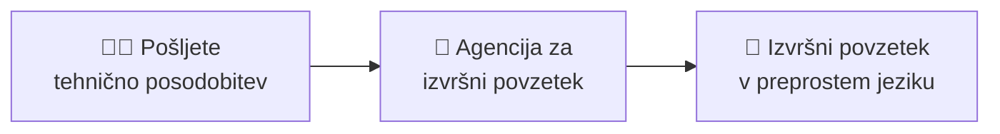

# Modul 0 - Uvod

⏱️ ~10 min

> [!WARNING]
> **Predogled in omejitve:** [Gostujoči agenti](https://learn.microsoft.com/azure/foundry/agents/concepts/hosted-agents) so trenutno v **javnem predogledu** - niso priporočeni za produkcijske obremenitve. Bodite pozorni na naslednje:
> - **Podprte regije so omejene** - pred ustvarjanjem virov preverite [razpoložljivost regije](https://learn.microsoft.com/azure/foundry/agents/concepts/hosted-agents#region-availability). Če izberete nepodprto regijo, bo namestitev neuspešna.
> - Paket `azure-ai-agentserver-agentframework` je v predizdaji - API-ji se lahko spreminjajo med različicami.
> - Omejitve merjenja: gostujoči agenti podpirajo 0–5 kopij (vključno z merjenjem na nič).
> - Nekatere funkcije, prikazane na delavnici, se lahko spremenijo, ko storitev doseže splošno razpoložljivost (GA).

## Kaj boste zgradili

V tej delavnici boste zgradili agenta **"Pojasni kot da sem izvršni direktor"** - gostujočega AI agenta, ki vzame kompleksne tehnične posodobitve in jih prepiše v jedrnate povzetke za izvršne direktorje v preprostem angleškem jeziku.

```mermaid
flowchart LR
    A["🧑‍💻 Pošljete\ntehnično posodobitev"] --> B["🤖 Agencija za\nizvršni povzetek"]
    B --> C["📝 Izvršni povzetek\nv preprostem jeziku"]
```

**Agent uporablja:**
- **Microsoft Agent Framework** - za logiko in strukturo agenta
- **Foundry Toolkit za VS Code** - za skelet, lokalno testiranje in nameščanje
- **AI model** (npr. `gpt-4.1-mini/gpt-5-mini`) - za generiranje povzetkov

Do konca delavnice boste imeli delujočega agenta, katerega boste lahko lokalno testirali preko Agent Inspectorja in po potrebi namestili v oblak.

---

## Kaj so gostujoči agenti?

**Gostujoči agent** je AI agent, ki deluje kot upravljana storitev v Microsoft Foundry. Namesto da upravljate lastno infrastrukturo, zapakirate agenta v vsebnik, Foundry pa poskrbi za merjenje, gostovanje in izpostavitev prek standardnega HTTP vmesnika.

| Pojem | Pomen |
|---------|--------------|
| **Agent** | Vaša Python koda, ki sprejme uporabniško sporočilo, pokliče AI model in vrne strukturiran odgovor |
| **Gostujoči** | Foundry za vas poganja vsebnik - brez VM-jev, Kubernetes ali upravljanja infrastrukture |
| **Protokol odgovorov** | Standardni HTTP API (`POST /responses`), ki ga lahko kliče kateri koli odjemalec za interakcijo z agentom |
| **Agent Inspector** | Lokalni vmesnik za testiranje (vključen v Foundry Toolkit), ki omogoča klepet z agentom pred nameščanjem |

V tej delavnici boste šli od začetka do popolnoma gostujočega agenta - ali se ustavili pri lokalnem testiranju, če želite.

---

## Izberite svojo pot

> ⚠️ **Pred nadaljevanjem izberite eno pot.** Vaša izbira določa, katera orodja boste namestili in kateri moduli veljajo. Kasneje lahko preklopite iz poti B → poti A, če pridobite naročnino.

<strong>🅰️ Pot A - Azure oblak (zahteva naročnino na Azure)</strong>

| | Podrobnosti |
|---|---|
| **Za koga je to?** | Imate aktivno naročnino na Azure in lahko ustvarjate Foundry vire |
| **Model** | Azure OpenAI prek Foundry (npr. `gpt-4.1-mini/gpt-5-mini`) |
| **Pokriti moduli** | Vsi moduli (00–07) |
| **Nameščanje v oblak?** | ✅ Da - popolna end-to-end namestitev |

<strong>🅱️ Pot B - Lokalno / brezplačni nivo (ni potrebna naročnina na Azure)</strong>

| | Podrobnosti |
|---|---|
| **Za koga je to?** | MVP, študenti ali kdorkoli brez dostopa do Azure |
| **Model** | **Foundry Local** (brezplačno, deluje na vašem računalniku) |
| **Pokriti moduli** | Moduli 00–04 (preskočite nameščanje in preverjanje v oblaku) |
| **Nameščanje v oblak?** | ❌ Ne - samo lokalno testiranje preko Agent Inspectorja |

---

## Vse poti: potrebna orodja

Namestite vsako spodaj. Po namestitvi preverite, ali deluje, tako da zaženete ukaz za preverjanje.

| # | Orodje | Različica | Namestitev | Preverjanje (pričakovan izhod) |
|---|------|---------|---------|---------------------------|
| 1 | **Visual Studio Code** | Najnovejša | [code.visualstudio.com](https://code.visualstudio.com/) | Se odpre brez napak |
| 2 | **Python** | 3.12 ali novejša| [python.org/downloads](https://www.python.org/downloads/) | `python --version` $\rightarrow$ `Python 3.12.x` |
| 3 | **Foundry Toolkit za VS Code** | Najnovejša | ID razširitve: `ms-windows-ai-studio.windows-ai-studio` | Ikona Foundry v Activity Bar |
| 4 | **Python razširitev za VS Code** | Najnovejša | ID razširitve: `ms-python.python` | Nameščena v panelu Razširitve |

> [!TIP]
> **Nasveti za namestitev:**
> - **Python PATH (Windows):** Vedno izberite **"Add Python to PATH"** na prvem zaslonu namestitvenega programa Python. Brez tega se `python` ne bo prepoznal v terminalu.
> - **Več verzij Pythona:** Če imate nameščena Python 3.10 in 3.12, uporabite `python3.12 -m venv .venv`, da zagotovite pravilno verzijo v virtualnem okolju.
> - **Docker WSL 2 (Windows):** Med namestitvijo Docker Desktop poskrbite, da je izbran **WSL 2 backend**. Docker s Hyper-V deluje počasneje in lahko povzroči težave pri gradnji Foundry vsebnikov.
> - **Docker se ne začne?** Po zagonu Docker Desktop počakajte 30–60 sekund. Zaženite `docker info` - če vidite "Cannot connect to the Docker daemon," se Docker še inicializira.
> - **Razširitve VS Code se ne naložijo?** Po namestitvi razširitev naložite okno znova: `Ctrl+Shift+P` → `Developer: Reload Window`.

> **Uporabniki Windows:** Pri namestitvi Pythona preverite **"Add Python to PATH"**.

**Naslednje:** [01 - Namestitev →](01-setup.md)

---

<!-- CO-OP TRANSLATOR DISCLAIMER START -->
**Omejitev odgovornosti**:
Ta dokument je bil preveden z uporabo AI prevajalske storitve [Co-op Translator](https://github.com/Azure/co-op-translator). Čeprav si prizadevamo za natančnost, vas prosimo, da upoštevate, da avtomatizirani prevodi lahko vsebujejo napake ali netočnosti. Izvirni dokument v njegovem izvirnem jeziku je treba obravnavati kot avtoritativni vir. Za kritične informacije je priporočljiv strokovni človeški prevod. Ne odgovarjamo za morebitna nesporazume ali napačne interpretacije, ki izhajajo iz uporabe tega prevoda.
<!-- CO-OP TRANSLATOR DISCLAIMER END -->