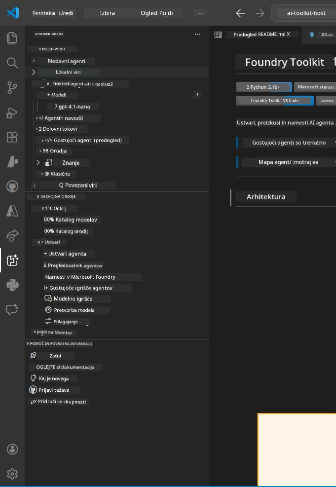
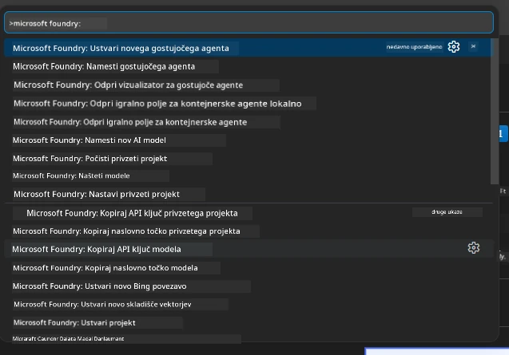

# Modul 1 - Namestitev Foundry orodij in Foundry razširitve

Ta modul vas vodi skozi namestitev in preverjanje dveh ključnih VS Code razširitev za to delavnico. Če ste jih že namestili med [Modulom 0](00-prerequisites.md), uporabite ta modul za potrditev, da delujejo pravilno.

---

## Korak 1: Namestitev Microsoft Foundry razširitve

Razširitev **Microsoft Foundry for VS Code** je vaše glavno orodje za ustvarjanje Foundry projektov, nameščanje modelov, pripravo gostovanih agentov in nameščanje neposredno iz VS Code.

1. Odprite VS Code.
2. Pritisnite `Ctrl+Shift+X`, da odprete **Razširitve**.
3. V iskalno polje na vrhu vnesite: **Microsoft Foundry**
4. Poiščite rezultat z naslovom **Microsoft Foundry for Visual Studio Code**.
   - Izdajatelj: **Microsoft**
   - ID razširitve: `TeamsDevApp.vscode-ai-foundry`
5. Kliknite gumb **Namesti**.
6. Počakajte, da se namestitev zaključi (videli boste majhen indikator napredka).
7. Po namestitvi poglejte v **Vrsto aktivnosti** (navpična vrstica ikon na levi strani VS Code). Tam bi morali videti novo ikono **Microsoft Foundry** (izgleda kot diamant/AI ikona).
8. Kliknite ikono **Microsoft Foundry**, da odprete stranski prikaz. Videli bi morali razdelke za:
   - **Viri** (ali Projekti)
   - **Agenti**
   - **Modeli**

> **Če ikona ni vidna:** Poskusite znova naložiti VS Code (`Ctrl+Shift+P` → `Developer: Reload Window`).

---

## Korak 2: Namestitev Foundry Toolkit razširitve

Razširitev **Foundry Toolkit** ponuja [**Agent Inspector**](https://learn.microsoft.com/azure/foundry/agents/how-to/vs-code-agents-workflow-pro-code) - vizualni vmesnik za lokalno testiranje in odpravljanje napak agentov - ter orodja za igrališče, upravljanje modelov in vrednotenje.

1. V razdelku Razširitve (`Ctrl+Shift+X`) počistite iskalno polje in vnesite: **Foundry Toolkit**
2. Najdite **Foundry Toolkit** med rezultati.
   - Izdajatelj: **Microsoft**
   - ID razširitve: `ms-windows-ai-studio.windows-ai-studio`
3. Kliknite **Namesti**.
4. Po namestitvi se prikaže ikona **Foundry Toolkit** v vrstici aktivnosti (izgleda kot robot/sparkle ikona).
5. Kliknite ikono **Foundry Toolkit**, da odprete njegov stranski prikaz. Videli bi morali zaslon dobrodošlice Foundry Toolkit s možnostmi za:
   - **Modele**
   - **Igrališče**
   - **Agente**

---

## Korak 3: Preverite, da obe razširitvi delujeta

### 3.1 Preverite Microsoft Foundry razširitev

1. Kliknite ikono **Microsoft Foundry** v vrstici aktivnosti.
2. Če ste prijavljeni v Azure (iz Modula 0), bi morali videti vaše projekte pod **Viri**.
3. Če vas zahteva prijava, kliknite **Prijava** in sledite postopku avtentikacije.
4. Potrdite, da vidite stranski prikaz brez napak.

### 3.2 Preverite Foundry Toolkit razširitev

1. Kliknite ikono **Foundry Toolkit** v vrstici aktivnosti.
2. Potrdite, da se zaslon dobrodošlice ali glavni panel naloži brez napak.
3. Za zdaj ni potrebno nič konfigurirati - pregledovalnik agentov bomo uporabili v [Modulu 5](05-test-locally.md).

### 3.3 Preverite preko ukazne palete

1. Pritisnite `Ctrl+Shift+P`, da odprete Ukazno paleto.
2. Vnesite **"Microsoft Foundry"** - morali bi videti ukaze, kot so:
   - `Microsoft Foundry: Create a New Hosted Agent`
   - `Microsoft Foundry: Deploy Hosted Agent`
   - `Microsoft Foundry: Open Model Catalog`
3. Pritisnite `Escape`, da zaprete Ukazno paleto.
4. Odprite Ukazno paleto ponovno in vnesite **"Foundry Toolkit"** - morali bi videti ukaze, kot so:
   - `Foundry Toolkit: Open Agent Inspector`

> Če teh ukazov ne vidite, razširitve morda niso pravilno nameščene. Poskusite jih odstraniti in znova namestiti.

---

## Kaj te razširitve počnejo v tej delavnici

| Razširitev | Kaj počne | Kdaj jo uporabljate |
|-----------|-------------|-------------------|
| **Microsoft Foundry for VS Code** | Ustvarjanje Foundry projektov, nameščanje modelov, **priprava [gostovanih agentov](https://learn.microsoft.com/azure/foundry/agents/concepts/hosted-agents)** (samodejno generira `agent.yaml`, `main.py`, `Dockerfile`, `requirements.txt`), nameščanje v [Foundry Agent Service](https://learn.microsoft.com/azure/foundry/agents/overview) | Moduli 2, 3, 6, 7 |
| **Foundry Toolkit** | Agent Inspector za lokalno testiranje/odpravljanje napak, igralniški vmesnik, upravljanje modelov | Moduli 5, 7 |

> **Foundry razširitev je najbolj ključno orodje v tej delavnici.** Pokriva celoten življenjski cikel: priprava → konfiguracija → nameščanje → preverjanje. Foundry Toolkit jo dopolnjuje z vizualnim Agent Inspectorjem za lokalno testiranje.

---

### Kontrolna točka

- [ ] Ikona Microsoft Foundry je vidna v vrstici aktivnosti
- [ ] Klik nanjo odpre stranski prikaz brez napak
- [ ] Ikona Foundry Toolkit je vidna v vrstici aktivnosti
- [ ] Klik nanjo odpre stranski prikaz brez napak
- [ ] `Ctrl+Shift+P` → vnos "Microsoft Foundry" prikaže razpoložljive ukaze
- [ ] `Ctrl+Shift+P` → vnos "Foundry Toolkit" prikaže razpoložljive ukaze

---

**Prejšnje:** [00 - Predpogoji](00-prerequisites.md) · **Naslednje:** [02 - Ustvari Foundry projekt →](02-create-foundry-project.md)

---

<!-- CO-OP TRANSLATOR DISCLAIMER START -->
**Omejitev odgovornosti**:
Ta dokument je bil preveden z uporabo AI prevajalske storitve [Co-op Translator](https://github.com/Azure/co-op-translator). Čeprav si prizadevamo za natančnost, vas opozarjamo, da lahko avtomatizirani prevodi vsebujejo napake ali netočnosti. Izvirni dokument v njegovem izvorni jezik naj velja za avtoritativni vir. Za kritične informacije je priporočljiv strokovni človeški prevod. Nismo odgovorni za kakršne koli nesporazume ali napačne interpretacije, ki izhajajo iz uporabe tega prevoda.
<!-- CO-OP TRANSLATOR DISCLAIMER END -->