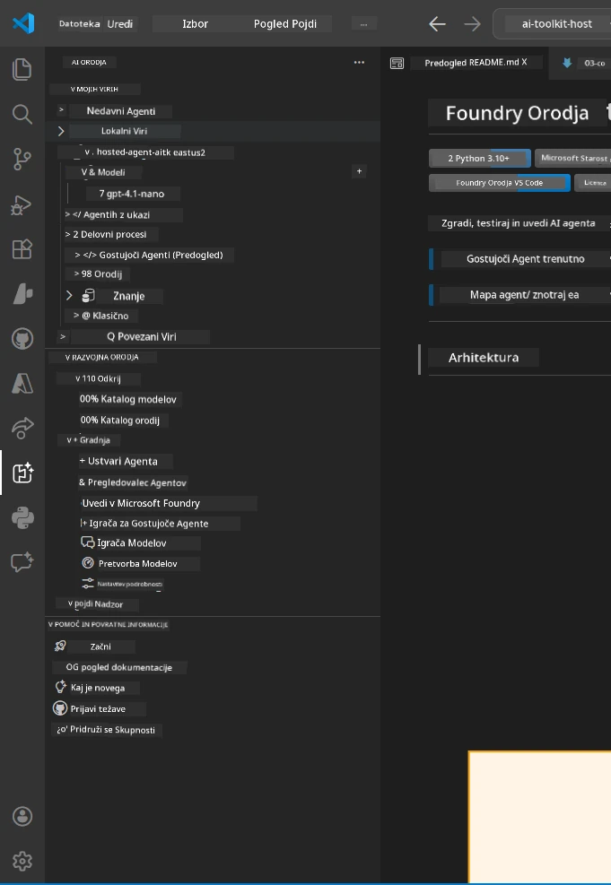
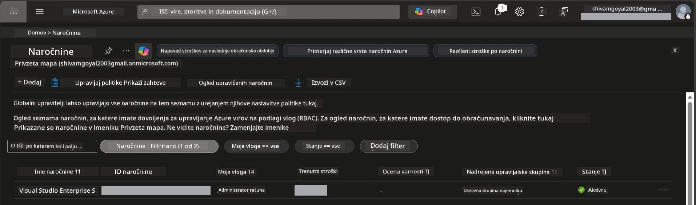
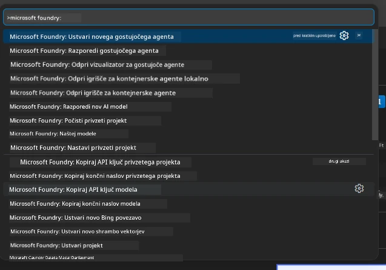
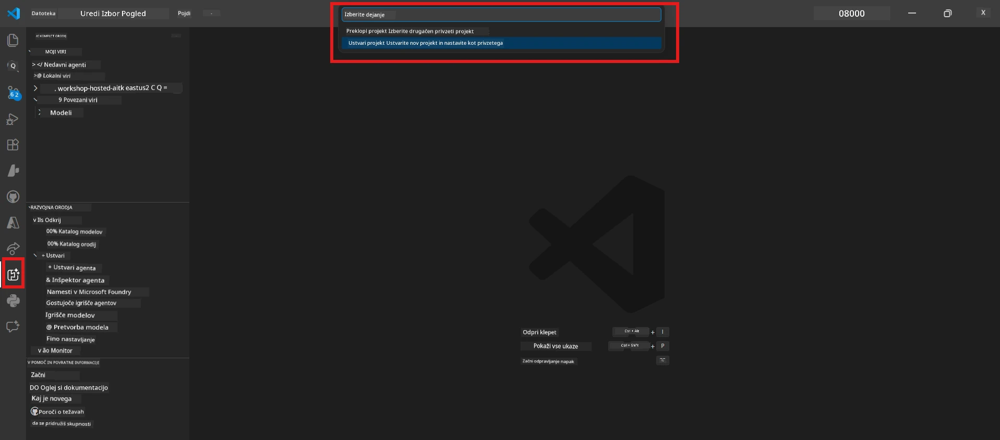
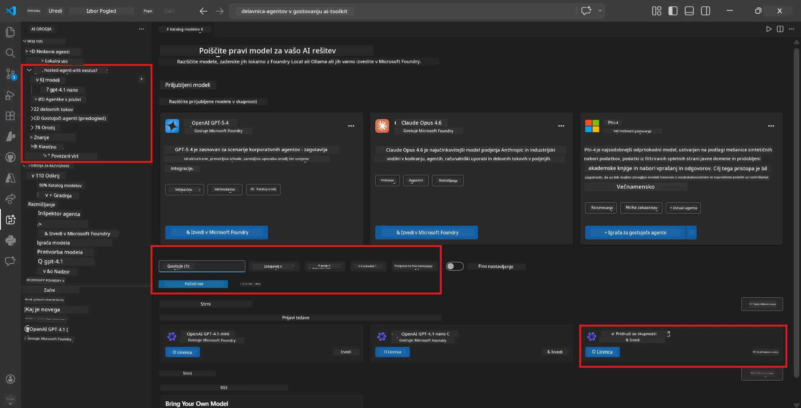
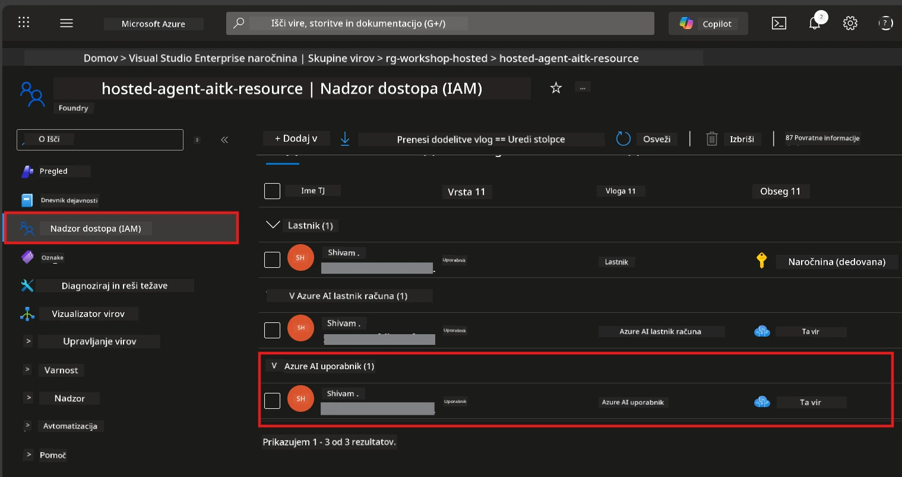

# Nastavitev: Razširitev, Projekt in Model

⏱️ ~15 min

V tem modulu namestite in preverite razširitev Foundry Toolkit, ustvarite (ali se povežete na) Foundry projekt in uvedete model, ki ga bo uporabljal vaš agent.

## 1. korak: Namestite Foundry Toolkit

**Foundry Toolkit za VS Code** je glavna razširitev za to delavnico. Omogoča ustvarjanje projektov, uvajanje modelov, gradnjo agentov, lokalno testiranje (Agent Inspector) in uvajanje v oblak - vse iz VS Code.

1. Odprite VS Code in pritisnite `Ctrl+Shift+X` za odprtje panela **Extensions**.
2. Poiščite **Foundry Toolkit**.
3. Namestite **Foundry Toolkit for VS Code** (Izdajatelj: Microsoft, ID: `ms-windows-ai-studio.windows-ai-studio`).
4. Po namestitvi se ikona **Foundry Toolkit** prikaže v Activity Barju (levi stranski meni).

> *Opomba: Activity Bar lahko v starejših verzijah razširitve prikaže "AI TOOLKIT". Funkcionalnost je enaka.*



## 2. korak: Nastavitev glede na vaš dostop

> **Izberite svojo pot:** Razširite spodnji odsek, ki ustreza vaši nastavitvi. Potrebno je dokončati le **eno** pot.

<details>
<summary><strong>🅰️ Pot A - Azure oblak (zahteva Azure naročnino)</strong></summary>

### Azure CLI

1. Namestite s spletne strani [learn.microsoft.com/cli/azure/install-azure-cli](https://learn.microsoft.com/cli/azure/install-azure-cli).
2. Preverite: `az --version` (pričakujte 2.80.0+).
3. Prijavite se: `az login`

### Možnosti preverjanja pristnosti

[Microsoft Agent Framework](https://learn.microsoft.com/agent-framework/overview/) uporablja [`DefaultAzureCredential`](https://learn.microsoft.com/azure/developer/python/sdk/authentication/credential-chains#defaultazurecredential-overview), ki poskuša več metod preverjanja pristnosti po vrsti. Izberite tisto, ki ustreza vašemu okolju:

#### Možnost 1: VS Code računi (priporočeno za delavnice)
1. Kliknite na ikono **Accounts** (silhueta osebe) v spodnjem levem kotu VS Code.
2. Izberite **Sign in to use Microsoft Foundry** (ali **Sign in with Azure**).
3. Odpre se brskalnik - prijavite se z Azure računom, ki ima dostop do vaše naročnine.
4. Vrnite se v VS Code. V spodnjem levem kotu bi morali videti ime svojega računa.

#### Možnost 2: Azure CLI
```bash
az login
az account set --subscription "<your-subscription-id>"
```

#### Možnost 3: Service Principal (podjetja/CI)
Za zaprte okolje ali CI/CD pipeline nastavite naslednje spremenljivke v vaši `.env` datoteki:
```env
AZURE_TENANT_ID=<your-tenant-id>
AZURE_CLIENT_ID=<your-client-id>
AZURE_CLIENT_SECRET=<your-client-secret>
```

> **Kako deluje `DefaultAzureCredential`:** Najprej poskuša spremenljivke okolja, nato upravljano identiteto, prijavo v VS Code, nato Azure CLI - uporabi tisto, ki uspe prva. Več na [credential chain docs](https://learn.microsoft.com/azure/developer/python/sdk/authentication/credential-chains#defaultazurecredential-overview).

### Azure Developer CLI (azd)

1. Namestite: `winget install microsoft.azd` (Windows) ali glejte [navodila za namestitev](https://learn.microsoft.com/azure/developer/azure-developer-cli/install-azd).
2. Preverite: `azd version`
3. Prijavite se: `azd auth login`

### Docker Desktop (opcijsko)

Docker je potreben le, če želite graditi kontejnere lokalno. Razširitev Foundry samodejno upravlja gradnje med uvajanjem.

1. Namestite s [docs.docker.com/get-docker](https://docs.docker.com/get-docker/).
2. Preverite: `docker info`

### Azure naročnina in RBAC

1. Prijavite se na [portal.azure.com](https://portal.azure.com).
2. Pojdite na **Subscriptions** in potrdite, da je vsaj ena **Aktivna**.
3. Zabeležite svojo **Subscription ID** - potrebovali jo boste v Modulu 01.



#### Tabela scenarijev RBAC

Za uvajanje [Hosted Agent](https://learn.microsoft.com/azure/foundry/agents/concepts/hosted-agents) potrebujete dovoljenja za **ukrepe nad podatki**, ki jih standardne Azure vloge `Owner` in `Contributor` **nimajo**. Uporabite spodnjo tabelo za določitev, katere vloge potrebujete:

| Scenarij | Zahtevane vloge | Kje jih dodeliti |
|----------|-----------------|------------------|
| Ustvarite nov Foundry projekt | **Azure AI Owner** na Foundry virov | Foundry vir v Azure portalu |
| Uvajanje v obstoječ projekt (novi viri) | **Azure AI Owner** + **Contributor** na naročnini | Naročnina + Foundry vir |
| Uvajanje v popolnoma nastavljen projekt | **Reader** na računu + **Azure AI User** na projektu | Račun + Projekt v Azure portalu |
| Samo lokalno testiranje (brez uvajanja) | **Azure AI User** na projektu | Projekt v Azure portalu |

> **Pomembno:** Azure vloge `Owner` in `Contributor` pokrivajo le *upravljavske* pravice (ARM operacije). Za *ukrepe nad podatki* kot `agents/write`, potrebujete [**Azure AI User**](https://learn.microsoft.com/azure/foundry/concepts/rbac-foundry#built-in-roles) (ali višjo) vlogo, da ustvarite in uvajate agente.

## Povežite se ali ustvarite Foundry projekt



1. Pritisnite `Ctrl+Shift+P` → vtipkajte **Foundry Toolkit: Create Project** → izberite.
2. Izberite svojo **Azure naročnino** iz spustnega seznama.
3. Izberite ali ustvarite **resource group** (npr. `rg-hosted-agents-workshop`).
4. Izberite **regijo**, ki podpira hosted agente: `East US`, `West US 2` ali `Sweden Central`. Glejte [dostopnost regij](https://learn.microsoft.com/azure/foundry/agents/concepts/hosted-agents#region-availability).
5. Vnesite ime projekta (npr. `workshop-agents`).
6. Počakajte 2–5 minut za pripravo. Pojavi se obvestilo o poteku v VS Code.
7. Ko je končano, se vaš projekt prikaže v stranskem meniju **Foundry Toolkit** pod **MY RESOURCES**.



## Uvedite model in dodelite RBAC

Vaš hosted agent potrebuje AI model za ustvarjanje odgovorov.

#### Matrika izbire modela
Glede na vaše potrebe lahko izberete med različnimi razredi modelov:

| Model | Najbolj primeren za | Stroški | Opombe |
|-------|-------------------|---------|--------|
| `gpt-4.1` | Visokokakovostni, nijansirani odgovori | Višji | Najboljši rezultati, priporočeno za končno testiranje |
| `gpt-4.1-mini/gpt-5-mini` | Hitro iteriranje, nižji stroški | Nižji | Primerno za razvoj na delavnici in hitro testiranje |
| `gpt-4.1-nano` | Lahke naloge | Najnižji | Najbolj stroškovno učinkovito, vendar preprostejši odgovori |

1. Pritisnite `Ctrl+Shift+P` → **Foundry Toolkit: Open Model Catalog** (ali kliknite **Model Catalog** v stranskem meniju pod DEVELOPER TOOLS → Discover).
2. Poiščite **gpt-4.1** v katalogu.
3. Najdite **OpenAI GPT-4.1-mini** (ali `gpt-5-mini` za boljšo kakovost) in kliknite **Deploy**.



4. V nastavitvah uvajanja:
   - **Ime uvajanja:** Pustite privzeto ali vnesite lastno ime. **Zapomnite si to ime.**
   - **Cilj:** Izberite **Deploy to Foundry Toolkit** → izberite vaš projekt.
5. Kliknite **Deploy** in počakajte 1–3 minute.

> **Priporočilo:** Za delavnico uporabite `gpt-4.1-mini/gpt-5-mini` - hitro, ugodno in z dobrimi rezultati.

### Zabeležite svoje vrednosti

Po uvajanju si zabeležite ti dve vrednosti (potrebovali ju boste v Modulu 03):

| Vrednost | Kje jo najti |
|---------|-------------|
| **Končna točka projekta** | Kliknite vaš projekt v stranskem meniju → prikazan je URL (npr. `https://<account>.services.ai.azure.com/api/projects/<project>`) |
| **Ime uvajajenga modela** | Razširite projekt → **Models** → ime poleg uvajanega modela (npr. `gpt-4.1-mini/gpt-5-mini`) |

### Dodelite RBAC vlogo

> ⚠️ **To je najbolj pogosto prezrta naloga.** Brez pravilne vloge bo uvajanje v Modulu 05 spodletelo.

#### Katero vlogo potrebujem?
Glede na vaš scenarij potrebuje naslednje kombinacije vlog:

| Scenarij | Zahtevane vloge | Kje jih dodeliti |
|----------|-----------------|------------------|
| Ustvarite nov Foundry projekt | **Azure AI Owner** na Foundry virov | Foundry vir v Azure portalu |
| Uvajanje v obstoječ projekt (novi viri) | **Azure AI Owner** + **Contributor** na naročnini | Naročnina + Foundry vir |
| Uvajanje v popolnoma nastavljen projekt | **Reader** na računu + **Azure AI User** na projektu | Račun + Projekt v Azure portalu |

**Pomembno:** Azure vloge `Owner` in `Contributor` pokrivajo le *upravljavske* pravice. Za *ukrepe nad podatki* kot `agents/write` potrebujete **Azure AI User** (ali višjo) vlogo.

1. Odprite [portal.azure.com](https://portal.azure.com).
2. Poiščite ime svojega **Foundry projekta** → kliknite rezultat tipa **"Foundry Toolkit project"** (NE glavni račun).
3. Kliknite **Access control (IAM)** v levem meniju.
4. Kliknite **+ Add** → **Add role assignment**.
5. **Zavihek vloga:** Poiščite **Azure AI User**, izberite jo, kliknite **Next**.
6. **Zavihek člani:** Izberite **User, group, or service principal** → kliknite **+ Select members** → poiščite in izberite sebe → kliknite **Select**.
7. Kliknite **Review + assign** → ponovno **Review + assign**.
8. **Počakajte 1–2 minuti** za uveljavitev sprememb.

> **Zakaj ta vloga?** Azure `Owner`/`Contributor` omogočata le upravljavske pravice. Vloga **Azure AI User** omogoča `agents/write` ukrepe nad podatki, potrebne za ustvarjanje in uvajanje agentov. Več na [Foundry RBAC docs](https://learn.microsoft.com/azure/foundry/concepts/rbac-foundry#built-in-roles).



</details>

<details>
<summary><strong>🅱️ Pot B - Lokalno / brezplačni nivo (ni potrebna Azure naročnina)</strong></summary>

### Foundry Local

Foundry Local vam omogoča poganjanje AI modelov na vašem računalniku - brez računa v oblaku. Do modelov Foundry Local lahko dostopate preko Foundry Toolkit, kot sledi:

1. Pojdite na razširitev Foundry Toolkit.
2. V navigaciji Foundry Toolkit pojdite na **Developer Tools** > izberite **Model Catalog**.
3. V novem oknu izberite **local** v navigacijski vrstici.
4. Pomaknite se navzdol do **Phi 4 Mini,** in kliknite **gumb za dodajanje**; pojavi se pojavitev, ki kaže, da se model prenaša.
5. Ko je model prenesen, nadaljujte na naslednji korak.

</details>

### ✅ Kontrolna točka


- [ ] `Ctrl+Shift+P` → "Foundry Toolkit" prikazuje razpoložljive ukaze
- [ ] Foundry Toolkit razširitev nameščena in stranski meni se naloži brez napak
- [ ] VS Code se odpre in deluje pravilno
- [ ] `python --version` prikazuje 3.10+
- [ ] Ikona Foundry Toolkit vidna v Activity Barju VS Code
- [ ] **Pot A:** `az login` uspe, naročnina je aktivna
- [ ] **Pot B:** Foundry Local teče (`foundry local status`)
- [ ] **Pot A:** Foundry projekt viden v stranskem meniju, model uveden, dodeljena vloga Azure AI User
- [ ] **Pot B:** Foundry Local teče z modelom
- [ ] Zabeležili ste svoj **endpoint** in **ime uvajenega modela**


**Prejšnji:** [00 - Predpogoji](00-prerequisites.md) · **Naslednji:** [02 - Ustvarite Hosted Agent →](02-create-hosted-agent.md)

---

<!-- CO-OP TRANSLATOR DISCLAIMER START -->
**Omejitev odgovornosti**:
Ta dokument je bil preveden z uporabo AI prevajalske storitve [Co-op Translator](https://github.com/Azure/co-op-translator). Čeprav si prizadevamo za natančnost, vas prosimo, da upoštevate, da avtomatizirani prevodi lahko vsebujejo napake ali netočnosti. Izvirni dokument v njegovem izvirnem jeziku je treba obravnavati kot avtoritativni vir. Za kritične informacije je priporočljiv strokovni človeški prevod. Ne odgovarjamo za morebitna nesporazume ali napačne interpretacije, ki izhajajo iz uporabe tega prevoda.
<!-- CO-OP TRANSLATOR DISCLAIMER END -->