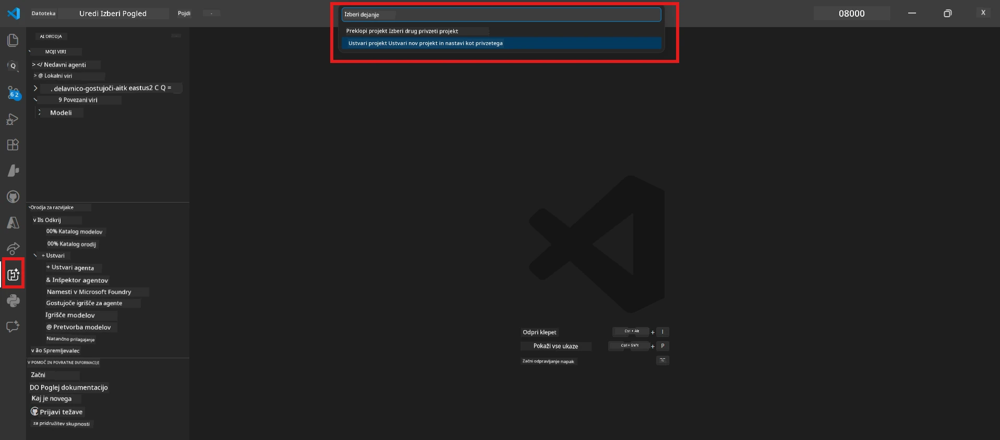
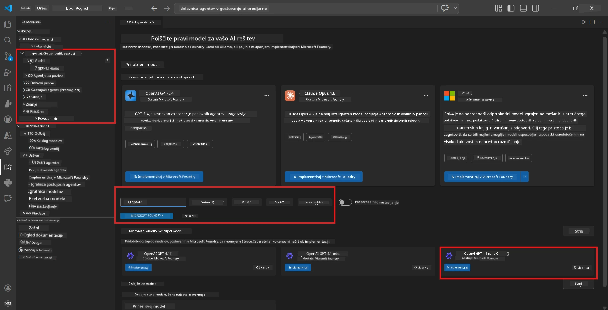
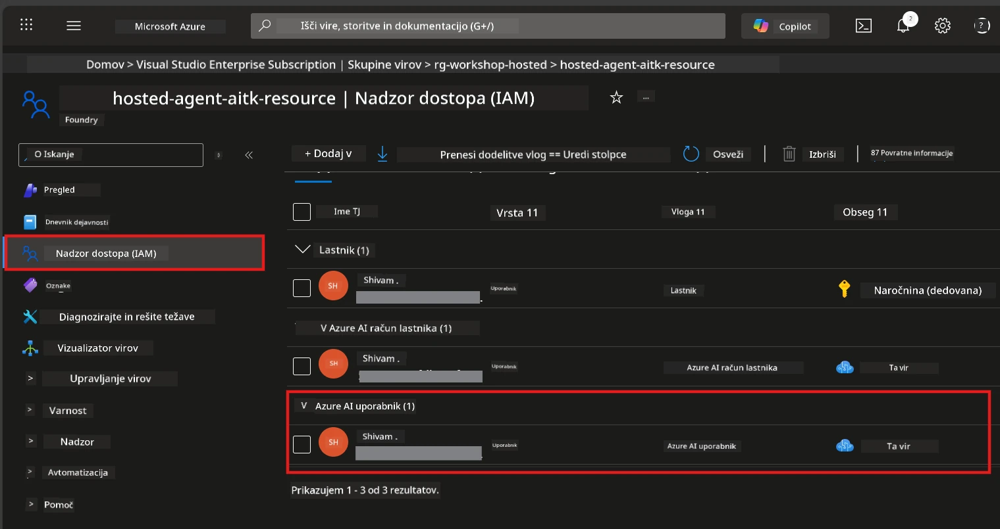

# Modul 2 - Ustvarjanje Foundry projekta in uvajanje modela

V tem modulu ustvarite (ali izberete) Microsoft Foundry projekt in uvedete model, ki ga bo vaš agent uporabljal. Vsak korak je jasno zapisan - sledite jim po vrsti.

> Če že imate Foundry projekt z uvedenim modelom, preskočite na [Modul 3](03-create-hosted-agent.md).

---

## Korak 1: Ustvarite Foundry projekt iz VS Code

Za ustvarjanje projekta boste uporabili Microsoft Foundry razširitev, ne da bi zapustili VS Code.

1. Pritisnite `Ctrl+Shift+P`, da odprete **Command Palette**.
2. Vnesite: **Microsoft Foundry: Create Project** in ga izberite.
3. Prikaže se spustni meni - izberite svojo **Azure naročnino** s seznama.
4. Zahtevali vas bodo, da izberete ali ustvarite **skupino virov**:
   - Za ustvarjanje nove: vnesite ime (npr. `rg-hosted-agents-workshop`) in pritisnite Enter.
   - Za uporabo obstoječe: izberite jo iz spustnega seznama.
5. Izberite **regijo**. **Pomembno:** Izberite regijo, ki podpira gostovane agente. Preverite [dostopnost regij](https://learn.microsoft.com/azure/foundry/agents/concepts/hosted-agents#region-availability) - pogosto izbrane so `East US`, `West US 2` ali `Sweden Central`.
6. Vnesite **ime** za Foundry projekt (npr. `workshop-agents`).
7. Pritisnite Enter in počakajte, da se postopek priprave zaključi.

> **Priprava traja 2-5 minut.** V spodnjem desnem kotu VS Code boste videli obvestilo o napredku. Med pripravo ne zapirajte VS Code.

8. Ko je končano, bo v stranski vrstici **Microsoft Foundry** prikazan vaš novi projekt pod **Resources**.
9. Kliknite na ime projekta, da ga razširite, in preverite, da so prikazane sekcije kot so **Models + endpoints** in **Agents**.



### Alternativa: Ustvarjanje prek Foundry portala

Če raje uporabljate brskalnik:

1. Odprite [https://ai.azure.com](https://ai.azure.com) in se prijavite.
2. Na domači strani kliknite **Create project**.
3. Vnesite ime projekta, izberite naročnino, skupino virov in regijo.
4. Kliknite **Create** in počakajte, da se priprava zaključi.
5. Ko je projekt ustvarjen, se vrnite v VS Code – projekt bi se moral prikazati v stranski vrstici Foundry po osvežitvi (kliknite ikono za osvežitev).

---

## Korak 2: Uvedite model

Vaš [gostovani agent](https://learn.microsoft.com/azure/foundry/agents/concepts/hosted-agents) potrebuje Azure OpenAI model za generiranje odgovorov. Zdaj boste [enega uvedli](https://learn.microsoft.com/azure/ai-foundry/openai/how-to/create-resource#deploy-a-model).

1. Pritisnite `Ctrl+Shift+P`, da odprete **Command Palette**.
2. Vnesite: **Microsoft Foundry: Open [Model Catalog](https://learn.microsoft.com/azure/ai-foundry/openai/concepts/models)** in izberite to možnost.
3. Odpre se pogled Model Catalog v VS Code. Brskajte ali uporabite iskalno vrstico in poiščite **gpt-4.1**.
4. Kliknite kartico modela **gpt-4.1** (ali `gpt-4.1-mini`, če želite nižje stroške).
5. Kliknite **Deploy**.


6. V konfiguraciji uvajanja:
   - **Ime uvajanja**: pustite privzeto (npr. `gpt-4.1`) ali vnesite svoje poimenovanje. **Zapomnite si to ime** - potrebovali ga boste v Modulu 4.
   - **Cilj**: izberite **Deploy to Microsoft Foundry** in izberite projekt, ki ste ga pravkar ustvarili.
7. Kliknite **Deploy** in počakajte, da se uvajanje dokonča (1-3 minute).

### Izbira modela

| Model | Najbolj primeren za | Stroški | Opozarjanje |
|-------|---------------------|---------|-------------|
| `gpt-4.1` | Visokokakovostni, natančni odgovori | Višji | Najboljši rezultati, priporočeno za končno testiranje |
| `gpt-4.1-mini` | Hitro iteriranje, nižji stroški | Nižji | Dobro za razvoj delavnice in hitro testiranje |
| `gpt-4.1-nano` | Lažja opravila | Najnižji | Najcenejši, vendar enostavnejši odgovori |

> **Priporočilo za to delavnico:** Uporabite `gpt-4.1-mini` za razvoj in testiranje. Je hiter, cenovno ugoden in daje dobre rezultate za vaje.

### Preverite uvajanje modela

1. V stranski vrstici **Microsoft Foundry** razširite svoj projekt.
2. Poglejte pod **Models + endpoints** (ali podobno sekcijo).
3. Videti bi morali vaš uvedeni model (npr. `gpt-4.1-mini`) z statusom **Succeeded** ali **Active**.
4. Kliknite na uvedbo modela, da si ogledate njegove podrobnosti.
5. **Zabeležite si** ti dve vrednosti - potrebovali ju boste v Modulu 4:

   | Nastavitev | Kje jo najti | Primer vrednosti |
   |------------|--------------|------------------|
   | **Projektna končna točka** | Kliknite na ime projekta v Foundry stranski vrstici. URL končne točke je prikazan v podrobnostih. | `https://<account>.services.ai.azure.com/api/projects/<project>` |
   | **Ime uvedbe modela** | Ime ob uvedenem modelu. | `gpt-4.1-mini` |

---

## Korak 3: Dodelite potrebne RBAC vloge

To je **najpogosteje spregledan korak**. Brez pravih vlog bo uvajanje v Modulu 6 spodletelo zaradi pomanjkanja dovoljenj.

### 3.1 Dodelite sebi vlogo Azure AI User

1. Odprite brskalnik in pojdite na [https://portal.azure.com](https://portal.azure.com).
2. V zgornji iskalni vrstici vnesite ime svojega **Foundry projekta** in ga kliknite med rezultati.
   - **Pomembno:** Pomaknite se do **projekta** (tip: "Microsoft Foundry project"), **ne** do računovodskega centra/starševskega vira.
3. V levi navigaciji projekta kliknite **Access control (IAM)**.
4. Kliknite gumb **+ Add** na vrhu → izberite **Add role assignment**.
5. Na zavihku **Role** poiščite [**Azure AI User**](https://learn.microsoft.com/azure/foundry/concepts/rbac-foundry#built-in-roles) in ga izberite. Kliknite **Next**.
6. Na zavihku **Members**:
   - Izberite **User, group, or service principal**.
   - Kliknite **+ Select members**.
   - Poiščite svoje ime ali e-pošto, izberite sebe in kliknite **Select**.
7. Kliknite **Review + assign** → nato še enkrat **Review + assign**, da potrdite.



### 3.2 (Neobvezno) Dodelite vlogo Azure AI Developer

Če morate znotraj projekta ustvarjati dodatne vire ali programsko upravljati uvajanja:

1. Ponovite zgornje korake, vendar v koraku 5 izberite **Azure AI Developer**.
2. To vlogo dodelite na ravni **Foundry vira (računa)**, ne le na nivoju projekta.

### 3.3 Preverite svoje dodeljene vloge

1. Na strani **Access control (IAM)** projekta kliknite zavihek **Role assignments**.
2. Poiščite svoje ime.
3. Videti morate vsaj vlogo **Azure AI User** za obseg projekta.

> **Zakaj je to pomembno:** Vloga [`Azure AI User`](https://learn.microsoft.com/azure/foundry/concepts/rbac-foundry#built-in-roles) dovoljuje podatkovno dejanje `Microsoft.CognitiveServices/accounts/AIServices/agents/write`. Brez tega boste med uvajanjem naleteli na napako:
>
> ```
> Error: lacks the required data action 
> Microsoft.CognitiveServices/accounts/AIServices/agents/write 
> to perform POST /api/projects/{projectName}/assistants operation.
> ```
>
> Za več podrobnosti glejte [Modul 8 - Odpravljanje težav](08-troubleshooting.md).

---

### Preveritvena točka

- [ ] Foundry projekt obstaja in je viden v Microsoft Foundry stranski vrstici v VS Code
- [ ] Uveden je vsaj en model (npr. `gpt-4.1-mini`) s statusom **Succeeded**
- [ ] Zabeležili ste URL **projektne končne točke** in **ime uvedbe modela**
- [ ] Imate dodeljeno vlogo **Azure AI User** na nivoju **projekta** (preverite v Azure Portalu → IAM → Role assignments)
- [ ] Projekt je v [podprti regiji](https://learn.microsoft.com/azure/foundry/agents/concepts/hosted-agents#region-availability) za gostovane agente

---

**Prejšnji:** [01 - Namestitev Foundry orodij](01-install-foundry-toolkit.md) · **Naslednji:** [03 - Ustvarjanje gostovanega agenta →](03-create-hosted-agent.md)

---

<!-- CO-OP TRANSLATOR DISCLAIMER START -->
**Omejitev odgovornosti**:  
Ta dokument je bil preveden z uporabo storitve za prevajanje z umetno inteligenco [Co-op Translator](https://github.com/Azure/co-op-translator). Čeprav si prizadevamo za natančnost, vas prosimo, da upoštevate, da avtomatizirani prevodi lahko vsebujejo napake ali netočnosti. Izvirni dokument v izvorni jezik naj velja za zanesljiv vir. Za pomembne informacije priporočamo strokovni človeški prevod. Ne prevzemamo odgovornosti za morebitna nesporazume ali napačne interpretacije, ki izhajajo iz uporabe tega prevoda.
<!-- CO-OP TRANSLATOR DISCLAIMER END -->