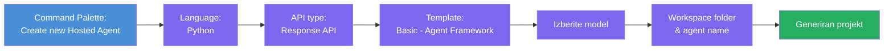
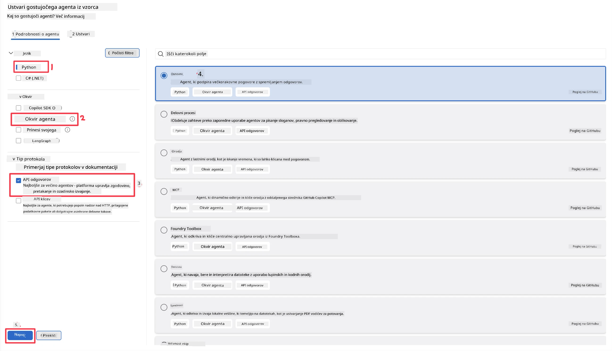
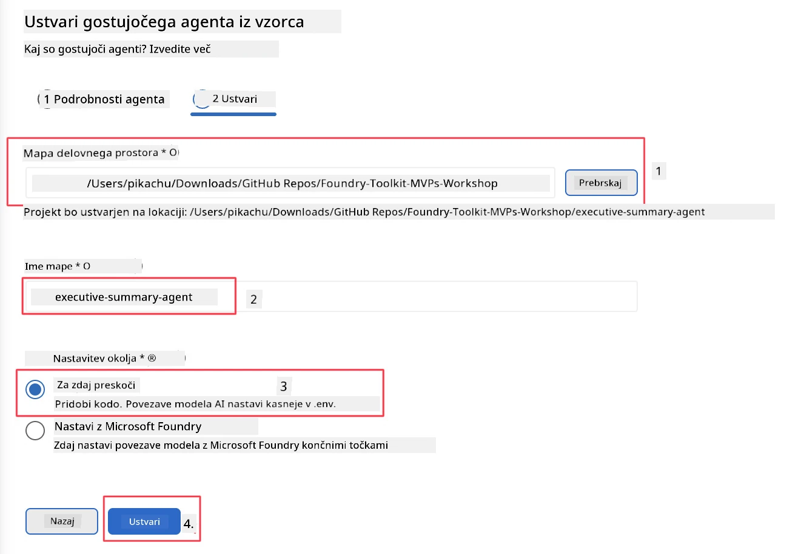

# Modul 2 - Ustvari novega gostovanega agenta

⏱️ ~5 min

V tem modulu uporabite Foundry Toolkit za **izgradnjo projekta gostovanega agenta**. Okvir samodejno ustvari celotno strukturo projekta - `agent.yaml`, `main.py`, `Dockerfile`, `requirements.txt` in konfiguracijo za odpravljanje napak v VS Code - tako da se lahko osredotočite na prilagajanje vedenja agenta.

> **Ključni koncept:** Mapa `agent/` v tej nalogi je primer tega, kar generira Foundry Toolkit. Teh datotek ne pišete iz nič.

### Potek čarovnika za gradnjo projekta



---

## 1. korak: Odprite čarovnika Create Hosted Agent

1. Pritisnite `Ctrl+Shift+P`, da odprete **Command Palette**.
2. Vtipkajte: **Foundry Toolkit: Create new Hosted Agent** in ga izberite.

> **Alternativa: Ustvarjanje prek Foundry Portala**
> Če raje uporabljate brskalnik, lahko projekt ustvarite na [https://ai.azure.com](https://ai.azure.com). Ko je projekt pripravljen, se vrnite v VS Code in uporabite stransko vrstico **Foundry Toolkit**, da se povežete z njim.

> **Alternativa:** Kliknite ikono **+** poleg **Hosted Agents (Preview)** v stranski vrstici Foundry Toolkit.

## 2. korak: Izberite nastavitve



1. Na levi navigaciji/sekciji z možnostmi izberite naslednje:

| Meni | Izbira | Opombe |
|--------|-----------|-------|
| **Jezik** | Python | Podprt je tudi C# |
| **Ogrodje** | Agent Framework | Preprosta začetna točka z uporabo Agent Framework SDK |
| **Tip API-ja** | Response API | `POST /responses` - pogovorno, z zgodovino, ki jo upravlja platforma |
| **Predloga** | Basic | Preprosta začetna točka z uporabo Agent Framework SDK |

2. Ko izberete, kliknite **Naprej**



3. V naslednjem oknu izberite naslednje:

| Meni | Izbira | Opombe |
|--------|-----------|-------|
| **Mapa delovnega prostora** | Izberite ciljno mapo | npr. `/workspace/Foundry_Toolkit_for_VSCode_Lab/` ali podmapo v tem repozitoriju |
| **Ime agenta** | Vnesite ime | npr. `executive-summary-agent` |
| **Nastavitev okolja** | preskočite nastavitev za zdaj |  |

Kliknite **create**, da ustvarite agenta. Ustvarjena bo nova mapa z imenom gostovanega agenta.

## 3. korak: Preverite ustvarjeni projekt

Ko je gradnja končana, preverite, ali v raziskovalcu (`Ctrl+Shift+E`) vidite te datoteke:

```
📂 my-agent/
├── .env                ← Environment variables (placeholders)
├── .vscode/
│   ├── launch.json     ← Debug config (F5 → run + Agent Inspector)
│   └── tasks.json      ← VS Code task definitions
├── agent.yaml          ← Agent definition (kind: hosted)
├── Dockerfile          ← Container config for deployment
├── main.py             ← Agent entry point (your main code)
└── requirements.txt    ← Python dependencies
```

### Pomembne datoteke razložene

| Datoteka | Namen |
|------|---------|
| `agent.yaml` | Določa agenta kot `kind: hosted`, preslika okoljske spremenljivke, definira protokol `/responses` |
| `main.py` | Ustvari `FoundryChatClient` → ga ovije v `Agent` z navodili → streže preko `ResponsesHostServer` na vratih 8088 |
| `Dockerfile` | Uporablja `python:3.12-slim`, namesti odvisnosti, izpostavi vrata 8088, zažene `main.py` |
| `requirements.txt` | `agent-framework-foundry`, `agent-framework-foundry-hosting`, `mcp`, `debugpy` |

> **Pomembno:** Odprite mapo s scaffoldu za agenta neposredno v VS Code (samo mapo `agent/`), da `.vscode/launch.json` in `tasks.json` pravilno delujeta za odpravljanje napak s F5.

---

### ✅ Kontrolna točka

- [ ] Ustvarjen je bil scaffoldiran projekt z vsemi pričakovanimi datotekami
- [ ] `agent.yaml` kaže `kind: hosted` in `protocol: responses`
- [ ] `main.py` uvaža `Agent`, `FoundryChatClient`, `ResponsesHostServer`
- [ ] Mapa agenta je odprta v VS Code kot koren delovnega prostora

---

**Prejšnje:** [01 - Namestitev](01-setup.md) · **Naslednje:** [03 - Konfiguracija in koda →](03-configure-and-code.md)

---

<!-- CO-OP TRANSLATOR DISCLAIMER START -->
**Omejitev odgovornosti**:
Ta dokument je bil preveden z uporabo AI prevajalske storitve [Co-op Translator](https://github.com/Azure/co-op-translator). Čeprav si prizadevamo za natančnost, vas prosimo, da upoštevate, da avtomatizirani prevodi lahko vsebujejo napake ali netočnosti. Izvirni dokument v njegovem izvirnem jeziku je treba obravnavati kot avtoritativni vir. Za kritične informacije je priporočljiv strokovni človeški prevod. Ne odgovarjamo za morebitna nesporazume ali napačne interpretacije, ki izhajajo iz uporabe tega prevoda.
<!-- CO-OP TRANSLATOR DISCLAIMER END -->