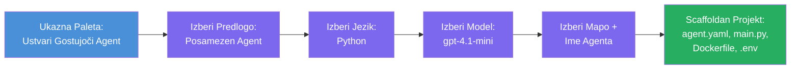

# Module 3 - Ustvari novega gostujočega agenta (samodejno ustvarjeno z razširitvijo Foundry)

V tem modulu boste z uporabo razširitve Microsoft Foundry **ustvarili nov projekt [gostujočega agenta](https://learn.microsoft.com/azure/foundry/agents/concepts/hosted-agents)**. Razširitev samodejno ustvari celotno strukturo projekta - vključno z `agent.yaml`, `main.py`, `Dockerfile`, `requirements.txt`, `.env` datoteko in konfiguracijo za odpravljanje napak v VS Code. Po ustvarjanju boste te datoteke prilagodili z navodili, orodji in konfiguracijo vašega agenta.

> **Ključni koncept:** Mapa `agent/` v tej delavnici je primer tega, kar razširitev Foundry generira, ko zaženete ta ukaz za ustvarjanje projekta. Te datoteke ne pišete sami od začetka - razširitev jih ustvari, vi pa jih nato spremenite.

### Postopek čarovnika za ustvarjanje projekta


---

## Korak 1: Odpri čarovnika za ustvarjanje gostujočega agenta

1. Pritisnite `Ctrl+Shift+P`, da odprete **Ukazno paleto**.
2. Vtipkajte: **Microsoft Foundry: Create a New Hosted Agent** in ga izberite.
3. Odpre se čarovnik za ustvarjanje gostujočega agenta.

> **Alternativna pot:** Do tega čarovnika lahko dostopate tudi prek stranske vrstice Microsoft Foundry → klik na ikono **+** zraven **Agents** ali z desnim klikom izberite **Create New Hosted Agent**.

---

## Korak 2: Izberi predlogo

Čarovnik vas vpraša, katero predlogo želite izbrati. Na voljo so možnosti, kot so:

| Predloga | Opis | Kdaj uporabiti |
|----------|-------------|-------------|
| **En sam agent** | En agent z lastnim modelom, navodili in neobveznimi orodji | Ta delavnica (Lab 01) |
| **Večagentno delovno tok** | Več agentov, ki sodelujejo zaporedno | Lab 02 |

1. Izberite **En sam agent**.
2. Kliknite **Naprej** (ali se izbor vodi samodejno naprej).

---

## Korak 3: Izberite programski jezik

1. Izberite **Python** (priporočeno za to delavnico).
2. Kliknite **Naprej**.

> **Podprt je tudi C#**, če raje uporabljate .NET. Struktura projekta je podobna (uporablja `Program.cs` namesto `main.py`).

---

## Korak 4: Izberite svoj model

1. Čarovnik prikaže modele, ki so nameščeni v vašem Foundry projektu (iz Modula 2).
2. Izberite model, ki ste ga nameščali - npr. **gpt-4.1-mini**.
3. Kliknite **Naprej**.

> Če noben model ni prikazan, se vrnite v [Modul 2](02-create-foundry-project.md) in najprej namestite model.

---

## Korak 5: Izberite lokacijo mape in ime agenta

1. Odpre se pogovorno okno za izbiro datoteke - izberite **ciljno mapo**, v katero bo ustvarjen projekt. Za to delavnico:
   - Če začnete novo: izberite katerokoli mapo (npr. `C:\Projects\my-agent`)
   - Če delate v repozitoriju delavnice: ustvarite novo podmapo v `workshop/lab01-single-agent/agent/`
2. Vnesite **ime** gostujočega agenta (npr. `executive-summary-agent` ali `my-first-agent`).
3. Kliknite **Ustvari** (ali pritisnite Enter).

---

## Korak 6: Počakajte, da se ustvarjanje dokonča

1. VS Code se odpre v **novem oknu** s projektom, ki je bil ustvarjen.
2. Počakajte nekaj sekund, da se projekt povsem naloži.
3. V raziskovalcu (`Ctrl+Shift+E`) bi morali videti naslednje datoteke:

```
📂 my-first-agent/
├── .env                ← Environment variables (auto-generated with placeholders)
├── .vscode/
│   └── launch.json     ← Debug configuration (F5 to run + Agent Inspector)
├── agent.yaml          ← Agent definition (kind: hosted)
├── Dockerfile          ← Container configuration for deployment
├── main.py             ← Agent entry point (your main code file)
└── requirements.txt    ← Python dependencies
```

> **To je ista struktura kot mapa `agent/`** v tej delavnici. Razširitev Foundry samodejno ustvari te datoteke - jih ni treba ustvarjati ročno.

> **Opomba delavnice:** V tem repozitoriju delavnice je mapa `.vscode/` v **korenu delovnega prostora** (ne znotraj vsakega projekta). Vsebuje skupno `launch.json` in `tasks.json` z dvema konfiguracijama za odpravljanje napak - **"Lab01 - Single Agent"** in **"Lab02 - Multi-Agent"** - vsaka kaže na pravilno delavnico kot `cwd`. Ko pritisnete F5, izberite konfiguracijo, ki ustreza delavnici, na kateri delate.

---

## Korak 7: Razumite vsako ustvarjeno datoteko

Vzemite si trenutek in pregledajte vsako datoteko, ki jo je ustvaril čarovnik. Njihovo razumevanje je pomembno za Modul 4 (prilagoditev).

### 7.1 `agent.yaml` - definicija agenta

Odprite `agent.yaml`. Izgleda takole:

```yaml
# yaml-language-server: $schema=https://raw.githubusercontent.com/microsoft/AgentSchema/refs/heads/main/schemas/v1.0/ContainerAgent.yaml

kind: hosted
name: my-first-agent
description: >
  A hosted agent deployed to Microsoft Foundry Agent Service.
metadata:
  authors:
    - Microsoft
  tags:
    - Azure AI AgentServer
    - Microsoft Agent Framework
    - Hosted Agent
protocols:
  - protocol: responses
    version: v1
environment_variables:
  - name: AZURE_AI_PROJECT_ENDPOINT
    value: ${PROJECT_ENDPOINT}
  - name: AZURE_AI_MODEL_DEPLOYMENT_NAME
    value: ${MODEL_DEPLOYMENT_NAME}
dockerfile_path: Dockerfile
resources:
  cpu: '0.25'
  memory: 0.5Gi
```

**Ključna polja:**

| Polje | Namen |
|-------|---------|
| `kind: hosted` | Določa, da gre za gostujočega agenta (na osnovi kontejnerja, nameščenega v [Foundry Agent Service](https://learn.microsoft.com/azure/foundry/agents/overview)) |
| `protocols: responses v1` | Agent izpostavi OpenAI združljiv HTTP endpoint `/responses` |
| `environment_variables` | Preslikava vrednosti iz `.env` v spremenljivke okolja kontejnerja ob zagonu |
| `dockerfile_path` | Poti do Dockerfile, ki se uporablja za izgradnjo kontejnerske slike |
| `resources` | Dodelitev CPU in pomnilnika za kontejner (0.25 CPU, 0.5Gi pomnilnika) |

### 7.2 `main.py` - vstopna točka agenta

Odprite `main.py`. To je glavna Python datoteka, kjer je logika vašega agenta. Postavitev vključuje:

```python
from agent_framework.azure import AzureAIAgentClient
from azure.ai.agentserver.agentframework import from_agent_framework
from azure.identity.aio import DefaultAzureCredential
```

**Ključni uvozi:**

| Uvoz | Namen |
|--------|--------|
| `AzureAIAgentClient` | Poveže vas z vašim Foundry projektom in ustvari agente preko `.as_agent()` |
| [`DefaultAzureCredential`](https://learn.microsoft.com/azure/developer/python/sdk/authentication/credential-chains#defaultazurecredential-overview) | Upravljanje z odobritvami (Azure CLI, prijava v VS Code, upravljana identiteta ali servisni račun) |
| `from_agent_framework` | Zavije agenta kot HTTP strežnik, ki izpostavi endpoint `/responses` |

Glavni tok je:
1. Ustvari poverilnico → ustvari klienta → kliči `.as_agent()` za pridobitev agenta (asinhroni kontekstni upravljalec) → zavije ga kot strežnik → zaženi

### 7.3 `Dockerfile` - kontejnerska slika

```dockerfile
FROM python:3.14-slim

WORKDIR /app

COPY ./ .

RUN pip install --upgrade pip && \
    if [ -f requirements.txt ]; then \
        pip install -r requirements.txt; \
    else \
        echo "No requirements.txt found" >&2; exit 1; \
    fi

EXPOSE 8088

CMD ["python", "main.py"]
```

**Ključne podrobnosti:**
- Uporablja osnovno sliko `python:3.14-slim`.
- Kopira vse datoteke projekta v `/app`.
- Posodobi `pip`, namesti odvisnosti iz `requirements.txt` in hitro odpove, če datoteka manjka.
- **Odpre vrata 8088** - to je zahtevano pristanišče za gostujoče agente. Ne spreminjajte ga.
- Zažene agenta z `python main.py`.

### 7.4 `requirements.txt` - odvisnosti

```
agent-framework-azure-ai==1.0.0rc3
agent-framework-core==1.0.0rc3
azure-ai-agentserver-agentframework==1.0.0b16
azure-ai-agentserver-core==1.0.0b16
debugpy
agent-dev-cli
```

| Paket | Namen |
|---------|---------|
| `agent-framework-azure-ai` | Azure AI integracija za Microsoft Agent Framework |
| `agent-framework-core` | Osrednji runtime za gradnjo agentov (vključuje `python-dotenv`) |
| `azure-ai-agentserver-agentframework` | Runtime strežnika gostujočega agenta za Foundry Agent Service |
| `azure-ai-agentserver-core` | Osnovne abstrakcije strežnika agentov |
| `debugpy` | Podpora za odpravljanje napak v Pythonu (omogoča F5 odpravljanje v VS Code) |
| `agent-dev-cli` | CLI za lokalni razvoj in testiranje agentov (uporablja ga konfiguracija za odpravljanje napak/zagon) |

---

## Razumevanje protokola agenta

Gostujoči agenti komunicirajo prek protokola **OpenAI Responses API**. Ko delujejo (lokalno ali v oblaku), agent izpostavi en HTTP endpoint:

```
POST http://localhost:8088/responses
Content-Type: application/json

{
  "input": "Your prompt here",
  "stream": false
}
```

The Foundry Agent Service kliče ta endpoint za pošiljanje uporabniških pozivov in prejemanje odgovorov agenta. To je isti protokol, ki ga uporablja OpenAI API, zato je vaš agent združljiv z vsakim odjemalcem, ki podpira OpenAI Responses format.

---

### Kontrolna točka

- [ ] Čarovnik za ustvarjanje projekta se je uspešno zaključil in odprlo se je **novo okno VS Code**
- [ ] Vidite vseh 5 datotek: `agent.yaml`, `main.py`, `Dockerfile`, `requirements.txt`, `.env`
- [ ] Datoteka `.vscode/launch.json` obstaja (omogoča odpravljanje napak s F5 - v tej delavnici je v korenu delovnega prostora z nastavitvami specifičnimi za delavnico)
- [ ] Pregledali ste vsako datoteko in razumete njen namen
- [ ] Razumete, da je pristanišče `8088` obvezno, prav tako pa je endpoint `/responses` del protokola

---

**Prejšnji:** [02 - Create Foundry Project](02-create-foundry-project.md) · **Naslednji:** [04 - Configure & Code →](04-configure-and-code.md)

---

<!-- CO-OP TRANSLATOR DISCLAIMER START -->
**Omejitev odgovornosti**:
Ta dokument je bil preveden z uporabo AI prevajalske storitve [Co-op Translator](https://github.com/Azure/co-op-translator). Čeprav si prizadevamo za natančnost, vas opozarjamo, da lahko avtomatizirani prevodi vsebujejo napake ali netočnosti. Izvirni dokument v njegovem maternem jeziku velja za avtoritativni vir. Za kritične informacije priporočamo strokovni človeški prevod. Nismo odgovorni za morebitna nesporazumevanja ali napačne interpretacije, ki izhajajo iz uporabe tega prevoda.
<!-- CO-OP TRANSLATOR DISCLAIMER END -->