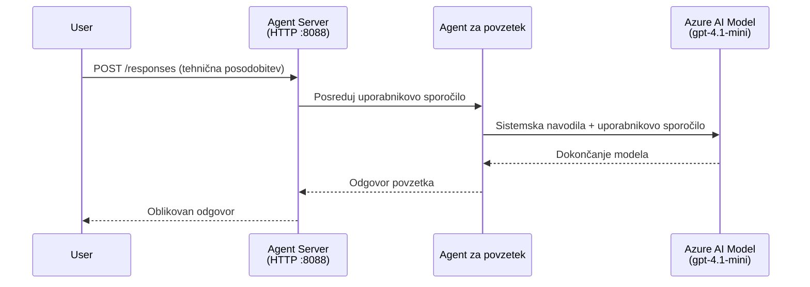
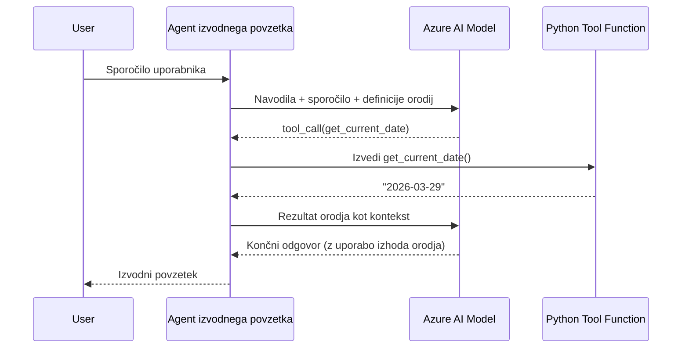

# Modul 4 - Konfigurirajte navodila, okolje in namestite odvisnosti

V tem modulu prilagodite samodejno ustvarjene datoteke agenta iz Modula 3. Tu pretvorite generični okvir v **vašega** agenta - z zapisovanjem navodil, nastavjanjem okoljskih spremenljivk, po želji dodajanjem orodij in nameščanjem odvisnosti.

> **Opomba:** Razširitev Foundry je samodejno ustvarila vaše projektne datoteke. Zdaj jih spremenite. Oglejte si mapo [`agent/`](../../../../../workshop/lab01-single-agent/agent) za popoln delujoč primer prilagojenega agenta.

---

## Kako komponente medsebojno sodelujejo

### Cikel zahtevka (eden agent)


> **Z orodji:** Če ima agent registrirana orodja, lahko model namesto neposrednega izida vrne klic orodja. Okvir izvede orodje lokalno, rezultat posreduje nazaj modelu, ki nato generira končni odgovor.


---

## Korak 1: Konfigurirajte okoljske spremenljivke

Okvir je ustvaril datoteko `.env` s privzetimi vrednostmi. Potrebno je vnesti prave vrednosti iz Modula 2.

1. V vašem ustvarjenem projektu odprite datoteko **`.env`** (nahaja se v korenu projekta).
2. Nadomestite privzete vrednosti z dejanskimi podatki o vašem Foundry projektu:

   ```env
   PROJECT_ENDPOINT=https://<your-account>.services.ai.azure.com/api/projects/<your-project>
   MODEL_DEPLOYMENT_NAME=gpt-4.1-mini
   ```

3. Shranite datoteko.

### Kje najti te vrednosti

| Vrednost | Kako jo najti |
|----------|--------------|
| **Projektna končna točka (endpoint)** | Odprite stransko vrstico **Microsoft Foundry** v VS Code → kliknite svoj projekt → URL končne točke je prikazan v pogledu podrobnosti. Izgleda podobno kot `https://<ime-računa>.services.ai.azure.com/api/projects/<ime-projekta>` |
| **Ime nameščenega modela** | V stranski vrstici Foundry razširite svoj projekt → pod **Models + endpoints** → ime je navedeno zraven nameščenega modela (npr. `gpt-4.1-mini`) |

> **Varnost:** Datoteke `.env` nikoli ne dodajajte v nadzor različic. Že je vključena v `.gitignore` privzeto. Če ni, jo dodajte:
> ```
> .env
> ```

### Kako potekajo okoljske spremenljivke

Preslikava poteka takole: `.env` → `main.py` (prebere po `os.getenv`) → `agent.yaml` (preslika na spreminjalke okolja v kontejnerju ob zaganjanju).

V `main.py` okvir prebere te vrednosti takole:

```python
PROJECT_ENDPOINT = os.getenv("AZURE_AI_PROJECT_ENDPOINT") or os.getenv("PROJECT_ENDPOINT")
MODEL_DEPLOYMENT_NAME = os.getenv("AZURE_AI_MODEL_DEPLOYMENT_NAME", os.getenv("MODEL_DEPLOYMENT_NAME", "gpt-4.1-mini"))
```

Sprejmeta se tako `AZURE_AI_PROJECT_ENDPOINT` kot `PROJECT_ENDPOINT` (v `agent.yaml` se uporablja predpona `AZURE_AI_*`).

---

## Korak 2: Zapišite navodila za agenta

To je najpomembnejši korak prilagoditve. Navodila določajo osebnost agenta, njegovo vedenje, format izhodnih podatkov in varnostne omejitve.

1. Odprite `main.py` v vašem projektu.
2. Poiščite niz navodil (okvir vsebuje privzeta/generična navodila).
3. Zamenjajte jih s podrobnimi, strukturiranimi navodili.

### Kaj vključujejo dobra navodila

| Komponenta | Namen | Primer |
|------------|-------|--------|
| **Vloga** | Kdo agent je in kaj počne | "Ste agent za izvršni povzetek" |
| **Ciljna skupina** | Za koga so odgovori namenjeni | "Višji vodje z omejenim tehničnim ozadjem" |
| **Definicija vhoda** | Kakšne vrste pozive obravnava | "Tehnična poročila o incidentih, operativne posodobitve" |
| **Format izhoda** | Natančna struktura odgovorov | "Izvršni povzetek: - Kaj se je zgodilo: ... - Poslovni vpliv: ... - Naslednji korak: ..." |
| **Pravila** | Omejitve in pogoji zavrnitve | "NE dodajajte informacij, ki niso bile podane" |
| **Varnost** | Preprečevanje zlorabe in halucinacij | "Če je vhod nejasen, zahtevaj pojasnilo" |
| **Primeri** | Vhodno/izhodni par za usmerjanje vedenja | Vključite 2-3 primere z različnimi vhodi |

### Primer: Navodila agenta za izvršni povzetek

Tukaj so navodila uporabljena v datoteki [`agent/main.py`](../../../../../workshop/lab01-single-agent/agent/main.py) delavnice:

```python
AGENT_INSTRUCTIONS = """You are an "Explain Like I'm an Executive" agent.

Purpose:
Your job is to translate complex technical or operational information into
clear, concise, and outcome-focused summaries that can be easily understood
by non-technical executives.

Audience:
Senior leaders with limited technical background who care about impact,
risk, and what happens next.

What you must do:
- Rephrase the input so it is understandable to a non-technical audience
- Prioritize clarity, brevity, and outcomes over technical accuracy
- Remove technical jargon, logs, metrics, stack traces, and deep root-cause details
- Translate technical causes into simple cause-and-effect statements
- Explicitly call out business impact
- Always include a clear next step or action
- Maintain a neutral, factual, and calm executive tone
- Do NOT add new facts or speculate beyond the input

Standard Output Structure (always use this wording):

Executive Summary:
- What happened: <plain-language description>
- Business impact: <clear, non-technical impact>
- Next step: <clear action or mitigation>

Rules:
- Keep responses under 100 words
- Do NOT add facts beyond the input
- If input is unclear, ask for clarification
"""
```

4. Zamenjajte obstoječi niz navodil v `main.py` s svojimi prilagojenimi navodili.
5. Shranite datoteko.

---

## Korak 3: (Neobvezno) Dodajte lastna orodja

Gostovani agenti lahko izvajajo **lokalne Python funkcije** kot [orodja](https://learn.microsoft.com/azure/foundry/agents/concepts/tool-catalog). To je ključna prednost kodno usmerjenih gostovanih agentov pred agenti, ki temeljijo samo na pozivih - vaš agent lahko izvaja poljubno strežniško logiko.

### 3.1 Definirajte funkcijo orodja

Dodajte funkcijo orodja v `main.py`:

```python
from agent_framework import tool

@tool
def get_current_date() -> str:
    """Returns the current date in YYYY-MM-DD format."""
    from datetime import date
    return str(date.today())
```

Dekorator `@tool` spremeni standardno Python funkcijo v orodje agenta. Dokstring postane opis orodja, ki ga model vidi.

### 3.2 Registrirajte orodje pri agentu

Ob ustvarjanju agenta preko upravljalca konteksta `.as_agent()`, posredujte orodje v parametru `tools`:

```python
async with AzureAIAgentClient(
    project_endpoint=PROJECT_ENDPOINT,
    model_deployment_name=MODEL_DEPLOYMENT_NAME,
    credential=credential,
).as_agent(
    name="my-agent",
    instructions=AGENT_INSTRUCTIONS,
    tools=[get_current_date],
) as agent:
    server = from_agent_framework(agent)
    await server.run_async()
```

### 3.3 Kako delujejo klici orodij

1. Uporabnik pošlje poziv.
2. Model odloči, ali je potrebno orodje (na podlagi poziva, navodil in opisov orodij).
3. Če je orodje potrebno, okvir lokalno pokliče vašo Python funkcijo (znotraj kontejnerja).
4. Vrednost, ki jo vrne orodje, posreduje modelu kot kontekst.
5. Model generira končni odgovor.

> **Orodja se izvajajo na strežniški strani** - tečejo znotraj vašega kontejnerja, ne v uporabnikovem brskalniku ali modelu. To pomeni, da imate dostop do baz podatkov, API-jev, datotečnih sistemov ali katerekoli Python knjižnice.

---

## Korak 4: Ustvarite in aktivirajte virtualno okolje

Pred nameščanjem odvisnosti ustvarite izolirano Python okolje.

### 4.1 Ustvarite virtualno okolje

Odprite terminal v VS Code (`` Ctrl+` ``) in zaženite:

```powershell
python -m venv .venv
```

To ustvari mapo `.venv` v vaši projektni mapi.

### 4.2 Aktivirajte virtualno okolje

**PowerShell (Windows):**

```powershell
.\.venv\Scripts\Activate.ps1
```

**Ukazna vrstica (Windows):**

```cmd
.venv\Scripts\activate.bat
```

**macOS/Linux (Bash):**

```bash
source .venv/bin/activate
```

Na začetku terminalskega poziva bi se moral prikazati `(.venv)`, kar pomeni, da je virtualno okolje aktivno.

### 4.3 Namestite odvisnosti

Z aktiviranim virtualnim okoljem namestite zahtevane pakete:

```powershell
pip install -r requirements.txt
```

Namesti:

| Paket | Namen |
|-------|-------|
| `agent-framework-azure-ai==1.0.0rc3` | Integracija Azure AI za [Microsoft Agent Framework](https://learn.microsoft.com/agent-framework/overview/) |
| `agent-framework-core==1.0.0rc3` | Osnovni runtime za izdelavo agentov (vključuje `python-dotenv`) |
| `azure-ai-agentserver-agentframework==1.0.0b16` | Runtime strežnika gostovanih agentov za [Foundry Agent Service](https://learn.microsoft.com/azure/foundry/agents/overview) |
| `azure-ai-agentserver-core==1.0.0b16` | Osnovne abstrakcije strežnika agenta |
| `debugpy` | Python razhroščevalnik (omogoča F5 razhroščevanje v VS Code) |
| `agent-dev-cli` | Lokalni razvojni CLI za testiranje agentov |

### 4.4 Preverite namestitev

```powershell
pip list | Select-String "agent-framework|agentserver"
```

Pričakovan izhod:
```
agent-framework-azure-ai   1.0.0rc3
agent-framework-core       1.0.0rc3
azure-ai-agentserver-agentframework 1.0.0b16
azure-ai-agentserver-core  1.0.0b16
```

---

## Korak 5: Preverite avtentikacijo

Agent uporablja [`DefaultAzureCredential`](https://learn.microsoft.com/azure/developer/python/sdk/authentication/credential-chains#defaultazurecredential-overview), ki zaporedoma poskuša več metod preverjanja pristnosti:

1. **Okoljske spremenljivke** - `AZURE_CLIENT_ID`, `AZURE_TENANT_ID`, `AZURE_CLIENT_SECRET` (servisni račun)
2. **Azure CLI** - upošteva vašo sejo `az login`
3. **VS Code** - uporablja račun, s katerim ste prijavljeni v VS Code
4. **Upravljana identiteta** - uporablja se pri zaganjanju v Azure (ob času nameščanja)

### 5.1 Preverite za lokalni razvoj

Vsaj ena od naslednjih možnosti mora delovati:

**Možnost A: Azure CLI (priporočeno)**

```powershell
az account show --query "{name:name, id:id}" --output table
```

Pričakovano: Prikaz imena in ID vaše naročnine.

**Možnost B: Prijava v VS Code**

1. Na spodnjem levem robu VS Code poiščite ikono **Računi**.
2. Če vidite ime vašega računa, ste prijavljeni.
3. Če ne, kliknite ikono → **Prijavite se, da uporabite Microsoft Foundry**.

**Možnost C: Servisni račun (za CI/CD)**

```powershell
$env:AZURE_TENANT_ID = "<your-tenant-id>"
$env:AZURE_CLIENT_ID = "<your-client-id>"
$env:AZURE_CLIENT_SECRET = "<your-client-secret>"
```

### 5.2 Pogosta težava z avtentikacijo

Če ste prijavljeni v več Azure računov, preverite, da je izbrana prava naročnina:

```powershell
az account set --subscription "<your-subscription-id>"
```

---

### Kontrolni seznam

- [ ] Datoteka `.env` ima veljavno vrednost za `PROJECT_ENDPOINT` in `MODEL_DEPLOYMENT_NAME` (ne začasne vrednosti)
- [ ] Navodila za agenta so prilagojena v `main.py` - določajo vlogo, ciljno skupino, format izhoda, pravila in varnostne omejitve
- [ ] (Neobvezno) Prilagojena orodja so definirana in registrirana
- [ ] Virtualno okolje je ustvarjeno in aktivno (`(.venv)` je vidno v terminalskem pozivu)
- [ ] `pip install -r requirements.txt` se uspešno zaključi brez napak
- [ ] `pip list | Select-String "azure-ai-agentserver"` pokaže, da je paket nameščen
- [ ] Avtentikacija je veljavna - `az account show` prikaže vašo naročnino ALI ste prijavljeni v VS Code

---

**Prejšnji:** [03 - Ustvari gostovanega agenta](03-create-hosted-agent.md) · **Naslednji:** [05 - Testiraj lokalno →](05-test-locally.md)

---

<!-- CO-OP TRANSLATOR DISCLAIMER START -->
**Omejitev odgovornosti**:  
Ta dokument je bil preveden z uporabo AI prevajalske storitve [Co-op Translator](https://github.com/Azure/co-op-translator). Medtem ko si prizadevamo za natančnost, upoštevajte, da lahko avtomatizirani prevodi vsebujejo napake ali netočnosti. Izvirni dokument v njegovem izvirnem jeziku velja za avtoritativni vir. Za kritične informacije priporočamo strokovni človeški prevod. Za morebitna nesporazume ali napačne interpretacije, ki izhajajo iz uporabe tega prevoda, ne odgovarjamo.
<!-- CO-OP TRANSLATOR DISCLAIMER END -->