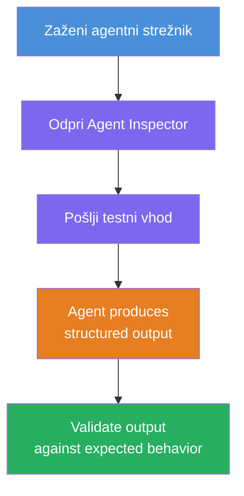
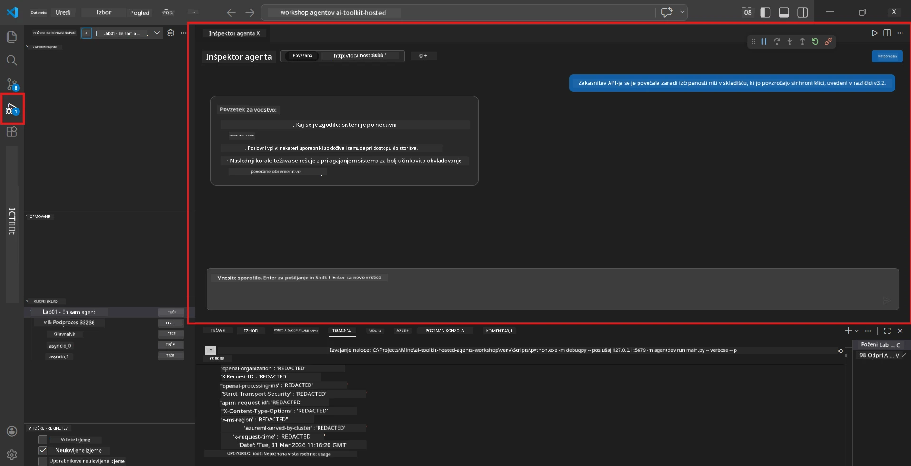
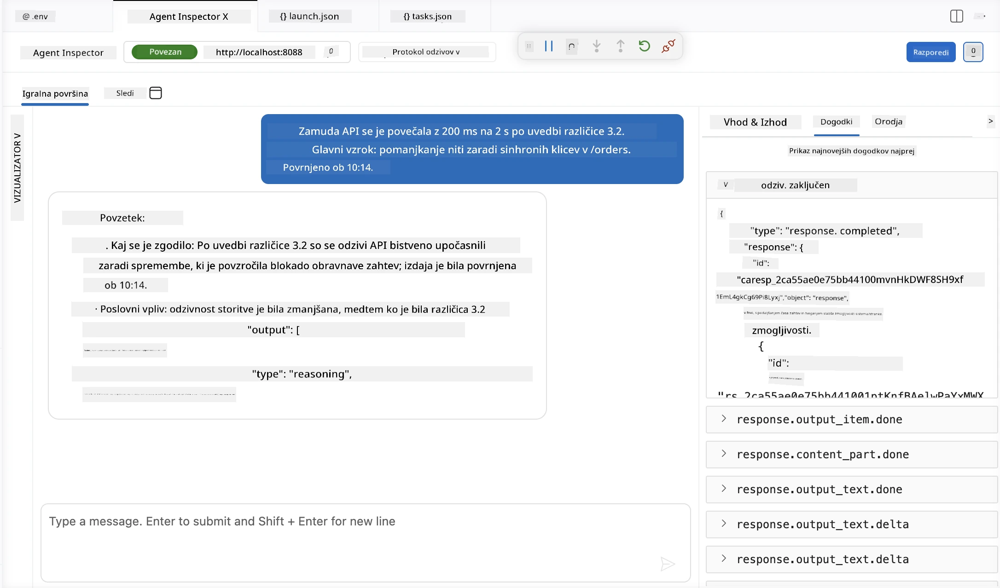

# Modul 4 - Preizkusite lokalno

⏱️ ~10 min

V tem modulu zaženete svojega agenta lokalno in potrdite, da deluje pravilno z uporabo **funkcionalnih testov po pravem poteku**. Uporabili boste Agent Inspector (vizualni vmesnik) ali neposredne HTTP klice, da potrdite, da agent proizvede strukturirane, natančne odgovore.

### Potek lokalnega testiranja



---

## Možnost 1: Pritisnite F5 - odpravljanje napak z Agent Inspector (priporočeno)

### Zaženite odpravljanje napak

1. Odprite mapo **executive-summary-agent/** neposredno v VS Code (`Datoteka → Odpri mapo`).
2. Odprite ploščo **Zaženi in odpravi napake** (`Ctrl+Shift+D`).
3. Izberite **Debug Local Agent Server** iz spustnega menija.
4. Pritisnite **F5** (ali kliknite ▶ Začni odpravljanje napak).

> ⚠️ **Ključno: Izberite svoj Python interpreter**
> Če prejmete "ModuleNotFoundError" ali odpravljalnik napak ne more začeti, morate VS Code povedati, naj uporablja vaše virtualno okolje:
  > 1. Pritisnite `Ctrl+Shift+P` $\rightarrow$ vpišite **Python: Select Interpreter**.
  > 2. Izberite interpreter, ki se nahaja v mapi `.venv` vašega projekta (npr. `.\.venv\Scripts\python.exe` v Windows).
  > 3. Ponovno zaženite sejo odpravljanja napak.
> Če še vedno prihaja do napak, ročno posodobite svojo datoteko `tasks.json` tako:
  > 1. Pojdite v datoteko `.vscode/tasks.json`
  > 2. Poiščite ukaz z oznako: `Run Agent/Workflow HTTP Server`
  > 3. Posodobite vrednost ukaza takole: `"value": "${workspaceFolder}/.venv/bin/python",`

### Kaj se zgodi

1. HTTP strežnik se zažene na `http://localhost:8088/responses`.
2. Plošča **Agent Inspector** se samodejno odpre - vizualni klepetalni vmesnik za testiranje.
3. V `main.py` so omogočene točke prekinitve.

Spremljajte Terminal za:
```
Starting executive summary hosted agent
Executive agent server running on http://localhost:8088
```

> **Če Agent Inspector ni odprt:** pritisnite `Ctrl+Shift+P` → **Foundry Toolkit: Open Agent Inspector**.



> *Posnetek zaslona lahko prikazuje starejšo znamko 'AI TOOLKIT' iz prejšnje različice razširitve.*

---

## Možnost 2: Testiranje prek Terminala (alternativa)

Zaženite agenta v enem terminalu, pošiljajte zahteve iz drugega:

```bash
# Terminal 1: Začni agentja
cd executive-summary-agent/
source .venv/bin/activate
python main.py
```

```bash
# Terminal 2: Pošlji test (curl)
curl -sS -X POST http://localhost:8088/responses \
  -H "Content-Type: application/json" \
  -d '{"input": "The API latency increased due to thread pool exhaustion caused by sync calls in v3.2.", "stream": false}'
```

---

## Testi scenarijev: Funkcionalna validacija po pravem poteku

Zaženite **vse tri** spodnje scenarije. Ti preverjajo, da vaš agent proizvaja pravilne, strukturirane izhode za realistične vnose.



### Scenarij 1: IT incident - povečana latenca API-ja

**Vnos:**
```
The API latency increased from 200ms to 2s after deploying v3.2.
Root cause: thread pool starvation from synchronous calls in /orders.
Rolled back at 10:14.
```

**Pričakovano vedenje:**
- ✅ Sledi strukturi "Executive Summary" (Kaj se je zgodilo / Poslovni vpliv / Naslednji korak)
- ✅ Brez tehničnega žargona (brez "thread pool", brez "/orders", brez "v3.2")
- ✅ Jasno navaja poslovni vpliv (npr. uporabniki so zaznali zamude)
- ✅ Vključuje naslednji korak (npr. odprava napake implementirana, spremljanje urejeno)

---

### Scenarij 2: Podatkovni potek - napaka ETL

**Vnos:**
```
The nightly ETL job failed because the upstream schema changed. APAC dashboards show missing data.
```

**Pričakovano vedenje:**
- ✅ Povzame napako osvežitve podatkov v preprostem jeziku
- ✅ Omenja vpliv na APAC nadzorno ploščo
- ✅ Vsebuje popravljalni naslednji korak
- ✅ NE omenja "ETL", "sheme" ali drugih tehničnih izrazov

---

### Scenarij 3: Varnost - razkriti pristopni podatki

**Vnos:**
```
Static analysis flagged a hardcoded secret in the repository.
The secret may have been exposed in commit history.
```

**Pričakovano vedenje:**
- ✅ Opisuje problem z referenco/varnostjo v jeziku, prijaznem za izvršno področje
- ✅ Opozarja na potencialno tveganje (nepooblaščen dostop)
- ✅ Navaja ukrep za odpravo (obnova referenc, revizija)
- ✅ NE vsebuje izrazov, kot so "statistična analiza", "zgodovina commitov" ali "hardcoded"

---

## Kriteriji validacije

Za vsak scenarij preverite:

| # | Kriteriji | Pogoj za uspeh |
|---|----------|---------------|
| 1 | **Struktura** | Odgovor uporablja format "Executive Summary" s tremi točkami |
| 2 | **Preprost jezik** | Brez tehničnega žargona, ki ga izvršni direktorji ne bi razumeli |
| 3 | **Natančnost** | Povzetek odraža vhod - brez izmišljenih podrobnosti |
| 4 | **Jedrnatost** | Odgovor pod 100 besedami |
| 5 | **Naslednji korak** | Jasno naveden ukrep ali blažitev |

---

## Nasveti za odpravljanje napak

| Težava | Popravek |
|-------|-----|
| Agent se ne zažene | Preverite vrednosti `.env`, potrdite, da je venv aktiviran, zaženite `pip install -r requirements.txt` |
| Prazen ali generični odgovor | Preglejte navodila v `main.py` - zagotovite, da je določen format izhoda |
| Odgovor vsebuje žargon | Okrepite pravila "odstrani tehnične izraze" v navodilih |
| Agent Inspector se ne odpre | `Ctrl+Shift+P` → **Foundry Toolkit: Open Agent Inspector** |
| Napake modela v Terminalu | Preverite, da `AZURE_AI_MODEL_DEPLOYMENT_NAME` natančno ustreza (občutljivo na velike/male črke) |

---

### ✅ Kontrolna točka

- [ ] Agent se lokalno zažene brez napak
- [ ] Agent Inspector se odpre in prikaže klepetalni vmesnik (če uporabljate F5)
- [ ] **Scenarij 1** (IT incident) - strukturiran Executive Summary, brez žargona
- [ ] **Scenarij 2** (podatkovni potek) - relevanten povzetek s poslovnim vplivom
- [ ] **Scenarij 3** (varnostno opozorilo) - ustrezna komunikacija tveganja
- [ ] Vsi odgovori sledijo definirani strukturi izhoda

> **Shrani svoje odgovore** (kopiraj ali posnetek zaslona) - primerjali jih boste z rezultati v oblaku v Modulu 06.

---

**Prejšnji:** [03 - Configure & Code](03-configure-and-code.md) · **Naslednji:** [05 - Deploy to Foundry →](05-deploy-to-foundry.md)

---

<!-- CO-OP TRANSLATOR DISCLAIMER START -->
**Omejitev odgovornosti**:
Ta dokument je bil preveden z uporabo AI prevajalske storitve [Co-op Translator](https://github.com/Azure/co-op-translator). Čeprav si prizadevamo za natančnost, vas prosimo, da upoštevate, da avtomatizirani prevodi lahko vsebujejo napake ali netočnosti. Izvirni dokument v njegovem izvirnem jeziku je treba obravnavati kot avtoritativni vir. Za kritične informacije je priporočljiv strokovni človeški prevod. Ne odgovarjamo za morebitna nesporazume ali napačne interpretacije, ki izhajajo iz uporabe tega prevoda.
<!-- CO-OP TRANSLATOR DISCLAIMER END -->