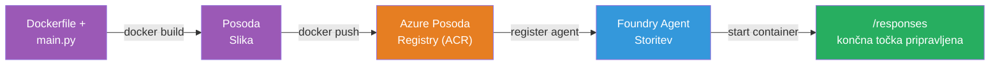
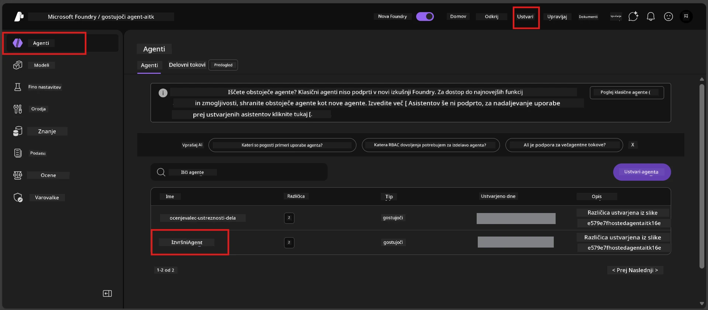

# Modul 6 - Namestitev v storitev Foundry Agent

V tem modulu boste namestili lokalno preizkušen agent v Microsoft Foundry kot [**Gostujočega agenta**](https://learn.microsoft.com/azure/foundry/agents/concepts/hosted-agents). Proces namestitve ustvari sliko Docker kontejnerja iz vašega projekta, jo naloži v [Azure Container Registry (ACR)](https://learn.microsoft.com/azure/container-registry/container-registry-intro) in ustvari različico gostujočega agenta v [Foundry Agent Service](https://learn.microsoft.com/azure/foundry/agents/overview).

### Postopek namestitve


---

## Preverjanje predpogojev

Pred namestitvijo preverite vsak spodnji element. Preskakovanje teh je najpogostejši vzrok za napake pri namestitvi.

1. **Agent uspešno opravi lokalne hitre teste:**
   - Zaključili ste vseh 4 teste v [Modulu 5](05-test-locally.md) in agent je pravilno reagiral.

2. **Imate vlogo [Azure AI User](https://learn.microsoft.com/azure/foundry/concepts/rbac-foundry#built-in-roles):**
   - Ta je bila dodeljena v [Modulu 2, Koraku 3](02-create-foundry-project.md). Če niste prepričani, preverite zdaj:
   - Azure Portal → vaš Foundry **projekt** → **Nadzor dostopa (IAM)** → zavihek **Dodelitev vlog** → poiščite svoje ime → potrdite, da je na seznamu **Azure AI User**.

3. **Prijavljeni ste v Azure v VS Code:**
   - Preverite ikono Računov v spodnjem levem kotu VS Code. Vaše uporabniško ime bi moralo biti vidno.

4. **(Neobvezno) Docker Desktop teče:**
   - Docker je potreben samo, če vas razširitev Foundry pozove k lokalni izdelavi. V večini primerov razširitev med namestitvijo samodejno upravlja gradnjo kontejnerja.
   - Če imate nameščen Docker, preverite, da teče: `docker info`

---

## Korak 1: Začnite z namestitvijo

Na voljo imate dva načina namestitve - oba pripeljeta do istega rezultata.

### Možnost A: Namestitev iz pregledovalnika agentov (priporočeno)

Če izvajate agenta z debuggerjem (F5) in je pregledovalnik agentov odprt:

1. Poglejte v **zgornji desni kot** panela pregledovalnika agentov.
2. Kliknite na gumb **Deploy** (ikona oblaka s puščico navzgor ↑).
3. Odpre se čarovnik za namestitev.

### Možnost B: Namestitev iz ukazne palete

1. Pritisnite `Ctrl+Shift+P`, da odprete **Ukazno paleto**.
2. Vnesite: **Microsoft Foundry: Deploy Hosted Agent** in ga izberite.
3. Odpre se čarovnik za namestitev.

---

## Korak 2: Konfigurirajte namestitev

Čarovnik vas vodi skozi konfiguracijo. Izpolnite vsak poziv:

### 2.1 Izberite ciljni projekt

1. Spustni meni prikazuje vaše Foundry projekte.
2. Izberite projekt, ki ste ga ustvarili v Modulu 2 (npr. `workshop-agents`).

### 2.2 Izberite datoteko agenta kontejnerja

1. Zahtevali vas bodo, da izberete vstopno točko agenta.
2. Izberite **`main.py`** (Python) - to datoteko čarovnik uporabi za prepoznavo vašega agenta.

### 2.3 Konfigurirajte vire

| Nastavitev | Priporočena vrednost | Opombe |
|------------|---------------------|--------|
| **CPU**    | `0.25`              | Privzeto, zadostno za delavnico. Povečajte za produkcijske obremenitve |
| **Pomnilnik** | `0.5Gi`          | Privzeto, zadostno za delavnico |

Te vrednosti so skladne s `agent.yaml`. Lahko sprejmete privzete.

---

## Korak 3: Potrdite in namestite

1. Čarovnik prikaže povzetek namestitve z naslednjim:
   - Ime ciljnega projekta
   - Ime agenta (iz `agent.yaml`)
   - Datoteka kontejnerja in viri
2. Preglejte povzetek in kliknite **Confirm and Deploy** (ali **Deploy**).
3. Spremljajte potek namestitve v VS Code.

### Kaj se dogaja med namestitvijo (korak za korakom)

Namestitev je večstopenjski proces. Spremljajte panel **Output** v VS Code (izberite "Microsoft Foundry" iz spustnega menija), da sledite postopku:

1. **Docker build** - VS Code ustvari Docker sliko kontejnerja iz vaše `Dockerfile`. Videli boste sporočila o plasteh Dockerja:
   ```
   Step 1/6 : FROM python:<version>-slim
   Step 2/6 : WORKDIR /app
   ...
   Successfully built abc123def456
   ```

2. **Docker push** - Slika se naloži v **Azure Container Registry (ACR)**, povezano z vašim Foundry projektom. To lahko traja 1-3 minute pri prvi namestitvi (osnovna slika je >100MB).

3. **Registracija agenta** - Foundry Agent Service ustvari novega gostujočega agenta (ali novo različico, če agent že obstaja). Uporabljeni so podatki iz `agent.yaml`.

4. **Zagon kontejnerja** - Kontejner se zažene v upravljani infrastrukturi Foundry. Platforma dodeli [sistemsko upravljano identiteto](https://learn.microsoft.com/azure/foundry/agents/concepts/agent-identity) in razkrije končno točko `/responses`.

> **Prva namestitev je počasnejša** (Docker mora naložiti vse plasti). Kasnejše namestitve so hitrejše, saj Docker predpomni nespremenjene plasti.

---

## Korak 4: Preverite status namestitve

Ko je ukaz za namestitev dokončan:

1. Odprite **Microsoft Foundry** stranski meni s klikom na ikono Foundry v vrstici za dejavnosti.
2. Razširite odsek **Hosted Agents (Preview)** pod vašim projektom.
3. Videti bi morali ime svojega agenta (npr. `ExecutiveAgent` ali ime iz `agent.yaml`).
4. **Kliknite na ime agenta**, da ga razširite.
5. Videli boste eno ali več **različic** (npr. `v1`).
6. Kliknite na različico, da vidite **Podrobnosti kontejnerja**.
7. Preverite polje **Status**:

   | Status        | Pomen                         |
   |---------------|-------------------------------|
   | **Started** ali **Running** | Kontejner teče in agent je pripravljen |
   | **Pending**   | Kontejner se zaganja (počakajte 30-60 sekund) |
   | **Failed**    | Zagon kontejnerja ni uspel (preverite dnevnike - glejte spodaj za odpravljanje težav) |



> **Če je "Pending" več kot 2 minuti:** Kontejner verjetno vleče osnovno sliko. Počakajte še malo. Če ostane v čakanju, preverite dnevnik kontejnerja.

---

## Pogoste napake pri namestitvi in rešitve

### Napaka 1: Dostop zavrnjen - `agents/write`

```
Error: lacks the required data action 
Microsoft.CognitiveServices/accounts/AIServices/agents/write 
to perform POST /api/projects/{projectName}/assistants operation.
```

**Vzrok:** Nimate vloge `Azure AI User` na ravni **projekta**.

**Popravek korak za korakom:**

1. Odprite [https://portal.azure.com](https://portal.azure.com).
2. V iskalno vrstico vpišite ime vašega Foundry **projekta** in ga kliknite.
   - **Pomembno:** Poskrbite, da ste viriščno v **projektu** (tip: "Microsoft Foundry project"), NE v nadrejenem računu/hub-u.
3. V levem meniju kliknite **Nadzor dostopa (IAM)**.
4. Kliknite **+ Dodaj** → **Dodaj dodelitev vloge**.
5. Na zavihku **Vloga** poiščite [**Azure AI User**](https://learn.microsoft.com/azure/foundry/concepts/rbac-foundry#built-in-roles) in jo izberite. Kliknite **Naprej**.
6. Na zavihku **Člani** izberite **Uporabnik, skupina ali storitveni račun**.
7. Kliknite **+ Izberi člane**, poiščite svoje ime/e-pošto, izberite sebe, kliknite **Izberi**.
8. Kliknite **Preglej + dodeli** → ponovno **Preglej + dodeli**.
9. Počakajte 1-2 minuti, da se dodelitev vloge uveljavi.
10. **Ponovno zaženite namestitev** iz Koraka 1.

> Vloga mora biti dodeljena na **ravni projekta**, ne le na ravni računa. To je najpogostejši vzrok za neuspešne namestitve.

### Napaka 2: Docker ne teče

```
Error: Docker build failed / Cannot connect to Docker daemon
```

**Popravek:**
1. Zaženite Docker Desktop (najdete ga v meniju Start ali sistemskem pladnju).
2. Počakajte, da se prikaže sporočilo "Docker Desktop is running" (30-60 sekund).
3. Preverite z ukazom: `docker info` v terminalu.
4. **Za Windows:** Poskrbite, da je v nastavitvah Docker Desktop omogočen WSL 2 backend → **Splošno** → **Uporabi motor na osnovi WSL 2**.
5. Ponovno zaženite namestitev.

### Napaka 3: ACR avtorizacija - `AcrPullUnauthorized`

```
Error: AcrPullUnauthorized
```

**Vzrok:** Upravljana identiteta vašega Foundry projekta nima pravice dostopa do registracije kontejnerjev za nalaganje slik.

**Popravek:**
1. V Azure portalu pojdite do svoje **[Container Registry](https://learn.microsoft.com/azure/container-registry/container-registry-intro)** (je v isti skupini virov kot vaš Foundry projekt).
2. Pojdite v **Nadzor dostopa (IAM)** → **Dodaj** → **Dodaj dodelitev vloge**.
3. Izberite vlogo **[AcrPull](https://learn.microsoft.com/azure/container-registry/container-registry-roles)**.
4. Pod **Člani** izberite **Upravljana identiteta** → poiščite upravljano identiteto vašega Foundry projekta.
5. **Preglej + dodeli**.

> To običajno nastavi samodejno razširitev Foundry. Če vidite to napako, lahko pomeni, da je samodejna nastavitev spodletela.

### Napaka 4: Neujemanje platforme kontejnerja (Apple Silicon)

Če nameščate iz Apple Silicon Mac (M1/M2/M3), mora biti kontejner zgrajen za `linux/amd64`:

```bash
docker build --platform linux/amd64 -t myagent:v1 .
```

> Razširitev Foundry to samodejno ureja za večino uporabnikov.

---

### Kontrolna točka

- [ ] Ukaz za namestitev je bil uspešno izveden v VS Code brez napak
- [ ] Agent se pojavi pod **Hosted Agents (Preview)** v stranskem meniju Foundry
- [ ] Kliknili ste na agenta → izbrali različico → videli **Podrobnosti kontejnerja**
- [ ] Status kontejnerja kaže **Started** ali **Running**
- [ ] (Če so bile napake) Prepoznali ste napako, uporabili popravek in uspešno znova namestili

---

**Prejšnji:** [05 - Testiranje lokalno](05-test-locally.md) · **Naslednji:** [07 - Preverjanje v igralnem prostoru →](07-verify-in-playground.md)

---

<!-- CO-OP TRANSLATOR DISCLAIMER START -->
**Omejitev odgovornosti**:  
Ta dokument je bil preveden z uporabo storitve za strojno prevajanje AI [Co-op Translator](https://github.com/Azure/co-op-translator). Čeprav si prizadevamo za natančnost, vas prosimo, da upoštevate, da avtomatizirani prevodi lahko vsebujejo napake ali netočnosti. Izvirni dokument v izvorni jezik velja za avtoritativni vir. Za ključne informacije priporočamo strokovni človeški prevod. Nismo odgovorni za morebitna nesporazumevanja ali napačne razlage, ki izhajajo iz uporabe tega prevoda.
<!-- CO-OP TRANSLATOR DISCLAIMER END -->