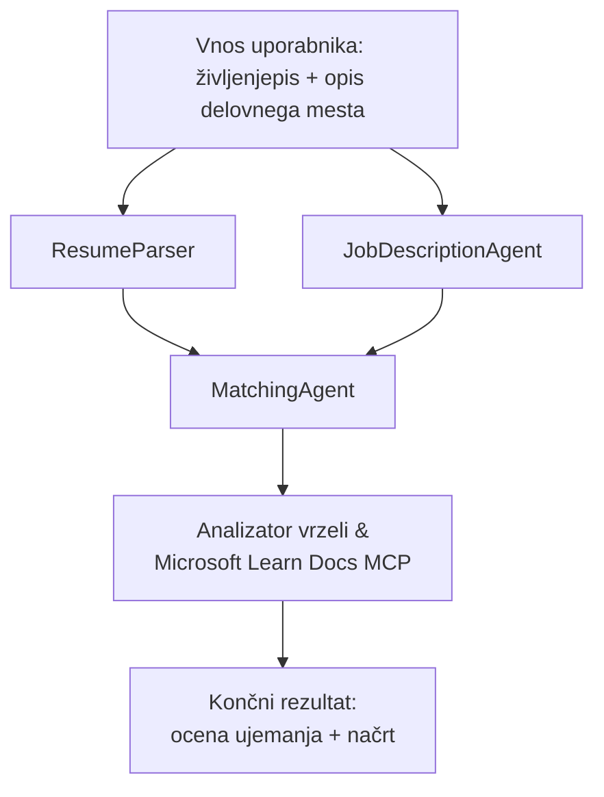

# PersonalCareerCopilot - Ocena ustreznosti življenjepisa za delovno mesto

Večagentni potek dela, ki oceni, kako dobro življenjepis ustreza opisu delovnega mesta, nato pa ustvari personalizirano učno pot za zapolnitev vrzeli.

---

## Agenti

| Agent | Vloga | Orodja |
|-------|-------|--------|
| **ResumeParser** | Izlušči strukturirane veščine, izkušnje, certifikate iz besedila življenjepisa | - |
| **JobDescriptionAgent** | Izlušči zahtevane/priporočene veščine, izkušnje, certifikate iz opisa delovnega mesta | - |
| **MatchingAgent** | Primerja profil z zahtevami → ocena ustreznosti (0-100) + ujemajoče/ manjkajoče veščine | - |
| **GapAnalyzer** | Ustvari personalizirano učno pot z viri Microsoft Learn | `search_microsoft_learn_for_plan` (MCP) |

## Potek dela


---

## Hiter začetek

### 1. Priprava okolja

```powershell
cd workshop\lab02-multi-agent\PersonalCareerCopilot
python -m venv .venv
.\.venv\Scripts\Activate.ps1          # Windows PowerShell
# source .venv/bin/activate            # macOS / Linux
pip install -r requirements.txt
```

### 2. Konfiguracija poverilnic

Kopirajte vzorčno datoteko env in vnesite podatke o vašem Foundry projektu:

```powershell
cp .env.example .env
```

Uredite `.env`:

```env
PROJECT_ENDPOINT=https://<your-account>.services.ai.azure.com/api/projects/<your-project>
MODEL_DEPLOYMENT_NAME=gpt-4.1-mini
```

| Vrednost | Kje jo najti |
|----------|-------------|
| `PROJECT_ENDPOINT` | Orodna vrstica Microsoft Foundry v VS Code → desni klik na projekt → **Kopiraj naslov končne točke projekta** |
| `MODEL_DEPLOYMENT_NAME` | Stran Foundry → razširite projekt → **Modeli + končne točke** → ime namestitve |

### 3. Zagon lokalno

```powershell
python -m debugpy --listen 127.0.0.1:5679 -m agentdev run main.py --verbose --port 8088
```

Lahko uporabite tudi nalogo VS Code: `Ctrl+Shift+P` → **Tasks: Run Task** → **Run Lab02 HTTP Server**.

### 4. Test z Agent Inspectorjem

Odprite Agent Inspector: `Ctrl+Shift+P` → **Foundry Toolkit: Open Agent Inspector**.

Prilepite ta testni poziv:

```
Resume:
Jane Doe
Senior Software Engineer with 5 years of experience in Python, Django, and AWS.
Built microservices handling 10K+ requests/second. Led a team of 4 developers.
Certifications: AWS Solutions Architect Associate.
Education: B.S. Computer Science, State University.

Job Description:
Senior Cloud Engineer at Contoso Ltd.
Required: Python, Azure, Kubernetes, Terraform, CI/CD pipelines.
Preferred: Go, monitoring (Prometheus/Grafana), cost optimization.
Experience: 5+ years in cloud infrastructure.
Certifications: Azure Solutions Architect Expert preferred.
```

**Pričakovano:** Ocena ustreznosti (0-100), ujemajoče/manjkajoče veščine in personalizirana učna pot z URL-ji Microsoft Learn.

### 5. Namestitev v Foundry

`Ctrl+Shift+P` → **Microsoft Foundry: Deploy Hosted Agent** → izberite vaš projekt → potrdite.

---

## Struktura projekta

```
PersonalCareerCopilot/
├── .env.example        ← Template for environment variables
├── .env                ← Your credentials (git-ignored)
├── agent.yaml          ← Hosted agent definition (name, resources, env vars)
├── Dockerfile          ← Container image for Foundry deployment
├── main.py             ← 4-agent workflow (instructions, MCP tool, WorkflowBuilder)
└── requirements.txt    ← Python dependencies
```

## Ključne datoteke

### `agent.yaml`

Določa gostovanega agenta za Foundry Agent Service:
- `kind: hosted` - deluje kot upravljan kontejner
- `protocols: [responses v1]` - izpostavlja HTTP končno točko `/responses`
- `environment_variables` - `PROJECT_ENDPOINT` in `MODEL_DEPLOYMENT_NAME` se vstavita ob namestitvi

### `main.py`

Vsebuje:
- **Navodila za agente** - štirje konstanti `*_INSTRUCTIONS`, po ena za vsakega agenta
- **Orodje MCP** - `search_microsoft_learn_for_plan()` kliče `https://learn.microsoft.com/api/mcp` prek Streamable HTTP
- **Ustvarjanje agentov** - `create_agents()` kot kontekstni upravljalec preko `AzureAIAgentClient.as_agent()`
- **Graf poteka dela** - `create_workflow()` uporablja `WorkflowBuilder` za povezovanje agentov z vzorci fan-out/fan-in/sekvencialno
- **Zagon strežnika** - `from_agent_framework(agent).run_async()` na vratih 8088

### `requirements.txt`

| Paket | Verzija | Namen |
|--------|---------|-------|
| `agent-framework-azure-ai` | `1.0.0rc3` | Integracija Azure AI za Microsoft Agent Framework |
| `agent-framework-core` | `1.0.0rc3` | Jedro zagonskega okolja (vsebuje WorkflowBuilder) |
| `azure-ai-agentserver-agentframework` | `1.0.0b16` | Zagonsko okolje za gostovane agente |
| `azure-ai-agentserver-core` | `1.0.0b16` | Osnove strežniških agentov |
| `debugpy` | najnovejša | Python razhroščevanje (F5 v VS Code) |
| `agent-dev-cli` | `--pre` | Lokalno razvojno orodje CLI + podporno okolje Agent Inspectorja |

---

## Reševanje težav

| Težava | Rešitev |
|---------|---------|
| `RuntimeError: Missing required environment variable(s)` | Ustvarite `.env` z `PROJECT_ENDPOINT` in `MODEL_DEPLOYMENT_NAME` |
| `ModuleNotFoundError: No module named 'agent_framework'` | Aktivirajte venv in zaženite `pip install -r requirements.txt` |
| V izhodu ni URL-jev Microsoft Learn | Preverite internetno povezavo do `https://learn.microsoft.com/api/mcp` |
| Samo ena kartica vrzeli (prirezano) | Preverite, da `GAP_ANALYZER_INSTRUCTIONS` vsebuje blok `CRITICAL:` |
| Vrata 8088 so zasedena | Ustavite druge strežnike: `netstat -ano \| findstr :8088` |

Za podrobnejše reševanje si oglejte [Modul 8 - Reševanje težav](../docs/08-troubleshooting.md).

---

**Celoten vodič:** [Lab 02 Docs](../docs/README.md) · **Nazaj na:** [Lab 02 README](../README.md) · [Domača stran delavnice](../../../README.md)

---

<!-- CO-OP TRANSLATOR DISCLAIMER START -->
**Omejitev odgovornosti**:
Ta dokument je bil preveden z uporabo storitve za umetno inteligenco [Co-op Translator](https://github.com/Azure/co-op-translator). Čeprav si prizadevamo za natančnost, vas prosimo, da upoštevate, da avtomatizirani prevodi lahko vsebujejo napake ali netočnosti. Izvirni dokument v njegovem izvirnem jeziku naj velja za avtoritativni vir. Za kritične informacije priporočamo strokovni prevod s strani človeka. Nismo odgovorni za kakršne koli napačne razlage ali nepravilne interpretacije, ki izhajajo iz uporabe tega prevoda.
<!-- CO-OP TRANSLATOR DISCLAIMER END -->