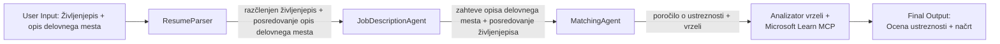

# PersonalCareerCopilot - Evalvator ustreznosti življenjepisa za delo

Aplikacija z več agenti, ki temelji na delovnem toku, oceni, kako dobro življenjepis ustreza opisu delovnega mesta, nato pa ustvari prilagojeno učni načrt za zapolnitev vrzeli.

---

## Agenti

| Agent | Vloga | Orodja |
|-------|------|-------|
| **ResumeParser** | Izvleče strukturirane veščine, izkušnje, certifikate iz besedila življenjepisa | - |
| **JobDescriptionAgent** | Izvleče zahtevane/željene veščine, izkušnje, certifikate iz opisa delovnega mesta | - |
| **MatchingAgent** | Primerja profil s zahtevami → ocena ustreznosti (0-100) + ujemajoče/pomanjkljive veščine | - |
| **GapAnalyzer** | Ustvari prilagojen učni načrt z viri Microsoft Learn | `search_microsoft_learn_for_plan` (MCP) |

## Delovni tok


```mermaid
flowchart LR
    UserInput["User Input: Življenjepis + opis delovnega mesta"] --> ResumeParser
    ResumeParser -- "razčlenjen življenjepis + posredovanje opis delovnega mesta" --> JobDescriptionAgent
    JobDescriptionAgent -- "zahteve opisa delovnega mesta + posredovanje življenjepisa" --> MatchingAgent
    MatchingAgent -- "poročilo o ustreznosti + vrzeli" --> GapAnalyzerMCP["Analizator vrzeli +\nMicrosoft Learn MCP"]
    GapAnalyzerMCP --> FinalOutput["Final Output:\nOcena ustreznosti + načrt"]
```

---

## Hitri začetek

### 1. Nastavite okolje

Ta mapa je referenčna implementacija ogrodja za lab 02, ki temelji na delovnem toku. Njena `main.py` uporablja obstoječe bloke pozivov in `WorkflowBuilder`, da poveže štiri agente.

```powershell
cd workshop\lab02-multi-agent\PersonalCareerCopilot
python -m venv .venv
.\.venv\Scripts\Activate.ps1          # Windows PowerShell
# source .venv/bin/activate            # macOS / Linux
pip install -r requirements.txt
```

### 2. Nastavite poverilnice

Ustvarite datoteko `.env` v tej mapi:

```powershell
copy .env .env.bak 2>$null; echo $null > .env
```

Uredite `.env`:

```env
FOUNDRY_PROJECT_ENDPOINT=https://<your-account>.services.ai.azure.com/api/projects/<your-project>
AZURE_AI_MODEL_DEPLOYMENT_NAME=gpt-4.1-mini
```

| Vrednost | Kje jo najti |
|-------|------------------|
| `FOUNDRY_PROJECT_ENDPOINT` | Stran Foundry Toolkit → desni klik na projekt → **Kopiraj končno točko projekta** |
| `AZURE_AI_MODEL_DEPLOYMENT_NAME` | Stran Foundry → razširi projekt → **Modeli + končne točke** → ime postavitve |

### 3. Zaženite lokalno

```powershell
python -m debugpy --listen 127.0.0.1:5679 main.py --port 8088
```

Ali uporabite nalogo VS Code: `Ctrl+Shift+P` → **Tasks: Run Task** → **Run Agent HTTP Server**.

Za razhroščevanje F5 uporabite **Debug Local Agent HTTP Server**.

### 4. Testirajte z Agent Inspector

Odprite Agent Inspector: `Ctrl+Shift+P` → **Foundry Toolkit: Open Agent Inspector**.

Prilepite ta testni poziv:

```
Resume:
Jane Doe
Senior Software Engineer with 5 years of experience in Python, Django, and AWS.
Built microservices handling 10K+ requests/second. Led a team of 4 developers.
Certifications: AWS Solutions Architect Associate.
Education: B.S. Computer Science, State University.

Job Description:
Senior Cloud Engineer at Contoso Ltd.
Required: Python, Azure, Kubernetes, Terraform, CI/CD pipelines.
Preferred: Go, monitoring (Prometheus/Grafana), cost optimization.
Experience: 5+ years in cloud infrastructure.
Certifications: Azure Solutions Architect Expert preferred.
```

**Pričakovano:** Ocena ustreznosti (0-100), ujemajoče/pomanjkljive veščine in prilagojen učni načrt z URL-ji Microsoft Learn.

### 5. Namestite v Foundry

`Ctrl+Shift+P` → **Foundry Toolkit: Deploy Hosted Agent** → izberite svoj projekt → potrdite.

---

## Struktura projekta

```
PersonalCareerCopilot/
├── .env                ← Your credentials (git-ignored)
├── agent.yaml          ← Hosted agent definition (name, resources, env vars)
├── Dockerfile          ← Container image for Foundry deployment
├── main.py             ← 4-agent workflow (instructions, MCP tool, WorkflowBuilder)
└── requirements.txt    ← Python dependencies
```

## Ključne datoteke

### `agent.yaml`

Določa gostujočega agenta za Foundry Agent Service:
- `kind: hosted` - teče kot upravljani kontejner
- `protocols` - protokol `responses` z `version: 1.0.0`, ki razkriva HTTP končno točko `/responses`
- `environment_variables` - tukaj je deklariran `AZURE_AI_MODEL_DEPLOYMENT_NAME`; `FOUNDRY_PROJECT_ENDPOINT` se samodejno vstavi ob namestitvi

### `main.py`

Vsebuje:
- **Navodila za agente** - štiri konstante `*_INSTRUCTIONS`, po ena na agenta
- **Orodje MCP** - `search_microsoft_learn_for_plan()` kliče `https://learn.microsoft.com/api/mcp` preko Streamable HTTP
- **Ustvarjanje agentov** - štiri primere `Agent()` + `AgentExecutor()` z deljenim `FoundryChatClient`
- **Graf delovnega toka** - `WorkflowBuilder` povezuje agente kot zaporedno cevovod: ResumeParser → JD Agent → MatchingAgent → GapAnalyzer
- **Zagon strežnika** - `ResponsesHostServer` teče na vratih 8088

### `requirements.txt`

| Paket | Namen |
|---------|----------|
| `agent-framework-foundry` | Jedro izvajanja: `Agent`, `AgentExecutor`, `WorkflowBuilder`, `@tool`, `FoundryChatClient` |
| `agent-framework-foundry-hosting` | `ResponsesHostServer` + integracija gostovanja Foundry |
| `mcp<2,>=1.24.0` | MCP odjemalec za GapAnalyzer (`streamable_http_client`) |
| `debugpy` | Python razhroščevanje (F5 v VS Code) |

---

## Reševanje težav

| Težava | Rešitev |
|-------|-----|
| `KeyError: 'FOUNDRY_PROJECT_ENDPOINT'` ali `KeyError: 'AZURE_AI_MODEL_DEPLOYMENT_NAME'` | Ustvarite `.env` z nastavitvijo `FOUNDRY_PROJECT_ENDPOINT` in `AZURE_AI_MODEL_DEPLOYMENT_NAME` |
| `ModuleNotFoundError: No module named 'agent_framework'` | Aktivirajte venv in zaženite `pip install -r requirements.txt` |
| Brez URL-jev Microsoft Learn v izhodu | Preverite internetno povezavo do `https://learn.microsoft.com/api/mcp` |
| Samo 1 kartica vrzeli (skrajšana) | Preverite, ali `GAP_ANALYZER_INSTRUCTIONS` vključuje blok `CRITICAL:` |
| Vrata 8088 so zasedena | Ustavite druge strežnike: `netstat -ano \| findstr :8088` |

Za podrobno odpravljanje težav si oglejte [Modul 8 - Reševanje težav](../docs/08-troubleshooting.md).

---

**Celoten potek:** [Lab 02 Docs](../docs/README.md) · **Nazaj na:** [Lab 02 README](../README.md) · [Domača stran delavnice](../../../README.md)

---

<!-- CO-OP TRANSLATOR DISCLAIMER START -->
**Omejitev odgovornosti**:
Ta dokument je bil preveden z uporabo AI prevajalske storitve [Co-op Translator](https://github.com/Azure/co-op-translator). Čeprav si prizadevamo za natančnost, vas prosimo, da upoštevate, da avtomatizirani prevodi lahko vsebujejo napake ali netočnosti. Izvirni dokument v njegovem izvirnem jeziku je treba obravnavati kot avtoritativni vir. Za kritične informacije je priporočljiv strokovni človeški prevod. Ne odgovarjamo za morebitna nesporazume ali napačne interpretacije, ki izhajajo iz uporabe tega prevoda.
<!-- CO-OP TRANSLATOR DISCLAIMER END -->