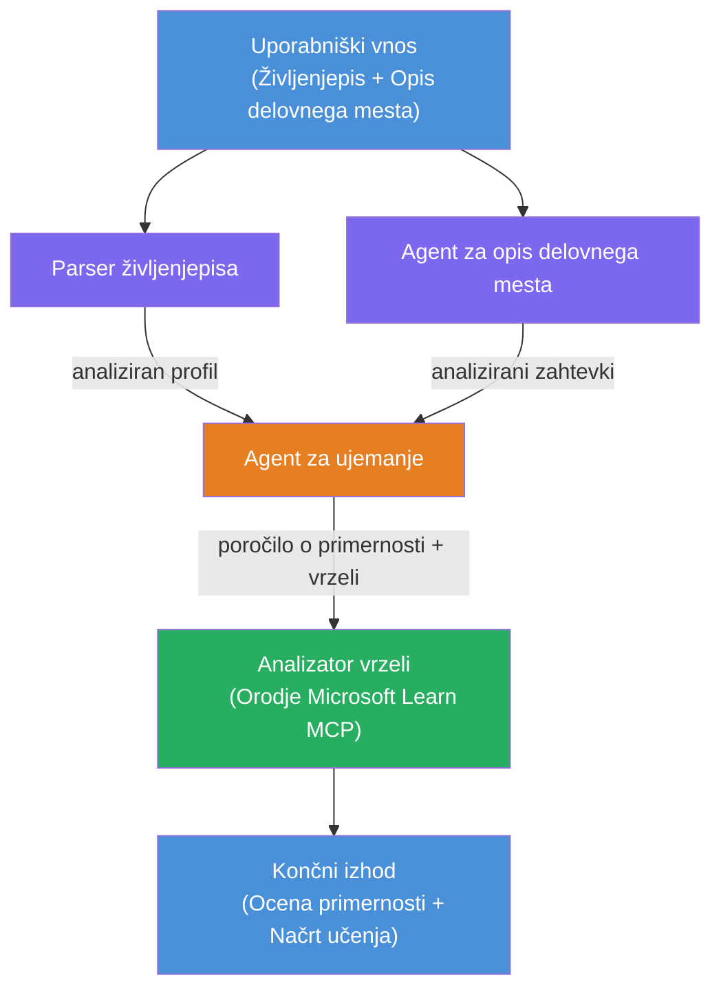

# Laboratorij 02 - Večagentni potek dela: Ocena usklajenosti življenjepisa za delovno mesto

---

## Kaj boste ustvarili

**Oceno usklajenosti življenjepisa za delovno mesto** - večagentni potek dela, kjer štirje specializirani agenti sodelujejo pri ocenjevanju, kako dobro življenjepis kandidata ustreza opisu delovnega mesta, nato pa ustvarijo prilagojeno učni načrt za zapolnitev vrzeli.

### Agenti

| Agent | Vloga |
|-------|-------|
| **Resume Parser** | Izvleče strukturirane veščine, izkušnje, certifikate iz besedila življenjepisa |
| **Job Description Agent** | Izvleče zahtevane/priporočene veščine, izkušnje, certifikate iz opisa delovnega mesta |
| **Matching Agent** | Primerja profil z zahtevami → ocenjeni skladnosti (0-100) + usklajene/manjkajoče veščine |
| **Gap Analyzer** | Ustvari prilagojeno učno pot z viri, časovnicami in hitrimi projekti za osvojitev |

### Tok demonstracije

Naložite **življenjepis + opis delovnega mesta** → pridobite **ocene skladnosti + manjkajoče veščine** → prejmete **prilagojeno učni načrt**.

### Arhitektura poteka dela

> Vijolična = vzporedni agenti | Oranžna = točka združevanja | Zelena = končni agent z orodji. Oglejte si [Modul 1 - Razumevanje arhitekture](docs/01-understand-multi-agent.md) in [Modul 4 - Vzorci orkestracije](docs/04-orchestration-patterns.md) za podrobne diagrame in podatkovne tokove.

### Obravnavane teme

- Ustvarjanje večagentnega poteka dela z uporabo **WorkflowBuilder**
- Določanje vlog agentov in poteka orkestracije (vzporedno + zaporedno)
- Vzorce komunikacije med agenti
- Lokalno testiranje z Agent Inspector
- Razmestitev večagentnih potekov dela v Foundry Agent Service

---

## Predpogoji

Najprej dokončajte Laboratorij 01:

- [Laboratorij 01 - En agent](../lab01-single-agent/README.md)

---

## Začni

Celotna navodila za nastavitev, predstavitev kode in ukaze za testiranje najdete v:

- [Laboratorij 2 dokumentacija - Predpogoji](docs/00-prerequisites.md)
- [Laboratorij 2 dokumentacija - Celotna učna pot](docs/README.md)
- [Vodič za zagon PersonalCareerCopilot](PersonalCareerCopilot/README.md)

## Vzorci orkestracije (agentske alternative)

Laboratorij 2 vključuje privzeti potek **vzoredno → agregator → načrtovalec**, dokumentacija pa opisuje tudi alternativne vzorce za prikaz močnejšega agentskega vedenja:

- **Fan-out/Fan-in z uteženim konsenzom**
- **Pregled/ kritika pred končnim učnim načrtom**
- **Pogojni usmerjevalnik** (izbira poti glede na oceno skladnosti in manjkajoče veščine)

Oglejte si [docs/04-orchestration-patterns.md](docs/04-orchestration-patterns.md).

---

**Prejšnji:** [Laboratorij 01 - En agent](../lab01-single-agent/README.md) · **Nazaj na:** [Domača stran delavnice](../../README.md)

---

<!-- CO-OP TRANSLATOR DISCLAIMER START -->
**Opozorilo**:  
Ta dokument je bil preveden z uporabo storitve za avtomatski prevod [Co-op Translator](https://github.com/Azure/co-op-translator). Čeprav si prizadevamo za točnost, vas prosimo, da upoštevate, da lahko avtomatizirani prevodi vsebujejo napake ali netočnosti. Izvirni dokument v njegovem izvirnem jeziku velja za avtoritativni vir. Za pomembne informacije priporočamo strokovni človeški prevod. Za morebitne nesporazume ali napačne razlage, ki izhajajo iz uporabe tega prevoda, nismo odgovorni.
<!-- CO-OP TRANSLATOR DISCLAIMER END -->