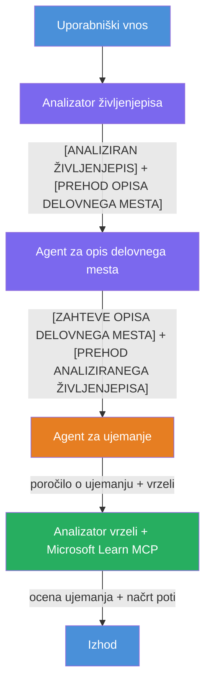

# Laboratorij 02 - Multi-agentni delovni tok: Ocena primernosti življenjepisa za delovno mesto

## Pregled

V tem praktičnem laboratoriju boste ustvarili **multi-agentno aplikacijo, osredotočeno na delovni tok**, z uporabo Foundry Toolkit v VS Code in jo uvedli v Microsoft Foundry Agent Service.

**Kaj boste ustvarili:** Ocenjevalec primernosti življenjepisa za delovno mesto, ki analizira življenjepis in opis delovnega mesta, oceni ujemanje in pripravi osebni načrt učenja z uporabo virov Microsoft Learn.

---

## Arhitektura

```mermaid
flowchart TD
    A["Uporabniški vnos"] --> B["Analizator življenjepisa"]
    B -->|"[ANALIZIRAN ŽIVLJENJEPIS] + [PREHOD OPISA DELOVNEGA MESTA]"| C["Agent za opis delovnega mesta"]
    C -->|"[ZAHTEVE OPISA DELOVNEGA MESTA] + [PREHOD ANALIZIRANEGA ŽIVLJENJEPISA]"| D["Agent za ujemanje"]
    D -->|poročilo o ujemanju + vrzeli| E["Analizator vrzeli + Microsoft Learn MCP"]
    E -->|ocena ujemanja + načrt poti| F["Izhod"]

    style A fill:#4A90D9,color:#fff
    style B fill:#7B68EE,color:#fff
    style C fill:#7B68EE,color:#fff
    style D fill:#E67E22,color:#fff
    style E fill:#27AE60,color:#fff
    style F fill:#4A90D9,color:#fff
```

**Kako deluje:**
1. Uporabnik prilepi življenjepis in opis delovnega mesta.
2. **ResumeParser** analizira življenjepis in v celoti kopira opis delovnega mesta v razdelek `[JOB DESCRIPTION PASS-THROUGH]`.
3. **JD Agent** izlušči strukturirane zahteve iz prenosa in nato posreduje `[PARSED RESUME]` kot `[PARSED RESUME PASS-THROUGH]`.
4. **MatchingAgent** primerja `[PARSED RESUME PASS-THROUGH]` in `[JD REQUIREMENTS]` ter ustvari oceno ujemanja.
5. **GapAnalyzer** spremeni vrzeli v praktičen načrt ter pridobi resnične povezave Microsoft Learn preko MCP.

---

## Zahteve

Najprej dokončajte Laboratorij 01:

- [Laboratorij 01 - En sam agent](../lab01-single-agent/README.md)

---

## Del 1: Preberite module v vrstnem redu

Celotno pot učenja si oglejte na:

- [Dokumenti za Lab 2 - Zahteve](docs/00-prerequisites.md)
- [Dokumenti za Lab 2 - Celotna pot učenja](docs/README.md)
- [Navodila za zagon PersonalCareerCopilot](PersonalCareerCopilot/README.md)

---

## Del 2: Izdelajte in preizkusite delovni tok

1. Uporabite čarovnika Foundry Toolkit za ustvarjanje projekta, ki temelji na delovnem toku.
2. Kopirajte bloke pozivov in graf delovnega toka iz `PersonalCareerCopilot/main.py` v vaš delovni prostor.
3. Zaženite lokalno z Agent Inspector in preverite vse štiri agente ter orodje MCP.
4. Ko lokalno testiranje uspe, uvedite gostujočega agenta v Foundry.

---

## Vzorce orkestracije

Laboratorij 02 vključuje privzeti potek **fan-out → fan-in → zaporedno**, dokumentacija pa opisuje tudi alternativne vzorce orkestracije za eksperimente.

- **Fan-out/Fan-in z uteženim soglasjem**
- **Prehod pregleda/pregledovalca pred končnim načrtom**
- **Pogojni usmerjevalnik** glede na oceno ujemanja in manjkajoče veščine

Oglejte si [docs/04-orchestration-patterns.md](docs/04-orchestration-patterns.md).

---

**Prejšnje:** [Laboratorij 01 - En sam agent](../lab01-single-agent/README.md) · **Nazaj na:** [Domača stran delavnice](../../README.md)

---

<!-- CO-OP TRANSLATOR DISCLAIMER START -->
**Omejitev odgovornosti**:
Ta dokument je bil preveden z uporabo AI prevajalske storitve [Co-op Translator](https://github.com/Azure/co-op-translator). Čeprav si prizadevamo za natančnost, vas prosimo, da upoštevate, da avtomatizirani prevodi lahko vsebujejo napake ali netočnosti. Izvirni dokument v njegovem izvirnem jeziku je treba obravnavati kot avtoritativni vir. Za kritične informacije je priporočljiv strokovni človeški prevod. Ne odgovarjamo za morebitna nesporazume ali napačne interpretacije, ki izhajajo iz uporabe tega prevoda.
<!-- CO-OP TRANSLATOR DISCLAIMER END -->