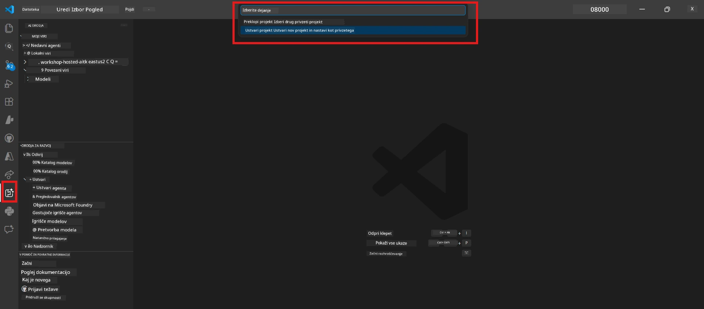

# Module 0 - Predpogoji

Pred začetkom Lab 02 potrdite, da imate naslednje opravljeno. Ta laboratorij neposredno gradi na Lab 01 - ne preskakujte ga.

---

## 1. Dokončajte Lab 01

Lab 02 predpostavlja, da ste že:

- [x] Dokončali vseh 8 modulov [Lab 01 - Enoten agent](../../lab01-single-agent/README.md)
- [x] Uspešno razmestili enega agenta na Foundry Agent Service
- [x] Preverili, da agent deluje tako v lokalnem Agent Inspector kot v Foundry Playground

Če niste dokončali Lab 01, se vrnite in ga dokončajte zdaj: [Lab 01 Dokumentacija](../../lab01-single-agent/docs/00-prerequisites.md)

---

## 2. Preverite obstoječo nastavitev

Vsa orodja iz Lab 01 bi morala biti še vedno nameščena in delujoča. Zaženite te hitre preglede:

### 2.1 Azure CLI

```powershell
az account show --query "{name:name, id:id}" --output table
```

Pričakovano: Prikaže vaše ime naročnine in ID. Če to ne uspe, zaženite [`az login`](https://learn.microsoft.com/cli/azure/authenticate-azure-cli-interactively).

### 2.2 Razširitve VS Code

1. Pritisnite `Ctrl+Shift+P` → vpišite **"Microsoft Foundry"** → potrdite, da vidite ukaze (npr. `Microsoft Foundry: Create a New Hosted Agent`).
2. Pritisnite `Ctrl+Shift+P` → vpišite **"Foundry Toolkit"** → potrdite, da vidite ukaze (npr. `Foundry Toolkit: Open Agent Inspector`).

### 2.3 Foundry projekt in model

1. Kliknite ikono **Microsoft Foundry** v vrstici aktivnosti VS Code.
2. Potrdite, da je vaš projekt na seznamu (npr. `workshop-agents`).
3. Razširite projekt → preverite, da obstaja razporejeni model (npr. `gpt-4.1-mini`) z statusom **Succeeded**.

> **Če je potekel vaš model deployment:** Nekatere brezplačne razmestitve se samodejno potečejo. Ponovno razmestite iz [Model Catalog](https://learn.microsoft.com/azure/foundry/foundry-models/concepts/models-sold-directly-by-azure) (`Ctrl+Shift+P` → **Microsoft Foundry: Open Model Catalog**).



### 2.4 RBAC vloge

Preverite, da imate v Foundry projektu dodeljeno vlogo **Azure AI User**:

1. [Azure Portal](https://portal.azure.com) → vaš Foundry **projekt** → **Dostopni nadzor (IAM)** → zavihek **[Dodelitve vlog](https://learn.microsoft.com/azure/foundry/concepts/rbac-foundry)**.
2. Poiščite svoje ime → potrdite, da je navedena vloga **[Azure AI User](https://aka.ms/foundry-ext-project-role)**.

---

## 3. Razumite koncepte večagentnega poteka dela (novo v Lab 02)

Lab 02 uvaja koncepte, ki niso bili zajeti v Lab 01. Pred nadaljevanjem jih preberite:

### 3.1 Kaj je večagentni potek dela?

Namesto da bi en agent opravljal vse, **večagentni potek dela** razdeli delo med več specializiranih agentov. Vsak agent ima:

- Svoje lastne **navodila** (sistemski poziv)
- Svojo lastno **vlogo** (za kaj je odgovoren)
- Neobvezna **orodja** (funkcije, ki jih lahko kliče)

Agenti komunicirajo skozi **orkestracijski graf**, ki določa, kako med njimi tečejo podatki.

### 3.2 WorkflowBuilder

Razred [`WorkflowBuilder`](https://learn.microsoft.com/agent-framework/workflows/agents-in-workflows) iz `agent_framework` je SDK komponenta, ki povezuje agente skupaj:

```python
from agent_framework import WorkflowBuilder

workflow = (
    WorkflowBuilder(
        name="MyWorkflow",
        start_executor=agent_a,
        output_executors=[agent_d],
    )
    .add_edge(agent_a, agent_b)
    .add_edge(agent_a, agent_c)
    .add_edge(agent_b, agent_d)
    .add_edge(agent_c, agent_d)
    .build()
)
```

- **`start_executor`** - Prvi agent, ki prejme uporabniški vnos
- **`output_executors`** - Agent(i), katerih izhod postane končni odgovor
- **`add_edge(source, target)`** - Določa, da `target` prejme izhod `source` agenta

### 3.3 MCP (Model Context Protocol) orodja

Lab 02 uporablja **MCP orodje**, ki kliče Microsoft Learn API za pridobivanje učnih virov. [MCP (Model Context Protocol)](https://modelcontextprotocol.io/introduction) je standardiziran protokol za povezovanje AI modelov z zunanjimi podatkovnimi viri in orodji.

| Pojem | Definicija |
|------|-----------|
| **MCP strežnik** | Storitev, ki izpostavlja orodja/vire preko [MCP protokola](https://learn.microsoft.com/azure/foundry/agents/how-to/tools/model-context-protocol) |
| **MCP klient** | Vaša koda agent, ki se povezuje na MCP strežnik in kliče njegova orodja |
| **[Streamable HTTP](https://learn.microsoft.com/agent-framework/agents/tools/hosted-mcp-tools)** | Metoda prenosa za komunikacijo z MCP strežnikom |

### 3.4 Kako se Lab 02 razlikuje od Lab 01

| Vidik | Lab 01 (Eni agent) | Lab 02 (Večagentni) |
|--------|----------------------|---------------------|
| Agenti | 1 | 4 (specializirane vloge) |
| Orkestracija | Ni | WorkflowBuilder (vzporedna + zaporedna) |
| Orodja | Neobvezna funkcija `@tool` | MCP orodje (klic zunanjega API-ja) |
| Kompleksnost | Enostaven poziv → odgovor | Življenjepis + JD → ocena primerenosti → načrt |
| Tok konteksta | Neposreden | Predaja med agenti |

---

## 4. Struktura repozitorija delavnice za Lab 02

Poskrbite, da veste, kje so datoteke za Lab 02:

```
workshop/
└── lab02-multi-agent/
    ├── README.md                       ← Lab overview
    ├── docs/                           ← You are here
    │   ├── README.md                   ← Learning path index
    │   ├── 00-prerequisites.md         ← This file
    │   ├── 01-understand-multi-agent.md
    │   ├── ...
    │   └── 08-troubleshooting.md
    └── PersonalCareerCopilot/          ← The agent project
        ├── agent.yaml                  ← Agent definition
        ├── main.py                     ← 4-agent workflow code
        ├── Dockerfile                  ← Container configuration
        └── requirements.txt            ← Python dependencies
```

---

### Kontrolna točka

- [ ] Lab 01 je popolnoma zaključen (vseh 8 modulov, agent razmestljen in preverjen)
- [ ] `az account show` prikaže vašo naročnino
- [ ] Razširitve Microsoft Foundry in Foundry Toolkit so nameščene in odzivne
- [ ] Foundry projekt ima razporejeni model (npr. `gpt-4.1-mini`)
- [ ] Imate vlogo **Azure AI User** na projektu
- [ ] Prebrali ste zgornji odsek o večagentnih konceptih in razumete WorkflowBuilder, MCP in orkestracijo agentov

---

**Naslednje:** [01 - Razumevanje večagentne arhitekture →](01-understand-multi-agent.md)

---

<!-- CO-OP TRANSLATOR DISCLAIMER START -->
**Opozorilo**:  
Ta dokument je bil preveden z uporabo storitve AI prevajanja [Co-op Translator](https://github.com/Azure/co-op-translator). Čeprav si prizadevamo za natančnost, prosimo, upoštevajte, da avtomatski prevodi lahko vsebujejo napake ali netočnosti. Izvirni dokument v izvirnem jeziku se šteje za uradni vir. Za pomembne informacije priporočamo strokovni človeški prevod. Ne odgovarjamo za morebitne nesporazume ali napačne razlage, ki izhajajo iz uporabe tega prevoda.
<!-- CO-OP TRANSLATOR DISCLAIMER END -->