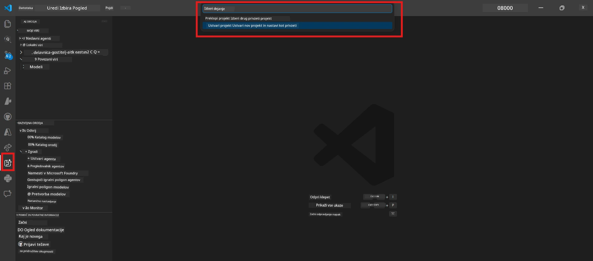

# Modul 0 - Uvod

⏱️ ~10 min

> [!WARNING]
> **Predogled & Omejitve:** [Gostujoči agenti](https://learn.microsoft.com/azure/foundry/agents/concepts/hosted-agents) so trenutno v **javnem predogledu** - niso priporočeni za produkcijske obremenitve. Nekatere funkcije prikazane v tej delavnici se lahko spremenijo, ko storitev preide v GA.

## Kaj boste zgradili

V tem labu boste razširili veščine enega agenta iz Laba 01 in zgradili **večagentni potek dela** - Ocenjevalec primernosti življenjepisa za delo.

Prilepite **življenjepis** in **opis delovnega mesta**. Štirje specializirani agenti postopoma obdelajo vhod, nato vrnejo:
- Oceno primernosti (0–100 z razčlenitvijo točk)
- Seznam manjkajočih veščin in certifikatov
- Personalizirano učno pot z dejanskimi povezavami Microsoft Learn za vsak primanjkljaj

**Potek dela uporablja:**
- **Microsoft Agent Framework** - `WorkflowBuilder` za zaporedno orkestracijo poteka
- **Foundry Toolkit za VS Code** - ogrodje, lokalno testiranje, nameščanje
- **AI model** (npr. `gpt-4.1-mini`) - uporabljen s strani vseh štirih agentov
- **Microsoft Learn MCP strežnik** - zagotavlja dejanske povezave do virov učenja za vsak primanjkljaj veščin

---

## Izberite svojo pot

> ⚠️ **Nadaljujte po isti poti, ki ste jo uporabljali v Lab 01.**

<details open>
<summary><strong>🅰️ Pot A - Azure oblak (zahteva Azure naročnino)</strong></summary>

| | Podrobnosti |
|---|---|
| **Za koga je to?** | Zaključili ste Lab 01 z uporabo Azure naročnine |
| **Model** | Azure OpenAI preko Foundry (npr. `gpt-4.1-mini`) |
| **Pokriti moduli** | Vsi moduli (00–09) |
| **Nameščanje v oblak?** | ✅ Da - popolna končna namestitev |

</details>

<details open>
<summary><strong>🅱️ Pot B - Foundry Local (ni potrebna Azure naročnina)</strong></summary>

| | Podrobnosti |
|---|---|
| **Za koga je to?** | Zaključili ste Lab 01 z uporabo Foundry Local |
| **Model** | Foundry Local (brezplačno, teče na vašem računalniku) |
| **Pokriti moduli** | Moduli 00–05 (preskočite 06–07 - nameščanje & preverjanje oblaka) |
| **Nameščanje v oblak?** | ❌ Ne - samo lokalno testiranje preko Agent Inspector |

</details>

---

## Preverjanje Laba 01

Lab 02 gradi neposredno na Lab 01. Najprej dokončajte Lab 01, preden začnete tukaj.

Še niste naredili Laba 01? Začnite tukaj: [Lab 01 - Uvod](../../lab01-single-agent/docs/00-prerequisites.md)

<details open>
<summary><strong>🅰️ Pot A - Azure oblak</strong></summary>

```powershell
az account show --query "{name:name, id:id}" --output table
```

Če to ne uspe, zaženite `az login`. Nato preverite v VS Code:

1. `Ctrl+Shift+P` → vpišite **Foundry Toolkit** → potrdite, da se prikažejo ukazi.
2. Kliknite ikono **Foundry Toolkit** → vaš projekt in nameščeni model pokažeta **Uspešno**.



> **RBAC:** V Lab 01 ste dodelili **Foundry User**. Če ga morate ponovno dodeliti, glejte [Lab 01, Modul 1](../../lab01-single-agent/docs/01-setup.md#deploy-a-model--assign-rbac). Vloga je bila prej imenovana **Azure AI User** - enake pravice.

</details>

<details open>
<summary><strong>🅱️ Pot B - Foundry Local</strong></summary>

```powershell
Invoke-WebRequest -Uri "http://localhost:5273/v1/health" -UseBasicParsing | Select-Object StatusCode
```

Pričakovano: `StatusCode: 200`. Če ne, znova zaženite Foundry Local iz stranskega menija Foundry Toolkit.

> Vse inferenčne operacije potekajo na vašem računalniku. Edini odhodni klic je orodje MCP na `https://learn.microsoft.com/api/mcp`.

</details>

---

## Kaj je novega v Lab 02

| | Lab 01 | Lab 02 |
|--|--------|--------|
| Agenti | 1 | 4 (veriženi z WorkflowBuilder) |
| Predloga ogrodja | Osnovna - Agent Framework | Poteki dela - Agent Framework |
| Nov paket | - | `mcp` |
| Orkestracija | En agent pogovora | Zaporedni potek (WorkflowBuilder) |
| Novo orodje | - | `search_microsoft_learn_for_plan` (MCP) |

---

**Naslednji korak:** [01 - Razumevanje arhitekture →](01-understand-multi-agent.md)

---

<!-- CO-OP TRANSLATOR DISCLAIMER START -->
**Omejitev odgovornosti**:
Ta dokument je bil preveden z uporabo AI prevajalske storitve [Co-op Translator](https://github.com/Azure/co-op-translator). Čeprav si prizadevamo za natančnost, vas prosimo, da upoštevate, da avtomatizirani prevodi lahko vsebujejo napake ali netočnosti. Izvirni dokument v njegovem izvirnem jeziku je treba obravnavati kot avtoritativni vir. Za kritične informacije je priporočljiv strokovni človeški prevod. Ne odgovarjamo za morebitna nesporazume ali napačne interpretacije, ki izhajajo iz uporabe tega prevoda.
<!-- CO-OP TRANSLATOR DISCLAIMER END -->