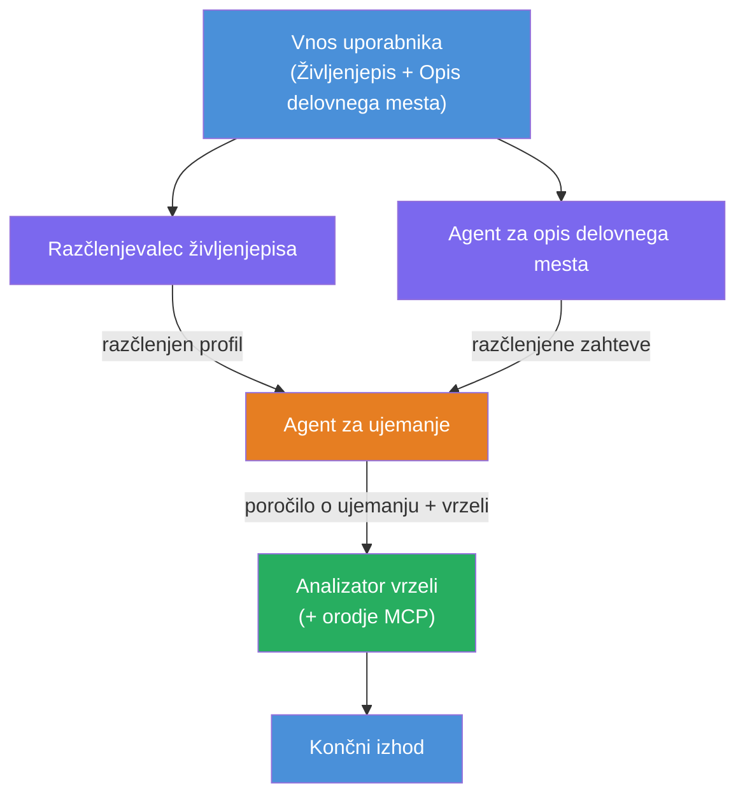
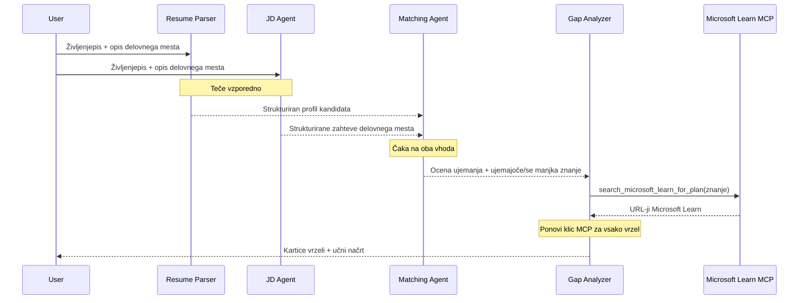
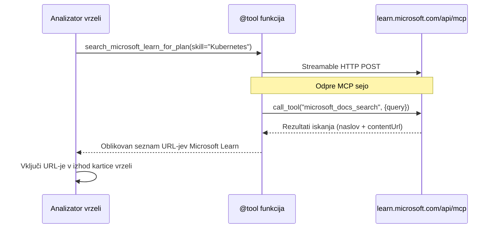

# Modul 1 - Razumevanje večagentne arhitekture

V tem modulu se naučite arhitekture ocenjevalca ujemanja življenjepisa s delovnim mestom, preden napišete katero koli kodo. Razumevanje orkestracijskega grafa, vlog agentov in pretoka podatkov je ključno za odpravljanje napak in razširjanje [večagentnih potekov dela](https://learn.microsoft.com/azure/architecture/ai-ml/idea/multiple-agent-workflow-automation).

---

## Problem, ki ga to rešuje

Ujemanje življenjepisa z opisom delovnega mesta vključuje več različnih veščin:

1. **Razčlenjevanje** - Izvleči strukturirane podatke iz nestrukturiranega besedila (življenjepis)
2. **Analiza** - Izvleči zahteve iz opisa delovnega mesta
3. **Primerjava** - Oceniti usklajenost med obema
4. **Načrtovanje** - Sestaviti načrt učenja za zapolnitev vrzeli

En sam agent, ki opravi vseh štiri naloge v enem pozivu, pogosto povzroči:
- Nepopolno izvlečenje (prehitro zaključi razčlenjevanje, da pride do ocene)
- Površinsko ocenjevanje (brez razčlenitve na podlagi dokazov)
- Generične načrte (ne prilagojene specifičnim vrzelim)

Z razdelitvijo na **štiri specializirane agente** se vsak osredotoči na svojo nalogo z namenskimi navodili, kar lahko na vsakem koraku prinese bolj kakovostne rezultate.

---

## Štirje agenti

Vsak agent je popoln [Microsoft Foundry](https://learn.microsoft.com/azure/foundry/agents/concepts/hosted-agents) agent, ustvarjen prek `AzureAIAgentClient.as_agent()`. Uporabljajo isti model, a imajo različna navodila in (po potrebi) različna orodja.

| # | Ime agenta | Vloga | Vhod | Izhod |
|---|------------|-------|------|-------|
| 1 | **ResumeParser** | Izvleče strukturiran profil iz besedila življenjepisa | Surovo besedilo življenjepisa (od uporabnika) | Kandidatov profil, tehnične veščine, mehke veščine, certifikati, domena izkušenj, dosežki |
| 2 | **JobDescriptionAgent** | Izvleče strukturirane zahteve iz opisa delovnega mesta | Surovo besedilo opisa delovnega mesta (od uporabnika, posredovano prek ResumeParser) | Pregled vloge, zahtevane veščine, prednostne veščine, izkušnje, certifikati, izobrazba, odgovornosti |
| 3 | **MatchingAgent** | Izračuna oceno ujemanja na podlagi dokazov | Izhodi ResumeParser + JobDescriptionAgent | Ocena ujemanja (0-100 z razčlenitvijo), ujemajoče se veščine, manjkajoče veščine, vrzeli |
| 4 | **GapAnalyzer** | Sestavi personaliziran načrt učenja | Izhod MatchingAgent | Kartice vrzeli (po veščinah), vrstni red učenja, časovni okvir, viri iz Microsoft Learn |

---

## Orkestracijski graf

Potek dela uporablja **vzporedno razvejanje**, ki mu sledi **zaporedna agregacija**:


> **Legenda:** Vijolična = vzporedni agenti, Oranžna = točka agregacije, Zelena = končni agent z orodji

### Kako tečejo podatki


1. **Uporabnik pošlje** sporočilo, ki vsebuje življenjepis in opis delovnega mesta.
2. **ResumeParser** prejme celoten uporabniški vhod in izvleče strukturiran kandidatov profil.
3. **JobDescriptionAgent** vzporedno prejme uporabniški vhod in izvleče strukturirane zahteve.
4. **MatchingAgent** prejme izhode **obeh** ResumeParser in JobDescriptionAgent (platforma počaka, da sta oba končana, preden zažene MatchingAgent).
5. **GapAnalyzer** prejme izhod MatchingAgent in pokliče **Microsoft Learn MCP orodje** za pridobitev pravih učnih virov za vsako vrzel.
6. **Končni izhod** je odziv GapAnalyzer, ki vključuje oceno ujemanja, kartice vrzeli in celovit načrt učenja.

### Zakaj je vzporedno razvejanje pomembno

ResumeParser in JobDescriptionAgent tečeta **vzporedno**, ker neodvisno delujeta drug od drugega. To:
- Zmanjšuje skupno zakasnitev (obe tečeta istočasno namesto zaporedno)
- Je naravna delitev (razčlenjevanje življenjepisa proti razčlenjevanju opisa delovnega mesta sta neodvisni nalogi)
- Prikazuje skupen vzorec večagentnega poteka dela: **razveji → združi → deluj**

---

## WorkflowBuilder v kodi

Tako zgornji graf preslika klice API-ja [`WorkflowBuilder`](https://learn.microsoft.com/agent-framework/workflows/agents-in-workflows) v `main.py`:

```python
from agent_framework import WorkflowBuilder

workflow = (
    WorkflowBuilder(
        name="ResumeJobFitEvaluator",
        start_executor=resume_parser,       # Prvi agent, ki prejme uporabniški vnos
        output_executors=[gap_analyzer],     # Končni agent, katerega izhod se vrne
    )
    .add_edge(resume_parser, jd_agent)      # ResumeParser → JobDescriptionAgent
    .add_edge(resume_parser, matching_agent) # ResumeParser → MatchingAgent
    .add_edge(jd_agent, matching_agent)      # JobDescriptionAgent → MatchingAgent
    .add_edge(matching_agent, gap_analyzer)  # MatchingAgent → GapAnalyzer
    .build()
)
```

**Razumevanje povezav:**

| Povezava | Pomen |
|----------|-------|
| `resume_parser → jd_agent` | JD Agent prejme izhod ResumeParser |
| `resume_parser → matching_agent` | MatchingAgent prejme izhod ResumeParser |
| `jd_agent → matching_agent` | MatchingAgent prav tako prejme izhod JD Agenta (počaka na oba) |
| `matching_agent → gap_analyzer` | GapAnalyzer prejme izhod MatchingAgent |

Ker `matching_agent` ima **dve vhodni povezavi** (`resume_parser` in `jd_agent`), platforma samodejno počaka, da sta obe zaključeni, preden zažene Matching Agent.

---

## MCP orodje

Agent GapAnalyzer ima eno orodje: `search_microsoft_learn_for_plan`. To je **[MCP orodje](https://learn.microsoft.com/agent-framework/agents/tools/hosted-mcp-tools)**, ki kliče Microsoft Learn API za pridobitev pripravljenih učnih virov.

### Kako deluje

```python
@tool
async def search_microsoft_learn_for_plan(
    skill: str, role: str = "", max_results: int = 5
) -> str:
    """Search Microsoft Learn MCP and return curated official links."""
    # Poveže se z https://learn.microsoft.com/api/mcp preko Streamable HTTP
    # Pokliče orodje 'microsoft_docs_search' na strežniku MCP
    # Vrne formatiran seznam URL-jev Microsoft Learn
```

### Potek klica MCP


1. GapAnalyzer odloči, da potrebuje učne vire za veščino (npr. "Kubernetes")
2. Platforma kliče `search_microsoft_learn_for_plan(skill="Kubernetes")`
3. Funkcija odpre [Streamable HTTP](https://learn.microsoft.com/agent-framework/agents/tools/hosted-mcp-tools) povezavo do `https://learn.microsoft.com/api/mcp`
4. Pokliče orodje `microsoft_docs_search` na [MCP strežniku](https://learn.microsoft.com/azure/foundry/agents/how-to/tools/model-context-protocol)
5. MCP strežnik vrne rezultate iskanja (naslov + URL)
6. Funkcija formatira rezultate in jih vrne kot niz
7. GapAnalyzer uporabi vrnjene URL-je v izhodu kartic vrzeli

### Pričakovani MCP dnevniki

Ko orodje teče, boste videli zapisnike kot:

```
GET https://learn.microsoft.com/api/mcp → 405 (Method Not Allowed)
POST https://learn.microsoft.com/api/mcp → 200
DELETE https://learn.microsoft.com/api/mcp → 405 (Method Not Allowed)
```

**To je normalno.** MCP odjemalec med inicializacijo preizkuša z GET in DELETE – pričakovano je, da se vrne 405. Sam klic orodja uporablja POST in vrne 200. Skrbite samo, če klici POST ne uspejo.

---

## Vzorec ustvarjanja agentov

Vsak agent je ustvarjen z uporabo asinhronega upravljavca konteksta **[`AzureAIAgentClient.as_agent()`](https://learn.microsoft.com/python/api/overview/azure/ai-agents-readme)**. To je Foundry SDK vzorec za ustvarjanje agentov, ki so samodejno pospravjeni:

```python
async with (
    get_credential() as credential,
    AzureAIAgentClient(
        project_endpoint=PROJECT_ENDPOINT,
        model_deployment_name=MODEL_DEPLOYMENT_NAME,
        credential=credential,
    ).as_agent(
        name="ResumeParser",
        instructions=RESUME_PARSER_INSTRUCTIONS,
    ) as resume_parser,
    # ... ponovite za vsakega agenta ...
):
    # Tukaj obstajajo vsi 4 agenti
    workflow = create_workflow(resume_parser, jd_agent, matching_agent, gap_analyzer)
```

**Ključne točke:**
- Vsak agent dobi lasten primer `AzureAIAgentClient` (SDK zahteva, da je ime agenta vezano na klienta)
- Vsi agenti uporabljajo iste `credential`, `PROJECT_ENDPOINT` in `MODEL_DEPLOYMENT_NAME`
- Blok `async with` zagotavlja, da so vsi agenti pospravljeni ob zaustavitvi strežnika
- GapAnalyzer dodatno prejme `tools=[search_microsoft_learn_for_plan]`

---

## Zagon strežnika

Po ustvarjanju agentov in sestavi poteka dela se strežnik zažene:

```python
from azure.ai.agentserver.agentframework import from_agent_framework

agent = create_workflow(resume_parser, jd_agent, matching_agent, gap_analyzer)
await from_agent_framework(agent).run_async()
```

`from_agent_framework()` ovije potek dela v HTTP strežnik, ki izpostavi `/responses` endpoint na vratih 8088. To je isti vzorec kot v laboratoriju 01, le da je "agent" zdaj celoten [graf poteka dela](https://learn.microsoft.com/agent-framework/workflows/as-agents).

---

### Kontrolna točka

- [ ] Razumete 4-agentno arhitekturo in vloge posameznih agentov
- [ ] Znate slediti pretoku podatkov: Uporabnik → ResumeParser → (vzporedno) JD Agent + MatchingAgent → GapAnalyzer → Izhod
- [ ] Razumete, zakaj MatchingAgent čaka na oba, ResumeParser in JD Agent (dve vhodni povezavi)
- [ ] Razumete MCP orodje: kaj počne, kako se kliče in da so dnevniki GET 405 normalni
- [ ] Razumete vzorec `AzureAIAgentClient.as_agent()` in zakaj ima vsak agent svojega klienta
- [ ] Znate prebrati kodo `WorkflowBuilder` in jo povezati z vizualnim grafom

---

**Prejšnji:** [00 - Zahteve](00-prerequisites.md) · **Naslednji:** [02 - Ustvarjanje večagentnega projekta →](02-scaffold-multi-agent.md)

---

<!-- CO-OP TRANSLATOR DISCLAIMER START -->
**Omejitev odgovornosti**:
Ta dokument je bil preveden z uporabo AI prevajalske storitve [Co-op Translator](https://github.com/Azure/co-op-translator). Čeprav si prizadevamo za natančnost, prosimo, upoštevajte, da avtomatizirani prevodi lahko vsebujejo napake ali netočnosti. Izvirni dokument v matičnem jeziku velja za avtoritativni vir. Za ključne informacije priporočamo strokovni človeški prevod. Za kakršna koli nesporazume ali napačne razlage, ki izhajajo iz uporabe tega prevoda, ne odgovarjamo.
<!-- CO-OP TRANSLATOR DISCLAIMER END -->