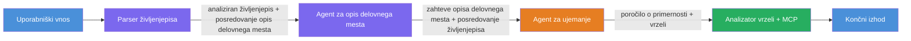

# Modul 1 - Razumevanje arhitekture

⏱️ ~5 min

Preden začnete pisati katero koli kodo, je tukaj hiter pregled tega, kar gradite in kako deluje.

---

## Kaj gradite

Vnesete **življenjepis** in **opis delovnega mesta**. Potek dela vrne:

- Oceno primerjave (0–100 z razčlenitvijo)
- Seznam vrzeli v veščinah in certifikatih
- Osebno učno pot z Microsoft Learn povezavami za vsako vrzel

---

## Štirje agenti

Eden sam agent, ki poskuša hkrati razčleniti, oceniti in načrtovati, običajno hiti in ustvarja površinske rezultate. Razdelitev dela na štiri specializirane agente prinaša boljše rezultate:

| Agent | Kaj počne |
|-------|-------------|
| **ResumeParser** | Razčleni življenjepis; kopira JD dobesedno v `[JOB DESCRIPTION PASS-THROUGH]` za spodnje agente |
| **JobDescriptionAgent** | Izvleče zahteve iz JD v pass-through; posreduje `[PARSED RESUME]` naprej kot `[PARSED RESUME PASS-THROUGH]` |
| **MatchingAgent** | Primerja obe označeni sekciji; ustvari oceno primernosti od 0 do 100 in seznam vrzeli |
| **GapAnalyzer** | Ustvari učno pot; išče po Microsoft Learn za vsako vrzel |

---

## Orkestracijski graf

Potek dela je **sekvenčni zbirnik** - vsak agent posreduje svoj izhod naslednjemu:


```mermaid
flowchart LR
    A["Uporabniški vnos"] --> B["Parser življenjepisa"]
    B -- "analiziran življenjepis + posredovanje opis delovnega mesta" --> C["Agent za opis delovnega mesta"]
    C -- "zahteve opisa delovnega mesta + posredovanje življenjepisa" --> D["Agent za ujemanje"]
    D -- "poročilo o primernosti + vrzeli" --> E["Analizator vrzeli + MCP"]
    E --> F["Končni izhod"]

    style A fill:#4A90D9,color:#fff
    style B fill:#7B68EE,color:#fff
    style C fill:#7B68EE,color:#fff
    style D fill:#E67E22,color:#fff
    style E fill:#27AE60,color:#fff
    style F fill:#4A90D9,color:#fff
```

1. **ResumeParser** prejme uporabniški vnos, razčleni življenjepis in kopira JD v `[JOB DESCRIPTION PASS-THROUGH]`.
2. **JD Agent** izvleče strukturirane zahteve in posreduje `[PARSED RESUME PASS-THROUGH]` naprej.
3. **MatchingAgent** primerja obe sekciji in ustvari oceno primernosti ter seznam vrzeli.
4. **GapAnalyzer** ustvari učno pot in pokliče orodje Microsoft Learn MCP za vsako vrzel.

---

## Kako to preslikati v kodo

V `main.py` to graf opišete z `WorkflowBuilder`:

```python
workflow_agent = (
    WorkflowBuilder(
        start_executor=resume_executor,       # prvi agent, ki prejme uporabnikov vnos
        output_executors=[gap_executor],      # zadnji agent - njegov izhod je odgovor
    )
    .add_edge(resume_executor, jd_executor)       # ResumeParser → JD agent
    .add_edge(jd_executor, matching_executor)     # JD agent → MatchingAgent
    .add_edge(matching_executor, gap_executor)    # MatchingAgent → GapAnalyzer
    .build()
    .as_agent()
)
```

Vsak `Agent` je zavit v `AgentExecutor`. Klici `add_edge()` definirajo strogo sekvenčni zbirnik - vsak agent prejme samo izhod svojega neposrednega predhodnika.

> `context_mode="last_agent"` pomeni, da vsak izvrševalec vidi samo izhod svojega neposrednega predhodnika. ResumeParser in JD Agent posredujeta podatke naprej v označenih sekcijah, tako da ima vsak spodnji agent natančno tisto, kar potrebuje.

---

## Orodje MCP

GapAnalyzer ima eno orodje: `search_microsoft_learn_for_plan`. Poveže se na `https://learn.microsoft.com/api/mcp` in vrne prave Microsoft Learn povezave za vsako vrzel v veščinah.

Ko orodje teče, boste videli te dnevnike - vsi so pričakovani:

```
GET  https://learn.microsoft.com/api/mcp → 405   ← connection probe, normal
POST https://learn.microsoft.com/api/mcp → 200   ← actual tool call
DELETE https://learn.microsoft.com/api/mcp → 405 ← cleanup probe, normal
```

Skrbite se le, če `POST` vrne napako.

---

**Prejšnje:** [00 - Zahteve](00-prerequisites.md) · **Naslednje:** [02 - Postavitev projekta →](02-scaffold-multi-agent.md)

---

<!-- CO-OP TRANSLATOR DISCLAIMER START -->
**Omejitev odgovornosti**:
Ta dokument je bil preveden z uporabo AI prevajalske storitve [Co-op Translator](https://github.com/Azure/co-op-translator). Čeprav si prizadevamo za natančnost, vas prosimo, da upoštevate, da avtomatizirani prevodi lahko vsebujejo napake ali netočnosti. Izvirni dokument v njegovem izvirnem jeziku je treba obravnavati kot avtoritativni vir. Za kritične informacije je priporočljiv strokovni človeški prevod. Ne odgovarjamo za morebitna nesporazume ali napačne interpretacije, ki izhajajo iz uporabe tega prevoda.
<!-- CO-OP TRANSLATOR DISCLAIMER END -->