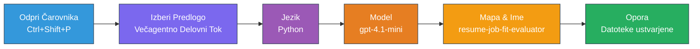
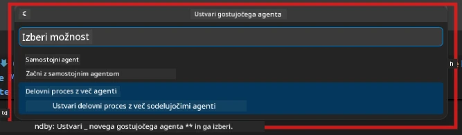

# Modul 2 - Postavitev večagentnega projekta

V tem modulu uporabite [Microsoft Foundry razširitev](https://marketplace.visualstudio.com/items?itemName=TeamsDevApp.vscode-ai-foundry), da **postavite večagentni potek dela**. Razširitev generira celotno strukturo projekta - `agent.yaml`, `main.py`, `Dockerfile`, `requirements.txt`, `.env` in konfiguracijo za razhroščevanje. Nato te datoteke prilagodite v modulih 3 in 4.

> **Opomba:** Mapa `PersonalCareerCopilot/` v tej delavnici je popoln, delujoč primer prilagojenega večagentnega projekta. Lahko postavite nov projekt (priporočeno za učenje) ali pa neposredno preučite obstoječo kodo.

---

## Korak 1: Odprite čarovnika za ustvarjanje gostujočega agenta


1. Pritisnite `Ctrl+Shift+P`, da odprete **Ukazno paleto**.
2. Vnesite: **Microsoft Foundry: Create a New Hosted Agent** in jo izberite.
3. Odpre se čarovnik za ustvarjanje gostujočega agenta.

> **Alternativa:** Kliknite ikono **Microsoft Foundry** na vrstici z aktivnostmi → kliknite ikono **+** poleg **Agents** → **Create New Hosted Agent**.

---

## Korak 2: Izberite predlogo za večagentni potek dela

Čarovnik vas vpraša, naj izberete predlogo:

| Predloga | Opis | Kdaj uporabiti |
|----------|-------------|-------------|
| Single Agent | En agent z navodili in neobveznimi orodji | Lab 01 |
| **Multi-Agent Workflow** | Več agentov, ki sodelujejo prek WorkflowBuilder | **Ta laboratorij (Lab 02)** |

1. Izberite **Multi-Agent Workflow**.
2. Kliknite **Next**.



---

## Korak 3: Izberite programski jezik

1. Izberite **Python**.
2. Kliknite **Next**.

---

## Korak 4: Izberite svoj model

1. Čarovnik prikaže modele, nameščene v vašem Foundry projektu.
2. Izberite isti model kot v Lab 01 (npr. **gpt-4.1-mini**).
3. Kliknite **Next**.

> **Namig:** [`gpt-4.1-mini`](https://learn.microsoft.com/azure/foundry/foundry-models/concepts/models-sold-directly-by-azure#gpt-41-series) je priporočljiv za razvoj - je hiter, poceni in dobro obvladuje večagentne poteke dela. Za končno produkcijsko uporabo preklopite na `gpt-4.1`, če želite izhod višje kakovosti.

---

## Korak 5: Izberite lokacijo mape in ime agenta

1. Odpre se dialog za izbiro mape. Izberite ciljno mapo:
   - Če sledite delavnici preko repozitorija: pojdite v `workshop/lab02-multi-agent/` in ustvarite novo podmapo
   - Če začnete od začetka: izberite katerokoli mapo
2. Vnesite **ime** za gostujočega agenta (npr. `resume-job-fit-evaluator`).
3. Kliknite **Create**.

---

## Korak 6: Počakajte, da se postavitev zaključi

1. VS Code odpre novo okno (ali na trenutnem oknu osveži) s postavljenim projektom.
2. Morali bi videti to strukturo datotek:

```
resume-job-fit-evaluator/
├── .env                ← Environment variables (placeholders)
├── .vscode/
│   └── launch.json     ← Debug configuration
├── agent.yaml          ← Agent definition (kind: hosted)
├── Dockerfile          ← Container configuration
├── main.py             ← Multi-agent workflow code (scaffold)
└── requirements.txt    ← Python dependencies
```

> **Opomba za delavnico:** V repozitoriju delavnice je mapa `.vscode/` v **korenu delovnega prostora** z deljenima `launch.json` in `tasks.json`. Konfiguracije za razhroščevanje za Lab 01 in Lab 02 so obe vključeni. Ko pritisnete F5, izberite **"Lab02 - Multi-Agent"** iz spustnega seznama.

---

## Korak 7: Razumevanje postavljenih datotek (specifika večagentnega projekta)

Večagentni projekt se razlikuje od enega agenta v več ključnih točkah:

### 7.1 `agent.yaml` - Definicija agenta

```yaml
kind: hosted
name: resume-job-fit-evaluator
description: >
  A multi-agent workflow that evaluates resume-to-job fit.
metadata:
  authors:
    - Microsoft
  tags:
    - Multi-Agent Workflow
    - Resume Evaluator
protocols:
  - protocol: responses
    version: v1
environment_variables:
  - name: PROJECT_ENDPOINT
    value: ${PROJECT_ENDPOINT}
  - name: MODEL_DEPLOYMENT_NAME
    value: ${MODEL_DEPLOYMENT_NAME}
```

**Ključna razlika od Lab 01:** Razdelek `environment_variables` lahko vključuje dodatne spremenljivke za MCP končne točke ali drugo konfiguracijo orodij. `name` in `description` odražata večagentno uporabo.

### 7.2 `main.py` - Koda večagentnega poteka dela

Projekt vključuje:
- **Več nizov z navodili za agente** (eno konstanto na agenta)
- **Več [`AzureAIAgentClient.as_agent()`](https://learn.microsoft.com/python/api/overview/azure/ai-agents-readme) kontekstnih upravljalcev** (enega za vsakega agenta)
- **[`WorkflowBuilder`](https://learn.microsoft.com/agent-framework/workflows/agents-in-workflows)** za povezovanje agentov
- **`from_agent_framework()`** za serviranje poteka dela kot HTTP končno točko

```python
from agent_framework import WorkflowBuilder, tool
from agent_framework.azure import AzureAIAgentClient
from azure.ai.agentserver.agentframework import from_agent_framework
```

Dodatni uvoz [`WorkflowBuilder`](https://learn.microsoft.com/agent-framework/workflows/agents-in-workflows) je nov v primerjavi z Lab 01.

### 7.3 `requirements.txt` - Dodatne odvisnosti

Večagentni projekt uporablja iste osnovne pakete kot Lab 01, plus pakete povezane z MCP:

```
agent-framework-azure-ai==1.0.0rc3
agent-framework-core==1.0.0rc3
azure-ai-agentserver-agentframework==1.0.0b16
azure-ai-agentserver-core==1.0.0b16
debugpy
agent-dev-cli --pre
```

> **Pomembna opomba o verzijah:** Paket `agent-dev-cli` zahteva zastavico `--pre` v `requirements.txt`, da namesti najnovejšo predogledno različico. To je potrebno za združljivost Agent Inspectorja z `agent-framework-core==1.0.0rc3`. Podrobnosti glejte v [Modul 8 - Odpravljanje težav](08-troubleshooting.md).

| Paket | Verzija | Namen |
|---------|---------|---------|
| [`agent-framework-azure-ai`](https://learn.microsoft.com/agent-framework/overview/) | `1.0.0rc3` | Azure AI integracija za [Microsoft Agent Framework](https://github.com/microsoft/agent-framework) |
| [`agent-framework-core`](https://learn.microsoft.com/agent-framework/overview/) | `1.0.0rc3` | Jedro runtime (vključuje WorkflowBuilder) |
| `azure-ai-agentserver-agentframework` | `1.0.0b16` | Runtime za gostujoče agente strežnika |
| `azure-ai-agentserver-core` | `1.0.0b16` | Jedrne abstrakcije strežnika agentov |
| `debugpy` | najnovejša | Python razhroščevanje (F5 v VS Code) |
| `agent-dev-cli` | `--pre` | Lokalni CLI za razvoj + backend Agent Inspectorja |

### 7.4 `Dockerfile` - Enako kot v Lab 01

Dockerfile je identičen tistemu iz Lab 01 - kopira datoteke, namesti odvisnosti iz `requirements.txt`, odpira vrata 8088 in zažene `python main.py`.

```dockerfile
FROM python:3.14-slim
WORKDIR /app
COPY ./ .
RUN pip install --upgrade pip && \
    if [ -f requirements.txt ]; then \
        pip install -r requirements.txt; \
    else \
      echo "No requirements.txt found" >&2; exit 1; \
    fi
EXPOSE 8088
CMD ["python", "main.py"]
```

---

### Kontrolna točka

- [ ] Čarovnik za postavitev zaključen → nova struktura projekta je vidna
- [ ] Vidite vse datoteke: `agent.yaml`, `main.py`, `Dockerfile`, `requirements.txt`, `.env`
- [ ] `main.py` vključuje uvoz `WorkflowBuilder` (potrjuje izbiro predloge za več agentov)
- [ ] `requirements.txt` vključuje tako `agent-framework-core` kot `agent-framework-azure-ai`
- [ ] Razumete, kako se večagentni projekt razlikuje od enega agenta (več agentov, WorkflowBuilder, MCP orodja)

---

**Prej:** [01 - Razumevanje večagentne arhitekture](01-understand-multi-agent.md) · **Naslednje:** [03 - Konfiguracija agentov in okolja →](03-configure-agents.md)

---

<!-- CO-OP TRANSLATOR DISCLAIMER START -->
**Omejitev odgovornosti**:  
Ta dokument je bil preveden z uporabo storitve za avtomatski prevod [Co-op Translator](https://github.com/Azure/co-op-translator). Čeprav si prizadevamo za natančnost, upoštevajte, da lahko avtomatizirani prevodi vsebujejo napake ali netočnosti. Izvirni dokument v njegovem izvirnem jeziku velja za avtoritativni vir. Za kritične informacije priporočamo strokovni človeški prevod. Za morebitne nesporazume ali napačne razlage, ki izhajajo iz uporabe tega prevoda, ne prevzemamo odgovornosti.
<!-- CO-OP TRANSLATOR DISCLAIMER END -->