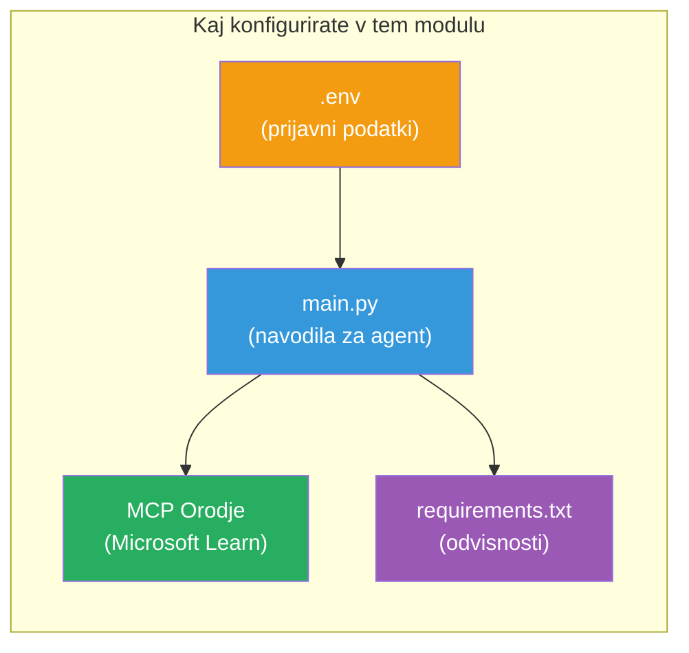

# Modul 3 - Konfiguracija agentov, orodja MCP in okolja

V tem modulu prilagodite zasnovani projekt za več agentov. Napisali boste navodila za vseh štiri agente, nastavili orodje MCP za Microsoft Learn, konfigurirali okoljske spremenljivke in namestili odvisnosti.


> **Referenca:** Celotna delujoča koda je v [`PersonalCareerCopilot/main.py`](../../../../../workshop/lab02-multi-agent/PersonalCareerCopilot/main.py). Uporabite jo kot referenco med gradnjo svojega projekta.

---

## 1. korak: Konfigurirajte okoljske spremenljivke

1. Odprite datoteko **`.env`** v korenu vašega projekta.
2. Izpolnite podrobnosti vašega projekta Foundry:

   ```env
   PROJECT_ENDPOINT=https://<your-account>.services.ai.azure.com/api/projects/<your-project>
   MODEL_DEPLOYMENT_NAME=gpt-4.1-mini
   ```

3. Shrani datoteko.

### Kje najti te vrednosti

| Vrednost | Kako jo najti |
|----------|--------------|
| **Projektna točka (endpoint)** | Microsoft Foundry stranski meni → kliknite vaš projekt → URL točke v podrobnostih |
| **Ime nameščene modele** | Foundry stranski meni → razširite projekt → **Models + endpoints** → ime poleg nameščene modele |

> **Varnost:** Nikoli ne pošiljajte `.env` v kontrolno različico. Dodajte jo v `.gitignore`, če še ni tam.

### Preslikava okoljskih spremenljivk

Glavna datoteka `main.py` za več agentov bere tako standardna kot tudi delavnica-specifična imena okoljskih spremenljivk:

```python
PROJECT_ENDPOINT = os.getenv("AZURE_AI_PROJECT_ENDPOINT") or os.getenv("PROJECT_ENDPOINT")
MODEL_DEPLOYMENT_NAME = os.getenv(
    "AZURE_AI_MODEL_DEPLOYMENT_NAME",
    os.getenv("MODEL_DEPLOYMENT_NAME", "gpt-4.1-mini"),
)
MICROSOFT_LEARN_MCP_ENDPOINT = os.getenv(
    "MICROSOFT_LEARN_MCP_ENDPOINT", "https://learn.microsoft.com/api/mcp"
)
```

MCP endpoint ima smiselno privzeto vrednost - ni ga treba nastaviti v `.env`, razen če ga želite preglasiti.

---

## 2. korak: Napišite navodila za agente

To je najpomembnejši korak. Vsak agent potrebuje skrbno oblikovana navodila, ki določajo njegovo vlogo, format izhoda in pravila. Odprite `main.py` in ustvarite (ali spremenite) konstante za navodila.

### 2.1 Agent za analizo življenjepisa (Resume Parser Agent)

```python
RESUME_PARSER_INSTRUCTIONS = """\
You are the Resume Parser.
Extract resume text into a compact, structured profile for downstream matching.

Output exactly these sections:
1) Candidate Profile
2) Technical Skills (grouped categories)
3) Soft Skills
4) Certifications & Awards
5) Domain Experience
6) Notable Achievements

Rules:
- Use only explicit or strongly implied evidence.
- Do not invent skills, titles, or experience.
- Keep concise bullets; no long paragraphs.
- If input is not a resume, return a short warning and request resume text.
"""
```

**Zakaj te sekcije?** Agent MatchingAgent potrebuje strukturirane podatke za ocenjevanje. Dosledne sekcije omogočajo zanesljiv prenos med agenti.

### 2.2 Agent za opis delovnega mesta (Job Description Agent)

```python
JOB_DESCRIPTION_INSTRUCTIONS = """\
You are the Job Description Analyst.
Extract a structured requirement profile from a JD.

Output exactly these sections:
1) Role Overview
2) Required Skills
3) Preferred Skills
4) Experience Required
5) Certifications Required
6) Education
7) Domain / Industry
8) Key Responsibilities

Rules:
- Keep required vs preferred clearly separated.
- Only use what the JD states; do not invent hidden requirements.
- Flag vague requirements briefly.
- If input is not a JD, return a short warning and request JD text.
"""
```

**Zakaj ločena zahtevana in želena znanja?** Agent MatchingAgent uporablja različne uteži za vsako (Zahtevane veščine = 40 točk, Želene veščine = 10 točk).

### 2.3 Agent za ujemanje (Matching Agent)

```python
MATCHING_AGENT_INSTRUCTIONS = """\
You are the Matching Agent.
Compare parsed resume output vs JD output and produce an evidence-based fit report.

Scoring (100 total):
- Required Skills 40
- Experience 25
- Certifications 15
- Preferred Skills 10
- Domain Alignment 10

Output exactly these sections:
1) Fit Score (with breakdown math)
2) Matched Skills
3) Missing Skills
4) Partially Matched
5) Experience Alignment
6) Certification Gaps
7) Overall Assessment

Rules:
- Be objective and evidence-only.
- Keep partial vs missing separate.
- Keep Missing Skills precise; it feeds roadmap planning.
"""
```

**Zakaj eksplicitno ocenjevanje?** Ponovljivo ocenjevanje omogoča primerjavo izvedb in odpravljanje napak. 100-točkovna lestvica je enostavna za razumevanje uporabnikom.

### 2.4 Agent za analizo vrzeli (Gap Analyzer Agent)

```python
GAP_ANALYZER_INSTRUCTIONS = """\
You are the Gap Analyzer and Roadmap Planner.
Create a practical upskilling plan from the matching report.

Microsoft Learn MCP usage (required):
- For EVERY High and Medium priority gap, call tool `search_microsoft_learn_for_plan`.
- Use returned Learn links in Suggested Resources.
- Prefer Microsoft Learn for free resources.

CRITICAL: You MUST produce a SEPARATE detailed gap card for EVERY skill listed in
the Missing Skills and Certification Gaps sections of the matching report. Do NOT
skip or combine gaps. Do NOT summarize multiple gaps into one card.

Output format:
1) Personalized Learning Roadmap for [Role Title]
2) One DETAILED card per gap (produce ALL cards, not just the first):
   - Skill
   - Priority (High/Medium/Low)
   - Current Level
   - Target Level
   - Suggested Resources (include Learn URL from tool results)
   - Estimated Time
   - Quick Win Project
3) Recommended Learning Order (numbered list)
4) Timeline Summary (week-by-week)
5) Motivational Note

Rules:
- Produce every gap card before writing the summary sections.
- Keep it specific, realistic, and actionable.
- Tailor to candidate's existing stack.
- If fit >= 80, focus on polish/interview readiness.
- If fit < 40, be honest and provide a staged path.
"""
```

**Zakaj poudarek "CRITICAL"?** Brez eksplicitnih navodil za izdelavo VSEH kart vrzeli model običajno ustvari samo 1-2 kartici in povzame preostale. Blok "CRITICAL" preprečuje to skrajšanje.

---

## 3. korak: Določite orodje MCP

GapAnalyzer uporablja orodje, ki kliče [Microsoft Learn MCP strežnik](https://learn.microsoft.com/azure/foundry/agents/how-to/tools/model-context-protocol). Dodajte to v `main.py`:

```python
import json
from agent_framework import tool
from mcp.client.session import ClientSession
from mcp.client.streamable_http import streamable_http_client

@tool
async def search_microsoft_learn_for_plan(
    skill: str, role: str = "", max_results: int = 5
) -> str:
    """Search Microsoft Learn MCP and return curated official links for roadmap planning."""
    query = " ".join(part for part in [skill, role, "learning path module"] if part).strip()
    query = query or "job skills learning path"

    try:
        async with streamable_http_client(MICROSOFT_LEARN_MCP_ENDPOINT) as (
            read_stream, write_stream, _,
        ):
            async with ClientSession(read_stream, write_stream) as session:
                await session.initialize()
                result = await session.call_tool(
                    "microsoft_docs_search", {"query": query}
                )

        if not result.content:
            return (
                "No results returned from Microsoft Learn MCP. "
                "Fallback: https://learn.microsoft.com/training/support/catalog-api"
            )

        payload_text = getattr(result.content[0], "text", "")
        data = json.loads(payload_text) if payload_text else {}
        items = data.get("results", [])[:max(1, min(max_results, 10))]

        if not items:
            return f"No direct Microsoft Learn results found for '{skill}'."

        lines = [f"Microsoft Learn resources for '{skill}':"]
        for i, item in enumerate(items, start=1):
            title = item.get("title") or item.get("url") or "Microsoft Learn Resource"
            url = item.get("url") or item.get("link") or ""
            lines.append(f"{i}. {title} - {url}".rstrip(" -"))
        return "\n".join(lines)
    except Exception as ex:
        return (
            f"Microsoft Learn MCP lookup unavailable. Reason: {ex}. "
            "Fallbacks: https://learn.microsoft.com/api/mcp"
        )
```

### Kako orodje deluje

| Korak | Kaj se zgodi |
|-------|--------------|
| 1 | GapAnalyzer odloči, da potrebuje vire za določeno veščino (npr. "Kubernetes") |
| 2 | Framework kliče `search_microsoft_learn_for_plan(skill="Kubernetes")` |
| 3 | Funkcija odpre [Streamable HTTP](https://learn.microsoft.com/agent-framework/agents/tools/hosted-mcp-tools) povezavo do `https://learn.microsoft.com/api/mcp` |
| 4 | Kliče `microsoft_docs_search` na [MCP strežniku](https://learn.microsoft.com/azure/foundry/agents/how-to/tools/model-context-protocol) |
| 5 | MCP strežnik vrne rezultate iskanja (naslov + URL) |
| 6 | Funkcija oblikuje rezultate kot oštevilčen seznam |
| 7 | GapAnalyzer vključi URL-je v kartico vrzeli |

### Odvisnosti MCP

MCP odjemalske knjižnice so vključene posredno preko [`agent-framework-core`](https://learn.microsoft.com/agent-framework/overview/). Ni vam treba jih dodajati posebej v `requirements.txt`. Če dobite napake pri uvozu, preverite:

```powershell
pip list | Select-String "mcp"
```

Pričakovano: nameščen paket `mcp` (različica 1.x ali novejša).

---

## 4. korak: Povežite agente in potek dela

### 4.1 Ustvarite agente z upravljalniki konteksta

```python
from contextlib import asynccontextmanager

@asynccontextmanager
async def create_agents():
    async with (
        get_credential() as credential,
        AzureAIAgentClient(
            project_endpoint=PROJECT_ENDPOINT,
            model_deployment_name=MODEL_DEPLOYMENT_NAME,
            credential=credential,
        ).as_agent(
            name="ResumeParser",
            instructions=RESUME_PARSER_INSTRUCTIONS,
        ) as resume_parser,
        AzureAIAgentClient(
            project_endpoint=PROJECT_ENDPOINT,
            model_deployment_name=MODEL_DEPLOYMENT_NAME,
            credential=credential,
        ).as_agent(
            name="JobDescriptionAgent",
            instructions=JOB_DESCRIPTION_INSTRUCTIONS,
        ) as jd_agent,
        AzureAIAgentClient(
            project_endpoint=PROJECT_ENDPOINT,
            model_deployment_name=MODEL_DEPLOYMENT_NAME,
            credential=credential,
        ).as_agent(
            name="MatchingAgent",
            instructions=MATCHING_AGENT_INSTRUCTIONS,
        ) as matching_agent,
        AzureAIAgentClient(
            project_endpoint=PROJECT_ENDPOINT,
            model_deployment_name=MODEL_DEPLOYMENT_NAME,
            credential=credential,
        ).as_agent(
            name="GapAnalyzer",
            instructions=GAP_ANALYZER_INSTRUCTIONS,
            tools=[search_microsoft_learn_for_plan],
        ) as gap_analyzer,
    ):
        yield resume_parser, jd_agent, matching_agent, gap_analyzer
```

**Ključne točke:**
- Vsak agent ima svojo instanco `AzureAIAgentClient`
- Samo GapAnalyzer dobi `tools=[search_microsoft_learn_for_plan]`
- `get_credential()` vrne [`ManagedIdentityCredential`](https://learn.microsoft.com/python/api/overview/azure/identity-readme#managed-identity-support) v Azure, lokalno pa [`DefaultAzureCredential`](https://learn.microsoft.com/azure/developer/python/sdk/authentication/credential-chains#defaultazurecredential-overview)

### 4.2 Zgradite graf poteka dela

```python
def create_workflow(resume_parser, jd_agent, matching_agent, gap_analyzer):
    workflow = (
        WorkflowBuilder(
            name="ResumeJobFitEvaluator",
            start_executor=resume_parser,
            output_executors=[gap_analyzer],
        )
        .add_edge(resume_parser, jd_agent)
        .add_edge(resume_parser, matching_agent)
        .add_edge(jd_agent, matching_agent)
        .add_edge(matching_agent, gap_analyzer)
        .build()
    )
    return workflow.as_agent()
```

> Oglejte si [Workflows as Agents](https://learn.microsoft.com/agent-framework/workflows/as-agents) za razumevanje vzorca `.as_agent()`.

### 4.3 Zaženite strežnik

```python
async def main() -> None:
    validate_configuration()
    async with create_agents() as (resume_parser, jd_agent, matching_agent, gap_analyzer):
        agent = create_workflow(resume_parser, jd_agent, matching_agent, gap_analyzer)
        from azure.ai.agentserver.agentframework import from_agent_framework
        await from_agent_framework(agent).run_async()

if __name__ == "__main__":
    asyncio.run(main())
```

---

## 5. korak: Ustvarite in aktivirajte virtualno okolje

### 5.1 Ustvarite okolje

```powershell
cd workshop\lab02-multi-agent\PersonalCareerCopilot
python -m venv .venv
```

### 5.2 Aktivirajte ga

**PowerShell (Windows):**
```powershell
.\.venv\Scripts\Activate.ps1
```

**macOS/Linux:**
```bash
source .venv/bin/activate
```

### 5.3 Namestite odvisnosti

```powershell
pip install -r requirements.txt
```

> **Opomba:** Vrstica `agent-dev-cli --pre` v `requirements.txt` zagotavlja namestitev najnovejše predogledne različice. To je potrebno za združljivost z `agent-framework-core==1.0.0rc3`.

### 5.4 Preverite namestitev

```powershell
pip list | Select-String "agent-framework|agentserver|agent-dev"
```

Pričakovani izhod:
```
agent-dev-cli                  0.0.1b260316
agent-framework-azure-ai       1.0.0rc3
agent-framework-core            1.0.0rc3
azure-ai-agentserver-agentframework 1.0.0b16
azure-ai-agentserver-core      1.0.0b16
```

> **Če `agent-dev-cli` prikaže starejšo verzijo** (npr. `0.0.1b260119`), bo Agent Inspector javljal napake 403/404. Nadgradnja: `pip install agent-dev-cli --pre --upgrade`

---

## 6. korak: Preverite avtentikacijo

Zaženite enak preveritveni ukaz kot v Lab 01:

```powershell
az account show --query "{name:name, id:id}" --output table
```

Če to ne uspe, uporabite [`az login`](https://learn.microsoft.com/cli/azure/authenticate-azure-cli-interactively).

Za delovne tokove z več agenti vsi štirje delijo enake poverilnice. Če avtentikacija deluje za enega, deluje za vse.

---

### Kontrolna točka

- [ ] `.env` vsebuje veljavne vrednosti `PROJECT_ENDPOINT` in `MODEL_DEPLOYMENT_NAME`
- [ ] Vse 4 konstante za navodila agentov so definirane v `main.py` (ResumeParser, JD Agent, MatchingAgent, GapAnalyzer)
- [ ] MCP orodje `search_microsoft_learn_for_plan` je definirano in registrirano pri GapAnalyzer
- [ ] `create_agents()` ustvari vseh 4 agente z lastnimi instancami `AzureAIAgentClient`
- [ ] `create_workflow()` zgradi pravilen graf s `WorkflowBuilder`
- [ ] Virtualno okolje je ustvarjeno in aktivirano (`(.venv)` vidno)
- [ ] `pip install -r requirements.txt` teče brez napak
- [ ] `pip list` prikazuje vse pričakovane pakete v pravilnih verzijah (rc3 / b16)
- [ ] `az account show` vrne vaš naročniški račun

---

**Prejšnji:** [02 - Scaffold Multi-Agent Project](02-scaffold-multi-agent.md) · **Naslednji:** [04 - Orchestration Patterns →](04-orchestration-patterns.md)

---

<!-- CO-OP TRANSLATOR DISCLAIMER START -->
**Omejitev odgovornosti**:
Ta dokument je bil preveden z uporabo storitve za strojno prevajanje [Co-op Translator](https://github.com/Azure/co-op-translator). Čeprav se trudimo za natančnost, vas prosimo, upoštevajte, da lahko avtomatizirani prevodi vsebujejo napake ali netočnosti. Izvirni dokument v njegovem izvirnem jeziku velja za avtoritativni vir. Za kritične informacije priporočamo strokovni prevod s strani človeka. Ne odgovarjamo za kakršnekoli nesporazume ali napačne interpretacije, ki izhajajo iz uporabe tega prevoda.
<!-- CO-OP TRANSLATOR DISCLAIMER END -->