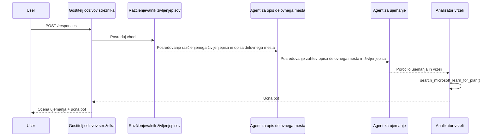

# Modul 3 - Konfiguracija navodil, okolja in namestitev odvisnosti

⏱️ ~15 min

V tem modulu boste predpripravljeno ogrodje spremenili v **vaš** večagentni potek dela - z nastavitvijo okoljskih spremenljivk, pisanjem navodil za agente, dodajanjem orodja MCP, povezovanjem grafa poteka dela in nameščanjem odvisnosti.

> **Referenca:** Celotna delujoča koda je v [`PersonalCareerCopilot/main.py`](../../../../../workshop/lab02-multi-agent/PersonalCareerCopilot/main.py). Uporabite jo kot referenco pri ustvarjanju lastnega grafa poteka dela in blokov pozivov.

---

## Kako se štirje agenti povezujejo


```mermaid
sequenceDiagram
    participant User
    participant Server as Gostitelj odzivov strežnika
    participant RP as Razčlenjevalnik življenjepisov
    participant JD as Agent za opis delovnega mesta
    participant MA as Agent za ujemanje
    participant GA as Analizator vrzeli

    User->>Server: POST /responses
    Server->>RP: Posreduj vhod
    RP-->>JD: Posredovanje razčlenjenega življenjepisa in opisa delovnega mesta
    JD-->>MA: Posredovanje zahtev opisa delovnega mesta in življenjepisa
    MA-->>GA: Poročilo ujemanja in vrzeli
    GA->>GA: search_microsoft_learn_for_plan()
    GA-->>Server: Učna pot
    Server-->>User: Ocena ujemanja + učna pot
```

---

## Korak 1: Konfigurirajte okoljske spremenljivke

1. Odprite datoteko **`.env`** v korenski mapi projekta (ustvarjena z začetnim čarovnikom).
2. Nadomestite nadomestne vrednosti z dejanskimi vrednostmi iz Lab 01.

<details open>
<summary><strong>🅰️ Pot A - naročnina Foundry</strong></summary>

```env
FOUNDRY_PROJECT_ENDPOINT=https://<your-account>.services.ai.azure.com/api/projects/<your-project>
AZURE_AI_MODEL_DEPLOYMENT_NAME=gpt-4.1-mini
```

> **Kje najti vrednosti:** Glejte [Lab 01, Modul 1](../../lab01-single-agent/docs/01-setup.md#deploy-a-model--assign-rbac).

</details>

<details open>
<summary><strong>🅱️ Pot B - Foundry lokalno</strong></summary>

```env
FOUNDRY_PROJECT_ENDPOINT=http://localhost:5273/v1
AZURE_AI_MODEL_DEPLOYMENT_NAME=phi-4-mini
```

> Vso sklepanje se izvaja na vaši napravi - nobeni podatki ne zapustijo vašega sistema. Za potrditev natančnega imena modela zaženite `foundry model list`. Edini odhodni klic je orodje MCP na `https://learn.microsoft.com/api/mcp`.

> **Kje najti vrednosti:** Glejte [Lab 01, Modul 1 - lokalna pot](../../lab01-single-agent/docs/01-setup.md#step-2-set-up-based-on-your-access).

</details>

> **Varnost:** `.env` nikoli ne pošiljajte v nadzor različic. Morala bi biti že vključena v `.gitignore`.

---

## Korak 2: Napišite agentna navodila

Navodila določajo vlogo, format izhoda in pravila za vsakega agenta. Odprite `main.py` in definirajte (ali zamenjajte) štiri konstantne vrednosti navodil - celotne nize najdete v [`PersonalCareerCopilot/main.py`](../../../../../workshop/lab02-multi-agent/PersonalCareerCopilot/main.py).

### 2.1 `RESUME_PARSER_INSTRUCTIONS`
Razčleni življenjepis v strukturiran profil kandidata **in** dobesedno kopira opis delovnega mesta v `[JOB DESCRIPTION PASS-THROUGH]`. Obe označeni sekciji morata biti v izhodu.

> **Zakaj pass-through?** Z nastavitvijo `context_mode="last_agent"` je ResumeParser **edini** agent, ki vidi izvorno uporabniško sporočilo. Če ne posreduje opisa delovnega mesta naprej, ga ostali agenti nikoli ne bodo videli.

### 2.2 `JOB_DESCRIPTION_INSTRUCTIONS`
Prebere izhod ResumeParser `[PARSED RESUME]` in `[JOB DESCRIPTION PASS-THROUGH]`. Izpiše `[JD REQUIREMENTS]` (strukturirane zahteve) in `[PARSED RESUME PASS-THROUGH]` (doalekopie življenjepisa za MatchingAgent).

### 2.3 `MATCHING_AGENT_INSTRUCTIONS`
Prebere `[JD REQUIREMENTS]` in `[PARSED RESUME PASS-THROUGH]`. Ustvari oceno primerjave (0–100) s podrobnimi izračuni, ujemajočimi se veščinami, manjkajočimi veščinami in usklajenostjo izkušenj.

### 2.4 `GAP_ANALYZER_INSTRUCTIONS`
Prebere poročilo o ujemanju. Za **vsako** manjkajočo veščino kliče `search_microsoft_learn_for_plan`, da pridobi vire Microsoft Learn. Ustvari eno podrobno kartico vrzeli na veščino ter učno pot po tednih.

---

## Korak 3: Dodajte orodje MCP

GapAnalyzer kliče [Microsoft Learn MCP strežnik](https://learn.microsoft.com/azure/foundry/agents/how-to/tools/model-context-protocol), da pridobi resnične učne vire za vsako vrzel v veščinah. Celotna funkcija `search_microsoft_learn_for_plan` je v [`PersonalCareerCopilot/main.py`](../../../../../workshop/lab02-multi-agent/PersonalCareerCopilot/main.py).

Registrirajte orodje na GapAnalyzerju ob ustvarjanju agenta:

```python
gap_analyzer = Agent(
    client=client,
    instructions=GAP_ANALYZER_INSTRUCTIONS,
    name="GapAnalyzer",
    tools=[search_microsoft_learn_for_plan],
)
```

> Glejte [`PersonalCareerCopilot/main.py`](../../../../../workshop/lab02-multi-agent/PersonalCareerCopilot/main.py) za celoten `WorkflowBuilder` graf z `FoundryChatClient`, `AgentExecutor` in vsemi kliči `add_edge()`.

---

## Korak 4: Ustvarite virtualno okolje in namestite odvisnosti

> ⚠️ **Ne preskočite tega koraka.** Brez nameščenih odvisnosti razhroščevanje s F5 ne bo delovalo.

### 4.1 Ustvarite virtualno okolje

```powershell
python -m venv .venv
```

### 4.2 Aktivirajte ga

| OS | Ukaz |
|----|---------|
| **Windows (PowerShell)** | `.\.venv\Scripts\Activate.ps1` |
| **Windows (CMD)** | `.venv\Scripts\activate.bat` |
| **macOS / Linux** | `source .venv/bin/activate` |

V terminalu bi morali videti `(.venv)` v pozivu.

### 4.3 Namestite odvisnosti

```powershell
pip install -r requirements.txt
```

### 4.4 Preverite

```powershell
pip list | Select-String "agent-framework|mcp|debugpy"
```

Pričakovano: `agent-framework-foundry`, `agent-framework-foundry-hosting`, `mcp` in `debugpy` so navedeni.

---

## Korak 5: Preverite overjanje

<details open>
<summary><strong>🅰️ Pot A - Azure poverilnice</strong></summary>

```powershell
az account show --query "{name:name, id:id}" --output table
```

Če ne deluje, zaženite [`az login`](https://learn.microsoft.com/cli/azure/authenticate-azure-cli-interactively).

Vsi štirje agenti uporabljajo en `FoundryChatClient` in eno `DefaultAzureCredential`. Če overjanje deluje za enega, deluje za vse.

</details>

<details open>
<summary><strong>🅱️ Pot B - Foundry lokalno</strong></summary>

Za lokalno testiranje overjanje ni potrebno.

</details>

---

### ✅ Kontrolna točka

> Ne nadaljujte v Modul 04, dokler: **(1)** v vašem pozivu ne vidite `(.venv)` IN **(2)** `pip install -r requirements.txt` ni uspešno zaključen.

- [ ] `.env` ima veljavno končno točko in ime modela za uvajanje (ne nadomestne vrednosti)
- [ ] Vse 4 constante navodil za agente definirane v `main.py` (ResumeParser, JD Agent, MatchingAgent, GapAnalyzer)
- [ ] Definirano in registrirano orodje MCP `search_microsoft_learn_for_plan` na GapAnalyzerju
- [ ] Ustvarjeni objekti `FoundryChatClient` + 4 `Agent` + 4 `AgentExecutor` v `main()`
- [ ] `WorkflowBuilder` ustvarja pravilen zaporedni graf z vsemi 3 kliči `add_edge()`
- [ ] Ustvarjeno in aktivirano virtualno okolje (`(.venv)` viden v pozivu)
- [ ] `pip install -r requirements.txt` uspešno zaključen brez napak
- [ ] **Pot A:** ukaz `az account show` uspe OR ikona računov v VS Code prikazuje prijavljen račun

---

**Prejšnji:** [02 - Scaffold Multi-Agent Project](02-scaffold-multi-agent.md) · **Naslednji:** [04 - Orchestration Patterns →](04-orchestration-patterns.md)

---

<!-- CO-OP TRANSLATOR DISCLAIMER START -->
**Omejitev odgovornosti**:
Ta dokument je bil preveden z uporabo AI prevajalske storitve [Co-op Translator](https://github.com/Azure/co-op-translator). Čeprav si prizadevamo za natančnost, vas prosimo, da upoštevate, da avtomatizirani prevodi lahko vsebujejo napake ali netočnosti. Izvirni dokument v njegovem izvirnem jeziku je treba obravnavati kot avtoritativni vir. Za kritične informacije je priporočljiv strokovni človeški prevod. Ne odgovarjamo za morebitna nesporazume ali napačne interpretacije, ki izhajajo iz uporabe tega prevoda.
<!-- CO-OP TRANSLATOR DISCLAIMER END -->