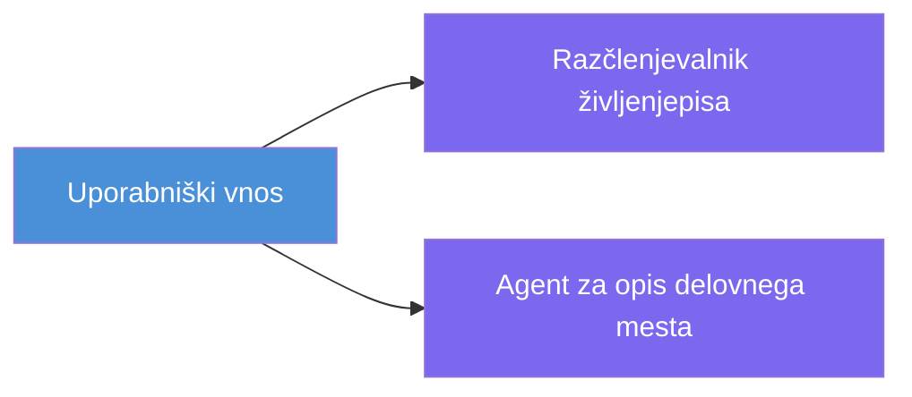
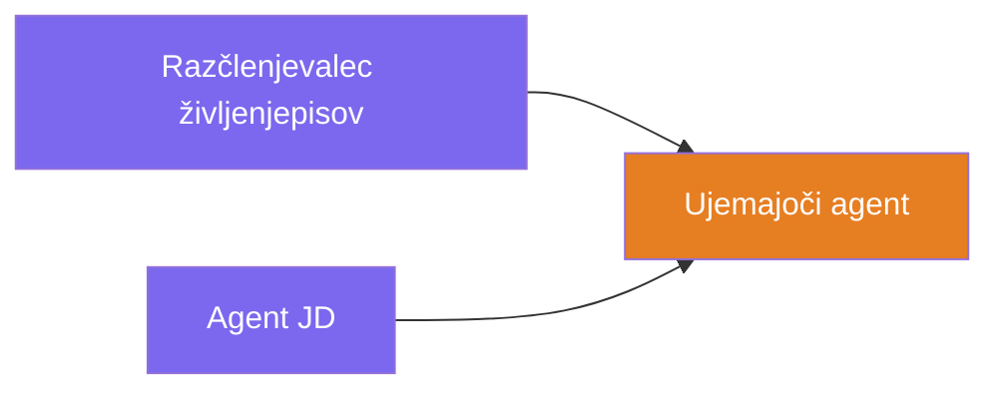
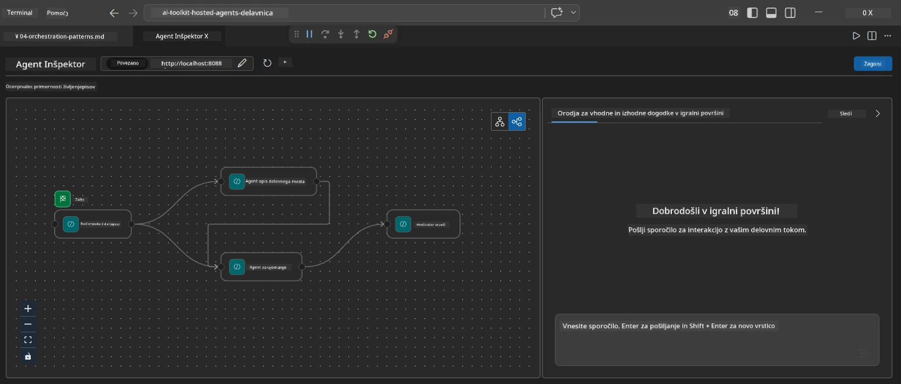
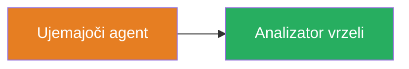
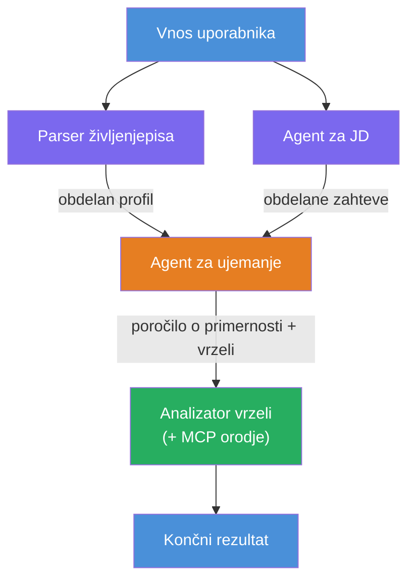
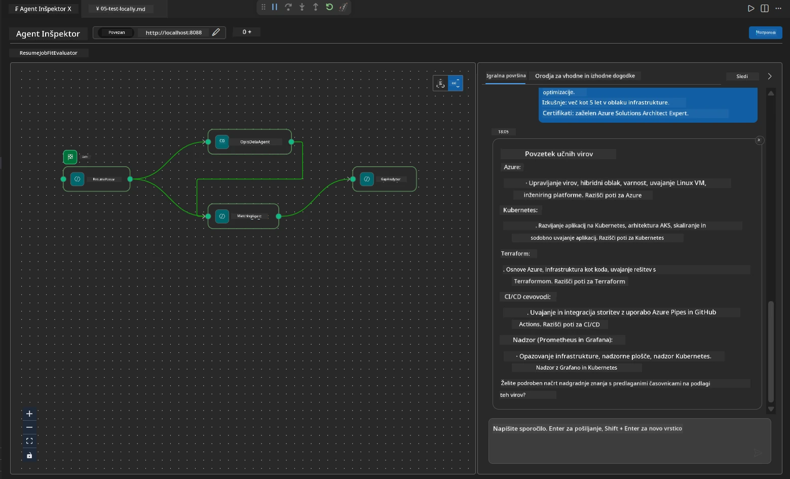

# Modul 4 - Vzorce orkestracije

V tem modulu raziskujete vzorce orkestracije, uporabljene v Resume Job Fit Evaluatorju, in se naučite, kako brati, spreminjati ter razširjati graf poteka dela. Razumevanje teh vzorcev je ključnega pomena za odpravljanje napak v pretoku podatkov in za gradnjo lastnih [večagentnih postopkov](https://learn.microsoft.com/agent-framework/workflows/).

---

## Vzorec 1: Fan-out (vzporedna razcepitev)

Prvi vzorec v poteku dela je **fan-out** – en vhod se istočasno pošlje več agentom.


V kodi se to zgodi, ker je `resume_parser` `start_executor` – prejme uporabnikovo sporočilo kot prvi. Nato, ker imata tako `jd_agent` kot `matching_agent` robove iz `resume_parser`, okvir posreduje izhod `resume_parser`ju obema agentoma:

```python
.add_edge(resume_parser, jd_agent)         # Izhod ResumeParser → JD Agent
.add_edge(resume_parser, matching_agent)   # Izhod ResumeParser → MatchingAgent
```

**Zakaj to deluje:** ResumeParser in JD Agent obdelujeta različne vidike istega vhoda. Njuno vzporedno izvajanje zmanjša skupno zakasnitev v primerjavi z zaporednim izvajanjem.

### Kdaj uporabiti fan-out

| Primer uporabe | Primer |
|----------|---------|
| Nepovezani podnalogi | Razčlenjevanje življenjepisa proti razčlenjevanju JD |
| Redundanca / glasovanje | Dva agenta analizirata iste podatke, tretji izbere najboljši odgovor |
| Večformatni izhod | En agent generira besedilo, drugi strukturiran JSON |

---

## Vzorec 2: Fan-in (agregacija)

Drugi vzorec je **fan-in** – več izhodov agentov se zbere in pošlje enemu nadaljnjemu agentu.


V kodi:

```python
.add_edge(resume_parser, matching_agent)   # Izhod ResumeParser → MatchingAgent
.add_edge(jd_agent, matching_agent)        # Izhod JD Agenta → MatchingAgent
```

**Ključno obnašanje:** Ko ima agent **dva ali več vhodnih robov**, okvir samodejno čaka, da vsi zgornji agenti dokončajo, preden pa zažene spodnjega agenta. MatchingAgent se ne začne, dokler ResumeParser in JD Agent ne končata.

### Kaj MatchingAgent prejme

Okvir združi (konkatenira) izhode vseh zgornjih agentov. Vhod MatchingAgenta izgleda tako:

```
[ResumeParser output]
---
Candidate Profile:
  Name: Jane Doe
  Technical Skills: Python, Azure, Kubernetes, ...
  ...

[JobDescriptionAgent output]
---
Role Overview: Senior Cloud Engineer
Required Skills: Python, Azure, Terraform, ...
...
```

> **Opomba:** Natančen format združitve je odvisen od različice ogrodja. Navodila za agenta naj bodo napisana tako, da obvladajo tako strukturiran kot nestrukturiran izhod zgornjih agentov.



---

## Vzorec 3: Zaporedna veriga

Tretji vzorec je **zaporedno povezovanje** – izhod enega agenta gre neposredno v naslednjega.


V kodi:

```python
.add_edge(matching_agent, gap_analyzer)    # Izhod MatchingAgent → GapAnalyzer
```

To je najpreprostejši vzorec. GapAnalyzer prejme oceno usklajenosti MatchingAgenta, ustrezne/manjkajoče veščine in vrzeli. Nato za vsako vrzel pokliče [orodje MCP](https://learn.microsoft.com/azure/foundry/agents/how-to/tools/model-context-protocol) za pridobitev virov Microsoft Learn.

---

## Celoten graf

Združevanje vseh treh vzorcev ustvari celoten potek dela:


### Časovni potek izvajanja

```mermaid
gantt
    title Časovnica izvajanja agenta
    dateFormat X
    axisFormat %s

    section Vzporedno
    Resume Parser       :rp, 0, 3
    JD Agent            :jd, 0, 2

    section Zaporedno
    Matching Agent      :ma, 3, 5
    Gap Analyzer        :ga, 5, 9
```


> Skupni časovna zahteva je približno `max(ResumeParser, JD Agent) + MatchingAgent + GapAnalyzer`. GapAnalyzer je običajno najpočasnejši, ker opravi več klicev orodja MCP (en klic na vrzel).

---

## Branje kode WorkflowBuilder

Tukaj je celotna funkcija `create_workflow()` iz `main.py`, z anotacijami:

```python
def create_workflow(resume_parser, jd_agent, matching_agent, gap_analyzer):
    workflow = (
        WorkflowBuilder(
            name="ResumeJobFitEvaluator",

            # Prvi agent, ki prejme uporabniški vnos
            start_executor=resume_parser,

            # Agent(i), katerih izhod postane končni odgovor
            output_executors=[gap_analyzer],
        )
        # Razvejitev: izhod ResumeParser gre tako k JD Agent kot k MatchingAgent
        .add_edge(resume_parser, jd_agent)
        .add_edge(resume_parser, matching_agent)

        # Združevanje: MatchingAgent čaka na oba, ResumeParser in JD Agent
        .add_edge(jd_agent, matching_agent)

        # Zaporedno: izhod MatchingAgent je vhod za GapAnalyzer
        .add_edge(matching_agent, gap_analyzer)

        .build()
    )
    return workflow.as_agent()
```

### Povzetek robov

| # | Rob | Vzorec | Učinek |
|---|------|---------|--------|
| 1 | `resume_parser → jd_agent` | Fan-out | JD Agent prejme izhod ResumeParserja (plus izvirni uporabniški vhod) |
| 2 | `resume_parser → matching_agent` | Fan-out | MatchingAgent prejme izhod ResumeParserja |
| 3 | `jd_agent → matching_agent` | Fan-in | MatchingAgent prejme tudi izhod JD Agenta (čaka na oba) |
| 4 | `matching_agent → gap_analyzer` | Zaporedno | GapAnalyzer prejme poročilo o usklajenosti + seznam vrzeli |

---

## Spreminjanje grafa

### Dodajanje novega agenta

Za dodajanje petega agenta (npr. **InterviewPrepAgent**, ki generira vprašanja za razgovor na podlagi analize vrzeli):

```python
# 1. Določite navodila
INTERVIEW_PREP_INSTRUCTIONS = """\
You are the Interview Prep Agent.
Given a gap analysis and fit report, generate 10 targeted interview questions
the candidate should prepare for.
"""

# 2. Ustvarite agenta (znotraj bloka async with)
AzureAIAgentClient(
    project_endpoint=PROJECT_ENDPOINT,
    model_deployment_name=MODEL_DEPLOYMENT_NAME,
    credential=credential,
).as_agent(
    name="InterviewPrepAgent",
    instructions=INTERVIEW_PREP_INSTRUCTIONS,
) as interview_prep,

# 3. Dodajte povezave v create_workflow()
.add_edge(matching_agent, interview_prep)   # prejme poročilo o fitnesu
.add_edge(gap_analyzer, interview_prep)     # prav tako prejme gap kartice

# 4. Posodobite output_executors
output_executors=[interview_prep],  # zdaj končni agent
```

### Sprememba vrstnega reda izvajanja

Da bi JD Agent deloval **po** ResumeParserju (zaporedno namesto vzporedno):

```python
# Odstrani: .add_edge(resume_parser, jd_agent) ← že obstaja, pusti jo
# Odstrani implicitno vzporednost s tem, da jd_agent NE prejema uporabniškega vnosa neposredno
# start_executor najprej pošlje resume_parser, jd_agent pa dobi
# izhod resume_parser preko povezave. To jih naredi zaporedne.
```

> **Pomembno:** `start_executor` je edini agent, ki prejme nepredelan uporabniški vhod. Vsi drugi agenti prejmejo izhod svojih zgornjih robov. Če želite, da agent prejme tudi nepredelan uporabniški vhod, mora imeti rob iz `start_executor` agenta.

---

## Pogoste napake v grafu

| Napaka | Simptomi | Popravek |
|---------|---------|-----|
| Manjkajoči rob do `output_executors` | Agent deluje, a izhod je prazen | Prepričajte se, da obstaja pot od `start_executor` do vsakega agenta v `output_executors` |
| Krožna odvisnost | Neskončna zanka ali časovna prekinitve | Preverite, da noben agent ne vrača podatkov nazaj zgornjemu agentu |
| Agent v `output_executors` brez vhodnega roba | Prazen izhod | Dodajte vsaj en `add_edge(source, that_agent)` |
| Več `output_executors` brez fan-in | Izhod vsebuje samo odgovor enega agenta | Uporabite enega izstopnega agenta, ki združuje, ali sprejmite več izhodov |
| Manjkajoči `start_executor` | `ValueError` pri gradnji | Vedno navedite `start_executor` v `WorkflowBuilder()` |

---

## Odpravljanje napak v grafu

### Uporaba Agent Inspectorja

1. Zaženite agenta lokalno (F5 ali terminal – glej [Modul 5](05-test-locally.md)).
2. Odprite Agent Inspector (`Ctrl+Shift+P` → **Foundry Toolkit: Odpri Agent Inspector**).
3. Pošljite testno sporočilo.
4. V odzivnem pogledu Inspectorja poiščite **tokovni izhod** – kaže prispevke vsakega agenta v zaporedju.



### Uporaba zapisovanja dnevnikov

Dodajte zapisovanje v `main.py` za sledenje pretoku podatkov:

```python
import logging
logger = logging.getLogger("resume-job-fit")

# V create_workflow(), po zgraditvi:
logger.info("Workflow graph built with edges: RP→JD, RP→MA, JD→MA, MA→GA")
```

Dnevniki strežnika prikazujejo vrstni red izvajanja agentov in klice orodja MCP:

```
INFO:resume-job-fit:Starting Resume -> Job Fit Evaluator HTTP server...
INFO:resume-job-fit:Server running on http://localhost:8088
INFO:agent_framework:Executing agent: ResumeParser
INFO:agent_framework:Executing agent: JobDescriptionAgent
INFO:agent_framework:Waiting for upstream agents: ResumeParser, JobDescriptionAgent
INFO:agent_framework:Executing agent: MatchingAgent
INFO:agent_framework:Executing agent: GapAnalyzer
INFO:agent_framework:Tool call: search_microsoft_learn_for_plan(skill="Kubernetes")
POST https://learn.microsoft.com/api/mcp → 200
INFO:agent_framework:Tool call: search_microsoft_learn_for_plan(skill="Terraform")
POST https://learn.microsoft.com/api/mcp → 200
```

---

### Kontrolni seznam

- [ ] Prepoznate tri vzorce orkestracije v poteku dela: fan-out, fan-in in zaporedno povezovanje
- [ ] Razumete, da agenti z več vhodnimi robovi čakajo, da vsi zgornji agenti dokončajo
- [ ] Znate prebrati kodo `WorkflowBuilder` in povezati vsak klic `add_edge()` z vizualnim grafom
- [ ] Razumete časovni potek izvajanja: najprej vzporedni agenti, potem agregacija, nato zaporedno
- [ ] Znate dodati novega agenta v graf (definirati navodila, ustvariti agenta, dodati robove, posodobiti izhod)
- [ ] Prepoznate pogoste napake v grafu in njihove simptome

---

**Prejšnji:** [03 - Nastavitev agentov in okolja](03-configure-agents.md) · **Naslednji:** [05 - Preskus lokalno →](05-test-locally.md)

---

<!-- CO-OP TRANSLATOR DISCLAIMER START -->
**Opozorilo**:  
Ta dokument je bil preveden z uporabo AI prevajalske storitve [Co-op Translator](https://github.com/Azure/co-op-translator). Čeprav si prizadevamo za natančnost, vas prosimo, da upoštevate, da lahko avtomatizirani prevodi vsebujejo napake ali netočnosti. Izvirni dokument v svojem maternem jeziku velja za avtoritativni vir. Za ključne informacije priporočamo strokovni človeški prevod. Nismo odgovorni za morebitna nesporazume ali napačne interpretacije, ki izhajajo iz uporabe tega prevoda.
<!-- CO-OP TRANSLATOR DISCLAIMER END -->