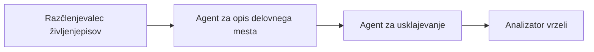

# Modul 4 - Vzorci orkestracije

⏱️ ~10 min

V tem modulu raziskujete vzorce orkestracije, uporabljene v Ocenjevalcu primerjave zaposlitev, in se naučite, kako brati, spreminjati in razširiti graf delovnega toka. Razumevanje teh vzorcev je ključno za odpravljanje težav s pretokom podatkov in ustvarjanje lastnih [večagentnih delovnih tokov](https://learn.microsoft.com/agent-framework/workflows/).

---

## Vzorec 1: Zaporedna veriga

Temeljni vzorec v delovnem toku je **zaporedna veriga** - izhod vsakega agenta neposredno napaja naslednjega.


```mermaid
flowchart LR
    RP[Razčlenjevalec življenjepisov] --> JD[Agent za opis delovnega mesta]
    JD --> MA[Agent za usklajevanje]
    MA --> GA[Analizator vrzeli]
```

V kodi vsak klic `add_edge()` ustvari en korak v verigi:

```python
.add_edge(resume_executor, jd_executor)       # Izhod ResumeParser → JD Agent
.add_edge(jd_executor, matching_executor)     # Izhod JD Agent → MatchingAgent
.add_edge(matching_executor, gap_executor)    # Izhod MatchingAgent → GapAnalyzer
```

> **Zakaj zaporedno, ne razvejitev/sestavitev?** `WorkflowBuilder` uporablja **OR-semantiko** za vhodne povezave: spodaj ležeči izvajalec se sproži takoj, ko **kateri koli** predhodnik dokonča. Če bi imel `matching_executor` dve prihodni povezavi (od `resume_executor` in `jd_executor`), bi se sprožil dvakrat - enkrat, ko konča ResumeParser, in ponovno, ko konča JD Agent - kar bi povzročilo, da se GapAnalyzer zažene tudi dvakrat in da se izhod pojavi dvakrat. Zaporedna cevovodna linija tega popolnoma preprečuje.

## Vzorec 2: Posredovanje vsebine

Ker `context_mode="last_agent"` pomeni, da vsak izvajalec vidi samo izhod svojega **nadzira predhodnika**, morajo agenti v zaporedni verigi izrecno posredovati naprej vse podatke, ki jih potrebujejo spodaj ležeči agenti.

V tem delovnem toku:
- **ResumeParser** prepiše JD dobesedno v `[JOB DESCRIPTION PASS-THROUGH]` (tako da ga JD Agent lahko najde).
- **JD Agent** prepiše `[PARSED RESUME]` dobesedno v `[PARSED RESUME PASS-THROUGH]` (tako da lahko MatchingAgent primerja oba profila).

```
ResumeParser output
└─ [PARSED RESUME]               ← extracted by JD Agent
└─ [JOB DESCRIPTION PASS-THROUGH] ← extracted by JD Agent

JD Agent output
└─ [JD REQUIREMENTS]             ← extracted by MatchingAgent
└─ [PARSED RESUME PASS-THROUGH]  ← extracted by MatchingAgent
```

Vsak odsek posredovanja je treba kopirati **do besede** - povzetek ali parafraziranje bi prekinilo spodaj ležečega agenta, ki je odvisen od tega.

---

## Popolni graf

Združevanje vzorcev zaporedne verige in posredovanja vsebine ustvari celoten delovni tok:

```mermaid
flowchart LR
    U[Vnos uporabnika] --> RP[Razčlenjevalnik življenjepisov]
    RP --> JD[Agent za opis delovnega mesta (JD Agent)]
    JD --> MA[Agent za ujemanje]
    MA --> GA[Analizator vrzeli + MCP]
    GA --> O[Končni izhod]
```

Pregledovalec agentov prikaže isto strukturo grafa, ko agent deluje lokalno. Za posnetke zaslona glejte [Modul 5 - Preizkus lokalno](05-test-locally.md).

---

## Branje kode WorkflowBuilder

Celotna funkcija `create_workflow()` je v [`PersonalCareerCopilot/main.py`](../../../../../workshop/lab02-multi-agent/PersonalCareerCopilot/main.py). Trije klici `add_edge()` zgradijo zaporedno cevovodno linijo:

| # | Povezava | Učinek |
|---|----------|---------|
| 1 | `resume_executor → jd_executor` | JD Agent prejme `[PARSED RESUME]` + `[JOB DESCRIPTION PASS-THROUGH]` |
| 2 | `jd_executor → matching_executor` | MatchingAgent prejme `[JD REQUIREMENTS]` + `[PARSED RESUME PASS-THROUGH]` |
| 3 | `matching_executor → gap_executor` | GapAnalyzer prejme poročilo o primernosti + seznam vrzeli |

---

## Spreminjanje grafa

### Dodajanje novega agenta

Za dodajanje petega agenta (npr. **InterviewPrepAgent** za GapAnalyzer):

1. Določite konstanto `INTERVIEW_PREP_INSTRUCTIONS`.
2. Ustvarite objekte `Agent` + `AgentExecutor` (enak vzorec kot pri obstoječih štirih).
3. Dodajte `.add_edge(gap_executor, interview_exec)` v `WorkflowBuilder`.
4. Posodobite `output_executors=[interview_exec]`.

> **Pomembno:** `start_executor` je edini agent, ki prejme surovi uporabniški vnos. Vsi drugi agenti prejmejo izhod s svoje zgornje povezave.

---

## Pogoste napake v grafu

| Napaka | Simptom | Popravek |
|--------|---------|----------|
| Manjka povezava do `output_executors` | Agent teče, a je izhod prazen | Preverite, da obstaja pot od `start_executor` do vsakogar iz `output_executors` |
| Krožna odvisnost | Neskončna zanka ali časovna omejitev | Preverite, da noben agent ne posreduje nazaj svojega zgornjega agenta |
| Agent v `output_executors` brez dohodne povezave | Prazen izhod | Dodajte vsaj eno povezavo `add_edge(source, that_agent)` |
| Več `output_executors` brez združitve | Izhod vsebuje samo odgovor enega agenta | Uporabite enega izhodnega agenta, ki združuje, ali sprejmite več izhodov |
| Manjka `start_executor` | `ValueError` med gradnjo | Vedno določite `start_executor` v `WorkflowBuilder()` |

---

## Odpravljanje napak v grafu

### Uporaba Agent Inspectorja

1. Zaženite agenta lokalno s F5.
2. Odprite Agent Inspector (`Ctrl+Shift+P` → **Foundry Toolkit: Odpri Agent Inspector**).
3. Pošljite testno sporočilo.
4. V odgovorni plošči inspectorja poiščite **tokovni izhod** - prikazuje prispevek vsakega agenta v zaporedju.


### Uporaba beleženja

Dodajte beleženje v `main.py`, da sledite pretoku podatkov:

```python
import logging
logger = logging.getLogger("resume-job-fit")

# V funkciji main(), po ustvarjanju delovnega poteka:
logger.info("Workflow graph built with edges: RP→JD, JD→MA, MA→GA")
```

Dnevniki strežnika prikažejo vrstni red izvajanja agentov in klice orodja MCP:

```
INFO:agent_framework:Executing agent: ResumeParser
INFO:agent_framework:Executing agent: JobDescriptionAgent
INFO:agent_framework:Executing agent: MatchingAgent
INFO:agent_framework:Executing agent: GapAnalyzer
INFO:agent_framework:Tool call: search_microsoft_learn_for_plan(skill="Kubernetes")
POST https://learn.microsoft.com/api/mcp → 200
INFO:agent_framework:Tool call: search_microsoft_learn_for_plan(skill="Terraform")
POST https://learn.microsoft.com/api/mcp → 200
```

---

### Kontrolna točka

- [ ] Prepoznate oba vzorca orkestracije v delovnem toku: zaporedno verigo in posredovanje vsebine
- [ ] Razumete, zakaj `context_mode="last_agent"` zahteva izrecno posredovanje podatkov med agenti
- [ ] Znate prebrati kodo `WorkflowBuilder` in povezati vsak klic `add_edge()` z vizualnim grafom
- [ ] Znate dodati novega agenta na konec cevovoda
- [ ] Prepoznate pogoste napake v grafu in njihove simptome

---

**Prejšnji:** [03 - Nastavitev agentov in okolja](03-configure-agents.md) · **Naslednji:** [05 - Preizkus lokalno →](05-test-locally.md)

---

<!-- CO-OP TRANSLATOR DISCLAIMER START -->
**Omejitev odgovornosti**:
Ta dokument je bil preveden z uporabo AI prevajalske storitve [Co-op Translator](https://github.com/Azure/co-op-translator). Čeprav si prizadevamo za natančnost, vas prosimo, da upoštevate, da avtomatizirani prevodi lahko vsebujejo napake ali netočnosti. Izvirni dokument v njegovem izvirnem jeziku je treba obravnavati kot avtoritativni vir. Za kritične informacije je priporočljiv strokovni človeški prevod. Ne odgovarjamo za morebitna nesporazume ali napačne interpretacije, ki izhajajo iz uporabe tega prevoda.
<!-- CO-OP TRANSLATOR DISCLAIMER END -->