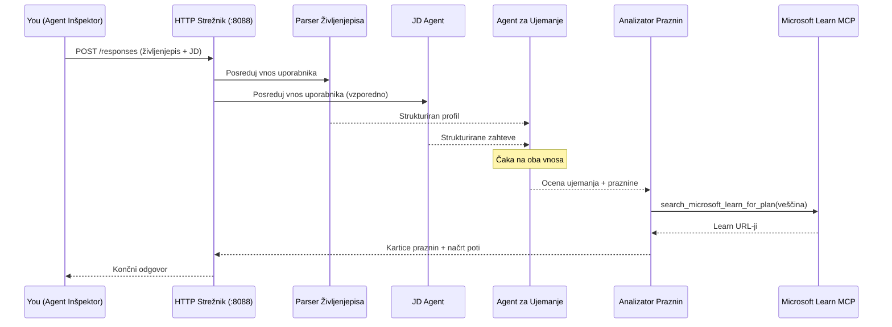
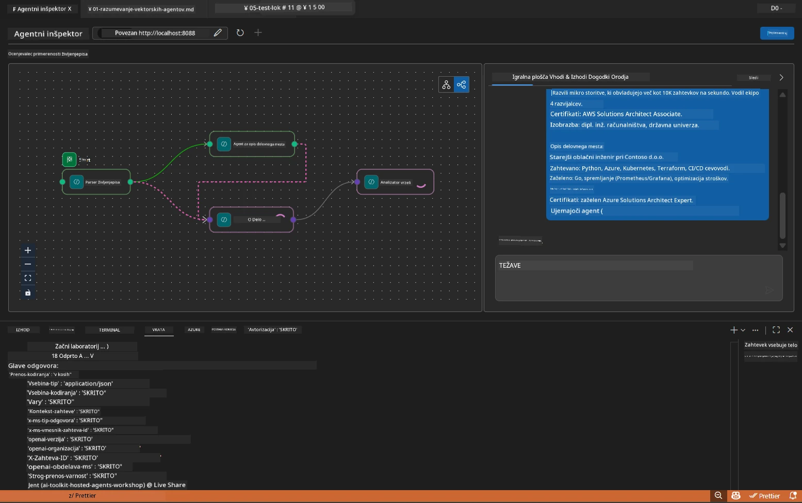

# Modul 5 - Testiranje lokalno (večagentni)

V tem modulu zaženete večagentni potek dela lokalno, ga preizkusite z Agent Inspectorjem in preverite, ali vsi štirje agenti ter orodje MCP delujejo pravilno, preden jih razmestite v Foundry.

### Kaj se zgodi med lokalnim izvajanjem testa


---

## Korak 1: Zaženite strežnik za agente

### Možnost A: Uporaba VS Code opravila (priporočeno)

1. Pritisnite `Ctrl+Shift+P` → vnesite **Tasks: Run Task** → izberite **Run Lab02 HTTP Server**.
2. Opravilo zažene strežnik z debugpy pritrjenim na vratih `5679` in agentom na vratih `8088`.
3. Počakajte, da se na izhodu pojavi:

```
INFO:resume-job-fit:Starting Resume -> Job Fit Evaluator HTTP server...
INFO:resume-job-fit:Server running on http://localhost:8088
```

### Možnost B: Ročna uporaba terminala

```powershell
cd workshop\lab02-multi-agent\PersonalCareerCopilot
```

Aktivirajte virtualno okolje:

**PowerShell (Windows):**
```powershell
.\.venv\Scripts\Activate.ps1
```

**macOS/Linux:**
```bash
source .venv/bin/activate
```

Zaženite strežnik:

```powershell
python -m debugpy --listen 127.0.0.1:5679 -m agentdev run main.py --verbose --port 8088
```

### Možnost C: Uporaba tipke F5 (način razhroščevanja)

1. Pritisnite `F5` ali pojdite na **Run and Debug** (`Ctrl+Shift+D`).
2. Izberite konfiguracijo zagona **Lab02 - Multi-Agent** iz spustnega menija.
3. Strežnik se zažene s popolno podporo prelomnih točk.

> **Namig:** Način razhroščevanja vam omogoča, da nastavite prelomne točke znotraj `search_microsoft_learn_for_plan()`, da pregledate odzive MCP, ali znotraj niza agentovih navodil, da vidite, kaj prejme vsak agent.

---

## Korak 2: Odprite Agent Inspector

1. Pritisnite `Ctrl+Shift+P` → vnesite **Foundry Toolkit: Open Agent Inspector**.
2. Agent Inspector se odpre v zavihku brskalnika na `http://localhost:5679`.
3. Videli bi morali uporabniški vmesnik agenta, pripravljen za sprejem sporočil.

> **Če se Agent Inspector ne odpre:** Prepričajte se, da je strežnik popolnoma zagnan (vidite dnevnik "Server running"). Če je vrata 5679 zasedena, glejte [Modul 8 - Odpravljanje težav](08-troubleshooting.md).

---

## Korak 3: Zaženite osnovne teste

Zaženite te tri teste v zaporedju. Vsak test postopoma preizkuša več poteka dela.

### Test 1: Osnovni življenjepis + opis delovnega mesta

Prilepite naslednje v Agent Inspector:

```
Resume:
Jane Doe
Senior Software Engineer with 5 years of experience in Python, Django, and AWS.
Built microservices handling 10K+ requests/second. Led a team of 4 developers.
Certifications: AWS Solutions Architect Associate.
Education: B.S. Computer Science, State University.

Job Description:
Senior Cloud Engineer at Contoso Ltd.
Required: Python, Azure, Kubernetes, Terraform, CI/CD pipelines.
Preferred: Go, monitoring (Prometheus/Grafana), cost optimization.
Experience: 5+ years in cloud infrastructure.
Certifications: Azure Solutions Architect Expert preferred.
```

**Pričakovana struktura izhoda:**

Odziv naj vsebuje izhod vseh štirih agentov v zaporedju:

1. **Izhod Resume Parserja** - Strukturiran profil kandidata s spretnostmi, razvrščenimi po kategorijah
2. **Izhod JD Agenta** - Strukturirane zahteve z ločenimi obveznimi in prednostnimi spretnostmi
3. **Izhod Matching Agent** - Ocena ustreznosti (0-100) z razčlenitvijo, ujemajoče se spretnosti, manjkajoče spretnosti, vrzeli
4. **Izhod Gap Analyzerja** - Posamezne kartice vrzeli za vsako manjkajočo spretnost, vsaka z Microsoft Learn URL-ji



### Kaj preveriti v Testu 1

| Preveri | Pričakovano | Opravljeno? |
|---------|-------------|-------------|
| Odziv vsebuje oceno ustreznosti | Število med 0-100 z razčlenitvijo | |
| Izpisane so ujemajoče se spretnosti | Python, CI/CD (delno), ipd. | |
| Izpisane so manjkajoče spretnosti | Azure, Kubernetes, Terraform, ipd. | |
| Obstajajo kartice vrzeli za vsako manjkajočo spretnost | Ena kartica na vsako spretnost | |
| Prisotni so Microsoft Learn URL-ji | Pravi `learn.microsoft.com` povezave | |
| Brez sporočil o napaki v odzivu | Čist strukturiran izhod | |

### Test 2: Preverite izvajanje MCP orodja

Med izvajanjem Testa 1 preverite **terminal strežnika** za MCP dnevniške vnose:

```
GET https://learn.microsoft.com/api/mcp → 405 (Method Not Allowed)
POST https://learn.microsoft.com/api/mcp → 200
DELETE https://learn.microsoft.com/api/mcp → 405 (Method Not Allowed)
```

| Vnos v dnevnik | Pomen | Pričakovano? |
|----------------|--------|--------------|
| `GET ... → 405` | MCP odjemalec preverja z GET med inicializacijo | Da - normalno |
| `POST ... → 200` | Dejanski poziv orodja na Microsoft Learn MCP strežnik | Da - to je pravi klic |
| `DELETE ... → 405` | MCP odjemalec preverja z DELETE med čiščenjem | Da - normalno |
| `POST ... → 4xx/5xx` | Klic orodja je spodletel | Ne - glej [Odpravljanje težav](08-troubleshooting.md) |

> **Ključna točka:** Vrstici `GET 405` in `DELETE 405` sta **pričakovano vedenje**. Skrbite samo, če `POST` klici vračajo nenavadne statusne kode.

### Test 3: Robni primer - kandidat z visoko ustreznostjo

Prilepite življenjepis, ki zelo dobro ustreza opisu delovnega mesta, da preverite, kako GapAnalyzer obravnava primere z visoko ustreznostjo:

```
Resume:
Alex Chen
Senior Cloud Engineer with 7 years of experience.
Skills: Python, Azure (AKS, Functions, DevOps), Kubernetes, Terraform, CI/CD (GitHub Actions, Azure Pipelines), Go, Prometheus, Grafana, cost optimization.
Certifications: Azure Solutions Architect Expert, Azure DevOps Engineer Expert.
Led infrastructure migration to Azure for 3 enterprise clients.
Education: M.S. Computer Science, Tech University.

Job Description:
Senior Cloud Engineer at Contoso Ltd.
Required: Python, Azure, Kubernetes, Terraform, CI/CD pipelines.
Preferred: Go, monitoring (Prometheus/Grafana), cost optimization.
Experience: 5+ years in cloud infrastructure.
Certifications: Azure Solutions Architect Expert preferred.
```

**Pričakovan odziv:**
- Ocena ustreznosti naj bo **80+** (večina spretnosti se ujema)
- Kartice vrzeli so usmerjene na finese/pripravo na razgovor, ne na osnovno učenje
- Navodila GapAnalyzerja pravijo: "Če je ustreznost >= 80, se osredotoči na finese/pripravo na razgovor"

---

## Korak 4: Preverite popolnost izhoda

Po izvedbi testov preverite, ali izhod ustreza naslednjim kriterijem:

### Kontrolni seznam strukture izhoda

| Sekcija | Agent | Prisoten? |
|---------|-------|-----------|
| Profil kandidata | Resume Parser | |
| Tehnične spretnosti (razvrščene) | Resume Parser | |
| Pregled vloge | JD Agent | |
| Obvezne in prednostne spretnosti | JD Agent | |
| Ocena ustreznosti z razčlenitvijo | Matching Agent | |
| Ujemajoče se / manjkajoče / delno spretnosti | Matching Agent | |
| Kartica vrzeli za vsako manjkajočo spretnost | Gap Analyzer | |
| Microsoft Learn URL-ji v karticah vrzeli | Gap Analyzer (MCP) | |
| Učenje po vrstnem redu (številčeno) | Gap Analyzer | |
| Povzetek časovne osi | Gap Analyzer | |

### Pogoste težave v tej fazi

| Težava | Vzrok | Popravek |
|--------|--------|----------|
| Le ena kartica vrzeli (ostalo skrajšano) | V navodilih GapAnalyzerja manjka odsek CRITICAL | Dodajte odstavek `CRITICAL:` v `GAP_ANALYZER_INSTRUCTIONS` - glej [Modul 3](03-configure-agents.md) |
| Brez Microsoft Learn URL-jev | MCP končna točka ni dosegljiva | Preverite internetno povezavo. Potrdite, da je `MICROSOFT_LEARN_MCP_ENDPOINT` v `.env` nastavljen na `https://learn.microsoft.com/api/mcp` |
| Prazen odziv | Ni nastavljena vrednost `PROJECT_ENDPOINT` ali `MODEL_DEPLOYMENT_NAME` | Preverite vrednosti v `.env` datoteki. Zaženite `echo $env:PROJECT_ENDPOINT` v terminalu |
| Ocena ustreznosti je 0 ali manjka | MatchingAgent ni prejel podatkov iz višjega nivoja | Preverite, da obstajata `add_edge(resume_parser, matching_agent)` in `add_edge(jd_agent, matching_agent)` v `create_workflow()` |
| Agent se zažene, a takoj zapre | Napaka pri uvozu ali manjkajoča odvisnost | Ponovno zaženite `pip install -r requirements.txt`. Preverite terminal za sledi napak |
| Napaka `validate_configuration` | Manjkajoče okoljske spremenljivke | Ustvarite `.env` z `PROJECT_ENDPOINT=<your-endpoint>` in `MODEL_DEPLOYMENT_NAME=<your-model>` |

---

## Korak 5: Testirajte z lastnimi podatki (neobvezno)

Poskusite prilepiti svoj življenjepis in pravi opis delovnega mesta. To pomaga preveriti:

- Ali agenti dobro obravnavajo različne formate življenjepisov (kronološki, funkcionalni, hibridni)
- Ali JD Agent obvladuje različne stile opisov delovnih mest (točke, odstavki, strukturirani)
- Ali MCP orodje vrača relevantne vire za resnične spretnosti
- Ali so kartice vrzeli prilagojene za vašo specifično ozadje

> **Opomba o zasebnosti:** Pri lokalnem testiranju vaši podatki ostanejo na vašem računalniku in se pošljejo le v vašo Azure OpenAI namestitev. Ne beležijo se in se ne shranjujejo s strani infrastrukture delavnice. Po želji uporabite nadomestna imena (npr. "Janez Novak" namesto vašega resničnega imena).

---

### Kontrolna točka

- [ ] Strežnik uspešno zagnan na vratih `8088` (v dnevniku je "Server running")
- [ ] Agent Inspector odprt in povezan z agentom
- [ ] Test 1: Popoln odziv z oceno ustreznosti, ujemajočimi/manjkajočimi spretnostmi, karticami vrzeli in Microsoft Learn URL-ji
- [ ] Test 2: MCP dnevnik kaže `POST ... → 200` (klici orodja so uspeli)
- [ ] Test 3: Kandidat z visoko ustreznostjo dobi oceno 80+ s priporočili za izboljšave
- [ ] Vse kartice vrzeli so prisotne (ena na vsako manjkajočo spretnost, brez skrajšav)
- [ ] Brez napak ali sledi napak v terminalu strežnika

---

**Prejšnji:** [04 - Orkestracijski vzorci](04-orchestration-patterns.md) · **Naslednji:** [06 - Razmestitev v Foundry →](06-deploy-to-foundry.md)

---

<!-- CO-OP TRANSLATOR DISCLAIMER START -->
**Opozorilo**:  
Ta dokument je bil preveden z uporabo AI prevajalske storitve [Co-op Translator](https://github.com/Azure/co-op-translator). Čeprav si prizadevamo za natančnost, vas prosimo, da upoštevate, da avtomatizirani prevodi lahko vsebujejo napake ali netočnosti. Izvirni dokument v njegovem maternem jeziku se smatra kot avtoritativni vir. Za kritične informacije je priporočljiv strokovni človeški prevod. Nismo odgovorni za morebitna nesporazumevanja ali napačne interpretacije, ki izhajajo iz uporabe tega prevoda.
<!-- CO-OP TRANSLATOR DISCLAIMER END -->