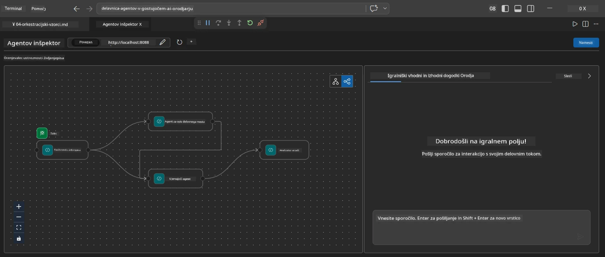
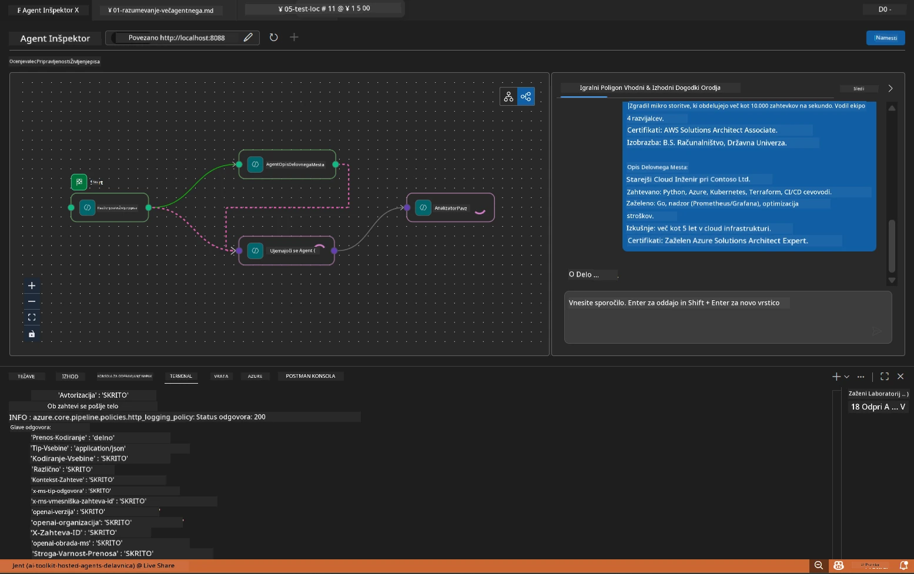
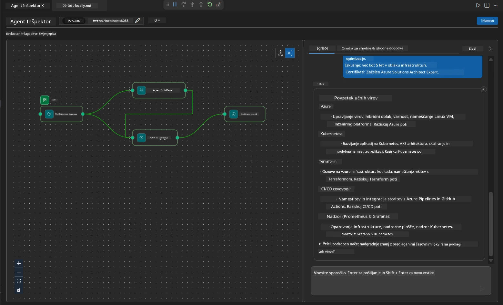

# Modul 5 - Testiraj lokalno

⏱️ ~15 min

V tem modulu zaženete večagentni potek lokalno, ga testirate z Agent Inspector-jem in preverite, da vsi štirje agenti ter orodje MCP pravilno delujejo, preden jih razporedite.

---

## Korak 1: Zaženi strežnik agenta

### Možnost A: Uporaba opravila VS Code (priporočeno)

1. Odprite `workshop/lab02-multi-agent/PersonalCareerCopilot/` kot svojo VS Code mapo.
2. Pritisnite `Ctrl+Shift+P` → vpišite **Tasks: Run Task** → izberite **Run Agent HTTP Server**.
3. Opravilo zažene strežnik z dodanim debugpy na vratih `5679` in agentom na vratih `8088`.
4. Počakajte, da se prikaže izhod:

```
INFO:resume-job-fit:Starting Resume -> Job Fit Evaluator HTTP server...
INFO:resume-job-fit:Server running on http://localhost:8088
```

### Možnost B: Uporaba F5 (debug način)

1. Pritisnite `F5` → izberite **Debug Local Agent HTTP Server**.
2. Strežnik se zažene s popolno podporo prelomnih točk - uporabno za pregledovanje odgovorov MCP ali izhodov agenta.

---

## Korak 2: Odpri Agent Inspector

1. Pritisnite `Ctrl+Shift+P` → vpišite **Foundry Toolkit: Open Agent Inspector**.
2. Agent Inspector se odpre kot plošča v VS Code, povezana na `http://localhost:8088`.
3. Moral bi videti agentov vmesnik pripravljen za sprejem sporočil.



> **Če se Agent Inspector ne odpre:** Prepričajte se, da je strežnik popolnoma zagnan (vidite zapis "Server running"). Če so vrata 5679 zasedena, glejte [Modul 8 - Reševanje težav](08-troubleshooting.md).

---

## Korak 2b: (Neobvezno) Odpri Visualizer poteka dela

Foundry Toolkit vključuje vizualizator poteka dela v realnem času, ki prikazuje, kako agenti medsebojno sodelujejo med izvajanjem grafa. To je posebej uporabno za odpravljanje napak pri večagentnem sistemu.

1. Pritisnite `Ctrl+Shift+P` → vpišite **Foundry Toolkit: Open Visualizer for Hosted Agents**.
2. Odpre se nov zavihek v VS Code, ki prikazuje graf izvajanja v živo.
3. Ko pošiljate sporočila v Agent Inspector, se vizualizator samodejno posodablja - zeleni vozli označujejo zaključene agente, animirane povezave prikazujejo pretok podatkov med njimi.

> **Spor vrat:** Če je vrat vizualizatorja že v uporabi, ga spremenite v nastavitvah VS Code → **Extensions** → **Microsoft Foundry Configuration** → **Hosted Agents: Visualizer Port**.

---

## Korak 3: Zaženi testne primere

Zaženite te tri teste v vrstnem redu. Vsak test postopoma pokrije več poteka dela.

### Test 1: Osnovni življenjepis + opis delovnega mesta

Prilepite naslednje v Agent Inspector:

```
Resume:
Jane Doe
Senior Software Engineer with 5 years of experience in Python, Django, and AWS.
Built microservices handling 10K+ requests/second. Led a team of 4 developers.
Certifications: AWS Solutions Architect Associate.
Education: B.S. Computer Science, State University.

Job Description:
Senior Cloud Engineer at Contoso Ltd.
Required: Python, Azure, Kubernetes, Terraform, CI/CD pipelines.
Preferred: Go, monitoring (Prometheus/Grafana), cost optimization.
Experience: 5+ years in cloud infrastructure.
Certifications: Azure Solutions Architect Expert preferred.
```

**Pričakovana struktura izhoda:**

Odgovor naj vsebuje izhod vseh štirih agentov zaporedoma:

1. **Izhod analizatorja življenjepisa** - Dve označeni sekciji: `[PARSED RESUME]` (profil kandidata z združenimi veščinami) in `[JOB DESCRIPTION PASS-THROUGH]` (do besede identičen tekst opisa delovnega mesta, ki gre naprej agentu JD)
2. **Izhod JD agenta** - Struktura zahtev z ločenimi obveznimi in želenimi veščinami
3. **Izhod Matching agenta** - Ocena primernosti (0-100) z razčlenitvijo, ujemajoče veščine, manjkajoče veščine, vrzeli
4. **Izhod Gap Analyzer-ja** - Posamezne kartice vrzeli za vsako manjkajočo veščino, vsaka z Microsoft Learn URL-ji





### Kaj preveriti v Testu 1

| Preveri | Pričakovano | Uspeh? |
|-------|----------|-------|
| Odgovor vsebuje oceno primernosti | Število med 0-100 z razčlenitvijo | |
| Seznam ujemajočih se veščin | Python, CI/CD (delno), itd. | |
| Seznam manjkajočih veščin | Azure, Kubernetes, Terraform, itd. | |
| Obstajajo kartice vrzeli za vsako manjkajočo veščino | Ena kartica na veščino | |
| Prisotni so Microsoft Learn URL-ji | Prave `learn.microsoft.com` povezave | |
| Ni sporočil o napakah v odgovoru | Čist strukturiran izhod | |

### Test 2: Roben primer - kandidat z visoko primernostjo

Prilepite življenjepis, ki zelo ustreza opisu delovnega mesta, da preverite, kako GapAnalyzer obdeluje scenarije z visoko primernostjo:

```
Resume:
Alex Chen
Senior Cloud Engineer with 7 years of experience.
Skills: Python, Azure (AKS, Functions, DevOps), Kubernetes, Terraform, CI/CD (GitHub Actions, Azure Pipelines), Go, Prometheus, Grafana, cost optimization.
Certifications: Azure Solutions Architect Expert, Azure DevOps Engineer Expert.
Led infrastructure migration to Azure for 3 enterprise clients.
Education: M.S. Computer Science, Tech University.

Job Description:
Senior Cloud Engineer at Contoso Ltd.
Required: Python, Azure, Kubernetes, Terraform, CI/CD pipelines.
Preferred: Go, monitoring (Prometheus/Grafana), cost optimization.
Experience: 5+ years in cloud infrastructure.
Certifications: Azure Solutions Architect Expert preferred.
```

**Pričakovano vedenje:**
- Ocena primernosti naj bo **80+** (večina veščin se ujema)
- Kartice vrzeli naj bodo osredotočene na izboljšanje/pripravo na razgovor in ne na temeljno učenje
- Navodila GapAnalyzer-ja pravijo: "Če je primernost >= 80, se osredotoči na izboljšanje/pripravo na razgovor"

---

## Korak 4: Testiraj s svojimi podatki (neobvezno)

Poskusi prilepiti svoj življenjepis in pravi opis delovnega mesta. To pomaga preveriti:

- Ali agenti obdelujejo različne formate življenjepisov (kronološki, funkcionalni, hibridni)
- Ali JD agent obvladuje različne sloge opisov delovnih mest (točke, odstavki, strukturirano)
- Ali orodje MCP vrača ustrezne vire za resnične veščine
- Ali so kartice vrzeli prilagojene tvojemu specifičnemu ozadju

> **Zasebnost - Pot A (Foundry cloud):** Življenjepis in besedilo JD se pošljejo v tvojo Azure OpenAI namestitev za sklepanje. Ne shranjujejo se ali beležijo znotraj infrastrukture delavnice. Uporabi nadomestna imena (npr. "Jane Doe"), če želiš.
>
> **Zasebnost - Pot B (Foundry Local):** Vse štiri agentne analize tečejo popolnoma na tvoji napravi. Tvoj življenjepis in besedilo opisa delovnega mesta **nikoli ne zapustita tvoje naprave**. Edini odhodni klic je, ko orodje MCP pridobiva vire iz `https://learn.microsoft.com/api/mcp`; ta poizvedba vsebuje samo ime veščine, ne tvoje osebne podatke.

---

### Kontrolna točka

- [ ] Strežnik je uspešno zagnan na vratih `8088` (v dnevniku piše "Server running")
- [ ] Agent Inspector odprt in povezan z agentom
- [ ] Test 1: Popoln odgovor z oceno primernosti, ujemajočimi/manjkajočimi veščinami, karticami vrzeli in Microsoft Learn URL-ji
- [ ] Test 2: Kandidat z visoko primernostjo dobi oceno 80+ s priporočili osredotočenimi na izboljšave
- [ ] Vse kartice vrzeli prisotne (ena na manjkajočo veščino, brez okrajšav)
- [ ] Brez napak ali sledi napak v terminalu strežnika

---

**Prejšnji:** [04 - Orchestration Patterns](04-orchestration-patterns.md) · **Naslednji:** [06 - Deploy to Foundry →](06-deploy-to-foundry.md)

---

<!-- CO-OP TRANSLATOR DISCLAIMER START -->
**Omejitev odgovornosti**:
Ta dokument je bil preveden z uporabo AI prevajalske storitve [Co-op Translator](https://github.com/Azure/co-op-translator). Čeprav si prizadevamo za natančnost, vas prosimo, da upoštevate, da avtomatizirani prevodi lahko vsebujejo napake ali netočnosti. Izvirni dokument v njegovem izvirnem jeziku je treba obravnavati kot avtoritativni vir. Za kritične informacije je priporočljiv strokovni človeški prevod. Ne odgovarjamo za morebitna nesporazume ali napačne interpretacije, ki izhajajo iz uporabe tega prevoda.
<!-- CO-OP TRANSLATOR DISCLAIMER END -->