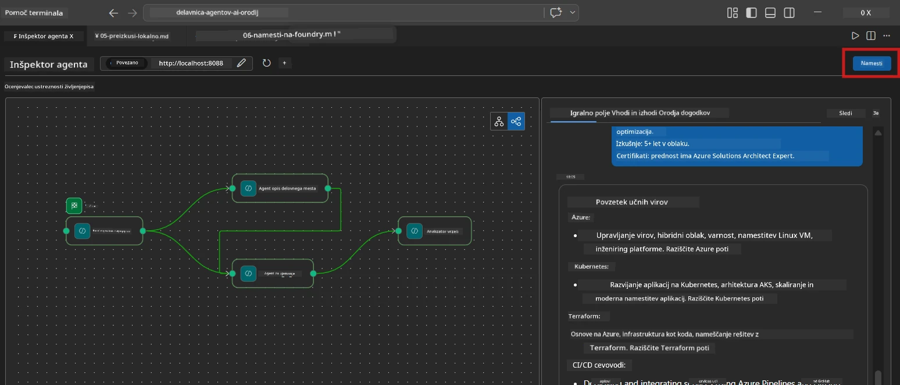
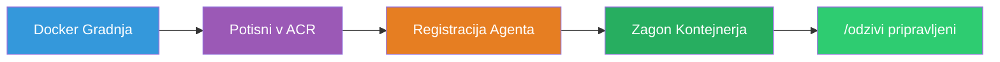
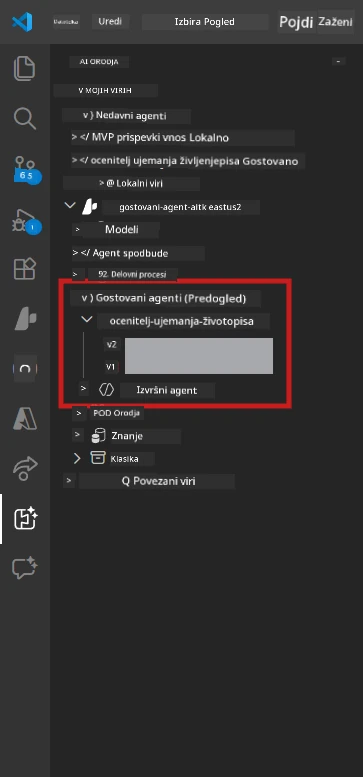

# Modul 6 - Namestitev v Foundry Agent Service

V tem modulu namestite lokalno preizkušeni večagentni potek dela na [Microsoft Foundry](https://learn.microsoft.com/azure/foundry/agents/concepts/hosted-agents) kot **Gostujoči agent**. Postopek namestitve ustvari Docker kontejnersko sliko, jo potisne v [Azure Container Registry (ACR)](https://learn.microsoft.com/azure/container-registry/container-registry-intro) in ustvarja različico gostujočega agenta v [Foundry Agent Service](https://learn.microsoft.com/azure/foundry/agents/how-to/publish-agent).

> **Ključna razlika glede na laboratorij 01:** Postopek namestitve je enak. Foundry obravnava vaš večagentni potek dela kot enega gostujočega agenta - kompleksnost je v kontejnerju, a površina namestitve je ista `/responses` končna točka.

---

## Preverjanje predpogoj

Pred namestitvijo preverite vsak spodnji element:

1. **Agent uspešno prestane lokalne osnovne preizkuse:**
   - Dokončali ste vseh 3 preizkuse v [Modulu 5](05-test-locally.md) in potek je ustvaril popoln izhod z vrzelno kartico in URL-ji Microsoft Learn.

2. **Imate dodeljeno vlogo [Azure AI User](https://learn.microsoft.com/azure/foundry/concepts/rbac-foundry):**
   - Dodeljena v [Lab 01, Modul 2](../../lab01-single-agent/docs/02-create-foundry-project.md). Preverite:
   - [Azure Portal](https://portal.azure.com) → vaš Foundry **projekt** vir → **Access control (IAM)** → **Dodelitve vlog** → potrdite, da je **[Azure AI User](https://aka.ms/foundry-ext-project-role)** naveden za vaš račun.

3. **Prijavljeni ste v Azure v VS Code:**
   - Preverite ikono Računi v spodnjem levem kotu VS Code. Ime vašega računa mora biti vidno.

4. **`agent.yaml` ima pravilne vrednosti:**
   - Odprite `PersonalCareerCopilot/agent.yaml` in preverite:
     ```yaml
     environment_variables:
       - name: PROJECT_ENDPOINT
         value: ${PROJECT_ENDPOINT}
       - name: MODEL_DEPLOYMENT_NAME
         value: ${MODEL_DEPLOYMENT_NAME}
     ```
   - Te se morajo ujemati z okoljskimi spremenljivkami, ki jih bere vaša `main.py`.

5. **`requirements.txt` ima pravilne različice:**
   ```
   agent-framework-azure-ai==1.0.0rc3
   agent-framework-core==1.0.0rc3
   azure-ai-agentserver-agentframework==1.0.0b16
   azure-ai-agentserver-core==1.0.0b16
   debugpy
   agent-dev-cli --pre
   ```

---

## Korak 1: Začnite z namestitvijo

### Možnost A: Namestitev iz Agent Inspectorja (priporočeno)

Če agent teče z F5 z odprtim Agent Inspectorjem:

1. Poglejte v **zgornji desni kot** panela Agent Inspector.
2. Kliknite gumb **Deploy** (ikona oblaka s puščico navzgor ↑).
3. Odpre se čarovnik za namestitev.



### Možnost B: Namestitev preko ukazne palete

1. Pritisnite `Ctrl+Shift+P` za odprtje **Command Palette**.
2. Vtipkajte: **Microsoft Foundry: Deploy Hosted Agent** in izberite.
3. Odpre se čarovnik za namestitev.

---

## Korak 2: Konfigurirajte namestitev

### 2.1 Izbira ciljanega projekta

1. Prikazan je spustni seznam vaših Foundry projektov.
2. Izberite projekt, ki ste ga uporabili v celotnem delavnem tečaju (npr. `workshop-agents`).

### 2.2 Izbira datoteke kontejnerskega agenta

1. Vprašani boste za vhodno točko agenta.
2. Pomaknite se do `workshop/lab02-multi-agent/PersonalCareerCopilot/` in izberite **`main.py`**.

### 2.3 Konfiguracija virov

| Nastavitev | Priporočena vrednost | Opombe |
|------------|---------------------|--------|
| **CPU**    | `0.25`              | Privzeto. Večagentni poteki ne potrebujejo več CPU, ker so klici modela I/O vezani |
| **Pomnilnik** | `0.5Gi`          | Privzeto. Povečajte na `1Gi`, če dodate velike orodja za obdelavo podatkov |

---

## Korak 3: Potrdite in namestite

1. Čarovnik prikaže povzetek namestitve.
2. Preglejte in kliknite **Confirm and Deploy**.
3. Spremljajte napredek v VS Code.

### Kaj se zgodi med namestitvijo

Spremljajte VS Code **Output** panel (izberite "Microsoft Foundry" s spustnega seznama):


1. **Docker build** - Ustvari kontejner iz vašega `Dockerfile`:
   ```
   Step 1/6 : FROM python:3.14-slim
   Step 2/6 : WORKDIR /app
   ...
   Successfully built abc123def456
   ```

2. **Docker push** - Potisne sliko v ACR (1-3 minute ob prvi namestitvi).

3. **Registracija agenta** - Foundry ustvari gostujočega agenta z metapodatki iz `agent.yaml`. Ime agenta je `resume-job-fit-evaluator`.

4. **Zagon kontejnerja** - Kontejner se zažene v upravljanem okolju Foundry z identiteto, upravljano s strani sistema.

> **Prva namestitev traja dlje** (Docker potiska vse plasti). Kasnejše namestitve uporabijo predpomnjene plasti in so hitrejše.

### Posebne opombe za večagente

- **Vsi štirje agenti so v enem kontejnerju.** Foundry vidi enega gostujočega agenta. Notranji graf WorkflowBuilder se izvaja znotraj.
- **Klici MCP gredo ven.** Kontejner potrebuje internetni dostop do `https://learn.microsoft.com/api/mcp`. Upravljana infrastruktura Foundry tega privzeto omogoča.
- **[Upravljana identiteta](https://learn.microsoft.com/python/api/overview/azure/identity-readme#managed-identity-support).** V gostujočem okolju `get_credential()` v `main.py` vrne `ManagedIdentityCredential()` (ker je nastavljen `MSI_ENDPOINT`). To je samodejno.

---

## Korak 4: Preverite stanje namestitve

1. Odprite stransko vrstico **Microsoft Foundry** (kliknite ikono Foundry v vrstici z aktivnostmi).
2. Razširite **Hosted Agents (Preview)** pod vašim projektom.
3. Poiščite **resume-job-fit-evaluator** (ali ime vašega agenta).
4. Kliknite na ime agenta → razširite različice (npr. `v1`).
5. Kliknite na različico → preverite **Podrobnosti kontejnerja** → **Stanje**:



| Stanje       | Pomen                       |
|--------------|-----------------------------|
| **Started** / **Running** | Kontejner teče, agent je pripravljen |
| **Pending**  | Kontejner se začenja (počakajte 30-60 sekund) |
| **Failed**   | Kontejner ni uspel zagnati (preverite dnevnike - spodaj) |

> **Večagentni zagon traja dlje** kot enagentni, ker kontejner ob zagonu ustvari 4 agentne primere. "Pending" do 2 minuti je normalno.

---

## Pogoste napake pri namestitvi in popravki

### Napaka 1: Zavrnjen dostop - `agents/write`

```
Error: lacks the required data action 
Microsoft.CognitiveServices/accounts/AIServices/agents/write
```

**Popravek:** Dodelite vlogo **[Azure AI User](https://learn.microsoft.com/azure/foundry/concepts/rbac-foundry)** na ravni **projekta**. Za korak po koraku si oglejte [Modul 8 - Odpravljanje težav](08-troubleshooting.md).

### Napaka 2: Docker ne teče

```
Error: Docker build failed / Cannot connect to Docker daemon
```

**Popravek:**
1. Zaženite Docker Desktop.
2. Počakajte na "Docker Desktop is running".
3. Preverite z: `docker info`
4. **Windows:** Poskrbite, da je v nastavitvah Docker Desktop omogočena podpora WSL 2.
5. Poskusite znova.

### Napaka 3: pip install spodleti med Docker build

```
Error: Could not find a version that satisfies the requirement agent-dev-cli
```

**Popravek:** Zastavica `--pre` v `requirements.txt` se drugače obravnava v Dockerju. Prepričajte se, da vaš `requirements.txt` vsebuje:
```
agent-dev-cli --pre
```

Če Docker še vedno spodleti, ustvarite `pip.conf` ali podajte `--pre` kot argument ustvarjanja. Oglejte si [Modul 8](08-troubleshooting.md).

### Napaka 4: Orodje MCP ne deluje v gostujočem agentu

Če Gap Analyzer po namestitvi ne proizvaja URL-jev Microsoft Learn:

**Vzrok:** Omrežna politika lahko blokira odhodne HTTPS povezave iz kontejnerja.

**Popravek:**
1. To običajno ni problem v privzeti konfiguraciji Foundry.
2. Če se zgodi, preverite, ali ima virtualno omrežje Foundry projekta NSG, ki blokira odhodne HTTPS povezave.
3. Orodje MCP ima vgrajene rezervne URL-je, zato bo agent še vedno proizvajal izhod (brez živih URL-jev).

---

### Kontrolna točka

- [ ] Ukaz za namestitev je v VS Code uspešno končan brez napak
- [ ] Agent je viden pod **Hosted Agents (Preview)** v Foundry stranski vrstici
- [ ] Ime agenta je `resume-job-fit-evaluator` (ali izbrano ime)
- [ ] Stanje kontejnerja kaže **Started** ali **Running**
- [ ] (Če so bile napake) Identificirali ste napako, uporabili popravek in uspešno znova namestili

---

**Prejšnji:** [05 - Preizkusite lokalno](05-test-locally.md) · **Naslednji:** [07 - Preverite v Playground →](07-verify-in-playground.md)

---

<!-- CO-OP TRANSLATOR DISCLAIMER START -->
**Opozorilo**:
Ta dokument je bil preveden z uporabo AI prevajalske storitve [Co-op Translator](https://github.com/Azure/co-op-translator). Čeprav si prizadevamo za natančnost, vas prosimo, da se zavedate, da avtomatizirani prevodi lahko vsebujejo napake ali netočnosti. Izvirni dokument v njegovem maternem jeziku velja za avtoritativni vir. Za kritične informacije priporočamo strokovni človeški prevod. Nismo odgovorni za morebitna nesporazumevanja ali napačne razlage, ki izhajajo iz uporabe tega prevoda.
<!-- CO-OP TRANSLATOR DISCLAIMER END -->