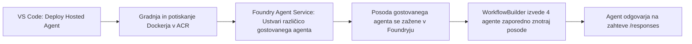
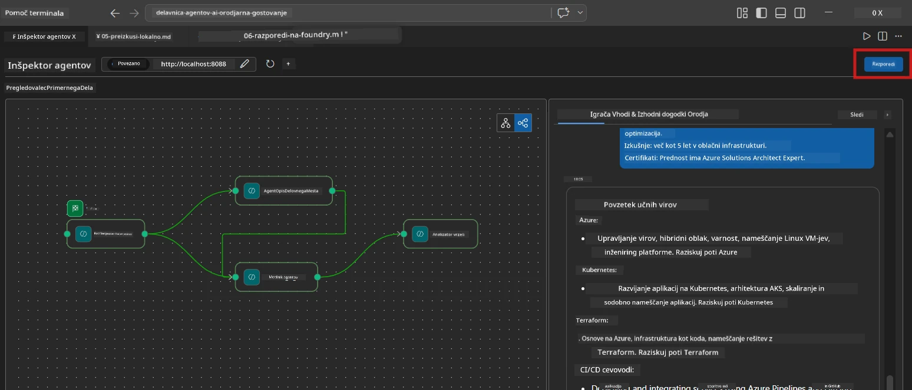
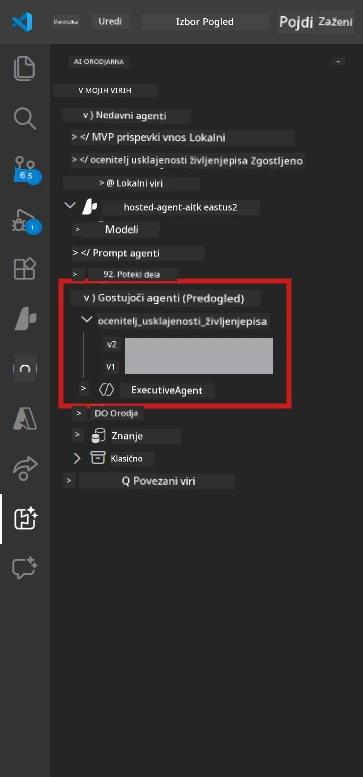

# Modul 6 - Namestitev v storitev Foundry Agent

⏱️ ~10 min

V tem modulu boste namestili lokalno testiran večagentni potek dela na [Microsoft Foundry](https://learn.microsoft.com/azure/foundry/agents/concepts/hosted-agents) kot **Gostujočega agenta**. Postopek namestitve ustvari Docker sliko kontejnerja, jo potisne v [Azure Container Registry (ACR)](https://learn.microsoft.com/azure/container-registry/container-registry-intro) ter ustvari različico gostujočega agenta v [Foundry Agent Service](https://learn.microsoft.com/azure/foundry/agents/how-to/publish-agent).

> **Ključna razlika od Lab 01:** Postopek namestitve je enak. Foundry vaš večagentni potek obravnava kot enega gostujočega agenta - kompleksnost je v kontejnerju, a površina namestitve ostaja ista `/responses` točka.

### Pipeline za nameščanje


```mermaid
flowchart LR
    A[VS Code: Deploy Hosted Agent] --> B[Gradnja in potiskanje Dockerja v ACR]
    B --> C[Foundry Agent Service: Ustvari različico gostovanega agenta]
    C --> D[Posoda gostovanega agenta se zažene v Foundryju]
    D --> E[WorkflowBuilder izvede 4 agente zaporedno znotraj posode]
    E --> F[Agent odgovarja na zahteve /responses]
```

---

## Preverjanje predpogojev

Pred namestitvijo preverite vsak spodnji element:

1. **Agent uspešno prestane lokalne preizkuse:**
   - Dokončali ste vseh 3 teste v [Modulu 5](05-test-locally.md) in potek dela je ustvaril popoln izhod z manjkajočimi karticami in URL-ji Microsoft Learn.

2. **Imate vlogo [Foundry User](https://learn.microsoft.com/azure/foundry/concepts/rbac-foundry)** (za namestitev potrebujete vsaj **Foundry Project Manager** na nivoju projekta):

   > **Opomba:** RBAC vloge za Foundry so bile pred kratkim preimenovane - **Foundry User**, **Foundry Owner** in **Foundry Project Manager** so bile prej poimenovane kot Azure AI User, Azure AI Owner in Azure AI Project Manager. ID-ji vlog in dovoljenja so nespremenjeni.

   - Preverite v [Azure Portalu](https://portal.azure.com) → vaše **projektno** Foundry **projektno** sredstvo → **Access control (IAM)** → **Dodelitve vlog** → potrdite, da je **Foundry User** (ali višje) navedena za vaš račun.

3. **Ste prijavljeni v Azure v VS Code:**
   - Preverite ikono Računi v spodnjem levem kotu VS Code. Moralo bi biti vidno vaše uporabniško ime.

4. **`agent.yaml` vsebuje pravilne vrednosti:**
   - Odprite `PersonalCareerCopilot/agent.yaml` in preverite:
     ```yaml
     environment_variables:
       - name: AZURE_AI_MODEL_DEPLOYMENT_NAME
         value: ${AZURE_AI_MODEL_DEPLOYMENT_NAME}
     ```
   - `FOUNDRY_PROJECT_ENDPOINT` tukaj **ni** naveden - Foundry ga doda med izvajanjem. Potrebno je deklarirati le `AZURE_AI_MODEL_DEPLOYMENT_NAME`.

5. **`requirements.txt` vsebuje pravilne različice:**
   ```
   agent-framework-foundry
   agent-framework-foundry-hosting
   mcp<2,>=1.24.0
   debugpy
   ```

---

## Korak 1: Začni namestitev

### Možnost A: Namestitev preko Agent Inspectorja (priporočeno)

Če agent teče preko F5 z odprtim Agent Inspectorjem:

1. Poglejte v **zgornji desni kot** panela Agent Inspector.
2. Kliknite gumb **Deploy** (ikona oblaka s puščico navzgor ↑).
3. Odpre se čarovnik za namestitev.



### Možnost B: Namestitev iz ukazne palete

1. Pritisnite `Ctrl+Shift+P` za odprtje **ukazne palete**.
2. Vtipkajte: **Foundry Toolkit: Deploy Hosted Agent** in izberite.
3. Odpre se čarovnik za namestitev.

---

## Korak 2: Konfigurirajte namestitev

### 2.1 Izberite ciljni projekt

1. Spustni seznam prikaže vaše Foundry projekte.
2. Izberite projekt, ki ste ga uporabljali skozi delavnico (npr. `workshop-agents`).

### 2.2 Izberite datoteko agenta za kontejner

1. Vprašani boste po izbiri začetne točke agenta.
2. Pomaknite se do `workshop/lab02-multi-agent/PersonalCareerCopilot/` in izberite **`main.py`**.

### 2.3 Konfigurirajte vire

| Nastavitev | Priporočena vrednost | Opombe |
|---------|------------------|-------|
| **Metoda namestitve** | **Kontejner** (priporočeno) ali **Koda** | Kontejner ustvari Docker sliko; Koda naloži izvor kot ZIP (predogled) |
| **Registracija kontejnerjev** | **Privzeta ACR** | Foundry ustvari in upravlja eno za vas |
| **CPU** | `0.25` | Privzeto. Večagentni poteki ne potrebujejo več CPU ker so klici modela vezani na I/O |
| **Pomnilnik** | `0.5Gi` | Privzeto. Povečajte na `1Gi`, če dodate velika orodja za obdelavo podatkov |

---

## Korak 3: Potrdite in namestite

1. Čarovnik prikaže povzetek namestitve.
2. Preglejte in kliknite **Potrdi in namesti**.
3. Spremljajte napredek v VS Code.

### Kaj se dogaja med namestitvijo

Spremljajte panel **Output** v VS Code (izberite "Microsoft Foundry" iz spustnega seznama):

1. **Docker build** - Izgradi kontejner iz vaše `Dockerfile`
   ```
   Step 1/6 : FROM python:3.12-slim
   Step 2/6 : WORKDIR /app
   ...
   Successfully built abc123def456
   ```

2. **Docker push** - Potisne sliko v ACR (1-3 minute ob prvi namestitvi).

3. **Registracija agenta** - Foundry ustvari gostujočega agenta z metapodatki iz `agent.yaml`. Ime agenta je `resume-job-fit-evaluator`.

4. **Zagon kontejnerja** - Kontejner se zažene v upravljani infrastrukturi Foundry z identiteto, ki jo upravlja sistem.

> **Prva namestitev je počasnejša** (Docker potisne vse plasti). Nadaljnje namestitve ponovno uporabijo predpomnjene plasti in so hitrejše.

### Posebne opombe za več agentov

- **Vsi štirje agenti so v enem kontejnerju.** Foundry vidi le enega gostujočega agenta. Graf WorkflowBuilder teče interno.
- **Klici MCP gredo navzven.** Kontejner potrebuje dostop do interneta, da doseže `https://learn.microsoft.com/api/mcp`. Upravljana infrastruktura Foundry to zagotavlja privzeto.
- **[Upravljana identiteta](https://learn.microsoft.com/azure/foundry/agents/concepts/agent-identity).** Foundry samodejno ustvari **posamezno Entra identiteto za vsakega agenta** ob času namestitve. V gostujočem okolju `DefaultAzureCredential` samodejno razreši to identiteto agenta - ročna konfiguracija upravljane identitete ni potrebna.

---

## Korak 4: Preverite stanje namestitve

1. Odprite stranski meni **Microsoft Foundry** (kliknite ikono Foundry na vrstici aktivnosti).
2. Razširite **Hosted Agents (Predogled)** pod vašim projektom.
3. Poiščite **resume-job-fit-evaluator** (ali ime vašega agenta).
4. Kliknite na ime agenta → razširite različice (npr. `v1`).
5. Kliknite na različico → poglejte **Podrobnosti kontejnerja** → **Stanje**:



| Status | Pomen |
|--------|---------|
| **active** | Agent teče in je pripravljen za sprejem zahtevkov |
| **creating** | Kontejner se zaganja (počakajte 30–60 sekund) |
| **failed** | Kontejner ni uspel zagnati (preverite dnevnike - spodaj) |

> **Opomba:** Stranski meni VS Code lahko prikazuje oznake kot "Running" ali "Started", medtem ko osnovni API uporablja `active`/`creating`. Oba prikaza pomenita isto stanje.

> **Zagon več agentov traja dlje** kot enega, ker kontejner ob zagonu ustvari 4 agentne instance. `creating` do 2 minuti je običajno.

---

## Pogoste napake pri nameščanju in rešitve

### Napaka 1: Dovoljenje zavrnjeno - `agents/write`

```
Error: lacks the required data action 
Microsoft.CognitiveServices/accounts/AIServices/agents/write
```

**Popravek:** Dodelite vlogo **[Foundry User](https://learn.microsoft.com/azure/foundry/concepts/rbac-foundry)** (prej **Azure AI User**) na nivoju **projekta**. Oglejte si [Modul 8 - Odpravljanje težav](08-troubleshooting.md) za korak-po-korak navodila.

### Napaka 2: Docker ne teče

```
Error: Docker build failed / Cannot connect to Docker daemon
```

**Popravek:**
1. Zaženite Docker Desktop.
2. Počakajte na "Docker Desktop is running".
3. Preverite: `docker info`
4. **Windows:** Preverite, da je WSL 2 backend omogočen v nastavitvah Docker Desktop.
5. Poskusite znova.

### Napaka 3: pip install ne uspe med Docker build

```
Error: Could not find a version that satisfies the requirement agent-framework-foundry
```

**Popravek:** Preverite, da `requirements.txt` ustreza:
```
agent-framework-foundry
agent-framework-foundry-hosting
mcp<2,>=1.24.0
debugpy
```

Če gradnja še vedno ne uspe, lahko vaša Docker mreža blokira PyPI. Preverite nastavitve proxy z `docker info`.

### Napaka 4: Orodje MCP ne deluje v gostujočem agentu

Če Gap Analyzer preneha proizvajati Microsoft Learn URL-je po namestitvi:

**Vzrok:** Omrežna politika lahko blokira odhodni HTTPS iz kontejnerja.

**Popravek:**
1. To običajno ni težava s privzeto konfiguracijo Foundry.
2. Če se pojavi, preverite, ali virtualno omrežje Foundry projekta uporablja NSG, ki blokira odhodni HTTPS.
3. Orodje MCP ima vgrajene rezervne URL-je, zato agent bo še vedno ustvarjal izhod (brez aktivnih URL-jev).

---

### Kontrolna točka

- [ ] Ukaz za namestitev je bil izveden brez napak v VS Code
- [ ] Agent se pojavi pod **Hosted Agents (Predogled)** v Foundry stranskem meniju
- [ ] Ime agenta je `resume-job-fit-evaluator` (ali vaša izbrana ime)
- [ ] Stanje kontejnerja kaže **Started** ali **Running**
- [ ] (Če so napake) Ste napako identificirali, uporabili popravek in uspešno znova namestili

---

**Prejšnji:** [05 - Test Locally](05-test-locally.md) · **Naslednji:** [07 - Verify in Playground →](07-verify-in-playground.md)

---

<!-- CO-OP TRANSLATOR DISCLAIMER START -->
**Omejitev odgovornosti**:
Ta dokument je bil preveden z uporabo AI prevajalske storitve [Co-op Translator](https://github.com/Azure/co-op-translator). Čeprav si prizadevamo za natančnost, vas prosimo, da upoštevate, da avtomatizirani prevodi lahko vsebujejo napake ali netočnosti. Izvirni dokument v njegovem izvirnem jeziku je treba obravnavati kot avtoritativni vir. Za kritične informacije je priporočljiv strokovni človeški prevod. Ne odgovarjamo za morebitna nesporazume ali napačne interpretacije, ki izhajajo iz uporabe tega prevoda.
<!-- CO-OP TRANSLATOR DISCLAIMER END -->