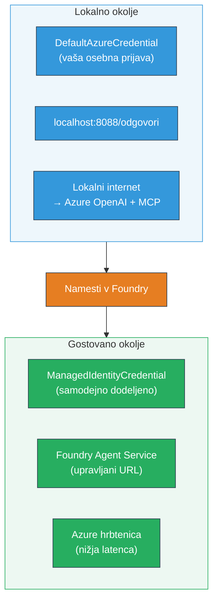

# Modul 7 - Preverjanje v Playgroundu

V tem modulu boste preizkusili svoj nameščeni večagentni potek dela tako v **VS Code** kot v **[Foundry Portalu](https://ai.azure.com)** ter potrdili, da agent deluje enako kot pri lokalnem testiranju.

---

## Zakaj preverjati po nameščanju?

Vaš večagentni potek dela je v lokalnem okolju deloval brezhibno, zakaj torej ponovno testirati? Gostujoče okolje se razlikuje na več načinov:


| Razlika | Lokalno | Gostujoče |
|---------|---------|-----------|
| **Identiteta** | [`DefaultAzureCredential`](https://learn.microsoft.com/azure/developer/python/sdk/authentication/credential-chains#defaultazurecredential-overview) (vaš osebni vpis) | [`ManagedIdentityCredential`](https://learn.microsoft.com/python/api/overview/azure/identity-readme#managed-identity-support) (samodejna dodelitev) |
| **Končna točka** | `http://localhost:8088/responses` | [Foundry Agent Service](https://learn.microsoft.com/azure/foundry/agents/concepts/hosted-agents) endpoint (upravljan URL) |
| **Omrežje** | Lokalni računalnik → Azure OpenAI + MCP outbound | Azure hrbtenica (nižja zakasnitev med storitvami) |
| **Povezava do MCP** | Lokalni internet → `learn.microsoft.com/api/mcp` | Izhod kontejnerja → `learn.microsoft.com/api/mcp` |

Če je katera koli okoljska spremenljivka nepravilno nastavljena, je RBAC drugačen ali je izhod MCP blokiran, boste to tukaj zaznali.

---

## Možnost A: Testiranje v Playgroundu v VS Code (priporočeno najprej)

[Foundry razširitev](https://marketplace.visualstudio.com/items?itemName=TeamsDevApp.vscode-ai-foundry) vključuje integriran Playground, ki vam omogoča klepet z nameščenim agentom brez zapuščanja VS Code.

### 1. korak: Pomaknite se do svojega gostujočega agenta

1. Kliknite ikono **Microsoft Foundry** v **vrstici z aktivnostmi** v VS Code (levo stranska vrstica), da odprete Foundry ploščo.
2. Razširite svoj povezani projekt (npr. `workshop-agents`).
3. Razširite **Hosted Agents (Preview)**.
4. Videti morate ime svojega agenta (npr. `resume-job-fit-evaluator`).

### 2. korak: Izberite različico

1. Kliknite ime agenta, da razširite njegove različice.
2. Kliknite različico, ki ste jo namestili (npr. `v1`).
3. Odpre se **podrobnostni panel** z informacijami o kontejnerju.
4. Preverite, ali je stanje **Started** ali **Running**.

### 3. korak: Odprite Playground

1. V podrobnostnem panelu kliknite gumb **Playground** (ali z desnim klikom na različico → **Open in Playground**).
2. Odpre se klepet v zavihku VS Code.

### 4. korak: Zaženite svoje osnovne teste

Uporabite iste 3 teste iz [Modula 5](05-test-locally.md). Vsako sporočilo vnesite v vhodno polje Playgrounda in pritisnite **Send** (ali **Enter**).

#### Test 1 - Celoten življenjepis + opis delovnega mesta (standardni potek)

Prilepite celoten poziv za življenjepis + opis delovnega mesta iz Modula 5, Test 1 (Jane Doe + Senior Cloud Engineer v Contoso Ltd).

**Pričakovano:**
- Ocena ujemanja z razčlenitvijo (lestvica do 100)
- Razdelek Ujemajoče veščine
- Razdelek Manjkajoče veščine
- **Ena kartica za vsak manjkajoči skill** z URL-ji Microsoft Learn
- Načrt učenja s časovnico

#### Test 2 - Hiter kratek test (minimalni vnos)

```
RESUME: 3 years Python developer, knows Django and PostgreSQL, no cloud experience.

JOB: Cloud DevOps Engineer requiring AWS, Kubernetes, Terraform, CI/CD. 5 years needed.
```

**Pričakovano:**
- Nižja ocena ujemanja (< 40)
- Poštena ocena z fazno potjo učenja
- Več kartic za vrzeli (AWS, Kubernetes, Terraform, CI/CD, izkušnje)

#### Test 3 - Kandidat z visoko stopnjo ujemanja

```
RESUME:
10 years Azure Cloud Architect. AZ-305 certified. Expert in AKS, Terraform, Azure DevOps, 
Azure Functions, Helm, Prometheus, Grafana, Python, Go. Led platform team of 8.

JOB:
Senior Cloud Engineer. Required: AKS, Terraform, Azure DevOps, Python. Preferred: Helm, Go.
5+ years experience. AZ-305 preferred.
```

**Pričakovano:**
- Visoka ocena ujemanja (≥ 80)
- Osredotočenost na pripravljenost za razgovor in izpopolnjevanje
- Nekatere ali nobene kartice za vrzeli
- Kratek časovni okvir osredotočen na pripravo

### 5. korak: Primerjajte z lokalnimi rezultati

Odprite svoje zapiske ali zavihek brskalnika iz Modula 5, kjer ste shranili lokalne odgovore. Za vsak test:

- Ali ima odgovor **isto strukturo** (ocena ujemanja, kartice vrzeli, načrt)?
- Ali uporablja **isto ocenjevalno lestvico** (razčlenitev do 100 točk)?
- Ali so **URL-ji Microsoft Learn** še vedno prisotni v karticah vrzeli?
- Ali je **ena kartica vrzeli za vsak manjkajoči skill** (ne skrajšana)?

> **Manjše razlike v besedilu so normalne** – model ni determinističen. Osredotočite se na strukturo, doslednost ocenjevanja in uporabo MCP orodij.

---

## Možnost B: Testiranje v Foundry Portalu

[Foundry Portal](https://ai.azure.com) nudi spletni playground, uporabno za deljenje s sodelavci ali deležniki.

### 1. korak: Odprite Foundry Portal

1. Odprite svoj brskalnik in pojdite na [https://ai.azure.com](https://ai.azure.com).
2. Prijavite se z istim Azure računom, ki ste ga uporabljali skozi celoten delavnico.

### 2. korak: Pomaknite se do svojega projekta

1. Na domači strani poiščite **Nedavni projekti** na levi stranski vrstici.
2. Kliknite ime svojega projekta (npr. `workshop-agents`).
3. Če ga ne vidite, kliknite **Vsi projekti** in ga poiščite.

### 3. korak: Poiščite svoj nameščeni agent

1. V levi navigaciji projekta kliknite **Build** → **Agents** (ali poiščite oddelek **Agents**).
2. Videti morate seznam agentov. Poiščite svoj nameščeni agent (npr. `resume-job-fit-evaluator`).
3. Kliknite ime agenta za odprtje njegove podrobnostne strani.

### 4. korak: Odprite Playground

1. Na podrobnostni strani agenta poglejte v zgornjo orodno vrstico.
2. Kliknite **Open in playground** (ali **Try in playground**).
3. Odpre se klepet.

### 5. korak: Zaženite iste osnovne teste

Ponovite vseh 3 testov iz Playgrounda v VS Code zgoraj. Vsak odgovor primerjajte z lokalnimi rezultati (Modul 5) in z rezultati iz Playgrounda v VS Code (Možnost A zgoraj).

---

## Specifično preverjanje za večagentni sistem

Poleg osnovne pravilnosti preverite še te značilnosti, specifične za več agentov:

### Izvajanje orodja MCP

| Preverjanje | Kako preveriti | Pogoji za uspeh |
|-------------|---------------|-----------------|
| Klici MCP uspešni | Kartice vrzeli vsebujejo URL-je `learn.microsoft.com` | Pravi URL-ji, ne rezervnih sporočil |
| Več klicev MCP | Vsaka vrzel z visoko/sredno prioriteto ima vire | Ne samo prva kartica vrzeli |
| Rezervni mehanizem MCP deluje | Če URL-ji manjkajo, preverite rezervno besedilo | Agent še vedno ustvari kartice vrzeli (z ali brez URL-jev) |

### Koordinacija agentov

| Preverjanje | Kako preveriti | Pogoji za uspeh |
|-------------|---------------|-----------------|
| Vsi 4 agenti so delovali | Izhod vsebuje oceno ujemanja IN kartice vrzeli | Oceno daje MatchingAgent, kartice GapAnalyzer |
| Sočasno izvajanje | Čas odgovora je sprejemljiv (< 2 min) | Če > 3 min, morda sočasno izvajanje ne deluje |
| Integriteta pretoka podatkov | Kartice vrzeli sklicujejo na veščine iz poročila | Brez izmisljenih veščin, ki niso v JD |

---

## Ocena pravilnosti

Uporabite to lestvico za oceno vedenja vašega večagentnega poteka dela v gostujočem okolju:

| # | Merilo | Pogoji za uspeh | Ocenjeno |
|---|---------|-----------------|----------|
| 1 | **Funkcionalna pravilnost** | Agent odgovori na življenjepis + JD z oceno ujemanja in analizo vrzeli | |
| 2 | **Doslednost ocenjevanja** | Ocena ujemanja uporablja lestvico do 100 točk z razčlenitvijo | |
| 3 | **Popolnost kartic vrzeli** | Ena kartica za vsak manjkajoči skill (ni skrajšana ali združena) | |
| 4 | **Integracija orodja MCP** | Kartice vrzeli vključujejo prave URL-je Microsoft Learn | |
| 5 | **Strukturna skladnost** | Struktura izhoda se ujema med lokalnim in gostujočim zagonom | |
| 6 | **Čas odgovora** | Gostujoči agent odgovori v 2 minutah za celotno oceno | |
| 7 | **Brez napak** | Brez napak HTTP 500, časovnih omejitev ali praznih odgovorov | |

> "Uspeh" pomeni, da so vsi 7 kriteriji izpolnjeni za vseh 3 osnovne teste v vsaj enem playgroundu (VS Code ali Portal).

---

## Reševanje težav z playgroundom

| Simptom | Verjetni vzrok | Popravek |
|---------|----------------|----------|
| Playground se ne naloži | Stanje kontejnerja ni "Started" | Vrni se na [Modul 6](06-deploy-to-foundry.md), preveri status nameščanja. Počakaj, če je "Pending" |
| Agent vrne prazen odgovor | Ime modela v nameščanju se ne ujema | Preveri `agent.yaml` → `environment_variables` → `MODEL_DEPLOYMENT_NAME` se ujema z nameščenim modelom |
| Agent vrne sporočilo o napaki | [RBAC](https://learn.microsoft.com/azure/foundry/concepts/rbac-foundry) dovoljenje manjka | Dodeli **[Azure AI User](https://aka.ms/foundry-ext-project-role)** na ravni projekta |
| V karticah vrzeli ni URL-jev Microsoft Learn | MCP izhod blokiran ali MCP strežnik nedosegljiv | Preveri, ali kontejner doseže `learn.microsoft.com`. Glej [Modul 8](08-troubleshooting.md) |
| Samo 1 kartica vrzeli (skrajšana) | Manjkajo navodila "CRITICAL" v GapAnalyzerju | Preglej [Modul 3, 2.4](03-configure-agents.md) |
| Ocena ujemanja zelo različna od lokalne | Različen model ali navodila nameščena | Primerjaj okoljske spremenljivke `agent.yaml` z lokalnim `.env`. Ponovno namesti, če je potrebno |
| "Agent not found" v Portalu | Nameščanje se še širi ali je spodletelo | Počakaj 2 minuti, osveži. Če še vedno manjka, ponovno namesti iz [Modul 6](06-deploy-to-foundry.md) |

---

### Čeklista

- [ ] Preizkušen agent v VS Code Playground - vsi 3 osnovni testi uspešni
- [ ] Preizkušen agent v [Foundry Portalu](https://ai.azure.com) Playground - vsi 3 osnovni testi uspešni
- [ ] Odgovori so strukturno skladni z lokalnim testiranjem (ocena ujemanja, kartice vrzeli, načrt)
- [ ] URL-ji Microsoft Learn so prisotni v karticah vrzeli (orodje MCP deluje v gostujočem okolju)
- [ ] Ena kartica vrzeli za vsak manjkajoči skill (brez skrajšav)
- [ ] Brez napak ali časovnih omejitev med testiranjem
- [ ] Izpolnjena ocenjevalna lestvica (vsi 7 kriterijev uspešno)

---

**Prejšnji:** [06 - Deploy to Foundry](06-deploy-to-foundry.md) · **Naslednji:** [08 - Troubleshooting →](08-troubleshooting.md)

---

<!-- CO-OP TRANSLATOR DISCLAIMER START -->
**Omejitev odgovornosti**:
Ta dokument je bil preveden z uporabo AI prevajalske storitve [Co-op Translator](https://github.com/Azure/co-op-translator). Medtem ko si prizadevamo za natančnost, vas prosimo, da upoštevate, da avtomatizirani prevodi lahko vsebujejo napake ali netočnosti. Izvirni dokument v izvirnem jeziku velja za avtoritativni vir. Za ključne informacije priporočamo strokovni človeški prevod. Za kakršne koli nesporazume ali napačne interpretacije, ki izhajajo iz uporabe tega prevoda, ne odgovarjamo.
<!-- CO-OP TRANSLATOR DISCLAIMER END -->