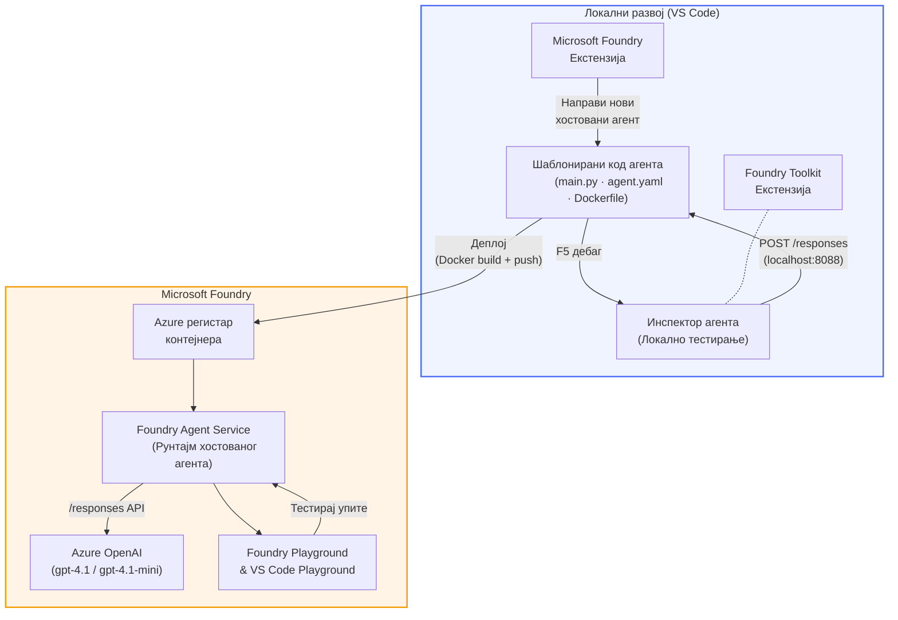

# Foundry Toolkit + Foundry Hosted Agents Радионца

[](https://www.python.org/)
[](https://github.com/microsoft/agents)
[](https://learn.microsoft.com/azure/ai-foundry/agents/concepts/hosted-agents/)
[](https://ai.azure.com/)
[](https://learn.microsoft.com/azure/ai-services/openai/)
[](https://learn.microsoft.com/cli/azure/install-azure-cli)
[](https://learn.microsoft.com/azure/developer/azure-developer-cli/install-azd)
[](https://www.docker.com/)
[](https://marketplace.visualstudio.com/items?itemName=ms-windows-ai-studio.windows-ai-studio)
[](LICENSE)

Правите, тестирајте и објављујте AI агенте у **Microsoft Foundry Agent Service** као **Hosted Agents** - потпуно из VS Code-а користећи **Microsoft Foundry extension** и **Foundry Toolkit**.

> **Hosted Agents су тренутно у прегледу.** Подржани региони су ограничени - погледајте [доступност региона](https://learn.microsoft.com/azure/foundry/agents/concepts/hosted-agents#region-availability).

> Папка `agent/` унутар сваке лабораторије је **аутоматски генерисана** од стране Foundry екстензије - затим прилагођавате код, тестирате локално и објављујете.

<!-- CO-OP TRANSLATOR LANGUAGES TABLE START -->
[Arabic](../ar/README.md) | [Bengali](../bn/README.md) | [Bulgarian](../bg/README.md) | [Burmese (Myanmar)](../my/README.md) | [Chinese (Simplified)](../zh-CN/README.md) | [Chinese (Traditional, Hong Kong)](../zh-HK/README.md) | [Chinese (Traditional, Macau)](../zh-MO/README.md) | [Chinese (Traditional, Taiwan)](../zh-TW/README.md) | [Croatian](../hr/README.md) | [Czech](../cs/README.md) | [Danish](../da/README.md) | [Dutch](../nl/README.md) | [Estonian](../et/README.md) | [Finnish](../fi/README.md) | [French](../fr/README.md) | [German](../de/README.md) | [Greek](../el/README.md) | [Hebrew](../he/README.md) | [Hindi](../hi/README.md) | [Hungarian](../hu/README.md) | [Indonesian](../id/README.md) | [Italian](../it/README.md) | [Japanese](../ja/README.md) | [Kannada](../kn/README.md) | [Khmer](../km/README.md) | [Korean](../ko/README.md) | [Lithuanian](../lt/README.md) | [Malay](../ms/README.md) | [Malayalam](../ml/README.md) | [Marathi](../mr/README.md) | [Nepali](../ne/README.md) | [Nigerian Pidgin](../pcm/README.md) | [Norwegian](../no/README.md) | [Persian (Farsi)](../fa/README.md) | [Polish](../pl/README.md) | [Portuguese (Brazil)](../pt-BR/README.md) | [Portuguese (Portugal)](../pt-PT/README.md) | [Punjabi (Gurmukhi)](../pa/README.md) | [Romanian](../ro/README.md) | [Russian](../ru/README.md) | [Serbian (Cyrillic)](./README.md) | [Slovak](../sk/README.md) | [Slovenian](../sl/README.md) | [Spanish](../es/README.md) | [Swahili](../sw/README.md) | [Swedish](../sv/README.md) | [Tagalog (Filipino)](../tl/README.md) | [Tamil](../ta/README.md) | [Telugu](../te/README.md) | [Thai](../th/README.md) | [Turkish](../tr/README.md) | [Ukrainian](../uk/README.md) | [Urdu](../ur/README.md) | [Vietnamese](../vi/README.md)

> **Волите да клонирате локално?**
>
> Овај репозиторијум укључује 50+ превода на језике што значајно повећава величину превлачења. Да бисте клонирали без превода, користите sparse checkout:
>
> **Bash / macOS / Linux:**
> ```bash
> git clone --filter=blob:none --sparse https://github.com/microsoft-foundry/Foundry_Toolkit_for_VSCode_Lab.git
> cd Foundry_Toolkit_for_VSCode_Lab
> git sparse-checkout set --no-cone '/*' '!translations' '!translated_images'
> ```
>
> **CMD (Windows):**
> ```cmd
> git clone --filter=blob:none --sparse https://github.com/microsoft-foundry/Foundry_Toolkit_for_VSCode_Lab.git
> cd Foundry_Toolkit_for_VSCode_Lab
> git sparse-checkout set --no-cone "/*" "!translations" "!translated_images"
> ```
>
> Ово вам даје све што вам је потребно за завршетак курса са много бржим преузимањем.
<!-- CO-OP TRANSLATOR LANGUAGES TABLE END -->

---

## Архитектура


**Проток:** Foundry екстензија генерише агента → ви прилагођавате код и инструкције → тестирајте локално са Agent Inspector → објављујете на Foundry (Docker слика се шаље у ACR) → верификујете у Playground-у.

---

## Шта ћете направити

| Лабораторија | Опис | Статус |
|-----|-------------|--------|
| **Лаб 01 - Један агент** | Направите **"Објасни као да сам извршни директор" агента**, тестирате га локално и објавите на Foundry | ✅ Доступно |
| **Лаб 02 - Вишеструки агенти у раду** | Направите **"Оцена одговарања резимеа за посао"** - 4 агента сарађују да процене услове резимеа и генеришу план учења | ✅ Доступно |

---

## Упознајте извршног агента

У овој радионици направићете **"Објасни као да сам извршни директор" агента** - AI агента који узима компликован технички жаргон и преводи га у смирене, спремне за састанак са управом резимеје. Јер, будимо искрени, нико у врху компаније не жели да чује о "истрошености thread pool-а изазваној синхроним позивима уведеним у верзији 3.2."

Овај агент је направљен након превише случајева у којима је мој савршено написан извештај добио одговор: *"Дакле… да ли је сајт пао или није?"*

### Како ради

Унесете техничко ажурирање. Он враћа извршни резиме - три главне тачке, без жаргона, без stack trace-ова, без егзистенцијалног страха. Само **шта се десило**, **пословни утицај** и **следећи корак**.

### Погледајте како ради

**Реците:**
> "Заустављање API-а повећано је због истрошености thread pool-а изазване синхроним позивима уведеним у верзији 3.2."

**Агент одговара:**

> **Извршни резиме:**
> - **Шта се десило:** Након најновијег издања, систем се успорио.
> - **Пословни утицај:** Неки корисници су искусили заостајања приликом коришћења услуге.
> - **Следећи корак:** Промена је повучена и припрема се поправка пре поновног објављивања.

### Зашто овај агент?

Он је једноставан агент за један циљ - савршен за учење токова рада hosted агената од почетка до краја без компликованих алатки. И да будем искрен? Сваком инжењерском тиму треба један такав.

---

## Структура радионице

```
📂 Foundry_Toolkit_for_VSCode_Lab/
├── 📄 README.md                      ← You are here
├── 📂 ExecutiveAgent/                ← Standalone hosted agent project
│   ├── agent.yaml
│   ├── Dockerfile
│   ├── main.py
│   └── requirements.txt
└── 📂 workshop/
    ├── 📂 lab01-single-agent/        ← Full lab: docs + agent code
    │   ├── README.md                 ← Hands-on lab instructions
    │   ├── 📂 docs/                  ← Step-by-step tutorial modules
    │   │   ├── 00-prerequisites.md
    │   │   ├── 01-install-foundry-toolkit.md
    │   │   ├── 02-create-foundry-project.md
    │   │   ├── 03-create-hosted-agent.md
    │   │   ├── 04-configure-and-code.md
    │   │   ├── 05-test-locally.md
    │   │   ├── 06-deploy-to-foundry.md
    │   │   ├── 07-verify-in-playground.md
    │   │   └── 08-troubleshooting.md
    │   └── 📂 agent/                 ← Reference solution (auto-scaffolded by Foundry extension)
    │       ├── agent.yaml
    │       ├── Dockerfile
    │       ├── main.py
    │       └── requirements.txt
    └── 📂 lab02-multi-agent/         ← Resume → Job Fit Evaluator
        ├── README.md                 ← Hands-on lab instructions (end-to-end)
        ├── 📂 docs/                  ← Step-by-step tutorial modules
        │   ├── 00-prerequisites.md
        │   ├── 01-understand-multi-agent.md
        │   ├── 02-scaffold-multi-agent.md
        │   ├── 03-configure-agents.md
        │   ├── 04-orchestration-patterns.md
        │   ├── 05-test-locally.md
        │   ├── 06-deploy-to-foundry.md
        │   ├── 07-verify-in-playground.md
        │   └── 08-troubleshooting.md
        └── 📂 PersonalCareerCopilot/ ← Reference solution (multi-agent workflow)
            ├── agent.yaml
            ├── Dockerfile
            ├── main.py
            └── requirements.txt
```

> **Напомена:** `agent/` фасцикла унутар сваке лабораторије је она коју **Microsoft Foundry extension** генерише када покренете `Microsoft Foundry: Create a New Hosted Agent` из Command Palette-а. Фајлови се затим прилагођавају вашим упутствима, алатима и конфигурацијом. Лабораторија 01 вас води кроз прављење овога од нуле.

---

## Почните

### 1. Клонирајте репозиторијум

```bash
git clone https://github.com/microsoft-foundry/Foundry_Toolkit_for_VSCode_Lab.git
cd Foundry_Toolkit_for_VSCode_Lab
```

### 2. Подесите Python виртуално окружење

```bash
python -m venv venv
```

Активирајте га:

- **Windows (PowerShell):**
  ```powershell
  .\venv\Scripts\Activate.ps1
  ```
- **macOS / Linux:**
  ```bash
  source venv/bin/activate
  ```

### 3. Инсталирајте зависности

```bash
pip install -r workshop/lab01-single-agent/agent/requirements.txt
```

### 4. Конфигуришите променљиве окружења

Копирајте пример `.env` фајла унутар агента и унесите своје вредности:

```bash
cp workshop/lab01-single-agent/agent/.env.example workshop/lab01-single-agent/agent/.env
```

Измените `workshop/lab01-single-agent/agent/.env`:

```env
AZURE_AI_PROJECT_ENDPOINT=https://<your-account>.services.ai.azure.com/api/projects/<your-project>
MODEL_DEPLOYMENT_NAME=<your-model-deployment-name>
```

### 5. Пратите лабораторије са радионице

Свака лабораторија је самостална са својим модулима. Почните са **Лаб 01** да научите основе, а затим наставите са **Лаб 02** за рад вишеструких агената.

#### Лаб 01 - Један агент ([пунa упутства](workshop/lab01-single-agent/README.md))

| # | Модул | Линк |
|---|--------|------|
| 1 | Прочитајте предуслове | [00-prerequisites.md](workshop/lab01-single-agent/docs/00-prerequisites.md) |
| 2 | Инсталирајте Foundry Toolkit & Foundry extension | [01-install-foundry-toolkit.md](workshop/lab01-single-agent/docs/01-install-foundry-toolkit.md) |
| 3 | Направите Foundry пројекат | [02-create-foundry-project.md](workshop/lab01-single-agent/docs/02-create-foundry-project.md) |
| 4 | Креирајте hosted агента | [03-create-hosted-agent.md](workshop/lab01-single-agent/docs/03-create-hosted-agent.md) |
| 5 | Конфигуришите инструкције и окружење | [04-configure-and-code.md](workshop/lab01-single-agent/docs/04-configure-and-code.md) |
| 6 | Тестирајте локално | [05-test-locally.md](workshop/lab01-single-agent/docs/05-test-locally.md) |
| 7 | Објавите на Foundry | [06-deploy-to-foundry.md](workshop/lab01-single-agent/docs/06-deploy-to-foundry.md) |
| 8 | Верификујте у playground-у | [07-verify-in-playground.md](workshop/lab01-single-agent/docs/07-verify-in-playground.md) |
| 9 | Решавање проблема | [08-troubleshooting.md](workshop/lab01-single-agent/docs/08-troubleshooting.md) |

#### Лаб 02 - Рад вишеструких агената ([пунa упутства](workshop/lab02-multi-agent/README.md))

| # | Модул | Линк |
|---|--------|------|
| 1 | Предуслови (Лаб 02) | [00-prerequisites.md](workshop/lab02-multi-agent/docs/00-prerequisites.md) |
| 2 | Разумевање архитектуре вишеструких агената | [01-understand-multi-agent.md](workshop/lab02-multi-agent/docs/01-understand-multi-agent.md) |
| 3 | Генеришите пројекат вишеструких агената | [02-scaffold-multi-agent.md](workshop/lab02-multi-agent/docs/02-scaffold-multi-agent.md) |
| 4 | Конфигуришите агенте и окружење | [03-configure-agents.md](workshop/lab02-multi-agent/docs/03-configure-agents.md) |
| 5 | Обрасци оркестрације | [04-orchestration-patterns.md](workshop/lab02-multi-agent/docs/04-orchestration-patterns.md) |
| 6 | Тестирајте локално (вишеструки агенти) | [05-test-locally.md](workshop/lab02-multi-agent/docs/05-test-locally.md) |
| 7 | Постави на Foundry | [06-deploy-to-foundry.md](workshop/lab02-multi-agent/docs/06-deploy-to-foundry.md) |
| 8 | Верификовање у песковнику | [07-verify-in-playground.md](workshop/lab02-multi-agent/docs/07-verify-in-playground.md) |
| 9 | Решавање проблема (више агената) | [08-troubleshooting.md](workshop/lab02-multi-agent/docs/08-troubleshooting.md) |

---

## Одржавалац

<table>
<tr>
    <td align="center"><a href="https://github.com/ShivamGoyal03">
        <br />
        <sub><b>Шивам Гојаљ</b></sub>
    </a><br />
    </td>
</tr>
</table>

---

## Потребне дозволе (брз подсетник)

| Сценарио | Потребне улоге |
|----------|---------------|
| Креирање новог Foundry пројекта | **Azure AI Owner** на Foundry ресурсу |
| Постављање на постојећи пројекат (нови ресурси) | **Azure AI Owner** + **Contributor** на претплати |
| Постављање на потпуно конфигурисан пројекат | **Reader** на налогу + **Azure AI User** на пројекту |

> **Важно:** Улоге Azure `Owner` и `Contributor` укључују само *управљачка* овлашћења, не и *развојна* (овлашћења за рад са подацима). Потребни су вам **Azure AI User** или **Azure AI Owner** да бисте правили и постављали агенте.

---

## Референце

- [Quickstart: Deploy your first hosted agent (VS Code)](https://learn.microsoft.com/azure/foundry/agents/quickstarts/quickstart-hosted-agent)
- [What are hosted agents?](https://learn.microsoft.com/azure/foundry/agents/concepts/hosted-agents)
- [Create hosted agent workflows in VS Code](https://learn.microsoft.com/azure/foundry/agents/how-to/vs-code-agents-workflow-pro-code)
- [Deploy a hosted agent](https://learn.microsoft.com/azure/foundry/agents/how-to/deploy-hosted-agent)
- [RBAC for Microsoft Foundry](https://learn.microsoft.com/azure/foundry/concepts/rbac-foundry)
- [Architecture Review Agent Sample](https://github.com/Azure-Samples/agent-architecture-review-sample) - Реални агент хостован са MCP алаткама, Excalidraw дијаграмима и двоструком имплементацијом

---


## Лиценца

[MIT](../../LICENSE)

---

<!-- CO-OP TRANSLATOR DISCLAIMER START -->
**Одрицање**:
Овај документ је преведен коришћењем AI преводилачке услуге [Co-op Translator](https://github.com/Azure/co-op-translator). Иако тежимо тачности, молимо вас да имате у виду да аутоматски преводи могу садржати грешке или нетачности. Оригинални документ на његовом изворном језику треба сматрати ауторитетним извором. За критичне информације препоручује се стручни људски превод. Нисмо одговорни за било каква неспоразума или погрешне тумачења која произилазе из коришћења овог превода.
<!-- CO-OP TRANSLATOR DISCLAIMER END -->