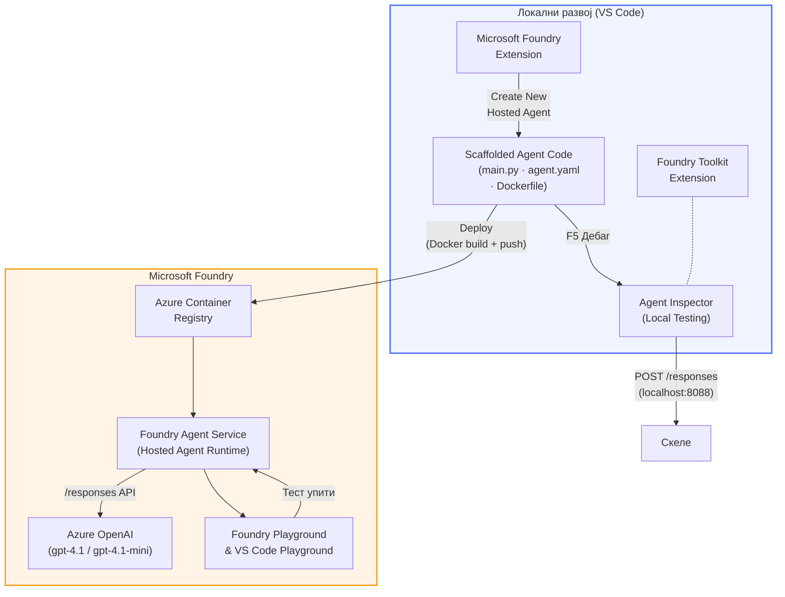

# Foundry Toolkit + Радионца за Hosted Agents у Foundry-у

[](https://www.python.org/)
[](https://github.com/microsoft/agents)
[](https://learn.microsoft.com/azure/foundry/agents/concepts/hosted-agents)
[](https://ai.azure.com/)
[](https://learn.microsoft.com/azure/ai-services/openai/)
[](https://learn.microsoft.com/cli/azure/install-azure-cli)
[](https://learn.microsoft.com/azure/developer/azure-developer-cli/install-azd)
[](https://www.docker.com/)
[](https://marketplace.visualstudio.com/items?itemName=ms-windows-ai-studio.windows-ai-studio)
[](LICENSE)

Направите, тестирате и распоредите AI агенте у **Microsoft Foundry Agent Service** као **Hosted Agents** - у потпуности из VS Code користећи **Microsoft Foundry екстензију** и **Foundry Toolkit**.

> **Hosted Agents су тренутно у претпубликацији.** Подржани региони су ограничени - погледајте [доступност региона](https://learn.microsoft.com/azure/foundry/agents/concepts/hosted-agents#region-availability).

> Фасцикла `agent/` унутар сваке лабораторије је **аутоматски креирана** од стране Foundry екстензије - након тога прилагођавате код, тестирате локално и распоређујете.

### 🌐 Подршка за више језика

#### Подржано путем GitHub Action (Аутоматизовано и увек ажурирано)

<!-- CO-OP TRANSLATOR LANGUAGES TABLE START -->
[Arabic](../ar/README.md) | [Bengali](../bn/README.md) | [Bulgarian](../bg/README.md) | [Burmese (Myanmar)](../my/README.md) | [Chinese (Simplified)](../zh-CN/README.md) | [Chinese (Traditional, Hong Kong)](../zh-HK/README.md) | [Chinese (Traditional, Macau)](../zh-MO/README.md) | [Chinese (Traditional, Taiwan)](../zh-TW/README.md) | [Croatian](../hr/README.md) | [Czech](../cs/README.md) | [Danish](../da/README.md) | [Dutch](../nl/README.md) | [Estonian](../et/README.md) | [Finnish](../fi/README.md) | [French](../fr/README.md) | [German](../de/README.md) | [Greek](../el/README.md) | [Hebrew](../he/README.md) | [Hindi](../hi/README.md) | [Hungarian](../hu/README.md) | [Indonesian](../id/README.md) | [Italian](../it/README.md) | [Japanese](../ja/README.md) | [Kannada](../kn/README.md) | [Khmer](../km/README.md) | [Korean](../ko/README.md) | [Lithuanian](../lt/README.md) | [Malay](../ms/README.md) | [Malayalam](../ml/README.md) | [Marathi](../mr/README.md) | [Nepali](../ne/README.md) | [Nigerian Pidgin](../pcm/README.md) | [Norwegian](../no/README.md) | [Persian (Farsi)](../fa/README.md) | [Polish](../pl/README.md) | [Portuguese (Brazil)](../pt-BR/README.md) | [Portuguese (Portugal)](../pt-PT/README.md) | [Punjabi (Gurmukhi)](../pa/README.md) | [Romanian](../ro/README.md) | [Russian](../ru/README.md) | [Serbian (Cyrillic)](./README.md) | [Slovak](../sk/README.md) | [Slovenian](../sl/README.md) | [Spanish](../es/README.md) | [Swahili](../sw/README.md) | [Swedish](../sv/README.md) | [Tagalog (Filipino)](../tl/README.md) | [Tamil](../ta/README.md) | [Telugu](../te/README.md) | [Thai](../th/README.md) | [Turkish](../tr/README.md) | [Ukrainian](../uk/README.md) | [Urdu](../ur/README.md) | [Vietnamese](../vi/README.md)

> **Више волите да клонирате локално?**
>
> Овај репозиторијум укључује преводе за преко 50 језика, што значајно повећава величину преузимања. Да бисте клонирали без превода, користите sparse checkout:
>
> **Bash / macOS / Linux:**
> ```bash
> git clone --filter=blob:none --sparse https://github.com/microsoft-foundry/Foundry_Toolkit_for_VSCode_Lab.git
> cd Foundry_Toolkit_for_VSCode_Lab
> git sparse-checkout set --no-cone '/*' '!translations' '!translated_images'
> ```
>
> **CMD (Windows):**
> ```cmd
> git clone --filter=blob:none --sparse https://github.com/microsoft-foundry/Foundry_Toolkit_for_VSCode_Lab.git
> cd Foundry_Toolkit_for_VSCode_Lab
> git sparse-checkout set --no-cone "/*" "!translations" "!translated_images"
> ```
>
> Ово вам даје све што вам треба да завршите курс са много бржим преузимањем.
<!-- CO-OP TRANSLATOR LANGUAGES TABLE END -->

---

## Архитектура


```mermaid
flowchart TB
    subgraph Local["Локални развој (VS Code)"]
        direction TB
        FE["Microsoft Foundry
        Extension"]
        FoundryToolkit["Foundry Toolkit
        Extension"]
        Scaffold["Scaffolded Agent Code
        (main.py · agent.yaml · Dockerfile)"]
        Inspector["Agent Inspector
        (Local Testing)"]
        FE -- "Create New
        Hosted Agent" --> Scaffold
        Scaffold -- "F5 Дебаг" --> Inspector
        FoundryToolkit -.- Inspector
    end

    subgraph Cloud["Microsoft Foundry"]
        direction TB
        ACR["Azure Container
        Registry"]
        AgentService["Foundry Agent Service
        (Hosted Agent Runtime)"]
        Model["Azure OpenAI
        (gpt-4.1 / gpt-4.1-mini)"]
        Playground["Foundry Playground
        & VS Code Playground"]
        ACR --> AgentService
        AgentService -- "/responses API" --> Model
        AgentService --> Playground
    end

    Scaffold -- "Deploy
    (Docker build + push)" --> ACR
    Inspector -- "POST /responses
    (localhost:8088)" --> Скеле
    Playground -- "Тест упити" --> AgentService

    style Local fill:#f0f4ff,stroke:#4a6cf7,stroke-width:2px
    style Cloud fill:#fff4e6,stroke:#f59e0b,stroke-width:2px
```

**Ток:** Foundry екстензија креира агента → ви прилагођавате код и инструкције → тестирате локално са Agent Inspector-ом → распореде на Foundry (Docker слика се шаље у ACR) → верификитет на Playground-у.

---

## Шта ћете направити

| Лабораторија | Опис | Статус |
|-----|-------------|--------|
| **Лабораторија 01 - Један агент** | Направите **"Објасни као да сам извршни директор" агента**, тестирате локално и распоредите у Foundry | ✅ Доступно |
| **Лабораторија 02 - Мулти-Агент Радни ток** | Направите **"Евалуатор погодности за посао преко резимеа"** - 4 агента сарађују на оцењивању погодности резимеа и генерисању плана учења | ✅ Доступно |

---

## Упознајте Извршног агента

У овој радионици направићете **"Објасни као да сам извршни директор" агента** - AI агента који претвара сложену техничку терминологију у смирене резимеје спремне за управни одбор. Јер будимо искрени, нико у вишем менаџменту не жели да чује о "исцрпљености thread pool-а узрокованој синхроним позивима уведеним у верзији 3.2."

Овог агента створих после превише случајева када је мој савршено написани пост-мортем добио одговор: *"Дакле... да ли је сајт пао или није?"*

### Како ради

Дате му техничко ажурирање. Враћа резиме за извршног директора - три кључне тачке, без жаргона, без исписа грешака, без егзистенцијалног страха. Само **шта се десило**, **пословни утицај** и **следећи корак**.

### Погледајте у акцији

**Рекнете:**
> "Задржавање API-а се повећало због исцрпљености thread pool-а изазване синхроним позивима уведеним у верзији 3.2."

**Агент одговара:**

> **Резиме за извршног директора:**
> - **Шта се десило:** Након последњег издања, систем се успорио.
> - **Пословни утицај:** Неки корисници су осетили кашњења приликом коришћења услуге.
> - **Следећи корак:** Промена је повучена назад и припрема се исправка пре поновног распореда.

### Зашто овај агент?

Једноставан, агента за једну сврху - савршен за учење радног тока hosted агената од почетка до краја без компликованих алата. А искрено? Сваком инжењерском тиму треба један овакав агент.

---

## Структура радионице

```
📂 Foundry_Toolkit_for_VSCode_Lab/
├── 📄 README.md                      ← You are here
└── 📂 workshop/
    ├── 📂 lab01-single-agent/        ← Full lab: docs + agent code
    │   ├── README.md                 ← Hands-on lab instructions
    │   ├── 📂 docs/                  ← Step-by-step tutorial modules
    │   │   ├── 00-prerequisites.md
    │   │   ├── 01-setup.md
    │   │   ├── 02-create-hosted-agent.md
    │   │   ├── 03-configure-and-code.md
    │   │   ├── 04-test-locally.md
    │   │   ├── 05-deploy-to-foundry.md
    │   │   ├── 06-verify-in-playground.md
    │   │   ├── 07-summary.md
    │   │   └── 08-troubleshooting.md
    │   └── 📂 agent/                 ← Reference solution (auto-scaffolded by Foundry extension)
    │       ├── agent.yaml
    │       ├── Dockerfile
    │       ├── main.py
    │       └── requirements.txt
    └── 📂 lab02-multi-agent/         ← Resume → Job Fit Evaluator
        ├── README.md                 ← Hands-on lab instructions (end-to-end)
        ├── 📂 docs/                  ← Step-by-step tutorial modules
        │   ├── 00-prerequisites.md
        │   ├── 01-understand-multi-agent.md
        │   ├── 02-scaffold-multi-agent.md
        │   ├── 03-configure-agents.md
        │   ├── 04-orchestration-patterns.md
        │   ├── 05-test-locally.md
        │   ├── 06-deploy-to-foundry.md
        │   ├── 07-verify-in-playground.md
        │   └── 08-troubleshooting.md
        └── 📂 PersonalCareerCopilot/ ← Reference solution (multi-agent workflow)
            ├── agent.yaml
            ├── Dockerfile
            ├── main.py
            └── requirements.txt
```

> **Напомена:** Фасцикла `agent/` унутар сваке лабораторије генерише **Microsoft Foundry екстензија** када покренете `Microsoft Foundry: Create a New Hosted Agent` из Command Palette-а. Фајлови су затим прилагођени инструкцијама, алатима и конфигурацијом вашег агента. Лабораторија 01 вас води корак по корак кроз креирање овога од нуле.

---

## Почетак рада

### 1. Клонирајте репозиторијум

```bash
git clone https://github.com/microsoft-foundry/Foundry_Toolkit_for_VSCode_Lab.git
cd Foundry_Toolkit_for_VSCode_Lab
```

### 2. Подесите Python виртуелно окружење

```bash
python -m venv venv
```

Активирајте га:

- **Windows (PowerShell):**
  ```powershell
  .\venv\Scripts\Activate.ps1
  ```
- **macOS / Linux:**
  ```bash
  source venv/bin/activate
  ```

### 3. Инсталирајте зависности

```bash
pip install -r workshop/lab01-single-agent/agent/requirements.txt
```

### 4. Конфигуришите променљиве окружења

Копирајте пример `.env` фајла унутар агента и унесите своје вредности:

```bash
cp workshop/lab01-single-agent/agent/.env.example workshop/lab01-single-agent/agent/.env
```

Измените `workshop/lab01-single-agent/agent/.env`:

```env
AZURE_AI_PROJECT_ENDPOINT=https://<your-account>.services.ai.azure.com/api/projects/<your-project>
AZURE_AI_MODEL_DEPLOYMENT_NAME=<your-model-deployment-name>
```

### 5. Пратите лабораторије радионице

Свако лабораторијско окружење је самостално са својим модулима. Почните са **Лабораторијом 01** за учење основа, а затим пређите на **Лабораторију 02** за мулти-агент радне токове.

#### Лабораторија 01 - Један агент ([потпуна упутства](workshop/lab01-single-agent/README.md))

| # | Модул | Линк |
|---|--------|------|
| 1 | Прочитајте предуслове | [00-prerequisites.md](workshop/lab01-single-agent/docs/00-prerequisites.md) |
| 2 | Инсталирајте Foundry Toolkit & Foundry екстензију | [01-setup.md](workshop/lab01-single-agent/docs/01-setup.md) |
| 3 | Креирајте Foundry пројекат | [01-setup.md](workshop/lab01-single-agent/docs/01-setup.md) |
| 4 | Креирајте hosted агента | [02-create-hosted-agent.md](workshop/lab01-single-agent/docs/02-create-hosted-agent.md) |
| 5 | Конфигуришите инструкције и окружење | [03-configure-and-code.md](workshop/lab01-single-agent/docs/03-configure-and-code.md) |
| 6 | Тестирајте локално | [04-test-locally.md](workshop/lab01-single-agent/docs/04-test-locally.md) |
| 7 | Распоредите на Foundry | [05-deploy-to-foundry.md](workshop/lab01-single-agent/docs/05-deploy-to-foundry.md) |
| 8 | Потврдите у playground-у | [06-verify-in-playground.md](workshop/lab01-single-agent/docs/06-verify-in-playground.md) |
| 9 | Решавање проблема | [08-troubleshooting.md](workshop/lab01-single-agent/docs/08-troubleshooting.md) |

#### Лабораторија 02 - Мулти-Агент Радни ток ([потпуна упутства](workshop/lab02-multi-agent/README.md))

| # | Модул | Линк |
|---|--------|------|
| 1 | Претпоставке (Лабораторија 02) | [00-prerequisites.md](workshop/lab02-multi-agent/docs/00-prerequisites.md) |
| 2 | Разумевање мулти-агент архитектуре | [01-understand-multi-agent.md](workshop/lab02-multi-agent/docs/01-understand-multi-agent.md) |
| 3 | Креирање мулти-агент пројекта | [02-scaffold-multi-agent.md](workshop/lab02-multi-agent/docs/02-scaffold-multi-agent.md) |
| 4 | Конфигурација агената и окружења | [03-configure-agents.md](workshop/lab02-multi-agent/docs/03-configure-agents.md) |
| 5 | Обрасци оркестрације | [04-orchestration-patterns.md](workshop/lab02-multi-agent/docs/04-orchestration-patterns.md) |
| 6 | Тестирање локално (мулти-агент) | [05-test-locally.md](workshop/lab02-multi-agent/docs/05-test-locally.md) |

| 7 | Распоред на Фаундрију | [06-deploy-to-foundry.md](workshop/lab02-multi-agent/docs/06-deploy-to-foundry.md) |
| 8 | Верификација у игралишту | [07-verify-in-playground.md](workshop/lab02-multi-agent/docs/07-verify-in-playground.md) |
| 9 | Решавање проблема (вишeагента) | [08-troubleshooting.md](workshop/lab02-multi-agent/docs/08-troubleshooting.md) |

---

## Одржаваоц

<table>
<tr>
    <td align="center"><a href="https://github.com/ShivamGoyal03">
        <br />
        <sub><b>Shivam Goyal</b></sub>
    </a><br />
    </td>
</tr>
</table>

---

## Потребна овлашћења (брзи преглед)

| Сценарио | Потребне улоге |
|----------|---------------|
| Креирање новог Фаундри пројекта | **Azure AI Owner** на Фаундри ресурсу |
| Деплој на постојећи пројекат (нови ресурси) | **Azure AI Owner** + **Contributor** на претплати |
| Деплој на потпуно конфигурисан пројекат | **Reader** на налогу + **Azure AI User** на пројекту |

> **Важно:** Azure улоге `Owner` и `Contributor` укључују само *управљачка* овлашћења, а не *развојна* (операције над подацима). Потребан вам је **Azure AI User** или **Azure AI Owner** за креирање и деплој агената.

---

## Референце

- [Брзи почетак: Деплој првог хостованог агента (VS Code)](https://learn.microsoft.com/azure/foundry/agents/quickstarts/quickstart-hosted-agent)
- [Шта су хостовани агенти?](https://learn.microsoft.com/azure/foundry/agents/concepts/hosted-agents)
- [Креирање протока рада хостованог агента у VS Code](https://learn.microsoft.com/azure/foundry/agents/how-to/vs-code-agents-workflow-pro-code)
- [Деплој хостованог агента](https://learn.microsoft.com/azure/foundry/agents/how-to/deploy-hosted-agent)
- [RBAC за Microsoft Foundry](https://learn.microsoft.com/azure/foundry/concepts/rbac-foundry)
- [Пример агента за преглед архитектуре](https://github.com/Azure-Samples/agent-architecture-review-sample) - Реалан хостовани агент са MCP алаткама, Excalidraw дијаграмима и двоструким деплојем

---


## Лиценца

[MIT](../../LICENSE)

---

<!-- CO-OP TRANSLATOR DISCLAIMER START -->
**Изјава о одрицању одговорности**:
Овај документ је преведен коришћењем услуге за аутоматски превод [Co-op Translator](https://github.com/Azure/co-op-translator). Иако тежимо тачности, имајте у виду да аутоматски преводи могу садржати грешке или нетачности. Оригинални документ на његовом изворном језику треба сматрати ауторитативним извором. За критичне информације препоручује се професионални људски превод. Нисмо одговорни за било каква неспоразума или погрешна тумачења која произилазе из коришћења овог превода.
<!-- CO-OP TRANSLATOR DISCLAIMER END -->