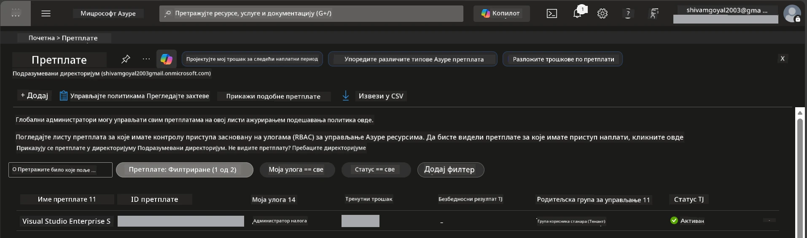

# Модул 0 - Претпоставке

Пре него што започнете радионицу, потврдите да имате следеће алате, приступ и окружење спремно. Пратите сваки корак испод - не прескачите напред.

---

## 1. Azure налог и претплата

### 1.1 Направите или потврдите вашу Azure претплату

1. Отворите прегледач и идите на [https://azure.microsoft.com/free/](https://azure.microsoft.com/free/).
2. Ако немате Azure налог, кликните **Start free** и пратите ток пријаве. Биће вам потребан Microsoft налог (или га направите) и кредитна картица за верификацију идентитета.
3. Ако већ имате налог, пријавите се на [https://portal.azure.com](https://portal.azure.com).
4. У Порталу кликните на плочу **Subscriptions** у левом навигационом менију (или претражите „Subscriptions“ у горњој траци за претрагу).
5. Потврдите да видите бар једну **Active** претплату. Запишите **Subscription ID** - потребан ће вам бити касније.



### 1.2 Разумевање потребних RBAC улога

[Hosted Agent](https://learn.microsoft.com/azure/foundry/agents/concepts/hosted-agents) распоређивање захтева дозволе за **data action** које стандардне Azure `Owner` и `Contributor` улоге НЕ укључују. Биће вам потребна једна од ових [комбинација улога](https://learn.microsoft.com/azure/foundry/concepts/rbac-foundry#built-in-roles):

| Сценарио | Потребне улоге | Где их доделити |
|----------|---------------|----------------------|
| Креирање новог Foundry пројекта | **Azure AI Owner** на Foundry ресурсу | Foundry ресурс у Azure порталу |
| Распоређивање у постојећи пројекат (нови ресурси) | **Azure AI Owner** + **Contributor** на претплату | Претплата + Foundry ресурс |
| Распоређивање у у потпуности конфигурисан пројекат | **Reader** на налогу + **Azure AI User** на пројекту | Налог + Пројекат у Azure порталу |

> **Кључна поента:** Azure `Owner` и `Contributor` улоге покривају само *управљачке* дозволе (ARM операције). Потребан вам је [**Azure AI User**](https://learn.microsoft.com/azure/foundry/concepts/rbac-foundry#built-in-roles) (или виши) за *data actions* као што је `agents/write` што је неопходно за креирање и распоређивање агената. Ове улоге ћете додељивати у [Модул 2](02-create-foundry-project.md).

---

## 2. Инсталирајте локалне алате

Инсталирајте сваки алат испод. Након инсталације, проверите да ради тако што ћете покренути команду за проверу.

### 2.1 Visual Studio Code

1. Идите на [https://code.visualstudio.com/](https://code.visualstudio.com/).
2. Преузмите инсталациони пакет за ваш оперативни систем (Windows/macOS/Linux).
3. Покрените инсталацију са подразумеваним подешавањима.
4. Отворите VS Code да потврдите да се покреће.

### 2.2 Python 3.10+

1. Идите на [https://www.python.org/downloads/](https://www.python.org/downloads/).
2. Преузмите Python 3.10 или новију верзију (препоручује се 3.12+).
3. **Windows:** Током инсталације, обавезно означите опцију **"Add Python to PATH"** на првом екрану.
4. Отворите терминал и проверите:

   ```powershell
   python --version
   ```

   Очекује се излаз: `Python 3.10.x` или новији.

### 2.3 Azure CLI

1. Идите на [https://learn.microsoft.com/cli/azure/install-azure-cli](https://learn.microsoft.com/cli/azure/install-azure-cli).
2. Пратите упутства за инсталацију за ваш оперативни систем.
3. Потврдите:

   ```powershell
   az --version
   ```

   Очекује: `azure-cli 2.80.0` или новији.

4. Пријавите се:

   ```powershell
   az login
   ```

### 2.4 Azure Developer CLI (azd)

1. Идите на [https://learn.microsoft.com/azure/developer/azure-developer-cli/install-azd](https://learn.microsoft.com/azure/developer/azure-developer-cli/install-azd).
2. Пратите упутства за инсталацију за ваш ОС. На Windows-у:

   ```powershell
   winget install microsoft.azd
   ```

3. Потврдите:

   ```powershell
   azd version
   ```

   Очекује: `azd version 1.x.x` или новији.

4. Пријавите се:

   ```powershell
   azd auth login
   ```

### 2.5 Docker Desktop (опционо)

Docker је потребан само ако желите да израдите и тестирате контејнер слику локално пре распоређивања. Проширење Foundry аутоматски обавља израду контејнера током распоређивања.

1. Идите на [https://docs.docker.com/get-docker/](https://docs.docker.com/get-docker/).
2. Преузмите и инсталирајте Docker Desktop за ваш ОС.
3. **Windows:** Проверите да је WSL 2 backend изабран током инсталације.
4. Покрените Docker Desktop и сачекајте да икона у системској траци прикаже **"Docker Desktop is running"**.
5. Отворите терминал и проверите:

   ```powershell
   docker info
   ```

   Ово би требало да испише Docker системске информације без грешака. Ако видите `Cannot connect to the Docker daemon`, сачекајте још неколико секунди да се Docker потпуно покрене.

---

## 3. Инсталирајте VS Code екстензије

Потребне су вам три екстензије. Инсталирајте их **пре** почетка радионице.

### 3.1 Microsoft Foundry за VS Code

1. Отворите VS Code.
2. Притисните `Ctrl+Shift+X` за отварање панела екстензија.
3. У поље за претрагу укуцајте **"Microsoft Foundry"**.
4. Пронађите **Microsoft Foundry for Visual Studio Code** (издавач: Microsoft, ID: `TeamsDevApp.vscode-ai-foundry`).
5. Кликните **Install**.
6. Након инсталације, требало би да видите икону **Microsoft Foundry** у Activity Bar-у (лева бочна трака).

### 3.2 Foundry Toolkit

1. У панелу екстензија (`Ctrl+Shift+X`), претражите **"Foundry Toolkit"**.
2. Пронађите **Foundry Toolkit** (издавач: Microsoft, ID: `ms-windows-ai-studio.windows-ai-studio`).
3. Кликните **Install**.
4. Икона **Foundry Toolkit** требало би да се појави у Activity Bar-у.

### 3.3 Python

1. У панелу екстензија, претражите **"Python"**.
2. Пронађите **Python** (издавач: Microsoft, ID: `ms-python.python`).
3. Кликните **Install**.

---

## 4. Пријавите се у Azure из VS Code-а

[Microsoft Agent Framework](https://learn.microsoft.com/agent-framework/overview/) користи [`DefaultAzureCredential`](https://learn.microsoft.com/azure/developer/python/sdk/authentication/credential-chains#defaultazurecredential-overview) за аутентификацију. Потребно је да будете пријављени у Azure у VS Code-у.

### 4.1 Пријава преко VS Code-а

1. Погледајте у доњи леви угао VS Code-а и кликните на икону **Accounts** (силуета особе).
2. Кликните **Sign in to use Microsoft Foundry** (или **Sign in with Azure**).
3. Отвориће се прозор прегледача - пријавите се Azure налогом који има приступ вашој претплати.
4. Вратите се у VS Code. Требало би да видите име вашег налога у доњем левом углу.

### 4.2 (Опционо) Пријава преко Azure CLI

Ако сте инсталирали Azure CLI и преферирате аутентификацију преко командне линије:

```powershell
az login
```

Ово отвара прегледач за пријаву. Након пријаве, подесите тачну претплату:

```powershell
az account set --subscription "<your-subscription-id>"
```

Потврдите:

```powershell
az account show --query "{name:name, id:id, state:state}" --output table
```

Требало би да видите име претплате, ID и стање = `Enabled`.

### 4.3 (Алтернатива) Аутентификација сервисним налогом

За CI/CD или заједничка окружења, уместо тога подесите ове променљиве окружења:

```powershell
$env:AZURE_TENANT_ID = "<your-tenant-id>"
$env:AZURE_CLIENT_ID = "<your-client-id>"
$env:AZURE_CLIENT_SECRET = "<your-client-secret>"
```

---

## 5. Ограничења у прегледу

Пре наставка, имајте у виду следећа тренутна ограничења:

- [**Hosted Agents**](https://learn.microsoft.com/azure/foundry/agents/concepts/hosted-agents) су тренутно у **jавној претпрегледној фази** - нису препоручени за продукцијске радне задатке.
- **Подржани региони су ограничени** - проверите [доступност региона](https://learn.microsoft.com/azure/foundry/agents/concepts/hosted-agents#region-availability) пре креирања ресурса. Ако изаберете регион који није подржан, распоређивање ће пропасти.
- Пакет `azure-ai-agentserver-agentframework` је претпромоција (`1.0.0b16`) - API може да се мења.
- Ограничења скалирања: hosted агенти подржавају 0-5 реплика (укључујући скалирање на нулу).

---

## 6. Прегледна листа за припрему

Прођите кроз сваки појединачни корак испод. Ако неки корак не успе, враћате се и исправите пре него што наставите.

- [ ] VS Code се отвара без грешака
- [ ] Python 3.10+ је у вашем PATH-у (`python --version` исписује `3.10.x` или новији)
- [ ] Azure CLI је инсталиран (`az --version` исписује `2.80.0` или новији)
- [ ] Azure Developer CLI је инсталиран (`azd version` исписује информације о верзији)
- [ ] Microsoft Foundry екстензија је инсталирана (икона видљива у Activity Bar-у)
- [ ] Foundry Toolkit екстензија је инсталирана (икона видљива у Activity Bar-у)
- [ ] Python екстензија је инсталирана
- [ ] Пријављени сте у Azure у VS Code-у (проверите икону Accounts у доњем левом углу)
- [ ] `az account show` враћа вашу претплату
- [ ] (Опционо) Docker Desktop ради (`docker info` враћа системске информације без грешака)

### Контролна тачка

Отворите Activity Bar у VS Code-у и потврдите да можете видети и **Foundry Toolkit** и **Microsoft Foundry** бочне траке. Кликните на сваку да потврдите да се успешно учитавају без грешака.

---

**Следеће:** [01 - Инсталирајте Foundry Toolkit и Foundry екстензију →](01-install-foundry-toolkit.md)

---

<!-- CO-OP TRANSLATOR DISCLAIMER START -->
**Искључење одговорности**:  
Овај документ је преведен уз помоћ АИ услуге превођења [Co-op Translator](https://github.com/Azure/co-op-translator). Иако тежимо ка тачности, имајте у виду да аутоматски преводи могу садржати грешке или нетачности. Изворни документ на његовом матерњем језику треба сматрати ауторитетом. За критичне информације препоручује се професионални људски превод. Нисмо одговорни за било каква неспоразума или погрешна тумачења настала употребом овог превода.
<!-- CO-OP TRANSLATOR DISCLAIMER END -->