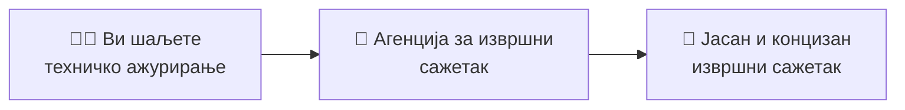

# Модул 0 - Увод

⏱️ ~10 мин

> [!WARNING]
> **Преглед и ограничења:** [Хостовани агенти](https://learn.microsoft.com/azure/foundry/agents/concepts/hosted-agents) су тренутно у фази **јавног прегледа** - није препоручено за производне радне оптерећења. Имајте у виду следеће:
> - **Подржане регије су ограничене** - провера [доступности региона](https://learn.microsoft.com/azure/foundry/agents/concepts/hosted-agents#region-availability) пре креирања ресурса. Уколико изаберете регију која није подржана, распоређивање ће пропасти.
> - Пакет `azure-ai-agentserver-agentframework` је пре-издање - API-ји се могу мењати између верзија.
> - Ограничења скалирања: хостовани агенти подржавају 0–5 реплика (укључујући скалирање на нулу).
> - Неке функције приказане у овој радионици могу се променити како услуга буде ишла ка генералној доступности (GA).

## Шта ћете изградити

У овој радионици ћете изградити агента **"Објасни као да сам извршни директор"** - хостованог AI агента који узима сложене техничке ажурирања и преписује их као једноставне извршне резимеа на енглеском језику.

```mermaid
flowchart LR
    A["🧑‍💻 Ви шаљете\nтехничко ажурирање"] --> B["🤖 Агенција за извршни\nсажетак"]
    B --> C["📝 Јасан и концизан\nизвршни сажетак"]
```

**Агент користи:**
- **Microsoft Agent Framework** - за логику и структуру агента
- **Foundry Toolkit за VS Code** - за изградњу основне структуре, локално тестирање и распоређивање
- **AI модел** (нпр. `gpt-4.1-mini/gpt-5-mini`) - за генерисање резимеа

До краја ове вежбе имаћете функционалног агента којег можете тестирати локално преко Agent Inspector-а, а опционално и распоредити у облак.

---

## Шта су хостовани агенти?

**Хостовани агент** је AI агент који ради као управљена услуга у Microsoft Foundry-у. Уместо да управљате својом инфраструктуром, упакујете код агента у контејнер, а Foundry се бави скалирањем, хостовањем и излагањем преко стандардног HTTP крајње тачке.

| Концепт | Значење |
|---------|-----------|
| **Агент** | Ваш Python код који прима поруку корисника, позива AI модел и враћа структуирани одговор |
| **Хостован** | Foundry покреће ваш контејнер уместо вас - нема ВМ-а, нема Кубернетес-а, нема управљања инфраструктуром |
| **Протокол одговора** | Стандардни HTTP API (`POST /responses`) који било који клијент може да користи за интеракцију са вашим агентом |
| **Agent Inspector** | Локални кориснички интерфејс за тестирање (укључен у Foundry Toolkit) који вам омогућава разговор са агентом пре распоређивања |

У овој радионици ћете прећи од нуле до потпуно хостованог агента - или се зауставити на локалном тестирању ако желите.

---

## Изаберите свој пут

> ⚠️ **Изаберите један пут пре наставка.** Ваш избор одређује које алате ћете инсталирати и који модули се односе на вас. Касније можете променити са пута Б → пут А ако добијете претплату.

<strong>🅰️ Пут А - Azure облак (захтева Azure претплату)</strong>

| | Детаљи |
|---|--------|
| **За кога је намењено?** | Имате активну Azure претплату и можете креирати Foundry ресурсе |
| **Модел** | Azure OpenAI преко Foundry (нпр. `gpt-4.1-mini/gpt-5-mini`) |
| **Обухваћени модули** | Сви модули (00–07) |
| **Распоређивање у облак?** | ✅ Да - потпуно крај-до-краја распоређивање |

<strong>🅱️ Пут Б - Локално / бесплатни слој (не треба Azure претплата)</strong>

| | Детаљи |
|---|--------|
| **За кога је намењено?** | MVP-ови, студенти или било ко без приступа Azure-у |
| **Модел** | **Foundry Local** (бесплатан, ради на вашем рачунару) |
| **Обухваћени модули** | Модули 00–04 (прескочити распоређивање и проверу у облаку) |
| **Распоређивање у облак?** | ❌ Не - само локално тестирање преко Agent Inspector-а |

---

## Сви путеви: Потребни алати

Инсталирајте сваки алат у наставку. После инсталације проверите да ли ради покретањем команде за проверу.

| # | Алат | Верзија | Инсталација | Провера (Очекујани излаз) |
|---|------|---------|-------------|----------------------------|
| 1 | **Visual Studio Code** | Најновија | [code.visualstudio.com](https://code.visualstudio.com/) | Отвара се без грешака |
| 2 | **Python** | 3.12 или новији | [python.org/downloads](https://www.python.org/downloads/) | `python --version` $\rightarrow$ `Python 3.12.x` |
| 3 | **Foundry Toolkit за VS Code** | Најновија | ИД екстензије: `ms-windows-ai-studio.windows-ai-studio` | Икона Foundry-а у Activity Baru |
| 4 | **Python екстензија за VS Code** | Најновија | ИД екстензије: `ms-python.python` | Инсталирана у панелу екстензија |

> [!TIP]
> **Професионални савети за инсталацију:**
> - **Python PATH (Windows):** Увек означите **"Add Python to PATH"** на првом екрану инсталације Python-а. Без овога, команда `python` неће бити препозната у вашем терминалу.
> - **Више верзија Python-а:** Ако имате и Python 3.10 и 3.12 инсталиране, користите `python3.12 -m venv .venv` да бисте осигурали коришћење исправне верзије за ваш виртуални енвиронмент.
> - **Docker WSL 2 (Windows):** Током инсталације Docker Desktop, уверите се да је одабран **WSL 2 backend**. Docker уз Hyper-V је спорији и може изазвати проблеме са израдама Foundry контејнера.
> - **Docker не почиње?** Сачекајте 30–60 секунди након покретања Docker Desktop-а. Покрените `docker info` - ако видите "Cannot connect to the Docker daemon," Docker се још увек покреће.
> - **VS Code екстензије се не учитавају?** Након инсталације екстензија, поново учитајте прозор: `Ctrl+Shift+P` → `Developer: Reload Window`.

> **Корисници Windows-а:** Обавезно означите **"Add Python to PATH"** током инсталације Python-а.

**Следеће:** [01 - Подешавање →](01-setup.md)

---

<!-- CO-OP TRANSLATOR DISCLAIMER START -->
**Изјава о одрицању одговорности**:
Овај документ је преведен коришћењем услуге за аутоматски превод [Co-op Translator](https://github.com/Azure/co-op-translator). Иако тежимо тачности, имајте у виду да аутоматски преводи могу садржати грешке или нетачности. Оригинални документ на његовом изворном језику треба сматрати ауторитативним извором. За критичне информације препоручује се професионални људски превод. Нисмо одговорни за било каква неспоразума или погрешна тумачења која произилазе из коришћења овог превода.
<!-- CO-OP TRANSLATOR DISCLAIMER END -->