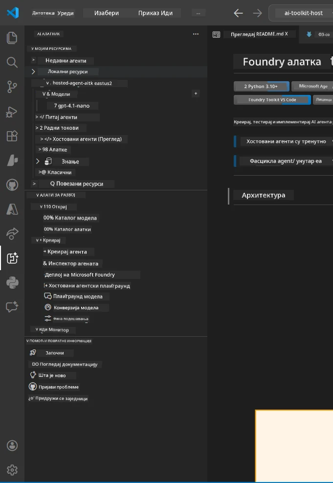
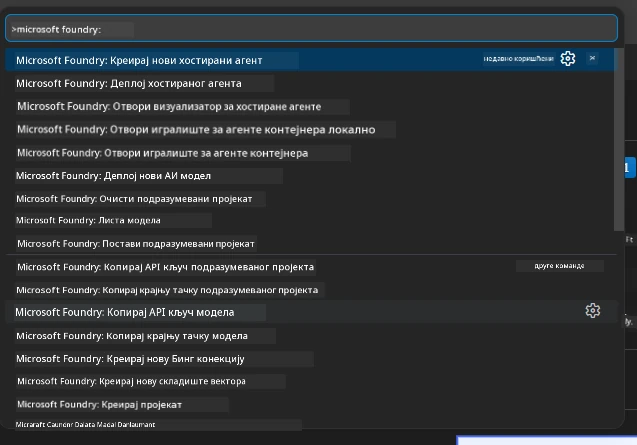

# Модул 1 - Инсталирајте Foundry Toolkit и Foundry проширење

Овај модул вас води кроз инсталирање и проверу два главна VS Code проширења за овај радионицу. Ако сте их већ инсталирали током [Модула 0](00-prerequisites.md), користите овај модул да проверите да ли исправно раде.

---

## Корак 1: Инсталирајте Microsoft Foundry проширење

Проширење **Microsoft Foundry за VS Code** је ваш главни алат за креирање Foundry пројеката, развијање модела, скелетирање хостованих агената и директно развијање из VS Code-а.

1. Отворите VS Code.
2. Притисните `Ctrl+Shift+X` да отворите панел **Extensions**.
3. У пољу за претрагу на врху укуцајте: **Microsoft Foundry**
4. Потражите резултат са насловом **Microsoft Foundry for Visual Studio Code**.
   - Издавач: **Microsoft**
   - Extension ID: `TeamsDevApp.vscode-ai-foundry`
5. Кликните на дугме **Install**.
6. Сачекајте да инсталација буде завршена (видећете мали индикатор напретка).
7. По инсталацији, погледајте у **Activity Bar** (вертикална икона на левој страни VS Code-а). Требало би да видите нову икону **Microsoft Foundry** (изгледа као дијамант/AI икона).
8. Кликните на икону **Microsoft Foundry** да отворите његов бочни приказ. Требало би да видите одељке за:
   - **Resources** (или Projects)
   - **Agents**
   - **Models**

> **Ако икона не појављује:** Покушајте да освежите VS Code (`Ctrl+Shift+P` → `Developer: Reload Window`).

---

## Корак 2: Инсталирајте Foundry Toolkit проширење

Проширење **Foundry Toolkit** пружа [**Agent Inspector**](https://learn.microsoft.com/azure/foundry/agents/how-to/vs-code-agents-workflow-pro-code) - визуелни интерфејс за тестирање и отклањање грешака агената локално - као и алате за playground, управљање моделима и евалуацију.

1. У панелу Extensions (`Ctrl+Shift+X`), очистите поље за претрагу и укуцајте: **Foundry Toolkit**
2. Пронађите **Foundry Toolkit** у резултатима.
   - Издавач: **Microsoft**
   - Extension ID: `ms-windows-ai-studio.windows-ai-studio`
3. Кликните на **Install**.
4. Након инсталације, икона **Foundry Toolkit** се појављује у Activity Bar (изгледа као икона робота/искрице).
5. Кликните на икону **Foundry Toolkit** да отворите његов бочни приказ. Требало би да видите поздравни екран Foundry Toolkit-а са опцијама за:
   - **Models**
   - **Playground**
   - **Agents**

---

## Корак 3: Потврдите да оба проширења раде

### 3.1 Потврда Microsoft Foundry проширења

1. Кликните на икону **Microsoft Foundry** у Activity Bar-у.
2. Ако сте пријављени у Azure (из Модула 0), требало би да видите ваше пројекте наведене под **Resources**.
3. Ако вас затраже пријаву, кликните **Sign in** и пратите аутентификациони ток.
4. Потврдите да можете видети бочни приказ без грешака.

### 3.2 Потврда Foundry Toolkit проширења

1. Кликните на икону **Foundry Toolkit** у Activity Bar-у.
2. Потврдите да се поздравни приказ или главни панел учитава без грешака.
3. Још увек не морате ништа конфигурисати - користићемо Agent Inspector у [Модул 5](05-test-locally.md).

### 3.3 Потврда преко Command Palette-а

1. Притисните `Ctrl+Shift+P` да отворите Command Palette.
2. Укуцајте **"Microsoft Foundry"** - требало би да видите команде као што су:
   - `Microsoft Foundry: Create a New Hosted Agent`
   - `Microsoft Foundry: Deploy Hosted Agent`
   - `Microsoft Foundry: Open Model Catalog`
3. Притисните `Escape` да затворите Command Palette.
4. Отворите поново Command Palette и укуцајте **"Foundry Toolkit"** - требало би да видите команде као што су:
   - `Foundry Toolkit: Open Agent Inspector`

> Ако не видите ове команде, могуће је да проширења нису правилно инсталирана. Покушајте да их деинсталирате и поново инсталирате.

---

## Шта ова проширења раде у овој радионици

| Проширење | Шта ради | Када ћете га користити |
|-----------|-----------|-----------------------|
| **Microsoft Foundry за VS Code** | Креирање Foundry пројеката, развијање модела, **скелетирање [хостованих агената](https://learn.microsoft.com/azure/foundry/agents/concepts/hosted-agents)** (аутоматски генерише `agent.yaml`, `main.py`, `Dockerfile`, `requirements.txt`), развијање на [Foundry Agent Service](https://learn.microsoft.com/azure/foundry/agents/overview) | Модули 2, 3, 6, 7 |
| **Foundry Toolkit** | Agent Inspector за локално тестирање/отклон грешака, playground UI, управљање моделима | Модули 5, 7 |

> **Foundry проширење је најважнији алат у овој радионици.** Обавља целокупан животни циклус: скелетирање → конфигурисање → развијање → потврда. Foundry Toolkit то допуњује пружајући визуелни Agent Inspector за локално тестирање.

---

### Контролна листа

- [ ] Икона Microsoft Foundry је видљива у Activity Bar-у
- [ ] Клик на њу отвара бочни приказ без грешака
- [ ] Икона Foundry Toolkit је видљива у Activity Bar-у
- [ ] Клик на њу отвара бочни приказ без грешака
- [ ] `Ctrl+Shift+P` → укуцавање "Microsoft Foundry" приказује доступне команде
- [ ] `Ctrl+Shift+P` → укуцавање "Foundry Toolkit" приказује доступне команде

---

**Претходно:** [00 - Предуслови](00-prerequisites.md) · **Следеће:** [02 - Креирајтe Foundry пројекат →](02-create-foundry-project.md)

---

<!-- CO-OP TRANSLATOR DISCLAIMER START -->
**Одрицање од одговорности**:  
Овај документ је преведен помоћу АИ услуге за превођење [Co-op Translator](https://github.com/Azure/co-op-translator). Иако настојимо да превод буде што прецизнији, молимо имајте у виду да аутоматски преводи могу да садрже грешке или нетачности. Оригинални документ на матичном језику треба сматрати ауторитетним извором. За критичне информације препоручује се професионални људски превод. Нисмо одговорни за било какве неспоразуме или погрешна тумачења настала коришћењем овог превода.
<!-- CO-OP TRANSLATOR DISCLAIMER END -->