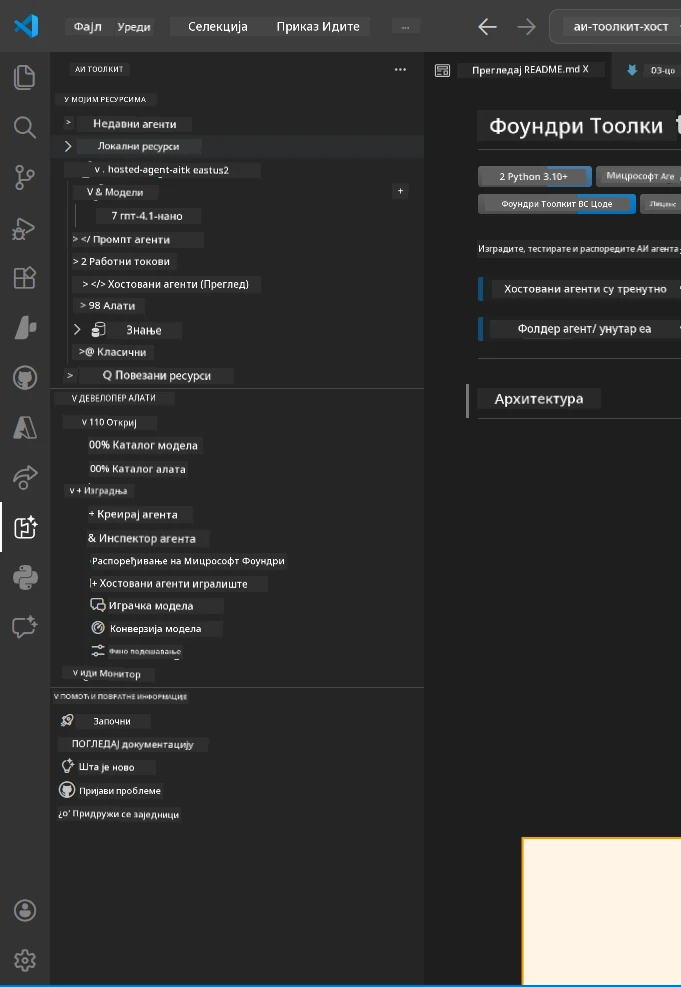
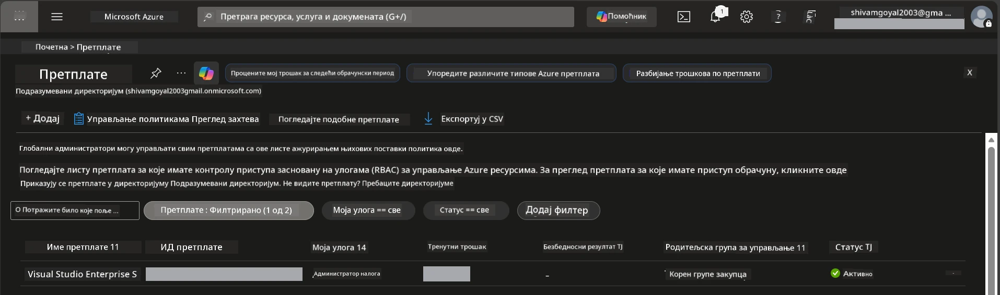
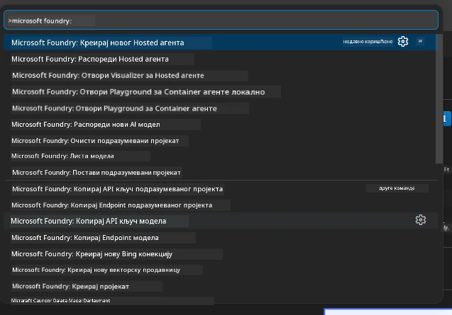
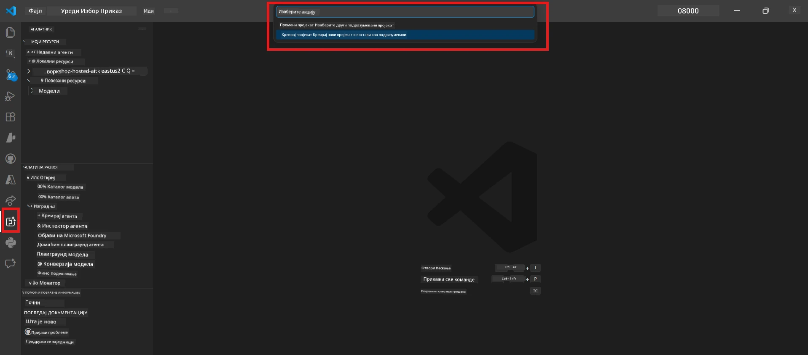
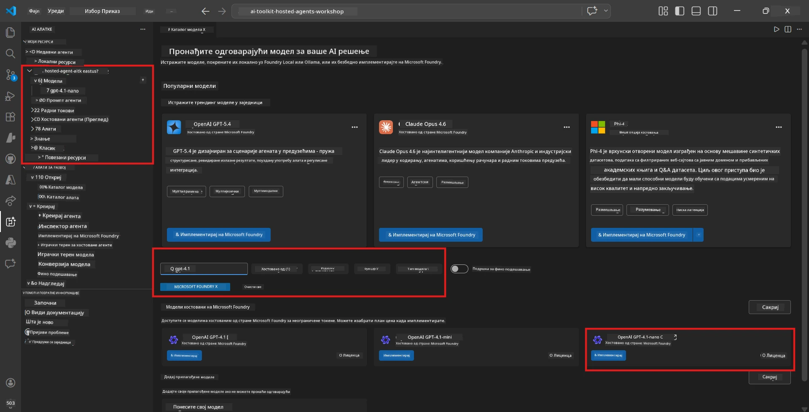
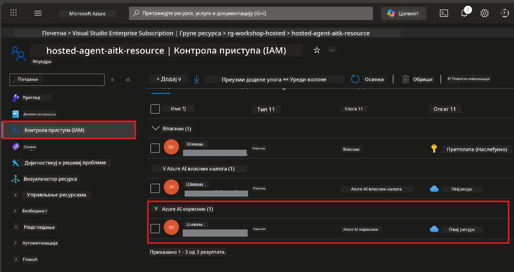

# Подешавање: Екстензија, Пројекат и Модел

⏱️ ~15 мин

У овом модулу инсталирате и проверите Foundry Toolkit екстензију, креирате (или се повезујете са) Foundry пројектом, и распоређујете модел који ће ваш агент користити.

## Корак 1: Инсталирање Foundry Toolkit-а

**Foundry Toolkit за VS Code** је главна екстензија за овај радионицу. Омогућава креирање пројеката, распореда модела, изградњу агената, локално тестирање (Agent Inspector) и распореда у облак - све из VS Code-а.

1. Отворите VS Code затим притисните `Ctrl+Shift+X` да отворите панел **Extensions**.
2. Претражите **Foundry Toolkit**.
3. Инсталирајте **Foundry Toolkit for VS Code** (Издавач: Microsoft, ID: `ms-windows-ai-studio.windows-ai-studio`).
4. Након инсталације, икона **Foundry Toolkit** се појављује у траци активности (лева бочна трака).

> *Напомена: Трака активности може приказивати "AI TOOLKIT" у старијим верзијама екстензије. Функционалност је идентична.*



## Корак 2: Подешавање у зависности од вашег приступа

> **Изаберите свој пут:** Проширите одељак у наставку који одговара вашем постављању. Потребно је да завршите само **један** пут.

<details>
<summary><strong>🅰️ Пут A - Azure облак (захтева Azure претплату)</strong></summary>

### Azure CLI

1. Инсталирајте са [learn.microsoft.com/cli/azure/install-azure-cli](https://learn.microsoft.com/cli/azure/install-azure-cli).
2. Проверите: `az --version` (очекује се 2.80.0+).
3. Пријавите се: `az login`

### Опције аутентификације

[Microsoft Agent Framework](https://learn.microsoft.com/agent-framework/overview/) користи [`DefaultAzureCredential`](https://learn.microsoft.com/azure/developer/python/sdk/authentication/credential-chains#defaultazurecredential-overview) који испитује више метода аутентификације по реду. Изаберите ону која одговара вашем окружењу:

#### Опција 1: Налози у VS Code (препоручено за радионице)
1. Кликните на икону **Accounts** (силуета особе) у доњем левом углу VS Code-а.
2. Изаберите **Sign in to use Microsoft Foundry** (или **Sign in with Azure**).
3. Отвориће се прегледач - пријавите се са Azure налогом који има приступ вашој претплати.
4. Вратите се у VS Code. Требало би да видите име свог налога у доњем левом углу.

#### Опција 2: Azure CLI
```bash
az login
az account set --subscription "<your-subscription-id>"
```

#### Опција 3: Service Principal (Enterprise/CI)
За ограничене енвиронменте или CI/CD цевоводе, подесите ове променљиве окружења у вашем `.env` фајлу:
```env
AZURE_TENANT_ID=<your-tenant-id>
AZURE_CLIENT_ID=<your-client-id>
AZURE_CLIENT_SECRET=<your-client-secret>
```

> **Како `DefaultAzureCredential` ради:** Прво испитује променљиве окружења, затим управљани идентитет, потом пријаву у VS Code, а потом Azure CLI - и користи прву која успе. Погледајте [документацију о линку акредитива](https://learn.microsoft.com/azure/developer/python/sdk/authentication/credential-chains#defaultazurecredential-overview).

### Azure Developer CLI (azd)

1. Инсталирајте: `winget install microsoft.azd` (Windows) или видите [документе за инсталацију](https://learn.microsoft.com/azure/developer/azure-developer-cli/install-azd).
2. Проверите: `azd version`
3. Пријавите се: `azd auth login`

### Docker Desktop (опционо)

Docker је потребан само ако желите локално да градите контејнере. Foundry екстензија аутоматски обрађује изградњу током распореда.

1. Инсталирајте са [docs.docker.com/get-docker](https://docs.docker.com/get-docker/).
2. Проверите: `docker info`

### Azure претплата и RBAC

1. Пријавите се на [portal.azure.com](https://portal.azure.com).
2. Идите на **Subscriptions** и потврдите да је бар једна претплата **Активна**.
3. Запишите свој **Subscription ID** - биће потребан у Модулу 01.



#### Табела сценарија RBAC

Распоређивање [Hosted Agent](https://learn.microsoft.com/azure/foundry/agents/concepts/hosted-agents) захтева дозволе за **data action** које стандардне Azure улоге `Owner` и `Contributor` не обухватају. Користите таблицу испод да одредите које улоге вам требају:

| Сценарио | Потребне улоге | Где их доделити |
|----------|---------------|----------------------|
| Креирање новог Foundry пројекта | **Azure AI Owner** на Foundry ресурсу | Foundry ресурс у Azure порталу |
| Распоређивање на постојећи пројекат (нови ресурси) | **Azure AI Owner** + **Contributor** на претплату | Претплата + Foundry ресурс |
| Распоређивање на потпуно конфигурисан пројекат | **Reader** на налогу + **Azure AI User** на пројекту | Налог + пројекат у Azure порталу |
| Само локално тестирање (без распореда) | **Azure AI User** на пројекту | Пројекат у Azure порталу |

> **Кључна поента:** Azure улоге `Owner` и `Contributor` покривају само *управљачке* дозволе (ARM операције). Потребан вам је [**Azure AI User**](https://learn.microsoft.com/azure/foundry/concepts/rbac-foundry#built-in-roles) (или виши) за *data actions* као што је `agents/write` који је неопходан за креирање и распоређивање агената.

## Повежите се или креирајте Foundry пројекат



1. Притисните `Ctrl+Shift+P` → укуцајте **Foundry Toolkit: Create Project** → изаберите ту опцију.
2. Изаберите своју **Azure претплату** из падајућег менија.
3. Изаберите или креирајте **resource group** (нпр. `rg-hosted-agents-workshop`).
4. Изаберите **регију** која подржава хостоване агенте: `East US`, `West US 2`, или `Sweden Central`. Погледајте [доступност регија](https://learn.microsoft.com/azure/foundry/agents/concepts/hosted-agents#region-availability).
5. Унесите име пројекта (нпр. `workshop-agents`).
6. Сачекајте 2–5 минута за провизију. У VS Code-у ће се појавити нотификација о напретку.
7. Када се заврши, ваш пројекат се појављује у бочној траци **Foundry Toolkit** у одељку **MY RESOURCES**.



## Распоредите модел и доделите RBAC

Ваш хостовани агент треба AI модел за генерисање одговора.

#### Матриса избора модела
У зависности од ваших потреба, можете изабрати између различитих нивоа модела:

| Модел | Најприкладније за | Цена | Напомене |
|-------|-----------------|------|----------|
| `gpt-4.1` | Одговори виског квалитета, суптилни | Више | Најбољи резултати, препоручено за финално тестирање |
| `gpt-4.1-mini/gpt-5-mini` | Брза итерација, ниже цене | Ниже | Добро за развој радионице и брзо тестирање |
| `gpt-4.1-nano` | Лагани задаци | Најниже | Најефтина варијанта, али одговори су једноставнији |

1. Притисните `Ctrl+Shift+P` → **Foundry Toolkit: Open Model Catalog** (или кликните на **Model Catalog** на бочној траци у одељку DEVELOPER TOOLS → Discover).
2. Претражите **gpt-4.1** у каталогу.
3. Пронађите **OpenAI GPT-4.1-mini** (или `gpt-5-mini` за бољи квалитет) и кликните **Deploy**.



4. У конфигурацији распореда:
   - **Име распореда:** Оставите подразумевано или унесите прилагођено име. **Запамтите ово име.**
   - **Циљ:** Изаберите **Deploy to Foundry Toolkit** → одаберите свој пројекат.
5. Кликните **Deploy** и сачекајте 1–3 минута.

> **Препорука:** За радионицу користите `gpt-4.1-mini/gpt-5-mini` - брзо, приступачно и даје добре резултате.

### Запишите своје вредности

Након распореда, запишите ове две вредности (потребне су вам у Модулу 03):

| Вредност | Где је пронаћи |
|---------|----------------|
| **Крајња тачка пројекта** | Кликните на свој пројекат у бочној траци → детаљни приказ показује URL (нпр. `https://<account>.services.ai.azure.com/api/projects/<project>`) |
| **Име распореда модела** | Проширите пројекат → **Models** → име поред вашег распореденог модела (нпр. `gpt-4.1-mini/gpt-5-mini`) |

### Додајте RBAC улогу

> ⚠️ **Ово је најчешће пропуштен корак.** Без исправне улоге, распоређивање у Модулу 05 ће пропасти.

#### Коју улогу ми треба?
У зависности од вашег сценарија, потребне су вам следеће комбинације улога:

| Сценарио | Потребне улоге | Где их доделити |
|----------|---------------|----------------------|
| Креирање новог Foundry пројекта | **Azure AI Owner** на Foundry ресурсу | Foundry ресурс у Azure порталу |
| Распоређивање на постојећи пројекат (нови ресурси) | **Azure AI Owner** + **Contributor** на претплату | Претплата + Foundry ресурс |
| Распоређивање на потпуно конфигурисан пројекат | **Reader** на налогу + **Azure AI User** на пројекту | Налог + пројекат у Azure порталу |

**Кључна поента:** Azure улоге `Owner` и `Contributor` покривају само *управљачке* дозволе. Потребан је **Azure AI User** (или виши) за *data actions* као што је `agents/write` кој је неопходан за креирање и распоређивање агената.

1. Отворите [portal.azure.com](https://portal.azure.com).
2. Претражите име свог **Foundry пројекта** → кликните резултат типа **"Foundry Toolkit project"** (НЕ матични налог).
3. Кликните **Access control (IAM)** у левој навигацији.
4. Кликните **+ Додај** → **Додај доделу улоге**.
5. **Табулатор улоге:** Претражите **Azure AI User**, изаберите га, кликните **Следеће**.
6. **Табулатор чланова:** Изаберите **Корисник, група или сервисни главни рачун** → кликните **+ Изаберите чланове** → пронађите и одаберите себе → кликните **Изабери**.
7. Кликните **Прегледај и додели** → поново **Прегледај и додели**.
8. **Сачекајте 1–2 минута** за пропагацију.

> **Зашто ова улога?** Azure `Owner`/`Contributor` дају само управљачке дозволе. Улога **Azure AI User** обезбеђује `agents/write` data action потребан за креирање и распореда агената. Погледајте [Foundry RBAC документацију](https://learn.microsoft.com/azure/foundry/concepts/rbac-foundry#built-in-roles).



</details>

<details>
<summary><strong>🅱️ Пут Б - Локално / бесплатни ниво (није потребна Azure претплата)</strong></summary>

### Foundry Local

Foundry Local вам омогућава да покрећете AI моделе на сопственом рачунару - није потребан рачун у облаку. Моделе из Foundry Local-а можете приступити користећи Foundry Toolkit преко каталога модела на следећи начин:

1. Идите у Foundry Toolkit екстензију.
2. У Foundry Toolkit навигацији идите у **Developer Tools** > и изаберите **Model Catalog**
3. У новом прозору одаберите **local** у навигационој траци.
4. Скролујте доле до **Phi 4 Mini,** и кликните на дугме **додај** појавиће се искачући прозор који указује да се модел преузима.
5. Када се модел преузме, можете наставити са следећим кораком.

</details>

### ✅ Контролна тачка


- [ ] `Ctrl+Shift+P` → "Foundry Toolkit" приказује доступне команде
- [ ] Foundry Toolkit екстензија инсталирана и бочна трака се учитава без грешака
- [ ] VS Code се отвара и ради исправно
- [ ] `python --version` приказује 3.10+
- [ ] Икона Foundry Toolkit видљива у траци активности VS Code-а
- [ ] **Пут A:** `az login` је успешан, претплата је активна
- [ ] **Пут Б:** Foundry Local ради (`foundry local status`)
- [ ] **Пут A:** Foundry пројекат видљив у бочној траци, модел распоређен, додељена улога Azure AI User
- [ ] **Пут Б:** Foundry Local ради са моделом
- [ ] Записали сте свој **endpoint** и **име распореда модела**


**Претходно:** [00 - Претходни услови](00-prerequisites.md) · **Следеће:** [02 - Креирање хостованог агента →](02-create-hosted-agent.md)

---

<!-- CO-OP TRANSLATOR DISCLAIMER START -->
**Изјава о одрицању одговорности**:
Овај документ је преведен коришћењем услуге за аутоматски превод [Co-op Translator](https://github.com/Azure/co-op-translator). Иако тежимо тачности, имајте у виду да аутоматски преводи могу садржати грешке или нетачности. Оригинални документ на његовом изворном језику треба сматрати ауторитативним извором. За критичне информације препоручује се професионални људски превод. Нисмо одговорни за било каква неспоразума или погрешна тумачења која произилазе из коришћења овог превода.
<!-- CO-OP TRANSLATOR DISCLAIMER END -->