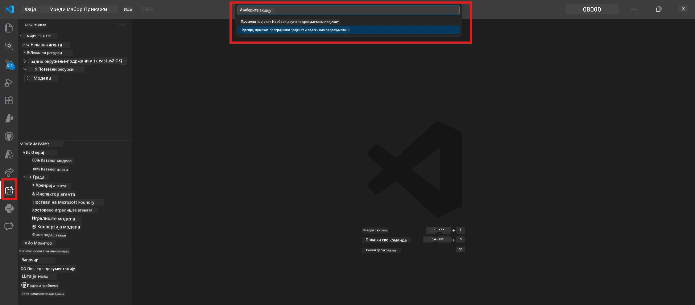
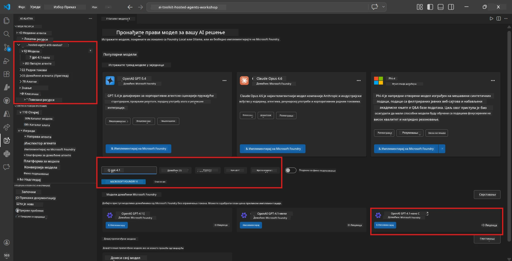
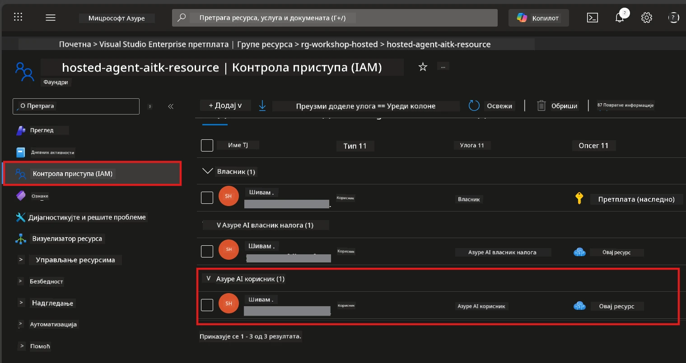

# Модул 2 - Направите Foundry пројекат и имплементирајте модел

У овом модулу, креирате (или одабирете) Microsoft Foundry пројекат и имплементирате модел који ће ваш агент користити. Сваком кораку је јасно описан - пратите их редом.

> Ако већ имате Foundry пројекат са имплементираним моделом, прескочите на [Модул 3](03-create-hosted-agent.md).

---

## Корак 1: Креирање Foundry пројекта из VS Code

Користићете Microsoft Foundry продужетак да креирате пројекат без напуштања VS Code-а.

1. Притисните `Ctrl+Shift+P` да бисте отворили **Command Palette**.
2. Упишите: **Microsoft Foundry: Create Project** и одаберите га.
3. Појавиће се падајући мени - одаберите вашу **Azure претплату** са листе.
4. Бићете упитани да одаберете или креирате **resource group**:
   - Да бисте креирали нову: унесите име (нпр. `rg-hosted-agents-workshop`) и притисните Enter.
   - Да бисте користили постојећу: одаберите је из падајућег менија.
5. Изаберите **регију**. **Важно:** Изаберите регију која подржава hosted агенте. Погледајте [доступност регија](https://learn.microsoft.com/azure/foundry/agents/concepts/hosted-agents#region-availability) - најчешћи избори су `East US`, `West US 2` или `Sweden Central`.
6. Унесите **име** за Foundry пројекат (нпр. `workshop-agents`).
7. Притисните Enter и сачекајте да провизионисање буде завршено.

> **Провизионисање траје 2-5 минута.** У доњем десном углу VS Code видећете нотификацију о напретку. Немојте затварати VS Code током провизионисања.

8. Када је завршено, бочни панел **Microsoft Foundry** ће показати ваш нови пројекат у одељку **Resources**.
9. Кликните на име пројекта да га проширите и уверите се да приказује секције као што су **Models + endpoints** и **Agents**.



### Алтернативно: Креирање преко Foundry портала

Ако више волите да користите претраживач:

1. Отворите [https://ai.azure.com](https://ai.azure.com) и пријавите се.
2. Кликните на **Create project** на почетној страници.
3. Унесите име пројекта, одаберите претплату, resource group и регију.
4. Кликните **Create** и сачекајте провизионисање.
5. Након креирања, вратите се у VS Code - пројекат би требао да се појави у Foundry бочном панелу након освежавања (кликните на иконицу за освежавање).

---

## Корак 2: Имплементирајте модел

Ваш [hosted агент](https://learn.microsoft.com/azure/foundry/agents/concepts/hosted-agents) треба Azure OpenAI модел за генерисање одговора. Сада ћете [имплементирати један](https://learn.microsoft.com/azure/ai-foundry/openai/how-to/create-resource#deploy-a-model).

1. Притисните `Ctrl+Shift+P` да отворите **Command Palette**.
2. Упишите: **Microsoft Foundry: Open [Model Catalog](https://learn.microsoft.com/azure/ai-foundry/openai/concepts/models)** и одаберите.
3. Приказ Model Catalog ће се отворити у VS Code-у. Прегледајте или користите траку за претрагу да бисте пронашли **gpt-4.1**.
4. Кликните на картицу модела **gpt-4.1** (или `gpt-4.1-mini` ако више волите мање трошкове).
5. Кликните **Deploy**.


6. У конфигурацији имплементације:
   - **Deployment name**: Оставите подразумевано (нпр. `gpt-4.1`) или унесите прилагођено име. **Запамтите ово име** - биће потребно у Модулу 4.
   - **Target**: Одаберите **Deploy to Microsoft Foundry** и изаберите пројекат који сте управо креирали.
7. Кликните **Deploy** и сачекајте да имплементација буде завршена (1-3 минута).

### Избор модела

| Модел | Најбоље за | Цена | Напомене |
|-------|------------|------|----------|
| `gpt-4.1` | Висококвалитетни, нијансирани одговори | Виша | Најбољи резултати, препоручен за коначна тестирања |
| `gpt-4.1-mini` | Брза итерација, нижи трошкови | Нижа | Добро за развој радионице и брзо тестирање |
| `gpt-4.1-nano` | Лаган посао | Најнижа | Најефтиније, али са једноставнијим одговорима |

> **Препорука за ову радионицу:** Користите `gpt-4.1-mini` за развој и тестирање. Брз је, јефтин и даје добре резултате за вежбе.

### Потврдите имплементацију модела

1. У бочној траци **Microsoft Foundry** проширите ваш пројекат.
2. Погледајте одељак **Models + endpoints** (или сличан).
3. Требало би да видите ваш имплементирани модел (нпр. `gpt-4.1-mini`) са статусом **Succeeded** или **Active**.
4. Кликните на имплементацију модела да видите детаље.
5. **Забележите** ове две вредности - биће вам потребне у Модулу 4:

   | Подешавање | Где га пронаћи | Пример вредности |
   |------------|----------------|------------------|
   | **Project endpoint** | Кликните на име пројекта у Foundry бочној траци. URL endpoint-а је приказан у приказу детаља. | `https://<account>.services.ai.azure.com/api/projects/<project>` |
   | **Model deployment name** | Име које је приказано поред имплементираног модела. | `gpt-4.1-mini` |

---

## Корак 3: Доделите потребне RBAC улоге

Ово је **најчешће пропуштени корак**. Без исправних улога, имплементација у Модулу 6 ће бити неуспешна због грешке у дозволама.

### 3.1 Доделите себи улогу Azure AI User

1. Отворите претраживач и идите на [https://portal.azure.com](https://portal.azure.com).
2. У врху за претрагу унесите име вашег **Foundry пројекта** и кликните на њега у резултатима.
   - **Важно:** Идите на ресурс **пројекта** (тип: "Microsoft Foundry project"), **не** на родитељски налог/ресурс хаба.
3. У левом менију пројекта, кликните на **Access control (IAM)**.
4. Кликните на дугме **+ Add** на врху → изаберите **Add role assignment**.
5. На картици **Role**, претражите и одаберите [**Azure AI User**](https://learn.microsoft.com/azure/foundry/concepts/rbac-foundry#built-in-roles). Кликните **Next**.
6. На картици **Members**:
   - Одаберите **User, group, or service principal**.
   - Кликните **+ Select members**.
   - Претражите своје име или имејл, изаберите себе и кликните **Select**.
7. Кликните **Review + assign** → затим поново **Review + assign** да потврдите.



### 3.2 (Опционо) Доделите улогу Azure AI Developer

Ако треба да креирате додатне ресурсе у оквиру пројекта или програмски управљате имплементацијама:

1. Поновите горе наведене кораке, али у кораку 5 изаберите **Azure AI Developer**.
2. Доделите ову улогу на нивоу **Foundry ресурса (аккаунта)**, а не само на нивоу пројекта.

### 3.3 Потврдите своје доделе улога

1. На страници **Access control (IAM)** пројекта, кликните на картицу **Role assignments**.
2. Потражите своје име.
3. Требало би да видите најмање улогу **Azure AI User** наведено за обухват пројекта.

> **Зашто је ово важно:** Улога [`Azure AI User`](https://learn.microsoft.com/azure/foundry/concepts/rbac-foundry#built-in-roles) омогућава `Microsoft.CognitiveServices/accounts/AIServices/agents/write` акцију над подацима. Без ње, видећете ову грешку током имплементације:
>
> ```
> Error: lacks the required data action 
> Microsoft.CognitiveServices/accounts/AIServices/agents/write 
> to perform POST /api/projects/{projectName}/assistants operation.
> ```
>
> Погледајте [Модул 8 - Решавање проблема](08-troubleshooting.md) за више детаља.

---

### Провера

- [ ] Foundry пројекат постоји и видљив је у Microsoft Foundry бочној траци у VS Code
- [ ] Бар један модел је имплементиран (нпр. `gpt-4.1-mini`) са статусом **Succeeded**
- [ ] Забележили сте URL **project endpoint-а** и име **model deployment-а**
- [ ] Имали сте додељену улогу **Azure AI User** на нивоу **пројекта** (потврдите у Azure порталу → IAM → Role assignments)
- [ ] Пројекат је у [подржаној регији](https://learn.microsoft.com/azure/foundry/agents/concepts/hosted-agents#region-availability) за hosted агенте

---

**Претходно:** [01 - Инсталирајте Foundry Toolkit](01-install-foundry-toolkit.md) · **Следеће:** [03 - Креирајте Hosted Агент →](03-create-hosted-agent.md)

---

<!-- CO-OP TRANSLATOR DISCLAIMER START -->
**Одрицање**:  
Овај документ је преведен коришћењем AI услуге за превод [Co-op Translator](https://github.com/Azure/co-op-translator). Иако тежимо прецизности, имајте у виду да аутоматски преводи могу садржати грешке или нетачности. Оригинални документ на његовом изворном језику треба сматрати ауторитетом. За критичне информације препоручује се професионални људски превод. Нисмо одговорни за било каква неспоразума или погрешна тумачења настала употребом овог превода.
<!-- CO-OP TRANSLATOR DISCLAIMER END -->