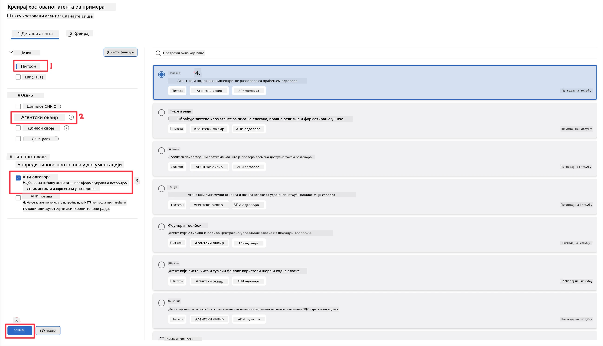
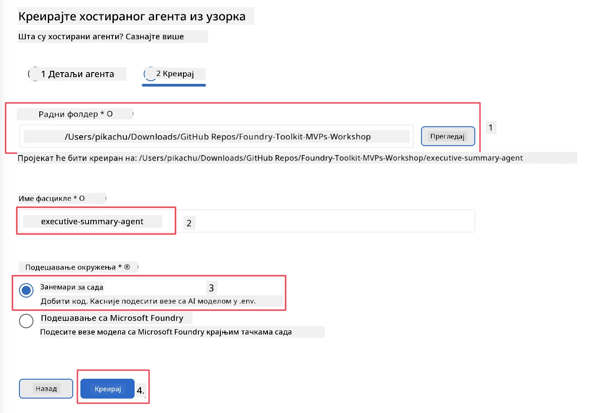

# Модул 2 - Креирање новог хостираног агента

⏱️ ~5 мин

У овом модулу користите Foundry Toolkit да **направите скелет пројекта хостираног агента**. Скелет генерише целу структуру пројекта - `agent.yaml`, `main.py`, `Dockerfile`, `requirements.txt` и конфигурацију за дебаговање у VS Code-у - како бисте могли да се фокусирате на прилагођавање понашања агента.

> **Кључни појам:** Фолдер `agent/` у овој лабораторији је пример онога што Foundry Toolkit генерише. Ви не пишете ове датотеке од нуле.

### Ток чаробњака за скелет

```mermaid
flowchart LR
    A["Command Palette:
    Create new Hosted Agent"] --> B["Language:
    Python"]
    B --> C["API type:
    Response API"]
    C --> D["Template:
    Basic - Agent Framework"]
    D --> E["Изабери модел"]
    E --> F["Workspace folder
    & agent name"]
    F --> G["Генерисани пројекат"]

    style A fill:#4A90D9,color:#fff
    style B fill:#7B68EE,color:#fff
    style C fill:#7B68EE,color:#fff
    style D fill:#7B68EE,color:#fff
    style E fill:#7B68EE,color:#fff
    style F fill:#7B68EE,color:#fff
    style G fill:#27AE60,color:#fff
```



---

## Корак 1: Отворите чаробњака за креирање хостираног агента

1. Притисните `Ctrl+Shift+P` да отворите **Командну палету**.
2. Упишите: **Foundry Toolkit: Create new Hosted Agent** и одаберите ту опцију.

> **Алтернативно: Креирање преко Foundry Портала**
> Ако више волите претраживач, можете креирати пројекат на [https://ai.azure.com](https://ai.azure.com). Када пројекат буде припремљен, вратите се у VS Code и користите Foundry Toolkit бочни панел да се повежете са њим.

> **Алтернативно:** Кликните икону **+** поред **Hosted Agents (Preview)** у Foundry Toolkit бочном панелу.

## Корак 2: Изаберите поставке



1. У левом делу навигације/опција изаберите следеће:

| Мену | Избор | Напомене |
|--------|-----------|-------|
| **Језик** | Python | Подржан је и C# |
| **Фрејмворк** | Agent Framework | Једноставна почетна тачка користећи Agent Framework SDK |
| **Тип API-ја** | Response API | `POST /responses` - разговорни, са платформски управљаном историјом |
| **Шаблон** | Basic | Једноставна почетна тачка користећи Agent Framework SDK |

2. Када изаберете, кликните на **Next**



3. У следећем прозору изаберите следеће:

| Мену | Избор | Напомене |
|--------|-----------|-------|
| **Фолдер радног простора** | Изаберите циљни фолдер | нпр. `/workspace/Foundry_Toolkit_for_VSCode_Lab/` или подфолдер у овом репозиторијуму |
| **Име агента** | Унесите назив | нпр. `executive-summary-agent` |
| **Подешавање окружења** | за сада прескочите подешавање |  |

Кликните **create** да направите агента. Биће креиран нови фолдер са именом хостираног агента.

## Корак 3: Прегледајте генерисани пројекат

Након завршетка скелетирања, проверите да ли видите ове фајлове у Експлореру (`Ctrl+Shift+E`):

```
📂 my-agent/
├── .env                ← Environment variables (placeholders)
├── .vscode/
│   ├── launch.json     ← Debug config (F5 → run + Agent Inspector)
│   └── tasks.json      ← VS Code task definitions
├── agent.yaml          ← Agent definition (kind: hosted)
├── Dockerfile          ← Container config for deployment
├── main.py             ← Agent entry point (your main code)
└── requirements.txt    ← Python dependencies
```

### Објашњење кључних датотека

| Датотека | Намена |
|------|---------|
| `agent.yaml` | Декларише агента као `kind: hosted`, пресликава променљиве окружења, дефинише протокол `/responses` |
| `main.py` | Креира `FoundryChatClient` → умотава га у `Agent` са инструкцијама → сервира преко `ResponsesHostServer` на порту 8088 |
| `Dockerfile` | Користи `python:3.12-slim`, инсталира зависности, отвара порт 8088, покреће `main.py` |
| `requirements.txt` | `agent-framework-foundry`, `agent-framework-foundry-hosting`, `mcp`, `debugpy` |

> **Важно:** Отворите директно скелетирани фолдер агента у VS Code-у (сам `agent/` фолдер) како би `.vscode/launch.json` и `tasks.json` правилно радили приликом дебаговања притиском на F5.

---

### ✅ Контролна тачка

- [ ] Креиран скелет пројекта са свим очекиваним датотекама
- [ ] У `agent.yaml` стоји `kind: hosted` и `protocol: responses`
- [ ] У `main.py` се увозе `Agent`, `FoundryChatClient`, `ResponsesHostServer`
- [ ] Фолдер агента је отворен у VS Code-у као корен радног простора

---

**Претходно:** [01 - Постављање](01-setup.md) · **Следеће:** [03 - Конфигурисање и кодирање →](03-configure-and-code.md)

---

<!-- CO-OP TRANSLATOR DISCLAIMER START -->
**Изјава о одрицању одговорности**:
Овај документ је преведен коришћењем услуге за аутоматски превод [Co-op Translator](https://github.com/Azure/co-op-translator). Иако тежимо тачности, имајте у виду да аутоматски преводи могу садржати грешке или нетачности. Оригинални документ на његовом изворном језику треба сматрати ауторитативним извором. За критичне информације препоручује се професионални људски превод. Нисмо одговорни за било каква неспоразума или погрешна тумачења која произилазе из коришћења овог превода.
<!-- CO-OP TRANSLATOR DISCLAIMER END -->