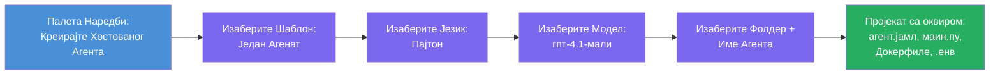

# Модул 3 - Креирање новог хостованог агента (аутоматски скелетирано помоћу Foundry екстензије)

У овом модулу користите Microsoft Foundry екстензију да **скелетирају нови пројекат [хостованог агента](https://learn.microsoft.com/azure/foundry/agents/concepts/hosted-agents)**. Екстензија генерише целу структуру пројекта за вас - укључујући `agent.yaml`, `main.py`, `Dockerfile`, `requirements.txt`, `.env` фајл и VS Code конфигурацију за дебаговање. Након скеле, прилагођавате ове фајлове вашим агенатским упутствима, алатима и конфигурацијом.

> **Кључни концепт:** Фолдер `agent/` у овом лабораторијском задатку је пример онога што Foundry екстензија генерише када покренете ову scaffold команду. Ви не пишете ове фајлове од нуле - екстензија их креира, а затим их модификујете.

### Ток чаробњака за скеле


---

## Корак 1: Отворите чаробњак за креирање хостованог агента

1. Притисните `Ctrl+Shift+P` да отворите **Командну палету**.
2. Укуцајте: **Microsoft Foundry: Create a New Hosted Agent** и изаберите ту опцију.
3. Отвориће се чаробњак за креирање хостованог агента.

> **Алтернативни пут:** Овај чаробњак можете такође приступити из страничне траке Microsoft Foundry → кликните на иконицу **+** поред **Agents** или кликните десним тастером и изаберите **Create New Hosted Agent**.

---

## Корак 2: Изаберите шаблон

Чаробњак ће вас питати да одаберете шаблон. Видећете опције као што су:

| Шаблон | Опис | Када користити |
|--------|-------|----------------|
| **Single Agent** | Један агент са својим моделом, упутствима и опционим алатима | Овај воркшоп (Лаб 01) |
| **Multi-Agent Workflow** | Више агената који сарађују у низу | Лаб 02 |

1. Изаберите **Single Agent**.
2. Кликните на **Next** (или избор ће се наставити аутоматски).

---

## Корак 3: Изаберите програмски језик

1. Изаберите **Python** (препоручено за овај воркшоп).
2. Кликните на **Next**.

> **Подржан је и C#** ако више волите .NET. Структура скеле је слична (користи `Program.cs` уместо `main.py`).

---

## Корак 4: Изаберите ваш модел

1. Чаробњак приказује моделе које сте распортили у вашем Foundry пројекту (из Модула 2).
2. Изаберите модел који сте распоредили - нпр. **gpt-4.1-mini**.
3. Кликните **Next**.

> Ако не видите моделе, вратите се на [Модул 2](02-create-foundry-project.md) и прво распоредите један.

---

## Корак 5: Изаберите локацију фолдера и име агента

1. Отвориће се дијалог за избор фајла - изаберите **одредишни фолдер** у који ће пројекат бити креиран. За овај воркшоп:
   - Ако почињете од нуле: изаберите било који фолдер (нпр. `C:\Projects\my-agent`)
   - Ако радите у оквиру воркшоп репозиторијума: креирајте нови подпапку унутар `workshop/lab01-single-agent/agent/`
2. Унесите **име** хостованог агента (нпр. `executive-summary-agent` или `my-first-agent`).
3. Кликните **Create** (или притисните Enter).

---

## Корак 6: Сачекајте да се скеле заврши

1. VS Code ће отворити **нови прозор** са скелетираним пројектом.
2. Сачекајте неколико секунди да се пројекат потпуно учита.
3. Треба да видите следеће фајлове у панелу Explorer (`Ctrl+Shift+E`):

```
📂 my-first-agent/
├── .env                ← Environment variables (auto-generated with placeholders)
├── .vscode/
│   └── launch.json     ← Debug configuration (F5 to run + Agent Inspector)
├── agent.yaml          ← Agent definition (kind: hosted)
├── Dockerfile          ← Container configuration for deployment
├── main.py             ← Agent entry point (your main code file)
└── requirements.txt    ← Python dependencies
```

> **Ово је иста структура као и у фолдеру `agent/`** у овом лабу. Foundry екстензија аутоматски генерише ове фајлове - не морате их ручно правити.

> **Напомена из воркшопа:** У овом репозиторијуму воркшопа, `.vscode/` фолдер се налази у **корену радног простора** (није унутар сваког пројекта). Садржи заједничке `launch.json` и `tasks.json` са две конфигурације дебаговања - **"Lab01 - Single Agent"** и **"Lab02 - Multi-Agent"** - свака показује на одговарајући cwd одређеног лаба. Када притиснете F5, изаберите конфигурацију која одговара лабу на којем радите из падајућег менија.

---

## Корак 7: Разумите сваки генерисани фајл

Одвојите тренутак да прегледате сваки фајл који је чаробњак креирао. Разумевање је важно за Модул 4 (прилагођавање).

### 7.1 `agent.yaml` - Дефиниција агента

Отворите `agent.yaml`. Изгледа овако:

```yaml
# yaml-language-server: $schema=https://raw.githubusercontent.com/microsoft/AgentSchema/refs/heads/main/schemas/v1.0/ContainerAgent.yaml

kind: hosted
name: my-first-agent
description: >
  A hosted agent deployed to Microsoft Foundry Agent Service.
metadata:
  authors:
    - Microsoft
  tags:
    - Azure AI AgentServer
    - Microsoft Agent Framework
    - Hosted Agent
protocols:
  - protocol: responses
    version: v1
environment_variables:
  - name: AZURE_AI_PROJECT_ENDPOINT
    value: ${PROJECT_ENDPOINT}
  - name: AZURE_AI_MODEL_DEPLOYMENT_NAME
    value: ${MODEL_DEPLOYMENT_NAME}
dockerfile_path: Dockerfile
resources:
  cpu: '0.25'
  memory: 0.5Gi
```

**Кључна поља:**

| Поље | Сврха |
|-------|---------|
| `kind: hosted` | Означава да је ово хостован агент (базиран на контејнеру, распоређен на [Foundry Agent Service](https://learn.microsoft.com/azure/foundry/agents/overview)) |
| `protocols: responses v1` | Агент излаже OpenAI компатибилну HTTP крајњу тачку `/responses` |
| `environment_variables` | Мапира вредности из `.env` у променљиве окружења контејнера приликом деплоја |
| `dockerfile_path` | Показује на Dockerfile који се користи за прављење слике контејнера |
| `resources` | CPU и меморијско додељивање контејнеру (0.25 CPU, 0.5Gi меморије) |

### 7.2 `main.py` - Улазна тачка агента

Отворите `main.py`. Ово је главни Python фајл где живи логика вашег агента. Скеле укључује:

```python
from agent_framework.azure import AzureAIAgentClient
from azure.ai.agentserver.agentframework import from_agent_framework
from azure.identity.aio import DefaultAzureCredential
```

**Кључни увози:**

| Увоз | Сврха |
|--------|--------|
| `AzureAIAgentClient` | Повезује се са вашим Foundry пројектом и креира агенте преко `.as_agent()` |
| [`DefaultAzureCredential`](https://learn.microsoft.com/azure/developer/python/sdk/authentication/credential-chains#defaultazurecredential-overview) | Руководи аутентификацијом (Azure CLI, VS Code пријава, managed identity или сервисни principal) |
| `from_agent_framework` | Омогућава агент као HTTP сервер који излаже крајњу тачку `/responses` |

Главни ток је:
1. Креирање акредитива → креирање клијента → позив `.as_agent()` да добије агента (асинхрони контекст менаџер) → упаковање као сервер → покретање

### 7.3 `Dockerfile` - Слика контејнера

```dockerfile
FROM python:3.14-slim

WORKDIR /app

COPY ./ .

RUN pip install --upgrade pip && \
    if [ -f requirements.txt ]; then \
        pip install -r requirements.txt; \
    else \
        echo "No requirements.txt found" >&2; exit 1; \
    fi

EXPOSE 8088

CMD ["python", "main.py"]
```

**Кључни детаљи:**
- Користи слику `python:3.14-slim` као основну.
- Копира све фајлове пројекта у `/app`.
- Надограђује `pip`, инсталира зависности из `requirements.txt`, и хитно пропада ако тај фајл недостаје.
- **Отвара порт 8088** - ово је обавезни порт за хостоване агенте. Не мењајте га.
- Покреће агента са `python main.py`.

### 7.4 `requirements.txt` - Зависности

```
agent-framework-azure-ai==1.0.0rc3
agent-framework-core==1.0.0rc3
azure-ai-agentserver-agentframework==1.0.0b16
azure-ai-agentserver-core==1.0.0b16
debugpy
agent-dev-cli
```

| Пакет | Сврха |
|---------|---------|
| `agent-framework-azure-ai` | Интеграција Azure AI за Microsoft Agent Framework |
| `agent-framework-core` | Основно време извршења за креирање агената (укључује `python-dotenv`) |
| `azure-ai-agentserver-agentframework` | Рунтајм сервера хостованог агента за Foundry Agent Service |
| `azure-ai-agentserver-core` | Основне апстракције сервера агента |
| `debugpy` | Подршка за дебаговање Python-а (омогућава F5 дебаговање у VS Code) |
| `agent-dev-cli` | Локални CLI за развој и тестирање агената (користи се у дебаг/рун конфигурацији) |

---

## Разумевање протокола агента

Хостовани агенти комуницирају преко **OpenAI Responses API** протокола. Док раде (локално или у облаку), агент излаже једну HTTP крајњу тачку:

```
POST http://localhost:8088/responses
Content-Type: application/json

{
  "input": "Your prompt here",
  "stream": false
}
```

Foundry Agent Service позива ову крајњу тачку да пошаље корисничке упите и прими одговоре агента. Ово је исти протокол који користи OpenAI API, тако да је ваш агент компатибилан са клијентима који говоре OpenAI Responses формат.

---

### Контролна листа

- [ ] Чаробњак за скеле је успешно завршен и отворен је **нови VS Code прозор**
- [ ] Видите свих 5 фајлова: `agent.yaml`, `main.py`, `Dockerfile`, `requirements.txt`, `.env`
- [ ] Постоји `launch.json` у `.vscode/` фолдеру (омогућава F5 дебаговање - у овом воркшопу налази се у корену радног простора са лаб-специфичним конфигурацијама)
- [ ] Прочитали сте сваки фајл и разумете његову сврху
- [ ] Разумете да је порт `8088` обавезан и да је `/responses` крајња тачка протокола

---

**Претходно:** [02 - Креирање Foundry пројекта](02-create-foundry-project.md) · **Следеће:** [04 - Конфигурисање и програмирање →](04-configure-and-code.md)

---

<!-- CO-OP TRANSLATOR DISCLAIMER START -->
**Изјава о одрицању од одговорности**:  
Овaј документ је преведен коришћењем AI услуге за превод [Co-op Translator](https://github.com/Azure/co-op-translator). Иако се трудимо да превод буде прецизан, имајте у виду да аутоматски преводи могу садржати грешке или нетачности. Изворни документ на његовом изворном језику треба сматрати званичним и ауторитетним извором. За критичне информације препоручује се професионални људски превод. Нисмо одговорни за било каква неспоразумевања или погрешна тумачења настала коришћењем овог превода.
<!-- CO-OP TRANSLATOR DISCLAIMER END -->