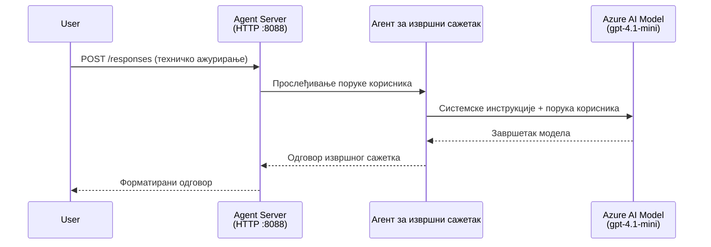
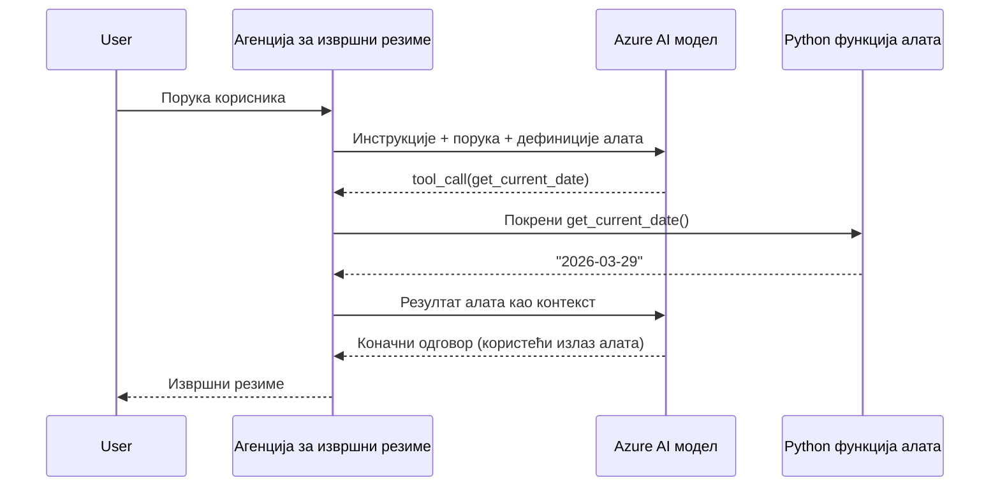

# Модул 4 - Конфигуришите упутства, окружење и инсталирајте зависности

У овом модулу прилагођавате аутоматски направљене агент датотеке из Модула 3. Овде трансформишете генераички скофолд у **вашег** агента – писањем упутстава, подешавањем променљивих окружења, по жељи додавањем алата и инсталирањем зависности.

> **Подсетник:** Foundry проширење је аутоматски генерисало ваше пројектне фајлове. Сада их мењате. Погледајте фолдер [`agent/`](../../../../../workshop/lab01-single-agent/agent) за комплетан радни пример прилагођеног агента.

---

## Како се саставни делови уклапају

### Животни циклус захтева (један агент)


> **Са алатима:** Ако агент има регистроване алате, модел може да врати позив алата уместо директног одговора. Фрејмворк извршава алат локално, прослеђује резултат назад моделу, а модел онда генерише коначни одговор.


---

## Корак 1: Конфигуришите променљиве окружења

Скофолд је креирао `.env` фајл са привременим вредностима. Потребно је да унесете праве вредности из Модула 2.

1. У свом скофолдираном пројекту отворите фајл **`.env`** (налази се у корену пројекта).
2. Замените привремене вредности стварним детаљима вашег Foundry пројекта:

   ```env
   PROJECT_ENDPOINT=https://<your-account>.services.ai.azure.com/api/projects/<your-project>
   MODEL_DEPLOYMENT_NAME=gpt-4.1-mini
   ```

3. Сачувајте фајл.

### Где пронаћи ове вредности

| Вредност | Како пронаћи |
|----------|--------------|
| **Пројектни ендпоинт** | Отворите **Microsoft Foundry** бочни панел у VS Code → кликните на свој пројекат → URL ендпоинта је приказан у детаљном прегледу. Изгледа као `https://<име-налога>.services.ai.azure.com/api/projects/<име-пројекта>` |
| **Име распореда модела** | У Foundry бочном панелу, проширите ваш пројекат → погледајте испод **Models + endpoints** → име се налази уз распоређени модел (нпр. `gpt-4.1-mini`) |

> **Безбедност:** Никада не комитујте `.env` фајл у контролу верзија. Он је већ подразумевано укључен у `.gitignore`. Ако није, додајте га:
> ```
> .env
> ```

### Како функционишу променљиве окружења

Ланац мапирања је: `.env` → `main.py` (читa преко `os.getenv`) → `agent.yaml` (мепира на променљиве окружења контејнера у време распоређивања).

У `main.py`, скофолд чита ове вредности овако:

```python
PROJECT_ENDPOINT = os.getenv("AZURE_AI_PROJECT_ENDPOINT") or os.getenv("PROJECT_ENDPOINT")
MODEL_DEPLOYMENT_NAME = os.getenv("AZURE_AI_MODEL_DEPLOYMENT_NAME", os.getenv("MODEL_DEPLOYMENT_NAME", "gpt-4.1-mini"))
```

Прихватају се оба: `AZURE_AI_PROJECT_ENDPOINT` и `PROJECT_ENDPOINT` (у `agent.yaml` се користи префикс `AZURE_AI_*`).

---

## Корак 2: Напишите упутства агента

Ово је најважнији корак прилагођавања. Упутства дефинишу личност вашег агента, понашање, формат излаза и безбедносне услове.

1. Отворите `main.py` у вашем пројекту.
2. Проналасите стринг са упутствима (скофолд укључује подразумевана/генеричка упутства).
3. Замените га детаљним, структурираним упутствима.

### Шта добра упутства укључују

| Компонента | Сврха | Пример |
|------------|-------|--------|
| **Улога** | Који је и шта ради агент | "Ви сте агент за извршне резимеe" |
| **Публика** | За кога су одговори намењени | "Виши лидери са ограниченим техничким знањем" |
| **Дефиниција уноса** | Какве захтеве обрађује | "Технички извештаји о инцидентима, оперативна ажурирања" |
| **Формат излаза** | Тачна структура одговора | "Извршни резиме: - Шта се догодило: ... - Утицај на пословање: ... - Следећи корак: ..." |
| **Правила** | Ограничавања и услови одбијања | "НЕ додајте информације ван онога што је пружено" |
| **Безбедност** | Превенција злоупотребе и халуцинација | "Ако је унос нејасан, тражите појашњење" |
| **Примери** | Парови уноса/излаза за усмеравање понашања | Обухваћати 2-3 примера са различитим уносима |

### Пример: Упутства агента за извршне резимее

Ево упутстава коришћених у радионичарском [`agent/main.py`](../../../../../workshop/lab01-single-agent/agent/main.py):

```python
AGENT_INSTRUCTIONS = """You are an "Explain Like I'm an Executive" agent.

Purpose:
Your job is to translate complex technical or operational information into
clear, concise, and outcome-focused summaries that can be easily understood
by non-technical executives.

Audience:
Senior leaders with limited technical background who care about impact,
risk, and what happens next.

What you must do:
- Rephrase the input so it is understandable to a non-technical audience
- Prioritize clarity, brevity, and outcomes over technical accuracy
- Remove technical jargon, logs, metrics, stack traces, and deep root-cause details
- Translate technical causes into simple cause-and-effect statements
- Explicitly call out business impact
- Always include a clear next step or action
- Maintain a neutral, factual, and calm executive tone
- Do NOT add new facts or speculate beyond the input

Standard Output Structure (always use this wording):

Executive Summary:
- What happened: <plain-language description>
- Business impact: <clear, non-technical impact>
- Next step: <clear action or mitigation>

Rules:
- Keep responses under 100 words
- Do NOT add facts beyond the input
- If input is unclear, ask for clarification
"""
```

4. Замените постојећи стринг упутстава у `main.py` својим прилагођеним упутствима.
5. Сачувајте фајл.

---

## Корак 3: (Опционално) Додајте прилагођене алате

Хостовани агенти могу извршавати **локалне Python функције** као [алате](https://learn.microsoft.com/azure/foundry/agents/concepts/tool-catalog). Ово је кључна предност агената базираних на коду у односу на оне који раде само са промптом – ваш агент може покретати произвољну серверску логику.

### 3.1 Дефинишите функцију алата

Додајте функцију алата у `main.py`:

```python
from agent_framework import tool

@tool
def get_current_date() -> str:
    """Returns the current date in YYYY-MM-DD format."""
    from datetime import date
    return str(date.today())
```

`@tool` декоратор претвара стандардну Python функцију у алат за агента. Докстринг постаје опис алата који модел види.

### 3.2 Региструјте алат са агентом

Када креирате агента преко `.as_agent()` контекст менаџера, проследите алат у параметру `tools`:

```python
async with AzureAIAgentClient(
    project_endpoint=PROJECT_ENDPOINT,
    model_deployment_name=MODEL_DEPLOYMENT_NAME,
    credential=credential,
).as_agent(
    name="my-agent",
    instructions=AGENT_INSTRUCTIONS,
    tools=[get_current_date],
) as agent:
    server = from_agent_framework(agent)
    await server.run_async()
```

### 3.3 Како функционишу позиви алата

1. Корисник шаље захтев.
2. Модел одлучује да ли је алат потребан (јерегледајући захтев, упутства и описе алата).
3. Ако је алат потребан, фрејмворк позива вашу Python функцију локално (у оквиру контејнера).
4. Вредност коју алат враћа шаље се назад моделу као контекст.
5. Модел генерише коначни одговор.

> **Алате извршава сервер** – покрећу се унутар вашег контејнера, не у корисничком прегледачу или моделу. То вам омогућава приступ базама података, API-јима, фајл системима или било којој Python библиотеци.

---

## Корак 4: Креирајте и активирајте виртуелно окружење

Пре инсталације зависности, креирајте изоловано Python окружење.

### 4.1 Креирајте виртуелно окружење

Отворите терминал у VS Code (`` Ctrl+` ``) и покрените:

```powershell
python -m venv .venv
```

Ово прави `.venv` фолдер у вашем пројектном директоријуму.

### 4.2 Активирајте виртуелно окружење

**PowerShell (Windows):**

```powershell
.\.venv\Scripts\Activate.ps1
```

**Command Prompt (Windows):**

```cmd
.venv\Scripts\activate.bat
```

**macOS/Linux (Bash):**

```bash
source .venv/bin/activate
```

Требало би да видите `(.venv)` на почетку терминалске линије, што указује да је виртуелно окружење активирано.

### 4.3 Инсталирајте зависности

У активном виртуелном окружењу, инсталирајте потребне пакете:

```powershell
pip install -r requirements.txt
```

Инсталира се:

| Пакет | Сврха |
|-------|--------|
| `agent-framework-azure-ai==1.0.0rc3` | Интеграција Azure AI за [Microsoft Agent Framework](https://learn.microsoft.com/agent-framework/overview/) |
| `agent-framework-core==1.0.0rc3` | Основно окружење за изградњу агената (укључује `python-dotenv`) |
| `azure-ai-agentserver-agentframework==1.0.0b16` | Рантам за хостовани агент сервер за [Foundry Agent Service](https://learn.microsoft.com/azure/foundry/agents/overview) |
| `azure-ai-agentserver-core==1.0.0b16` | Основне агенцијске серверске апстракције |
| `debugpy` | Питхон дебаговање (омогућава F5 дебаговање у VS Code) |
| `agent-dev-cli` | Локални CLI за развој и тестирање агената |

### 4.4 Проверите инсталацију

```powershell
pip list | Select-String "agent-framework|agentserver"
```

Очекује се излаз:
```
agent-framework-azure-ai   1.0.0rc3
agent-framework-core       1.0.0rc3
azure-ai-agentserver-agentframework 1.0.0b16
azure-ai-agentserver-core  1.0.0b16
```

---

## Корак 5: Потврдите аутентификацију

Агент користи [`DefaultAzureCredential`](https://learn.microsoft.com/azure/developer/python/sdk/authentication/credential-chains#defaultazurecredential-overview) који проба више метода аутентификације у овом редоследу:

1. **Променљиве окружења** – `AZURE_CLIENT_ID`, `AZURE_TENANT_ID`, `AZURE_CLIENT_SECRET` (сервисни налог)
2. **Azure CLI** – преузима вашу `az login` сесију
3. **VS Code** – користи налог са којим сте се пријавили у VS Code
4. **Управљани идентитет** – користи се када агент ради у Azure (у време распоређивања)

### 5.1 Проверите за локални развој

Нешто од овога треба да ради:

**Опција А: Azure CLI (препоручено)**

```powershell
az account show --query "{name:name, id:id}" --output table
```

Очекује се: Приказује име и ID ваше претплате.

**Опција Б: Пријава у VS Code**

1. Погледајте доле лево у VS Code за иконицу **Налози**.
2. Ако видите име вашег налога, аутентификовани сте.
3. Ако не, кликните на икону → **Пријавите се за коришћење Microsoft Foundry**.

**Опција Ц: Сервисни налог (за CI/CD)**

```powershell
$env:AZURE_TENANT_ID = "<your-tenant-id>"
$env:AZURE_CLIENT_ID = "<your-client-id>"
$env:AZURE_CLIENT_SECRET = "<your-client-secret>"
```

### 5.2 Чест проблем са аутентификацијом

Ако сте пријављени на више Azure налога, уверите се да је изabrана правилна претплата:

```powershell
az account set --subscription "<your-subscription-id>"
```

---

### Контролна листа

- [ ] `.env` фајл садржи важеће `PROJECT_ENDPOINT` и `MODEL_DEPLOYMENT_NAME` (не привремене вредности)
- [ ] Упутства агента су прилагођена у `main.py` – дефинишу улогу, публику, формат излаза, правила и безбедносне услове
- [ ] (Опционално) Прилагођени алати су дефинисани и регистровани
- [ ] Виртуелно окружење је креирано и активирано (`(.venv)` видљиво у терминалу)
- [ ] `pip install -r requirements.txt` је успешно завршен без грешака
- [ ] `pip list | Select-String "azure-ai-agentserver"` приказује да је пакет инсталиран
- [ ] Аутентификација је важећа – `az account show` враћа вашу претплату ИЛИ сте пријављени у VS Code

---

**Претходно:** [03 - Create Hosted Agent](03-create-hosted-agent.md) · **Следеће:** [05 - Test Locally →](05-test-locally.md)

---

<!-- CO-OP TRANSLATOR DISCLAIMER START -->
**Одрицање од одговорности**:  
Овaј документ је преведен помоћу AI преводилачке услуге [Co-op Translator](https://github.com/Azure/co-op-translator). Иако тежимо прецизности, молимо вас да имате на уму да аутоматизовани преводи могу садржати грешке или нетачности. Изворни документ на његовом оригиналном језику треба сматрати ауторитетом. За критичне информације препоручује се професионалан људски превод. Нисмо одговорни за било какве неспоразуме или погрешне тумачења која произилазе из коришћења овог превода.
<!-- CO-OP TRANSLATOR DISCLAIMER END -->