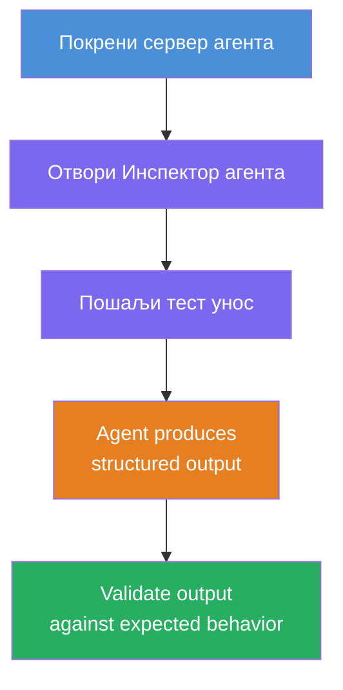
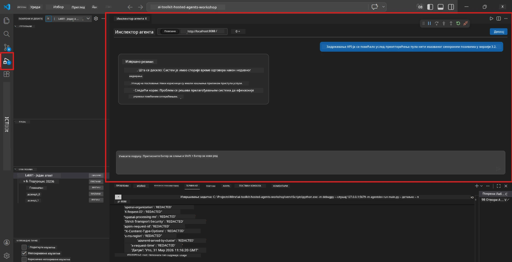
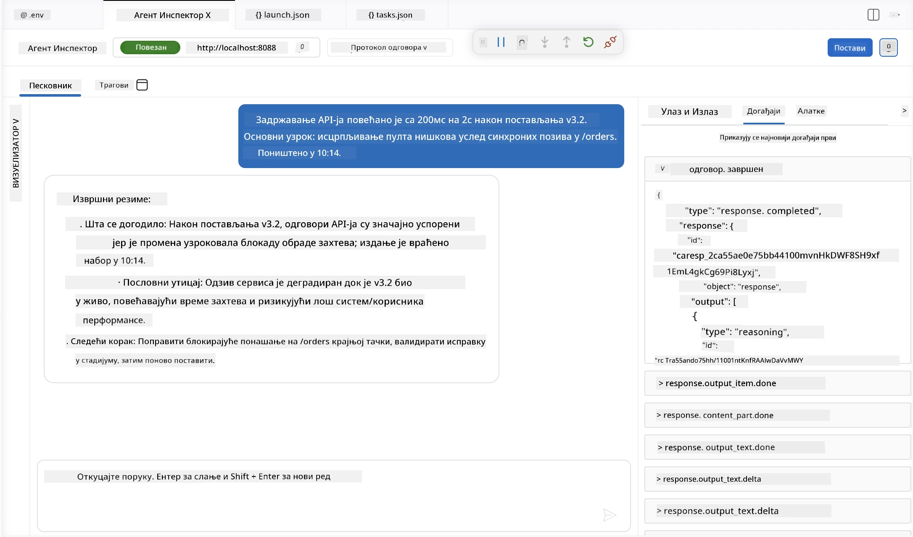

# Модул 4 - Тестирање Локално

⏱️ ~10 мин

У овом модулу покрећете свог агента локално и проверавате да ли ради исправно користећи **happy-path функционалне тестове**. Користићете Agent Inspector (визуелни кориснички интерфејс) или директне HTTP позиве да бисте потврдили да агент производи структуриране, тачне одговоре.

### Локални ток тестирања



---

## Опција 1: Притисните F5 - Дебаговање са Agent Inspector-ом (препоручено)

### Покрени дебагер

1. Отворите фасциклу **executive-summary-agent/** директно у VS Code-у (`File → Open Folder`).
2. Отворите панел **Run and Debug** (`Ctrl+Shift+D`).
3. Изаберите **Debug Local Agent Server** из падајућег менија.
4. Притисните **F5** (или кликните на ▶ Start Debugging).

> ⚠️ **Критично: Изаберите свој Python Interpreter**
> Ако добијете "ModuleNotFoundError" или дебагер не може да почне, морате рећи VS Code-у да користи ваш виртуелни енвиронмент:
  > 1. Притисните `Ctrl+Shift+P` $\rightarrow$ укуцајте **Python: Select Interpreter**.
  > 2. Изаберите интерпретер који се налази у `.venv` фасцикли вашег пројекта (нпр. `.\.venv\Scripts\python.exe` на Windows-у).
  > 3. Поново покрените дебаг сесију.
> Ако и даље добијате грешке, ручно ажурирајте свој фајл `tasks.json` на следећи начин:
  > 1. Идите у датотеку `.vscode/tasks.json`
  > 2. Пронађите команда под називом: `Run Agent/Workflow HTTP Server`
  > 3. Ажурирајте вредност команде овако: `"value": "${workspaceFolder}/.venv/bin/python",`

### Шта се дешава

1. HTTP сервер почиње на `http://localhost:8088/responses`.
2. Панел **Agent Inspector** се аутоматски отвори - визуелни интерфејс за тестирање чет-а.
3. Демаркатори за паузу (breakpoints) су омогућени у `main.py`.

Пратите Терминал за:
```
Starting executive summary hosted agent
Executive agent server running on http://localhost:8088
```

> **Ако се Agent Inspector не отвори:** Притисните `Ctrl+Shift+P` → **Foundry Toolkit: Open Agent Inspector**.



> *Снимак екрана можда приказује старији 'AI TOOLKIT' брендирање из раније верзије проширења.*

---

## Опција 2: Тест преко Терминала (алтернатива)

Покрените агента у једном терминалу, шаљите захтеве из другог:

```bash
# Терминал 1: Покрени агента
cd executive-summary-agent/
source .venv/bin/activate
python main.py
```

```bash
# Терминал 2: Пошаљи тест (curl)
curl -sS -X POST http://localhost:8088/responses \
  -H "Content-Type: application/json" \
  -d '{"input": "The API latency increased due to thread pool exhaustion caused by sync calls in v3.2.", "stream": false}'
```

---

## Тестови сценарија: Happy-path функционална валидација

Покрените **сва три** сценарија испод. Ово проверава да ваш агент производи исправан, структурирани излаз за реалистичне улазе.



### Сценарио 1: IT инцидент - скок латенције API-ја

**Улаз:**
```
The API latency increased from 200ms to 2s after deploying v3.2.
Root cause: thread pool starvation from synchronous calls in /orders.
Rolled back at 10:14.
```

**Очекивано понашање:**
- ✅ Праћење структуре "Executive Summary" (Шта се десило / Утицај на посао / Следећи корак)
- ✅ Без техничког жаргона (без "thread pool", без "/orders", без "v3.2")
- ✅ Јасно наводи утицај на посао (нпр. корисници су искусили кашњења)
- ✅ Укључује следећи корак (нпр. корекција је примењена, праћење је омогућено)

---

### Сценарио 2: Data Pipeline - неуспех ETL процеса

**Улаз:**
```
The nightly ETL job failed because the upstream schema changed. APAC dashboards show missing data.
```

**Очекивано понашање:**
- ✅ Сажеће неуспех освежавања података једноставним језиком
- ✅ Помиње утицај на APAC таблицу
- ✅ Укључује корак за исправку
- ✅ Не помиње "ETL", "schema" или друге техничке термине

---

### Сценарио 3: Безбедност - изложени акредитиви

**Улаз:**
```
Static analysis flagged a hardcoded secret in the repository.
The secret may have been exposed in commit history.
```

**Очекивано понашање:**
- ✅ Описује проблем са акредитивима/безбедношћу екзекјутиву пријатељским језиком
- ✅ Наводи потенцијални ризик (неовлашћени приступ)
- ✅ Наводи акцију за исправку (ротација акредитива, ревизија)
- ✅ Не укључује термине као што су "static analysis", "commit history" или "hardcoded"

---

## Критеријуми валидације

За сваки сценарио проверите:

| # | Критеријум | Услов проласка |
|---|-----------|---------------|
| 1 | **Структура** | Одговор користи "Executive Summary" формат са сва три ставке |
| 2 | **Једноставан језик** | Нема техничког жаргона који извршни не би разумео |
| 3 | **Тачност** | Сажеће одражава улаз - нема измишљених детаља |
| 4 | **Сажетост** | Одговор је мањи од 100 речи |
| 5 | **Следећи корак** | Јасно је наведена акција или мера ублажавања |

---

## Савети за дебаговање

| Проблем | Решење |
|--------|---------|
| Агент се не покреће | Проверите `.env` вредности, уверите се да је venv активиран, покрените `pip install -r requirements.txt` |
| Празан или општи одговор | Прегледајте упутства у `main.py` - обезбедите да је формат излаза назначен |
| Одговор садржи жаргон | Појачајте правила "уклони техничке термине" у упутствима |
| Agent Inspector се не отвори | `Ctrl+Shift+P` → **Foundry Toolkit: Open Agent Inspector** |
| Грешке модела у Терминалу | Уверите се да `AZURE_AI_MODEL_DEPLOYMENT_NAME` тачно одговара (велика и мала слова) |

---

### ✅ Контролна тачка

- [ ] Агент се покреће локално без грешака
- [ ] Agent Inspector се отвара и приказује интерфејс чет-а (ако користите F5)
- [ ] **Сценарио 1** (IT инцидент) - структурирани Executive Summary, без жаргона
- [ ] **Сценарио 2** (подаци у цевоводу) - релевантно сажеће са утицајем на посао
- [ ] **Сценарио 3** (безбедносни аларм) - одговарајућа комуникација ризика
- [ ] Сви одговори прате дефинисану структуру излаза

> **Сачувајте своје одговоре** (копирајте или направите снимак екрана) - упоредићете их са резултатима са облака у Модулу 06.

---

**Претходно:** [03 - Конфигуришите и кодирајте](03-configure-and-code.md) · **Следеће:** [05 - Деплоји у Foundry →](05-deploy-to-foundry.md)

---

<!-- CO-OP TRANSLATOR DISCLAIMER START -->
**Изјава о одрицању одговорности**:
Овај документ је преведен коришћењем услуге за аутоматски превод [Co-op Translator](https://github.com/Azure/co-op-translator). Иако тежимо тачности, имајте у виду да аутоматски преводи могу садржати грешке или нетачности. Оригинални документ на његовом изворном језику треба сматрати ауторитативним извором. За критичне информације препоручује се професионални људски превод. Нисмо одговорни за било каква неспоразума или погрешна тумачења која произилазе из коришћења овог превода.
<!-- CO-OP TRANSLATOR DISCLAIMER END -->