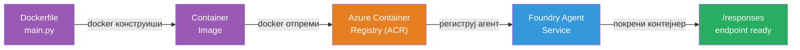
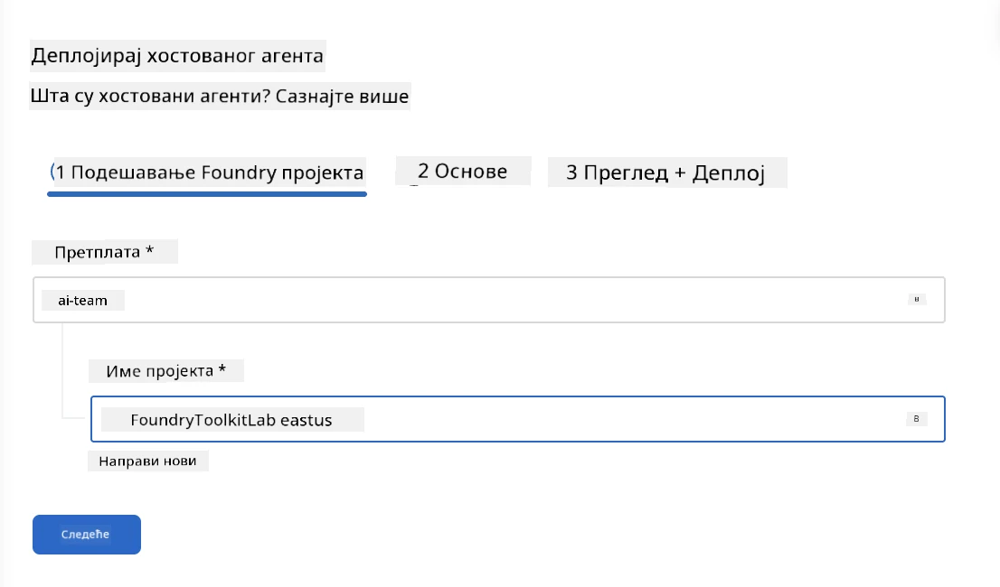
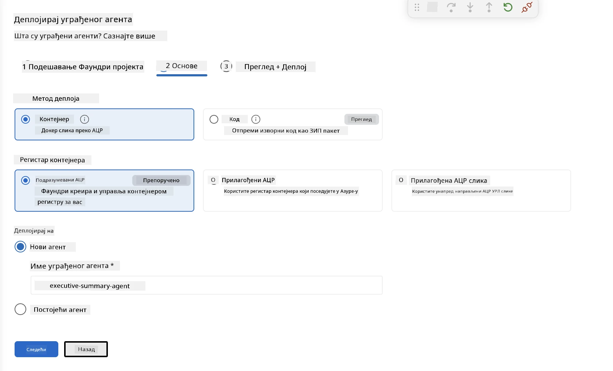
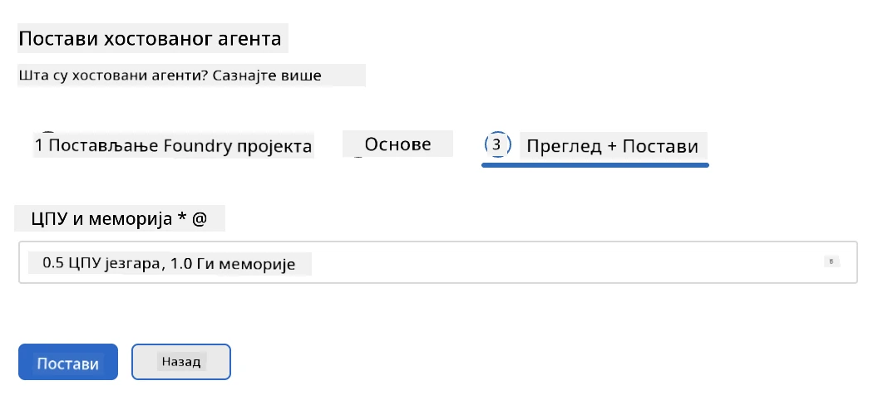
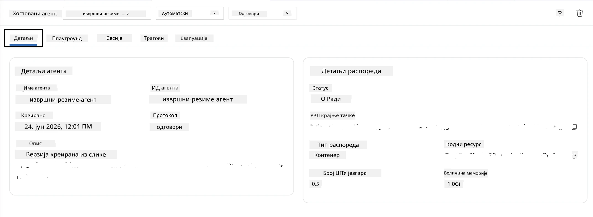

# Модул 5 - Деплоy на Foundry Agent Service

⏱️ ~10 мин

> ⚠️ **Корисници путање Б:** Овај модул захтева претплату на Foundry. Ако користите Foundry Local, прескочите на [Модул 07 - Резиме](07-summary.md). Успешно сте завршили локални развојни ток рада!

У овом модулу, деплоy-ујете ваш локално тестиран агент на Microsoft Foundry као **Домаћинског агента**. Деплоy прави слику контејнера, шаље је у Azure Container Registry и покреће агента у управљаној Foundry инфраструктури.

### Пијплајн деплоy-а

---

## Провера предуслова

Пре деплоy-а проверите:

- [ ] Агент пролази сва 3 локална сценарија из [Модула 04](04-test-locally.md)
- [ ] Имате **Azure AI User** улогу на нивоу пројекта ([Модул 01, Додела РБАЦ](01-setup.md#deploy-a-model--assign-rbac))
- [ ] Пријављени сте у Azure у VS Code-у (икона Рачуни приказује ваше име)

---

## Корак 1: Почните деплоy

### Опција А: Деплоy из Agent Inspector-а (препоручује се)

Ако је Agent Inspector отворен (са тестирања):
1. Кликните на дугме **Deploy** у горњем десном углу (икона облака ↑).

### Опција Б: Деплоy из Command Palette-а

1. Притисните `Ctrl+Shift+P` → **Foundry Toolkit: Deploy Hosted Agent**.

---

## Корак 2: Конфигуришите деплоy

Визард ће вас упитати за:

| Упит | Избор |
|--------|-----------|
| **Претплата** | Ваша Azure претплата |
| **Циљни пројекат** | Ваш Foundry пројекат (нпр. `workshop-agents`) |

Кликните **next** да конфигуришете вашег агента.

| Упит | Избор |
|--------|-----------|
| **Метод деплоy-а** | Контејнер |
| **Container registry** | **Подразумевани ACR** (Microsoft Foundry креира и управља једним за вас) |
| **Deploy to** | Нови агент (име, `executive-summary-agent`) |

Кликните **next** да прегледате и деплоy-ујете вашег агента.

| Упит | Избор |
|--------|-----------|
| **CPU и меморија** | **0.25 CPU језгара, 0.5 Gi меморије** (довољно за радионицу) |

---

## Корак 3: Деплоy и праћење

1. Кликните **Deploy**.
2. Пратите панел **Output** (изаберите **Microsoft Foundry** из падајућег менија).
3. Деплоy пролази кроз ове фазе:
   - **Docker build** - прави контејнер из вашег Dockerfile-а
   - **Docker push** - шаље слику у ACR (1–3 минута при првом деплоy-у)
   - **Регистрација агента** - креира домаћинског агента у Foundry-у
   - **Покретање контејнера** - покреће се са системски управљаним идентитетом

4. Када се заврши, појављује се обавештење:
   > **my-agent је успешно деплоy-ован.** `View logs` `Run agent`

5. Кликните **Run agent** да отворите Agent Playground.

### Вредности статуса деплоy-а

| Статус | Значење |
|--------|---------|
| **Running** | Контејнер спреман, агент одговара |
| **Pending** | Контејнер се покреће - сачекајте 30–60 секунди |
| **Failed** | Проверите логове (погледајте решавање проблема испод) |

---

## Уобичајене грешке при деплоy-у

| Грешка | Узрок | Поправка |
|-------|-----------|-----|
| `agents/write` дозвола одбијена | Недостаје **Azure AI User** улога на нивоу пројекта | [Модул 01, Додела РБАЦ](01-setup.md#deploy-a-model--assign-rbac) |
| Docker није покренут | Docker Desktop није покренут | Покрените Docker Desktop → проверите `docker info` |
| ACR ауторизација | Управљани идентитет не може да повуче слику | Погледајте [Модул 08 - Решавање проблема](08-troubleshooting.md) |

---

### ✅ Контролна тачка

- [ ] Деплоy завршен без грешака
- [ ] Агент се појављује под **Hosted Agents (Preview)** у Foundry бочној траци
- [ ] Статус контејнера показује **Running**
- [ ] Отворен је Agent Playground таб приказујући детаље агента и URL крајње тачке

---

**Претходно:** [04 - Тестирај локално](04-test-locally.md) · **Следеће:** [06 - Верификуј у Playground-у →](06-verify-in-playground.md)

---

<!-- CO-OP TRANSLATOR DISCLAIMER START -->
**Изјава о одрицању одговорности**:
Овај документ је преведен коришћењем услуге за аутоматски превод [Co-op Translator](https://github.com/Azure/co-op-translator). Иако тежимо тачности, имајте у виду да аутоматски преводи могу садржати грешке или нетачности. Оригинални документ на његовом изворном језику треба сматрати ауторитативним извором. За критичне информације препоручује се професионални људски превод. Нисмо одговорни за било каква неспоразума или погрешна тумачења која произилазе из коришћења овог превода.
<!-- CO-OP TRANSLATOR DISCLAIMER END -->