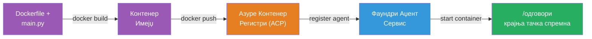
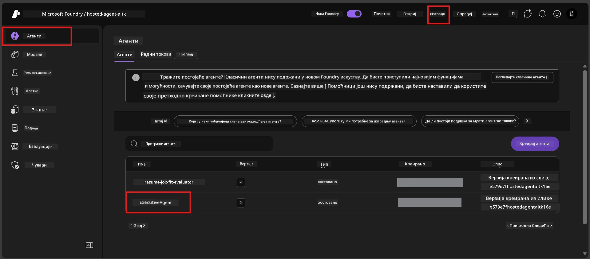

# Модул 6 - Деплој на Foundry Agent сервис

У овом модулу, деплојујете локално тестирани агент на Microsoft Foundry као [**Hosted Agent**](https://learn.microsoft.com/azure/foundry/agents/concepts/hosted-agents). Процес деплоја гради Docker контејнер слику из вашег пројекта, шаље је у [Azure Container Registry (ACR)](https://learn.microsoft.com/azure/container-registry/container-registry-intro) и креира хостовану верзију агента у [Foundry Agent Service](https://learn.microsoft.com/azure/foundry/agents/overview).

### Deployment pipeline


---

## Провера предуслова

Пре деплоја, проверите сваки од следећих ставова. Прескакање ових најчешћи је узрок неуспешних деплоя.

1. **Агент пролази локалне smoke тестове:**
   - Завршили сте сва четири теста у [Модул 5](05-test-locally.md) и агент је правилно реаговао.

2. **Имате улогу [Azure AI User](https://learn.microsoft.com/azure/foundry/concepts/rbac-foundry#built-in-roles):**
   - Ова улога је додељена у [Модул 2, корак 3](02-create-foundry-project.md). Ако нисте сигурни, проверите сада:
   - Azure портал → ваш Foundry **проект** ресурс → **Access control (IAM)** → таб **Role assignments** → претражите своје име → потврдите да је **Azure AI User** наведен.

3. **Пријављени сте у Azure преко VS Code:**
   - Проверите икону налога у доњем левом углу VS Code-а. Име вашег налога треба да буде видљиво.

4. **(Опционо) Docker Desktop ради:**
   - Docker је потребан само ако вас Foundry екстензија пита за локални build. У већини случајева екстензија аутоматски гради контејнере током деплоја.
   - Ако имате Docker инсталиран, проверите да ли ради: `docker info`

---

## Корак 1: Започните деплој

Постоје два начина деплоја — оба воде до истог резултата.

### Опција А: Deploy из Agent Inspectora (препоручено)

Ако покрећете агента са дебаггером (F5) и Agent Inspector је отворен:

1. Погледајте у **горњи десни угао** панела Agent Inspectora.
2. Кликните на дугме **Deploy** (икона облака са стрелицом нагоре ↑).
3. Отвориће се чаробњак за деплој.

### Опција Б: Deploy из Command Palette

1. Притисните `Ctrl+Shift+P` да отворите **Command Palette**.
2. Откуцајте: **Microsoft Foundry: Deploy Hosted Agent** и изаберите ту опцију.
3. Отвориће се чаробњак за деплој.

---

## Корак 2: Конфигуришите деплој

Чаробњак за деплој води вас кроз подешавања. Попуните сваки упит:

### 2.1 Изаберите циљни пројекат

1. Падајући мени приказује ваше Foundry пројекте.
2. Изаберите пројекат који сте креирали у Модулу 2 (нпр. `workshop-agents`).

### 2.2 Изаберите фајл за агент контејнер

1. Бићете упитани да изаберете почетну тачку агента.
2. Изаберите **`main.py`** (Python) - овај фајл чаробњак користи за идентификовање вашег агент пројекта.

### 2.3 Конфигуришите ресурсе

| Поставка | Препоручена вредност | Напомене |
|---------|------------------|-------|
| **CPU** | `0.25` | Подразумевано, довољно за радионицу. Повећајте за продукционе радне оптерећења |
| **Memory** | `0.5Gi` | Подразумевано, довољно за радионицу |

Ово одговара вредностима у `agent.yaml`. Можете прихватити подразумеване.

---

## Корак 3: Потврдите и деплојујте

1. Чаробњак приказује резиме деплоја са:
   - Име циљног пројекта
   - Име агента (из `agent.yaml`)
   - Фајл контејнера и ресурсе
2. Прегледајте резиме и кликните на **Confirm and Deploy** (или **Deploy**).
3. Пратите напредак у VS Code-у.

### Шта се дешава током деплоја (крок по крок)

Деплој је процес у више корака. Пратите VS Code **Output** панел (изаберите „Microsoft Foundry“ из падајућег менија):

1. **Docker build** - VS Code гради Docker слику из `Dockerfile`-а. Видећете Docker поруке о слојевима:
   ```
   Step 1/6 : FROM python:<version>-slim
   Step 2/6 : WORKDIR /app
   ...
   Successfully built abc123def456
   ```

2. **Docker push** - Слика се шаље у **Azure Container Registry (ACR)** повезан са вашим Foundry пројектом. Ово може трајати 1-3 минута при првом деплоју (основна слика је >100MB).

3. **Agent registration** - Foundry Agent Service креира новог хостованог агента (или нову верзију ако агент већ постоји). Користе се метаподатци из `agent.yaml`.

4. **Container start** - Контејнер се покреће у Foundry-јевој управљаној инфраструктури. Платформа додељује [системски управљани идентитет](https://learn.microsoft.com/azure/foundry/agents/concepts/agent-identity) и излаже `/responses` крајњу тачку.

> **Први деплој је спорији** (Docker мора да пошаље све слојеве). Након тога деплоји су бржи јер Docker кешира непромењене слојеве.

---

## Корак 4: Проверите статус деплоја

Након што се команда за деплој заврши:

1. Отворите **Microsoft Foundry** бочни панел кликом на Foundry икону у Activity Bar-у.
2. Проширите одељак **Hosted Agents (Preview)** испод вашег пројекта.
3. Требало би да видите име вашег агента (нпр. `ExecutiveAgent` или име из `agent.yaml`).
4. **Кликните на име агента** да бисте га проширили.
5. Видећете једну или више **верзија** (нпр. `v1`).
6. Кликните на верзију да видите **Container Details**.
7. Проверите поље **Status**:

   | Статус | Значење |
   |--------|---------|
   | **Started** или **Running** | Контејнер ради, агент је спреман |
   | **Pending** | Контејнер се покреће (сачекајте 30-60 секунди) |
   | **Failed** | Контејнер није успео да се покрене (погледајте логове - погледајте решавање проблема доле) |



> **Ако видите "Pending" дуже од 2 минута:** Контејнер можда повлачи основну слику. Сачекајте још мало. Ако остане у стању pending, проверите логове контејнера.

---

## Уобичајене грешке приликом деплоя и њихова решења

### Грешка 1: Permission denied - `agents/write`

```
Error: lacks the required data action 
Microsoft.CognitiveServices/accounts/AIServices/agents/write 
to perform POST /api/projects/{projectName}/assistants operation.
```

**Основни узрок:** Немате улогу `Azure AI User` на нивоу **пројекта**.

**Упутство корак по корак:**

1. Отворите [https://portal.azure.com](https://portal.azure.com).
2. У пољу за претрагу укуцајте име вашег Foundry **пројекта** и кликните на њега.
   - **Критично:** Обавезно отворите **ресурс пројекта** (тип: "Microsoft Foundry project"), а НЕ родитељски налога/хаба.
3. У левој навигацији кликните на **Access control (IAM)**.
4. Кликните на **+ Add** → **Add role assignment**.
5. У табу **Role**, претражите [**Azure AI User**](https://learn.microsoft.com/azure/foundry/concepts/rbac-foundry#built-in-roles) и изаберите ту улогу. Кликните **Next**.
6. У табу **Members**, изаберите **User, group, or service principal**.
7. Кликните **+ Select members**, пронађите своје име/е-маил, изаберите себе, кликните **Select**.
8. Кликните **Review + assign** → поново **Review + assign**.
9. Сачекајте 1-2 минута да се улога пропагира.
10. **Поново покушајте деплој** из Корака 1.

> Улога мора бити на опсегу **пројекта**, не само на нивоу налога. Ово је најчешћи разлог неуспешних деплоя.

### Грешка 2: Docker не ради

```
Error: Docker build failed / Cannot connect to Docker daemon
```

**Решење:**
1. Покрените Docker Desktop (пронађите га у Start менију или системском трају).
2. Сачекајте да се прикаже "Docker Desktop is running" (30-60 секунди).
3. Проверите: `docker info` у терминалу.
4. **За Виндоус:** Осигурајте да је WSL 2 backend омогућен у Docker Desktop подешавањима → **General** → **Use the WSL 2 based engine**.
5. Поново покрените деплој.

### Грешка 3: Ауторизација на ACR - `AcrPullUnauthorized`

```
Error: AcrPullUnauthorized
```

**Основни узрок:** Управљани идентитет Foundry пројекта нема приступ за pull у регистру контејнера.

**Решење:**
1. У Azure порталу, идите на ваш **[Container Registry](https://learn.microsoft.com/azure/container-registry/container-registry-intro)** (налази се у истој групи ресурса као и пројекат Foundry).
2. Идите на **Access control (IAM)** → **Add** → **Add role assignment**.
3. Изаберите улогу **[AcrPull](https://learn.microsoft.com/azure/container-registry/container-registry-roles)**.
4. Испод Members изаберите **Managed identity** → пронађите управљани идентитет Foundry пројекта.
5. Кликните **Review + assign**.

> Ово се обично аутоматски подешава од стране Foundry екстензије. Ако добијете ову грешку, може значити да се аутоматска конфигурација није успешно извршила.

### Грешка 4: Неслагање платформе за контејнер (Apple Silicon)

Ако деплојујете са Apple Silicon Мака (M1/M2/M3), контејнер мора бити направљен за `linux/amd64`:

```bash
docker build --platform linux/amd64 -t myagent:v1 .
```

> Foundry екстензија ово аутоматски решава за већину корисника.

---

### Контролна тачка

- [ ] Команда за деплој завршена без грешака у VS Code-у
- [ ] Агент се приказује под **Hosted Agents (Preview)** у Foundry бочној траци
- [ ] Кликнули сте на агента → изабрали верзију → видели **Container Details**
- [ ] Статус контејнера показује **Started** или **Running**
- [ ] (Ако је било грешака) Идентификовали сте грешку, применили решење и успешно поново деплојовали

---

**Претходно:** [05 - Test Locally](05-test-locally.md) · **Следеће:** [07 - Verify in Playground →](07-verify-in-playground.md)

---

<!-- CO-OP TRANSLATOR DISCLAIMER START -->
**Одрицање од одговорности**:  
Овај документ је преведен коришћењем АИ услуге за превођење [Co-op Translator](https://github.com/Azure/co-op-translator). Иако тежимо тачности, молимо имајте у виду да аутоматизовани преводи могу садржати грешке или нетачности. Оригинални документ на његовом изворном језику треба сматрати ауторитетним извором. За критичне информације се препоручује професионални човекови превод. Нисмо одговорни за било каква неспоразума или погрешног тумачења које произилазе из коришћења овог превода.
<!-- CO-OP TRANSLATOR DISCLAIMER END -->