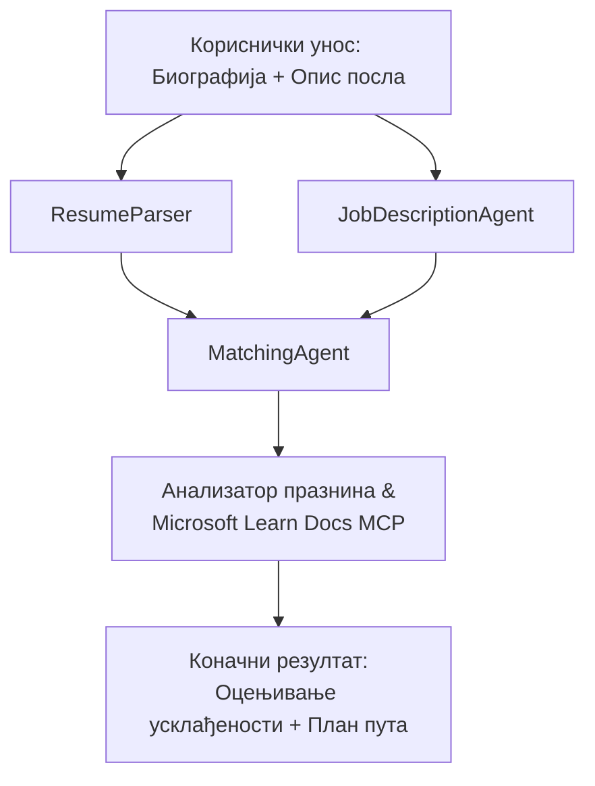

# PersonalCareerCopilot - Оцењивач подударања резимеа са послом

Вишерагентни ток рада који процењује колико резиме одговара опису посла, а затим генерише персонализовану карту учења за затварање празнина.

---

## Агенте

| Агент | Улога | Алати |
|-------|-------|-------|
| **ResumeParser** | Извлачи структуиране вештине, искуство, сертификате из текста резимеа | - |
| **JobDescriptionAgent** | Извлачи захтеване/пожељне вештине, искуство, сертификате из описа посла | - |
| **MatchingAgent** | Упоређује профил и захтеве → оцена подударања (0-100) + поклапајуће/потпуне вештине | - |
| **GapAnalyzer** | Прави персонализовану карту учења са Microsoft Learn ресурсима | `search_microsoft_learn_for_plan` (MCP) |

## Ток рада


---

## Брзи почетак

### 1. Подешавање окружења

```powershell
cd workshop\lab02-multi-agent\PersonalCareerCopilot
python -m venv .venv
.\.venv\Scripts\Activate.ps1          # Windows PowerShell
# source .venv/bin/activate            # macOS / Линукс
pip install -r requirements.txt
```

### 2. Конфигурисање акредитива

Копирајте пример `.env` фајла и попуните детаље вашег Foundry пројекта:

```powershell
cp .env.example .env
```

Измените `.env`:

```env
PROJECT_ENDPOINT=https://<your-account>.services.ai.azure.com/api/projects/<your-project>
MODEL_DEPLOYMENT_NAME=gpt-4.1-mini
```

| Вредност | Где се налази |
|----------|---------------|
| `PROJECT_ENDPOINT` | Microsoft Foundry странибар у VS Code → десни клик на пројекат → **Copy Project Endpoint** |
| `MODEL_DEPLOYMENT_NAME` | Foundry странибар → проширите пројекат → **Models + endpoints** → име деплоја |

### 3. Покретање локално

```powershell
python -m debugpy --listen 127.0.0.1:5679 -m agentdev run main.py --verbose --port 8088
```

Или користите VS Code задатак: `Ctrl+Shift+P` → **Tasks: Run Task** → **Run Lab02 HTTP Server**.

### 4. Тестирање са Agent Inspector-ом

Отворите Agent Inspector: `Ctrl+Shift+P` → **Foundry Toolkit: Open Agent Inspector**.

Налепите овај тестни упит:

```
Resume:
Jane Doe
Senior Software Engineer with 5 years of experience in Python, Django, and AWS.
Built microservices handling 10K+ requests/second. Led a team of 4 developers.
Certifications: AWS Solutions Architect Associate.
Education: B.S. Computer Science, State University.

Job Description:
Senior Cloud Engineer at Contoso Ltd.
Required: Python, Azure, Kubernetes, Terraform, CI/CD pipelines.
Preferred: Go, monitoring (Prometheus/Grafana), cost optimization.
Experience: 5+ years in cloud infrastructure.
Certifications: Azure Solutions Architect Expert preferred.
```

**Очекује се:** Оцена подударања (0-100), поклапајуће/недостајуће вештине и персонализована карта учења са Microsoft Learn URL-овима.

### 5. Деплоy на Foundry

`Ctrl+Shift+P` → **Microsoft Foundry: Deploy Hosted Agent** → изаберите пројекат → потврдите.

---

## Структура пројекта

```
PersonalCareerCopilot/
├── .env.example        ← Template for environment variables
├── .env                ← Your credentials (git-ignored)
├── agent.yaml          ← Hosted agent definition (name, resources, env vars)
├── Dockerfile          ← Container image for Foundry deployment
├── main.py             ← 4-agent workflow (instructions, MCP tool, WorkflowBuilder)
└── requirements.txt    ← Python dependencies
```

## Кључни фајлови

### `agent.yaml`

Дефинише хостованог агента за Foundry Agent Service:
- `kind: hosted` - ради као управљани контејнер
- `protocols: [responses v1]` - изложи `/responses` HTTP крајњу тачку
- `environment_variables` - `PROJECT_ENDPOINT` и `MODEL_DEPLOYMENT_NAME` се убацују приликом деплоја

### `main.py`

Садржи:
- **Упутства за агенте** - четири константе `*_INSTRUCTIONS`, по једна за сваког агента
- **MCP алат** - `search_microsoft_learn_for_plan()` позива `https://learn.microsoft.com/api/mcp` преко Streamable HTTP-а
- **Креирање агената** - контекстни менаџер `create_agents()` користећи `AzureAIAgentClient.as_agent()`
- **Граф тока рада** - `create_workflow()` користи `WorkflowBuilder` за повезивање агената са фан-аут/фан-ин/секвенцијалним шаблонима
- **Покретање сервера** - `from_agent_framework(agent).run_async()` на порту 8088

### `requirements.txt`

| Пакет | Верзија | Намена |
|-------|---------|---------|
| `agent-framework-azure-ai` | `1.0.0rc3` | Azure AI интеграција за Microsoft Agent Framework |
| `agent-framework-core` | `1.0.0rc3` | Основно окружење (укључује WorkflowBuilder) |
| `azure-ai-agentserver-agentframework` | `1.0.0b16` | Покретачки сервер за хостоване агенте |
| `azure-ai-agentserver-core` | `1.0.0b16` | Основне абстракције агента сервера |
| `debugpy` | најновија | Python дебаговање (Ф5 у VS Code) |
| `agent-dev-cli` | `--pre` | Локални дев CLI + backend за Agent Inspector |

---

## Решавање проблема

| Проблем | Решење |
|---------|---------|
| `RuntimeError: Missing required environment variable(s)` | Направите `.env` са `PROJECT_ENDPOINT` и `MODEL_DEPLOYMENT_NAME` |
| `ModuleNotFoundError: No module named 'agent_framework'` | Активирајте venv и покрените `pip install -r requirements.txt` |
| Нема Microsoft Learn URL-ова у резултату | Проверите интернет конекцију ка `https://learn.microsoft.com/api/mcp` |
| Само 1 картица празнине (скраћена) | Проверите да `GAP_ANALYZER_INSTRUCTIONS` садржи блок `CRITICAL:` |
| Порт 8088 је у употреби | Зауставите друге сервере: `netstat -ano \| findstr :8088` |

За детаљно решавање проблема, погледајте [Модул 8 - Решавање проблема](../docs/08-troubleshooting.md).

---

**Цео водич:** [Lab 02 Docs](../docs/README.md) · **Назад на:** [Lab 02 README](../README.md) · [Почетна радионице](../../../README.md)

---

<!-- CO-OP TRANSLATOR DISCLAIMER START -->
**Одрицање одговорности**:  
Овај документ је преведен коришћењем AI услуге за превођење [Co-op Translator](https://github.com/Azure/co-op-translator). Иако тежимо ка тачности, молимо вас да имате у виду да аутоматски преводи могу садржати грешке или нетачности. Изворни документ на оригиналном језику треба сматрати ауторитетним извором. За критичне информације препоручује се професионални људски превод. Нисмо одговорни за било каква неспоразума или погрешна тумачења која могу проистећи из коришћења овог превода.
<!-- CO-OP TRANSLATOR DISCLAIMER END -->