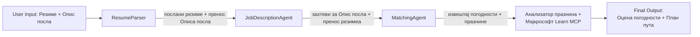

# PersonalCareerCopilot - Оцењивач прикладности радног места и биографије

Višeagentна апликација са фокусом на радни ток која процењује колико биографија одговара опису посла, а затим генерише персонализовани план учења за отклањање недостатака.

---

## Агенти

| Агент | Улога | Алати |
|-------|------|-------|
| **ResumeParser** | Извлачи структуриране вештине, искуство, сертификате из текста биографије | - |
| **JobDescriptionAgent** | Извлачи потребне/пожељне вештине, искуство, сертификате из описа посла | - |
| **MatchingAgent** | Упоређује профил са захтевима → оцена прикладности (0-100) + подударајуће/недостајуће вештине | - |
| **GapAnalyzer** | Прави персонализовани план учења са ресурсима Microsoft Learn | `search_microsoft_learn_for_plan` (MCP) |

## Радни ток


```mermaid
flowchart LR
    UserInput["User Input: Резиме + Опис посла"] --> ResumeParser
    ResumeParser -- "послани резиме + пренос Описа посла" --> JobDescriptionAgent
    JobDescriptionAgent -- "захтеви за Опис посла + пренос резимеа" --> MatchingAgent
    MatchingAgent -- "извештај погодности + празнине" --> GapAnalyzerMCP["Анализатор празнина +\nМајкрософт Learn MCP"]
    GapAnalyzerMCP --> FinalOutput["Final Output:\nОцена погодности + План пута"]
```

---

## Брз почетак

### 1. Подешавање окружења

Ова фасцикла је референтна имплементација за радни ток из Лаба 02. Њен `main.py` користи постојеће блокове упита уз `WorkflowBuilder` да повежe четири агента.

```powershell
cd workshop\lab02-multi-agent\PersonalCareerCopilot
python -m venv .venv
.\.venv\Scripts\Activate.ps1          # Windows PowerShell
# source .venv/bin/activate            # macOS / Линукс
pip install -r requirements.txt
```

### 2. Конфигурисање акредитива

Креирајте `.env` фајл у овој фасцикли:

```powershell
copy .env .env.bak 2>$null; echo $null > .env
```

Измените `.env`:

```env
FOUNDRY_PROJECT_ENDPOINT=https://<your-account>.services.ai.azure.com/api/projects/<your-project>
AZURE_AI_MODEL_DEPLOYMENT_NAME=gpt-4.1-mini
```

| Вредност | Где пронаћи |
|-------|------------------|
| `FOUNDRY_PROJECT_ENDPOINT` | Foundry Toolkit бочна трака → десни клик на пројекат → **Copy Project Endpoint** |
| `AZURE_AI_MODEL_DEPLOYMENT_NAME` | Foundry бочна трака → проширити пројекат → **Models + endpoints** → име имплементације |

### 3. Покрени локално

```powershell
python -m debugpy --listen 127.0.0.1:5679 main.py --port 8088
```

Или користите Visual Studio Code задатак: `Ctrl+Shift+P` → **Tasks: Run Task** → **Run Agent HTTP Server**.

За F5 дебаговање, користите **Debug Local Agent HTTP Server**.

### 4. Тестирање са Agent Inspector-ом

Отворите Agent Inspector: `Ctrl+Shift+P` → **Foundry Toolkit: Open Agent Inspector**.

Налепите овај тест упит:

```
Resume:
Jane Doe
Senior Software Engineer with 5 years of experience in Python, Django, and AWS.
Built microservices handling 10K+ requests/second. Led a team of 4 developers.
Certifications: AWS Solutions Architect Associate.
Education: B.S. Computer Science, State University.

Job Description:
Senior Cloud Engineer at Contoso Ltd.
Required: Python, Azure, Kubernetes, Terraform, CI/CD pipelines.
Preferred: Go, monitoring (Prometheus/Grafana), cost optimization.
Experience: 5+ years in cloud infrastructure.
Certifications: Azure Solutions Architect Expert preferred.
```

**Очекује се:** Оцена прикладности (0-100), подударајуће/недостајуће вештине и персонализовани план учења са Microsoft Learn URL адресама.

### 5. Деплој на Foundry

`Ctrl+Shift+P` → **Foundry Toolkit: Deploy Hosted Agent** → изаберите ваш пројекат → потврдите.

---

## Структура пројекта

```
PersonalCareerCopilot/
├── .env                ← Your credentials (git-ignored)
├── agent.yaml          ← Hosted agent definition (name, resources, env vars)
├── Dockerfile          ← Container image for Foundry deployment
├── main.py             ← 4-agent workflow (instructions, MCP tool, WorkflowBuilder)
└── requirements.txt    ← Python dependencies
```

## Кључни фајлови

### `agent.yaml`

Дефинише hostovanog агента за Foundry Agent Service:
- `kind: hosted` - ради као управљани контејнер
- `protocols` - протокол `responses` са `version: 1.0.0`, који излази на `/responses` HTTP ендпоинт
- `environment_variables` - `AZURE_AI_MODEL_DEPLOYMENT_NAME` је овде декларисан; `FOUNDRY_PROJECT_ENDPOINT` се аутоматски убацује приликом деплоја

### `main.py`

Садржи:
- **Упутства за агенте** - четири константе `*_INSTRUCTIONS`, по једна за сваког агента
- **MCP алат** - `search_microsoft_learn_for_plan()` позива `https://learn.microsoft.com/api/mcp` преко Streamable HTTP
- **Креирање агената** - четири `Agent()` + `AgentExecutor()` инстанце које деле једног `FoundryChatClient`
- **Дијаграм радног тока** - `WorkflowBuilder` повезује агенте као секвенцијални ланац: ResumeParser → JD Agent → MatchingAgent → GapAnalyzer
- **Покретање сервера** - `ResponsesHostServer` ради на порту 8088

### `requirements.txt`

| Пакет | Сврха |
|---------|----------|
| `agent-framework-foundry` | Језгро: `Agent`, `AgentExecutor`, `WorkflowBuilder`, `@tool`, `FoundryChatClient` |
| `agent-framework-foundry-hosting` | `ResponsesHostServer` + интеграција са Foundry хостињем |
| `mcp<2,>=1.24.0` | MCP клијент за GapAnalyzer (`streamable_http_client`) |
| `debugpy` | Python дебаговање (F5 у VS Code) |

---

## Решавање проблема

| Проблем | Решење |
|-------|-----|
| `KeyError: 'FOUNDRY_PROJECT_ENDPOINT'` или `KeyError: 'AZURE_AI_MODEL_DEPLOYMENT_NAME'` | Креирајте `.env` са подешеним `FOUNDRY_PROJECT_ENDPOINT` и `AZURE_AI_MODEL_DEPLOYMENT_NAME` |
| `ModuleNotFoundError: No module named 'agent_framework'` | Активирајте виртуелно окружење и покрените `pip install -r requirements.txt` |
| Нема Microsoft Learn URL адреса у излазу | Проверите интернет конекцију до `https://learn.microsoft.com/api/mcp` |
| Само 1 картица недостатака (скраћено) | Проверите да `GAP_ANALYZER_INSTRUCTIONS` укључује `CRITICAL:` блок |
| Порт 8088 је заузет | Зауставите друге сервере: `netstat -ano \| findstr :8088` |

За детаљно решавање проблема, погледајте [Модул 8 - Решавање проблема](../docs/08-troubleshooting.md).

---

**Цео водич:** [Lab 02 Docs](../docs/README.md) · **Назад на:** [Lab 02 README](../README.md) · [Почетна радионице](../../../README.md)

---

<!-- CO-OP TRANSLATOR DISCLAIMER START -->
**Изјава о одрицању одговорности**:
Овај документ је преведен коришћењем услуге за аутоматски превод [Co-op Translator](https://github.com/Azure/co-op-translator). Иако тежимо тачности, имајте у виду да аутоматски преводи могу садржати грешке или нетачности. Оригинални документ на његовом изворном језику треба сматрати ауторитативним извором. За критичне информације препоручује се професионални људски превод. Нисмо одговорни за било каква неспоразума или погрешна тумачења која произилазе из коришћења овог превода.
<!-- CO-OP TRANSLATOR DISCLAIMER END -->