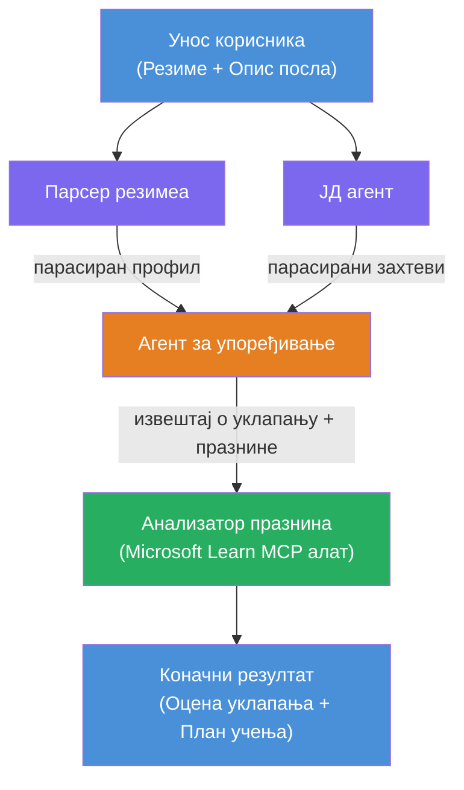

# Lab 02 - Вишеагентски ток рада: Оцена резимеа → усклађеност са позицијом

---

## Шта ћете направити

**Оцена резимеа → усклађеност са позицијом** - вишeагентски ток рада где четири специјализована агента сарађују у процени колико кандидатски резиме одговара опису посла, а затим генеришу персонализовани план учења за отклањање разлика.

### Агенти

| Агент | Улога |
|-------|-------|
| **Парсер резимеа** | Извлачи структуиране вештине, искуство, сертификате из текста резимеа |
| **Агент за опис посла** | Извлачи потребне/пожељне вештине, искуство, сертификате из описа посла |
| **Агент за упоређивање** | Упоређује профил са захтевима → оцена усклађености (0-100) + подударне/недостајуће вештине |
| **Анализатор разлика** | Креира персонализовани план учења са ресурсима, роковима и брзим пројектима |

### Демонстрациони ток рада

Пошаљите **резиме + опис посла** → добијте **оцену усклађености + недостајуће вештине** → примите **персонализовани план учења**.

### Архитектура тока рада

> Пурпурна = паралелни агенти | Наранџаста = тачка агрегирања | Зелена = коначан агент са алаткама. Погледајте [Модул 1 - Разумевање архитектуре](docs/01-understand-multi-agent.md) и [Модул 4 - Обрасци оркестрације](docs/04-orchestration-patterns.md) за детаљне дијаграме и ток података.

### Области које покривамо

- Креирање вишeагентског тока рада користећи **WorkflowBuilder**
- Дефинисање улога агената и тока оркестрације (паралелно + секвенцијално)
- Обрасци комуникације између агената
- Локално тестирање са Agent Inspector-ом
- Деплојмент вишeагентских токова рада на Foundry Agent Service

---

## Предуслови

Прво завршити Лаб 01:

- [Lab 01 - Single Agent](../lab01-single-agent/README.md)

---

## Почетак рада

Погледајте комплетна упутства за подешавање, приказ кода и команде за тестирање у:

- [Lab 2 Docs - Prerequisites](docs/00-prerequisites.md)
- [Lab 2 Docs - Full Learning Path](docs/README.md)
- [PersonalCareerCopilot run guide](PersonalCareerCopilot/README.md)

## Обрасци оркестрације (агентски алтернативи)

Лаб 2 садржи подразумевани ток **паралелно → агрегатор → планер**, а документација описује и алтернативне образце да прикаже јачу агентску понашање:

- **Fan-out/Fan-in са тежинским консензусом**
- **Преглед/критички пролаз пре коначног плана**
- **Условни рутер** (избор путање на основу оцене усклађености и недостајућих вештина)

Погледајте [docs/04-orchestration-patterns.md](docs/04-orchestration-patterns.md).

---

**Претходно:** [Lab 01 - Single Agent](../lab01-single-agent/README.md) · **Повратак:** [Workshop Home](../../README.md)

---

<!-- CO-OP TRANSLATOR DISCLAIMER START -->
**Одрицање од одговорности**:  
Овај документ је преведен уз помоћ АИ услуге за превођење [Co-op Translator](https://github.com/Azure/co-op-translator). Иако се трудимо да превод буде тачан, имајте у виду да аутоматски преводи могу садржати грешке или нетачности. Оригинални документ на мајчином језику треба сматрати ауторитетним извором. За критичне информације препоручује се професионални људски превод. Нисмо одговорни за било каква неспоразума или погрешна тумачења настала коришћењем овог превода.
<!-- CO-OP TRANSLATOR DISCLAIMER END -->