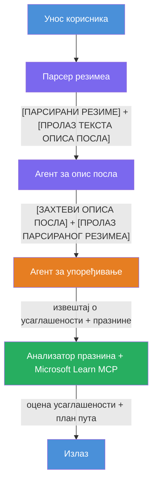

# Лаб 02 - Višеagеntski radni tok: Procena podobnosti CV-а и posla

## Преглед

У овом практичном лабораторијском задатку направићете **aplikaciju sa višеагентским radним током** користећи Foundry Toolkit у VS Code и распоредити је на Microsoft Foundry Agent Service.

**Шта ћете направити:** Procenu podobnosti CV-а i posla која парсира CV и опис посла, даје оцену подударања и прави персонализовани план учења користећи Microsoft Learn ресурсе.

---

## Архитектура

```mermaid
flowchart TD
    A["Унос корисника"] --> B["Парсер резимеа"]
    B -->|"[ПАРСИРАНИ РЕЗИМЕ] + [ПРОЛАЗ ТЕКСТА ОПИСА ПОСЛА]"| C["Агент за опис посла"]
    C -->|"[ЗАХТЕВИ ОПИСА ПОСЛА] + [ПРОЛАЗ ПАРСИРАНОГ РЕЗИМЕА]"| D["Агент за упоређивање"]
    D -->|извештај о усаглашености + празнине| E["Анализатор празнина + Microsoft Learn MCP"]
    E -->|оцена усаглашености + план пута| F["Излаз"]

    style A fill:#4A90D9,color:#fff
    style B fill:#7B68EE,color:#fff
    style C fill:#7B68EE,color:#fff
    style D fill:#E67E22,color:#fff
    style E fill:#27AE60,color:#fff
    style F fill:#4A90D9,color:#fff
```

**Како функцинише:**
1. Корисник налепи CV и опис посла.
2. **ResumeParser** парсира CV и копира опис посла дословно у секцију `[JOB DESCRIPTION PASS-THROUGH]`.
3. **JD Agent** извлачи структуиране захтеве из pass-through, а затим прослеђује `[PARSED RESUME]` као `[PARSED RESUME PASS-THROUGH]`.
4. **MatchingAgent** упоређује `[PARSED RESUME PASS-THROUGH]` са `[JD REQUIREMENTS]` и производи оцену подобности.
5. **GapAnalyzer** претвара празнине у практичан план и преузима стварне Microsoft Learn линкове преко MCP.

---

## Предуслови

Прво завршите Лаб 01:

- [Лаб 01 - Један агент](../lab01-single-agent/README.md)

---

## Део 1: Прочитајте модуле по реду

Погледајте цео пут учења у:

- [Лаб 2 Документација - Предуслови](docs/00-prerequisites.md)
- [Лаб 2 Документација - Цели пут учења](docs/README.md)
- [Упутство за покретање PersonalCareerCopilot](PersonalCareerCopilot/README.md)

---

## Део 2: Направите и тестирате радни ток

1. Користите Foundry Toolkit чаробњак за скелетирање пројекта базираног на радном току.
2. Копирајте блокове команды и граф радног тока из `PersonalCareerCopilot/main.py` у ваш радни простор.
3. Покрените локално са Agent Inspector-ом и проверите сва четири агента и MCP алатку.
4. Распоредите хостованог агента на Foundry након успешног локалног тестирања.

---

## Обрасци оркестрације

Лаб 02 укључује подразумевани **fan-out → fan-in → секвенцијални** ток, а документација описује и алтернативне обрасце за експериментисање.

- **Fan-out/Fan-in са тежинском сагласношћу**
- **Преглед и критика пре коначног плана**
- **Условни рутер** заснован на оцени подударања и недостајућим вештинама

Погледајте [docs/04-orchestration-patterns.md](docs/04-orchestration-patterns.md).

---

**Претходно:** [Лаб 01 - Један агент](../lab01-single-agent/README.md) · **Врати се на:** [Почетак радионице](../../README.md)

---

<!-- CO-OP TRANSLATOR DISCLAIMER START -->
**Изјава о одрицању одговорности**:
Овај документ је преведен коришћењем услуге за аутоматски превод [Co-op Translator](https://github.com/Azure/co-op-translator). Иако тежимо тачности, имајте у виду да аутоматски преводи могу садржати грешке или нетачности. Оригинални документ на његовом изворном језику треба сматрати ауторитативним извором. За критичне информације препоручује се професионални људски превод. Нисмо одговорни за било каква неспоразума или погрешна тумачења која произилазе из коришћења овог превода.
<!-- CO-OP TRANSLATOR DISCLAIMER END -->