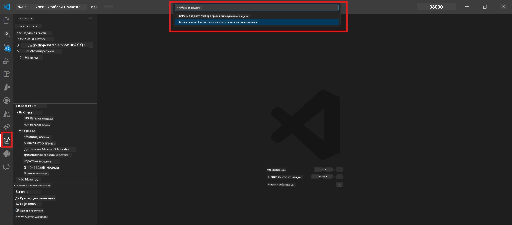

# Модул 0 - Предуслови

Пре почетка Лаба 02, потврдите да сте завршили следеће. Овај лабораторијски задатак директно је заснован на Лабу 01 - немојте га прескочити.

---

## 1. Завршите Лаб 01

Лаб 02 претпоставља да сте већ:

- [x] Завршили свих 8 модула из [Лаб 01 - Један агент](../../lab01-single-agent/README.md)
- [x] Успешно распоредили једног агента у Foundry Agent Service
- [x] Потврдили да агент ради и у локалном Agent Inspector-у и у Foundry Playground-у

Ако нисте завршили Лаб 01, вратите се и завршите га сада: [Лаб 01 документација](../../lab01-single-agent/docs/00-prerequisites.md)

---

## 2. Потврдите постојећу подешеност

Сви алати из Лаб 01 требало би да буду инсталирани и да раде. Покрените ове брзе провере:

### 2.1 Azure CLI

```powershell
az account show --query "{name:name, id:id}" --output table
```

Очекује се: Приказује име и ИД ваше претплате. Ако ово не успе, покрените [`az login`](https://learn.microsoft.com/cli/azure/authenticate-azure-cli-interactively).

### 2.2 VS Code екстензије

1. Притисните `Ctrl+Shift+P` → укуцајте **"Microsoft Foundry"** → потврдите да видите команде (нпр., `Microsoft Foundry: Create a New Hosted Agent`).
2. Притисните `Ctrl+Shift+P` → укуцајте **"Foundry Toolkit"** → потврдите да видите команде (нпр., `Foundry Toolkit: Open Agent Inspector`).

### 2.3 Foundry пројекат и модел

1. Кликните на иконицу **Microsoft Foundry** у Activity Bar-у VS Code-а.
2. Потврдите да је ваш пројекат наведен (нпр., `workshop-agents`).
3. Проширите пројекат → потврдите да постоји распоређени модел (нпр., `gpt-4.1-mini`) са статусом **Succeeded**.

> **Ако је ваша распоред моделa истекао:** Неки бесплатни нивои аутоматски истичу. Поново распоредите са [Model Catalog](https://learn.microsoft.com/azure/foundry/foundry-models/concepts/models-sold-directly-by-azure) (`Ctrl+Shift+P` → **Microsoft Foundry: Open Model Catalog**).



### 2.4 RBAC улоге

Потврдите да имате **Azure AI User** улогу на вашем Foundry пројекту:

1. [Azure портал](https://portal.azure.com) → ваш Foundry **пројекат** ресурс → **Access control (IAM)** → картица **[Распоред улога](https://learn.microsoft.com/azure/foundry/concepts/rbac-foundry)**
2. Претражите своје име → потврдите да је **[Azure AI User](https://aka.ms/foundry-ext-project-role)** наведен.

---

## 3. Разумевање концепата вишега агента (ново за Лаб 02)

Лаб 02 уводи концепте који нису обрађени у Лаб 01. Прочитајте их пре наставка:

### 3.1 Шта је вишега агентски ток рада?

Уместо да један агент ради све, **вишега агентски ток рада** дели посао међу више специјализованих агената. Сваки агент има:

- Своја **упутства** (системски подстицај)
- Своју **улогу** (за шта је одговоран)
- Опционалне **алате** (функције које може позивати)

Агенти комуницирају путем **графа оркестрације** који дефинише како подаци протичу између њих.

### 3.2 WorkflowBuilder

Класа [`WorkflowBuilder`](https://learn.microsoft.com/agent-framework/workflows/agents-in-workflows) из `agent_framework` је SDK компонента која повезује агенте:

```python
from agent_framework import WorkflowBuilder

workflow = (
    WorkflowBuilder(
        name="MyWorkflow",
        start_executor=agent_a,
        output_executors=[agent_d],
    )
    .add_edge(agent_a, agent_b)
    .add_edge(agent_a, agent_c)
    .add_edge(agent_b, agent_d)
    .add_edge(agent_c, agent_d)
    .build()
)
```

- **`start_executor`** - Први агент који прима унос корисника
- **`output_executors`** - Агент(и) чији излаз постаје коначни одговор
- **`add_edge(source, target)`** - Дефинише да `target` добија излаз од `source`

### 3.3 MCP (Model Context Protocol) алати

Лаб 02 користи **MCP алат** који позива Microsoft Learn API ради преузимања образовних ресурса. [MCP (Model Context Protocol)](https://modelcontextprotocol.io/introduction) је стандардан протокол за повезивање AI модела са екстерним изворима података и алатима.

| Појам | Дефиниција |
|-------|------------|
| **MCP сервер** | Сервис који излаже алате/ресурсе преко [MCP протокола](https://learn.microsoft.com/azure/foundry/agents/how-to/tools/model-context-protocol) |
| **MCP клијент** | Ваш агентски код који се повезује са MCP сервером и позива његове алате |
| **[Streamable HTTP](https://learn.microsoft.com/agent-framework/agents/tools/hosted-mcp-tools)** | Метод транспорта који се користи за комуникацију са MCP сервером |

### 3.4 Како се Лаб 02 разликује од Лаб 01

| Аспект | Лаб 01 (Један агент) | Лаб 02 (Више агената) |
|---------|----------------------|-----------------------|
| Агенти | 1 | 4 (специјализоване улоге) |
| Оркестрација | Ниједна | WorkflowBuilder (паралелно + секвенцијално) |
| Алатке | Опциона `@tool` функција | MCP алат (позив екстерног API-а) |
| Комплексност | Једноставан подстицај → одговор | Биографија + JD → фит скор → план пута |
| Проток контекста | Директан | Пренос између агената |

---

## 4. Структура репозиторијума радионице за Лаб 02

Побрините се да знате где су датотеке за Лаб 02:

```
workshop/
└── lab02-multi-agent/
    ├── README.md                       ← Lab overview
    ├── docs/                           ← You are here
    │   ├── README.md                   ← Learning path index
    │   ├── 00-prerequisites.md         ← This file
    │   ├── 01-understand-multi-agent.md
    │   ├── ...
    │   └── 08-troubleshooting.md
    └── PersonalCareerCopilot/          ← The agent project
        ├── agent.yaml                  ← Agent definition
        ├── main.py                     ← 4-agent workflow code
        ├── Dockerfile                  ← Container configuration
        └── requirements.txt            ← Python dependencies
```

---

### Контролна тачка

- [ ] Лаб 01 је у потпуности завршен (сви 8 модула, агент распоређен и потврђен)
- [ ] `az account show` враћа вашу претплату
- [ ] Microsoft Foundry и Foundry Toolkit екстензије су инсталиране и раде
- [ ] Foundry пројекат има распоређени модел (нпр., `gpt-4.1-mini`)
- [ ] Имате **Azure AI User** улогу на пројекту
- [ ] Прочитали сте горе одељак о концептима вишега агента и разумете WorkflowBuilder, MCP и оркестрацију агената

---

**Следеће:** [01 - Разумевање архитектуре вишега агента →](01-understand-multi-agent.md)

---

<!-- CO-OP TRANSLATOR DISCLAIMER START -->
**Одрицање од одговорности**:  
Овај документ је преведен коришћењем AI сервиса за превођење [Co-op Translator](https://github.com/Azure/co-op-translator). Док тежимо тачности, молимо вас да имате у виду да аутоматски преводи могу садржати грешке или нетачности. Изворни документ на његовом матичном језику треба сматрати ауторитетним извором. За критичне информације препоручује се професионални превод од стране човека. Нисмо одговорни за било каква неспоразума или погрешне тумачења настала употребом овог превода.
<!-- CO-OP TRANSLATOR DISCLAIMER END -->