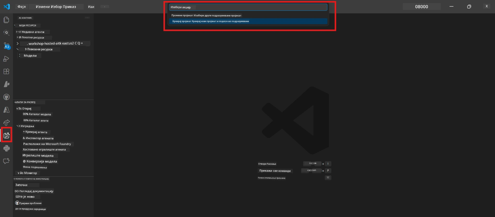

# Модул 0 - Увод

⏱️ ~10 мин

> [!WARNING]
> **Преглед и ограничења:** [Хостовани агенти](https://learn.microsoft.com/azure/foundry/agents/concepts/hosted-agents) су тренутно у фази **јавне превиев** - нису препоручени за продукцијске радне оптерећења. Неки приказани елементи у овом радионичарском курсу могу се мењати како услуга буде напредовала ка генералној доступности.

## Шта ћете направити

У овом лабораторијском задатку проширујете вештине једног агента из Лабораторије 01 за прављење **вишенаменског тока рада** - Оцена прегледа и прилагођености послу.

Уносите **резиме** и **опис посла**. Четири специјализована агента обрађују унос секвенцијално, затим враћају:
- Оцена прилагођености (0–100 са детаљним разградњом оцене)
- Листу недостајућих вештина и сертификата
- Персонализовану путну мапу учења са стварним Microsoft Learn линковима за сваки недостатак

**Ток рада користи:**
- **Microsoft Agent Framework** - `WorkflowBuilder` за секвенцијалну организацију радног процеса
- **Foundry Toolkit за VS Code** - скелет, локално тестирање, деплој
- **AI модел** (нпр. `gpt-4.1-mini`) - користе га сва четири агента
- **Microsoft Learn MCP сервер** - обезбеђује стварне линкове ресурса учења за сваки недостатак вештина

---

## Изаберите свој пут

> ⚠️ **Наставите истим путем који сте користили у Лабораторији 01.**

<details open>
<summary><strong>🅰️ Пут А - Azure cloud (треба Azure претплата)</strong></summary>

| | Подаци |
|---|---|
| **За кога је ово?** | Завршили сте Лаб 01 користећи Azure претплату |
| **Модел** | Azure OpenAI преко Foundry (нпр. `gpt-4.1-mini`) |
| **Обухваћени модули** | Сви модули (00–09) |
| **Да ли се деплојује у облак?** | ✅ Да - целокупан крај до крај деплој |

</details>

<details open>
<summary><strong>🅱️ Пут Б - Foundry Локално (није потребна Azure претплата)</strong></summary>

| | Подаци |
|---|---|
| **За кога је ово?** | Завршили сте Лаб 01 користећи Foundry Локално |
| **Модел** | Foundry Локално (бесплатно, ради на вашем рачунару) |
| **Обухваћени модули** | Модули 00–05 (прескочити 06–07 - деплој & проверу облака) |
| **Да ли се деплојује у облак?** | ❌ Не - само локално тестирање преко Agent Inspector-а |

</details>

---

## Провера Лаб 01

Лаб 02 се надовезује директно на Лаб 01. Прво завршите Лаб 01 пре него што кренете овде.

Још нисте радили Лаб 01? Почните овде: [Lab 01 - Introduction](../../lab01-single-agent/docs/00-prerequisites.md)

<details open>
<summary><strong>🅰️ Пут А - Azure cloud</strong></summary>

```powershell
az account show --query "{name:name, id:id}" --output table
```

Ако ово не успе, покрените `az login`. Затим проверите у VS Code:

1. `Ctrl+Shift+P` → упишите **Foundry Toolkit** → потврдите да се команде појављују.
2. Кликните икону **Foundry Toolkit** → ваш пројекат и деплојовани модел показују **Succeeded**.



> **RBAC:** Доделили сте **Foundry User** у Лаб 01. Ако морате поново да доделите, погледајте [Лаб 01, Модул 1](../../lab01-single-agent/docs/01-setup.md#deploy-a-model--assign-rbac). Улога је претходно била названа **Azure AI User** - исте дозволе.

</details>

<details open>
<summary><strong>🅱️ Пут Б - Foundry Локално</strong></summary>

```powershell
Invoke-WebRequest -Uri "http://localhost:5273/v1/health" -UseBasicParsing | Select-Object StatusCode
```

Очекује се: `StatusCode: 200`. Ако није, поново покрените Foundry Локално из Foundry Toolkit sidebar-а.

> Све претпоставке се покрећу на вашем рачунару. Једини излазни позив је MCP алат ка `https://learn.microsoft.com/api/mcp`.

</details>

---

## Шта је ново у Лаб 02

| | Лаб 01 | Лаб 02 |
|--|--------|--------|
| Агенти | 1 | 4 (повезани уз WorkflowBuilder) |
| Скеле шаблон | Основни - Agent Framework | Работни токови - Agent Framework |
| Нови пакет | - | `mcp` |
| Оркестрација | Један разговорни агент | Секвенцијални ток (WorkflowBuilder) |
| Нови алат | - | `search_microsoft_learn_for_plan` (MCP) |

---

**Следеће:** [01 - Разумевање архитектуре →](01-understand-multi-agent.md)

---

<!-- CO-OP TRANSLATOR DISCLAIMER START -->
**Изјава о одрицању одговорности**:
Овај документ је преведен коришћењем услуге за аутоматски превод [Co-op Translator](https://github.com/Azure/co-op-translator). Иако тежимо тачности, имајте у виду да аутоматски преводи могу садржати грешке или нетачности. Оригинални документ на његовом изворном језику треба сматрати ауторитативним извором. За критичне информације препоручује се професионални људски превод. Нисмо одговорни за било каква неспоразума или погрешна тумачења која произилазе из коришћења овог превода.
<!-- CO-OP TRANSLATOR DISCLAIMER END -->