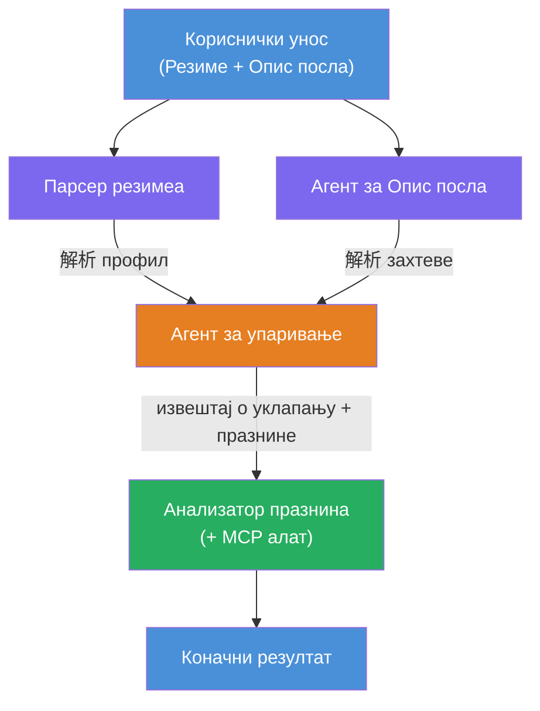
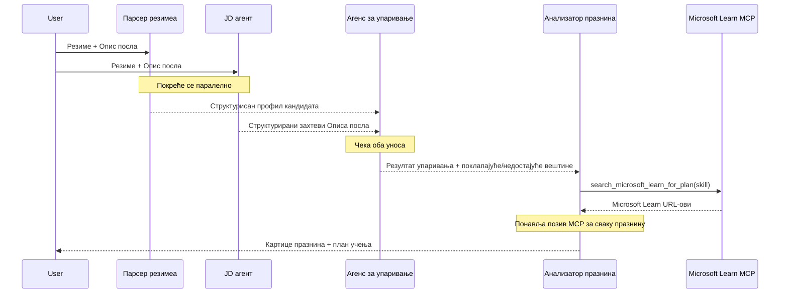
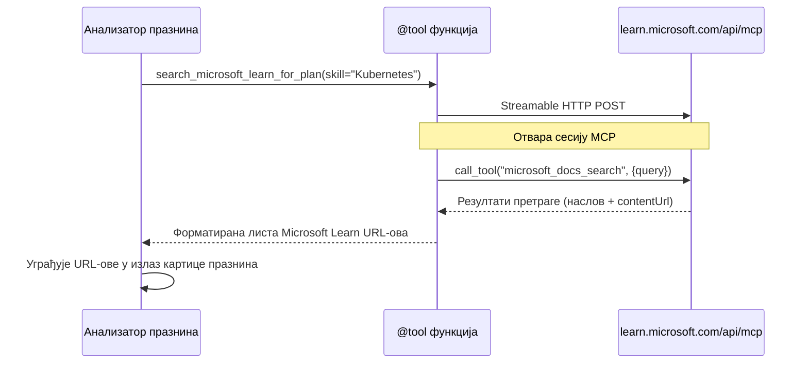

# Модул 1 - Разумевање архитектуре вишеразинског агента

У овом модулу учите архитектуру оцјењивача усклађености резимеа са послом пре него што започнете са писањем кода. Разумевање графа оркестрације, улога агената и тока података је критично за отклањање грешака и проширивање [вишеразинских радних токова](https://learn.microsoft.com/azure/architecture/ai-ml/idea/multiple-agent-workflow-automation).

---

## Проблем који се решава

Усклађивање резимеа са описом посла укључује више различитих вештина:

1. **Парсирање** - Издвајање структурираних података из неструктурисаног текста (резиме)
2. **Анализа** - Издвајање захтева из описа посла
3. **Поређење** - Оцена усаглашености између ова два
4. **Планирање** - Израда плана учења за затварање јаза

Један агент који обавља све четири задатка у једном упиту често производи:
- Непотпуну екстракцију (брзоплето пролази кроз парсирање да дође до оцене)
- Плитаку оцену (без анализе засноване на доказима)
- Генеричке планове (неприлагођене специфичним јазовима)

Поделом на **четири специјализована агента**, сваки се фокусира на свој задатак са посебним упутствима, производећи квалитетнији резултат у свакој фази.

---

## Четири агента

Сваки агент је пун [Microsoft Foundry](https://learn.microsoft.com/azure/foundry/agents/concepts/hosted-agents) агент креиран преко `AzureAIAgentClient.as_agent()`. Делe исти модел распореда али имају различита упутства и (опционо) различите алате.

| # | Име агента | Улога | Улаз | Излаз |
|---|------------|-------|-------|--------|
| 1 | **ResumeParser** | Издваја структурисани профил из текста резимеа | Сирови текст резимеа (од корисника) | Профил кандидата, Техничке вештине, Софт вештине, Сертификати, Доменско искуство, Остварења |
| 2 | **JobDescriptionAgent** | Издваја структурисане захтеве из описa посла | Сирови текст описа посла (од корисника, прослеђен преко ResumeParser) | Преглед улоге, Потребне вештине, Пожељне вештине, Искуство, Сертификати, Образовање, Одговорности |
| 3 | **MatchingAgent** | Израчунава оцену усклађености засновану на доказима | Излази из ResumeParser + JobDescriptionAgent | Оцена усклађености (0-100 са разлагањем), Усклађене вештине, Недостајуће вештине, Јазови |
| 4 | **GapAnalyzer** | Прави персонализовану мапу учења | Излаз из MatchingAgent | Картице јаза (по вештини), Редослед учења, Временски оквир, Ресурси са Microsoft Learn |

---

## Граф оркестрације

Радни ток користи **паралелно разгрануће** које следи **секвенцијална агрегaција**:


> **Легенда:** Лила = паралелни агенти, Наранџаста = точка агрегaције, Зелена = коначан агент са алатима

### Како тече податак


1. **Корисник шаље** поруку која садржи резиме и опис посла.
2. **ResumeParser** прима цео унос корисника и извуће структурисани профил кандидата.
3. **JobDescriptionAgent** паралелно прима кориснички унос и издваја структурисане захтеве.
4. **MatchingAgent** прима излазе из **обоје** ResumeParser и JobDescriptionAgent (фрејмворк чека да оба заврше пре покретања MatchingAgenta).
5. **GapAnalyzer** прими излаз MatchingAgenta и позива **Microsoft Learn MCP алат** да преузме стварне ресурсе за учење за сваки јаз.
6. **Коначан излаз** је одговор GapAnalyzera, који садржи оцену усклађености, картице јаза и комплетну мапу учења.

### Зашто је паралелно разгрануће важно

ResumeParser и JobDescriptionAgent раде **паралелно** јер ниједан не зависи од другог. Ово:
- Смањује укупно кашњење (обоје раде истовремено уместо секвенцијално)
- Представља природну поделу (парсирање резимеа и парсирање описа посла су независни задаци)
- Демонстрира чести вишеразински образац: **разгрануће → агрегaција → акција**

---

## WorkflowBuilder у коду

Ево како горњи граф мапира на позиве API-ја [`WorkflowBuilder`](https://learn.microsoft.com/agent-framework/workflows/agents-in-workflows) у `main.py`:

```python
from agent_framework import WorkflowBuilder

workflow = (
    WorkflowBuilder(
        name="ResumeJobFitEvaluator",
        start_executor=resume_parser,       # Први агент који прими унос корисника
        output_executors=[gap_analyzer],     # Крајњи агент чији се излаз враћа
    )
    .add_edge(resume_parser, jd_agent)      # ResumeParser → JobDescriptionAgent
    .add_edge(resume_parser, matching_agent) # ResumeParser → MatchingAgent
    .add_edge(jd_agent, matching_agent)      # JobDescriptionAgent → MatchingAgent
    .add_edge(matching_agent, gap_analyzer)  # MatchingAgent → GapAnalyzer
    .build()
)
```

**Разумевање ивица:**

| Ивица | Шта значи |
|-------|------------|
| `resume_parser → jd_agent` | JD агент прима излаз ResumeParser-а |
| `resume_parser → matching_agent` | MatchingAgent прима излаз ResumeParser-а |
| `jd_agent → matching_agent` | MatchingAgent такође прима излаз JD агента (чека оба) |
| `matching_agent → gap_analyzer` | GapAnalyzer прима излаз MatchingAgenta |

Пошто `matching_agent` има **две улазне ивице** (`resume_parser` и `jd_agent`), фрејмворк аутоматски чека оба да заврше пре покретања MatchingAgenta.

---

## MCP алат

GapAnalyzer агент има један алат: `search_microsoft_learn_for_plan`. Ово је **[MCP алат](https://learn.microsoft.com/agent-framework/agents/tools/hosted-mcp-tools)** који позива Microsoft Learn API да преузме куриране ресурсе за учење.

### Како ради

```python
@tool
async def search_microsoft_learn_for_plan(
    skill: str, role: str = "", max_results: int = 5
) -> str:
    """Search Microsoft Learn MCP and return curated official links."""
    # Повезује се на https://learn.microsoft.com/api/mcp преко Streamable HTTP-а
    # Позива 'microsoft_docs_search' алат на MCP серверу
    # Враћа форматирану листу Microsoft Learn URL-ова
```

### Ток позива MCP


1. GapAnalyzer закључује да му требају ресурси за учење за одређену вештину (нпр. "Kubernetes")
2. Фрејмворк позива `search_microsoft_learn_for_plan(skill="Kubernetes")`
3. Функција отвара [Streamable HTTP](https://learn.microsoft.com/agent-framework/agents/tools/hosted-mcp-tools) везу ка `https://learn.microsoft.com/api/mcp`
4. Позива `microsoft_docs_search` алат на [MCP серверу](https://learn.microsoft.com/azure/foundry/agents/how-to/tools/model-context-protocol)
5. MCP сервер враћа резултате претраге (наслов + URL)
6. Функција форматира резултате и враћа их као стринг
7. GapAnalyzer користи добијене URL-ове у излазу картица јаза

### Очекујте MCP логове

Када се алат покреће, видећете уносе у лог као:

```
GET https://learn.microsoft.com/api/mcp → 405 (Method Not Allowed)
POST https://learn.microsoft.com/api/mcp → 200
DELETE https://learn.microsoft.com/api/mcp → 405 (Method Not Allowed)
```

**Ово је нормално.** MCP клијент током иницијализације шаље GET и DELETE захтеве — враћање 405 је очекивано понашање. Сам позив алата користи POST и враћа статус 200. Забрините се само ако POST захтеви не успевају.

---

## Образац креирања агената

Сваки агент се креира коришћењем **асинхрониог контекст менаџера [`AzureAIAgentClient.as_agent()`](https://learn.microsoft.com/python/api/overview/azure/ai-agents-readme)**. Ово је Foundry SDK образац за креирање агената који се аутоматски чишће приликом затварања:

```python
async with (
    get_credential() as credential,
    AzureAIAgentClient(
        project_endpoint=PROJECT_ENDPOINT,
        model_deployment_name=MODEL_DEPLOYMENT_NAME,
        credential=credential,
    ).as_agent(
        name="ResumeParser",
        instructions=RESUME_PARSER_INSTRUCTIONS,
    ) as resume_parser,
    # ... поновите за сваког агента ...
):
    # Сва 4 агента постоје овде
    workflow = create_workflow(resume_parser, jd_agent, matching_agent, gap_analyzer)
```

**Кључне тачке:**
- Сваки агент добија своју инстанцу `AzureAIAgentClient` (SDK захтева да име агента буде у домену клијента)
- Сви агенти деле исте `credential`, `PROJECT_ENDPOINT` и `MODEL_DEPLOYMENT_NAME`
- `async with` блок обезбеђује да се сви агенти очисте када сервер затвори
- GapAnalyzer додатно добија `tools=[search_microsoft_learn_for_plan]`

---

## Покретање сервера

Након креирања агената и изградње радног тока, сервер се покреће:

```python
from azure.ai.agentserver.agentframework import from_agent_framework

agent = create_workflow(resume_parser, jd_agent, matching_agent, gap_analyzer)
await from_agent_framework(agent).run_async()
```

`from_agent_framework()` увија радни ток као HTTP сервер који излаже `/responses` крајњу тачку на порту 8088. Ово је исти образац као Лаб01, али "агент" је сада читав [граф радног тока](https://learn.microsoft.com/agent-framework/workflows/as-agents).

---

### Контролна тачка

- [ ] Разумете архитектуру од 4 агента и улоге сваког агента
- [ ] Можете пратити ток података: Корисник → ResumeParser → (паралелно) JD агент + MatchingAgent → GapAnalyzer → Излаз
- [ ] Разумете зашто MatchingAgent чека оба ResumeParser и JD агента (две улазне ивице)
- [ ] Разумете MCP алат: шта ради, како се позива и да су GET 405 логови нормални
- [ ] Разумете образац `AzureAIAgentClient.as_agent()` и зашто сваки агент има своју инстанцу клијента
- [ ] Можете прочитати `WorkflowBuilder` код и мапирати га на визуелни граф

---

**Претходно:** [00 - Претпоставке](00-prerequisites.md) · **Следеће:** [02 - Скела мулти-агент пројекта →](02-scaffold-multi-agent.md)

---

<!-- CO-OP TRANSLATOR DISCLAIMER START -->
**Одрицање**:
Овај документ је преведен коришћењем АI сервиса за превођење [Co-op Translator](https://github.com/Azure/co-op-translator). Иако се трудимо да превод буде тачан, молимо вас имајте на уму да аутоматизовани преводи могу садржати грешке или нетачности. Оригинални документ на његовом изворном језику треба сматрати ауторитетним извором. За критичне информације се препоручује професионални људски превод. Нисмо одговорни за било каква неспоразума или погрешна тумачења која проистекну из коришћења овог превода.
<!-- CO-OP TRANSLATOR DISCLAIMER END -->