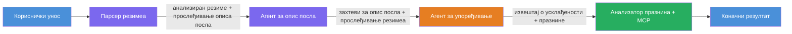

# Модул 1 - Разумевање архитектуре

⏱️ ~5 мин

Пре писања било каквог кода, ево кратког прегледа онога што правите и како то функционише.

---

## Шта правите

Убаците **биографију** и **опис посла**. Работни ток враћа:

- Оцена подударања (0–100 са распадом)
- Листу недостатака у вештинама и сертификатима
- Персонализовани план учења са Microsoft Learn линковима за сваки недостатак

---

## Четири агента

Један агент који покушава да обради, оцени и планира све одједном има обичај да жури и произведе плитак резултат. Подела рада на четири специјализована агента даје боље резултате:

| Агент | Шта ради |
|-------|-------------|
| **ResumeParser** | Обрађује биографију; копира опис посла без измена у `[JOB DESCRIPTION PASS-THROUGH]` за наредне агенте |
| **JobDescriptionAgent** | Извлачи захтеве из описа посла; прослеђује `[PARSED RESUME]` као `[PARSED RESUME PASS-THROUGH]` |
| **MatchingAgent** | Упоређује оба означена одељка; генерише оцену подударања од 0 до 100 и листу недостатака |
| **GapAnalyzer** | Креира план учења; тражи на Microsoft Learn за сваки недостатак |

---

## Оркестрациони график

Работни ток је **секвенцијална линија** - сваки агент прослеђује свој резултат следећем:


```mermaid
flowchart LR
    A["Кориснички унос"] --> B["Парсер резимеа"]
    B -- "анализиран резиме + прослеђивање описа посла" --> C["Агент за опис посла"]
    C -- "захтеви за опис посла + прослеђивање резимеа" --> D["Агент за упоређивање"]
    D -- "извештај о усклађености + празнине" --> E["Анализатор празнина + MCP"]
    E --> F["Коначни резултат"]

    style A fill:#4A90D9,color:#fff
    style B fill:#7B68EE,color:#fff
    style C fill:#7B68EE,color:#fff
    style D fill:#E67E22,color:#fff
    style E fill:#27AE60,color:#fff
    style F fill:#4A90D9,color:#fff
```

1. **ResumeParser** прима кориснички унос, обрађује биографију и копира опис посла у `[JOB DESCRIPTION PASS-THROUGH]`.
2. **JD Agent** извлачи структуриране захтеве и прослеђује `[PARSED RESUME PASS-THROUGH]` даље.
3. **MatchingAgent** упоређује оба одељка и генерише оцену подударања и листу недостатака.
4. **GapAnalyzer** гради план и позива Microsoft Learn MCP алат за сваки недостатак.

---

## Како се ово преводи у код

У `main.py`, овај граф описујете помоћу `WorkflowBuilder`:

```python
workflow_agent = (
    WorkflowBuilder(
        start_executor=resume_executor,       # први агент који прима унос корисника
        output_executors=[gap_executor],      # последњи агент - његов излаз је одговор
    )
    .add_edge(resume_executor, jd_executor)       # ResumeParser → JD Агент
    .add_edge(jd_executor, matching_executor)     # JD Агент → MatchingAgent
    .add_edge(matching_executor, gap_executor)    # MatchingAgent → GapAnalyzer
    .build()
    .as_agent()
)
```

Сваки `Agent` је умотан у `AgentExecutor`. Позиви `add_edge()` дефинишу строго секвенцијални ток - сваки агент прима само излаз свог непосредног претходника.

> `context_mode="last_agent"` значи да сваки извршилац види само резултат свог непосредног претходника. ResumeParser и JD Agent прослеђују податке у означеним одељцима тако да сваки следећи агент има баш оно што му треба.

---

## MCP алат

GapAnalyzer има један алат: `search_microsoft_learn_for_plan`. Повезује се на `https://learn.microsoft.com/api/mcp` и враћа праве Microsoft Learn линкове за сваки недостатак вештина.

Када алат ради, видећете ове логове - сваки очекивани:

```
GET  https://learn.microsoft.com/api/mcp → 405   ← connection probe, normal
POST https://learn.microsoft.com/api/mcp → 200   ← actual tool call
DELETE https://learn.microsoft.com/api/mcp → 405 ← cleanup probe, normal
```

Брините само ако `POST` врати грешку.

---

**Претходно:** [00 - Претпоставке](00-prerequisites.md) · **Следеће:** [02 - Скелирање пројекта →](02-scaffold-multi-agent.md)

---

<!-- CO-OP TRANSLATOR DISCLAIMER START -->
**Изјава о одрицању одговорности**:
Овај документ је преведен коришћењем услуге за аутоматски превод [Co-op Translator](https://github.com/Azure/co-op-translator). Иако тежимо тачности, имајте у виду да аутоматски преводи могу садржати грешке или нетачности. Оригинални документ на његовом изворном језику треба сматрати ауторитативним извором. За критичне информације препоручује се професионални људски превод. Нисмо одговорни за било каква неспоразума или погрешна тумачења која произилазе из коришћења овог превода.
<!-- CO-OP TRANSLATOR DISCLAIMER END -->