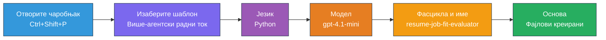
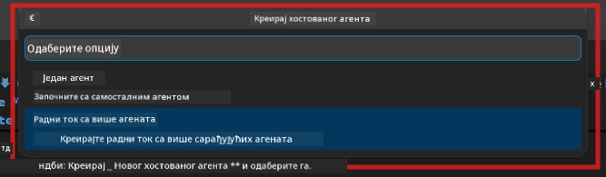

# Модул 2 - Scaffold-овање мулти-агент пројекта

У овом модулу користите [Microsoft Foundry екстензију](https://marketplace.visualstudio.com/items?itemName=TeamsDevApp.vscode-ai-foundry) да **scaffold-ујете пројекат мулти-агент радног тока**. Екстензија генерише читаву структуру пројекта - `agent.yaml`, `main.py`, `Dockerfile`, `requirements.txt`, `.env` и конфигурацију за дебаговање. Затим прилагођавате ове датотеке у Модулима 3 и 4.

> **Напомена:** Папка `PersonalCareerCopilot/` у овом лабораторијском вежбању је потпуни, радни пример прилагођеног мулти-агент пројекта. Можете scaffold-овати нови пројекат (препоручено за учење) или директно проучавати постојећи код.

---

## Корак 1: Отворите чаробњак за креирање хостованог агента


1. Притисните `Ctrl+Shift+P` да отворите **Командну палету**.
2. Укуцајте: **Microsoft Foundry: Create a New Hosted Agent** и изаберите ту опцију.
3. Отвориће се чаробњак за креирање хостованог агента.

> **Алтернатива:** Кликните на икону **Microsoft Foundry** у Activity Bar-у → кликните на икону **+** поред **Agents** → **Create New Hosted Agent**.

---

## Корак 2: Изаберите шаблон мулти-агент радног тока

Чаробњак ће вас питати да изаберете шаблон:

| Шаблон | Опис | Када користити |
|----------|-------------|-------------|
| Појединачни агент | Један агент са упутствима и опционим алаткама | Лаб 01 |
| **Мулти-Агент Радни Ток** | Више агената који сарађују преко WorkflowBuilder-а | **Овај лабораторијски задатак (Лаб 02)** |

1. Изаберите **Мулти-Агент Радни Ток**.
2. Кликните **Даље**.



---

## Корак 3: Изаберите програмски језик

1. Изаберите **Python**.
2. Кликните **Даље**.

---

## Корак 4: Изаберите ваш модел

1. Чаробњак приказује моделе који су постављени у вашем Foundry пројекту.
2. Изаберите исти модел који сте користили у Лаб 01 (нпр. **gpt-4.1-mini**).
3. Кликните **Даље**.

> **Савет:** [`gpt-4.1-mini`](https://learn.microsoft.com/azure/foundry/foundry-models/concepts/models-sold-directly-by-azure#gpt-41-series) је препоручен за развој - брз је, јефтин и добро ругује мулти-агентске радне токове. За коначну производну употребу пребаците на `gpt-4.1` ако желите квалитетнији излаз.

---

## Корак 5: Изаберите локацију фасцикле и име агента

1. Отвориће се дијалог за избор датотеке. Изаберите одредишну фасциклу:
   - Ако пратите радионицу: идите у `workshop/lab02-multi-agent/` и направите нову подфасциклу
   - Ако починете из почетка: изаберите било коју фасциклу
2. Унесите **име** за хостованог агента (нпр. `resume-job-fit-evaluator`).
3. Кликните **Креирај**.

---

## Корак 6: Сачекајте да scaffold-овање буде завршено

1. VS Code ће отворити нови прозор (или ће постојећи прозор бити ажуриран) са scaffold-ованим пројектом.
2. Требало би да видите овакву структуру фајлова:

```
resume-job-fit-evaluator/
├── .env                ← Environment variables (placeholders)
├── .vscode/
│   └── launch.json     ← Debug configuration
├── agent.yaml          ← Agent definition (kind: hosted)
├── Dockerfile          ← Container configuration
├── main.py             ← Multi-agent workflow code (scaffold)
└── requirements.txt    ← Python dependencies
```

> **Напомена са радионице:** У репозиторијуму радионице, `.vscode/` фасцикла је у **корену радног простора** са заједничким `launch.json` и `tasks.json`. Конфигурације за дебаговање за Лаб 01 и Лаб 02 су обе укључене. Када притиснете F5, изаберите **"Lab02 - Multi-Agent"** из падајућег менија.

---

## Корак 7: Разумевање scaffold-ованих датотека (специфично за мулти-агент)

Мулти-агент scaffold се разликује од појединачног агента у неколико кључних аспеката:

### 7.1 `agent.yaml` - Дефиниција агента

```yaml
kind: hosted
name: resume-job-fit-evaluator
description: >
  A multi-agent workflow that evaluates resume-to-job fit.
metadata:
  authors:
    - Microsoft
  tags:
    - Multi-Agent Workflow
    - Resume Evaluator
protocols:
  - protocol: responses
    version: v1
environment_variables:
  - name: PROJECT_ENDPOINT
    value: ${PROJECT_ENDPOINT}
  - name: MODEL_DEPLOYMENT_NAME
    value: ${MODEL_DEPLOYMENT_NAME}
```

**Кључна разлика у односу на Лаб 01:** Секција `environment_variables` може укључивати додатне променљиве за MCP ендпоинте или конфигурацију осталих алата. `name` и `description` одражавају употребу мулти-агента.

### 7.2 `main.py` - Код мулти-агент радног тока

Scaffold укључује:
- **Више низа упутстава за агенте** (једна const по агенту)
- **Више [`AzureAIAgentClient.as_agent()`](https://learn.microsoft.com/python/api/overview/azure/ai-agents-readme) контекст менаџера** (по један по агенту)
- **[`WorkflowBuilder`](https://learn.microsoft.com/agent-framework/workflows/agents-in-workflows)** за повезивање агената
- **`from_agent_framework()`** за сервирање радног тока као HTTP ендпоинт

```python
from agent_framework import WorkflowBuilder, tool
from agent_framework.azure import AzureAIAgentClient
from azure.ai.agentserver.agentframework import from_agent_framework
```

Додатни импорт [`WorkflowBuilder`](https://learn.microsoft.com/agent-framework/workflows/agents-in-workflows) је новина у односу на Лаб 01.

### 7.3 `requirements.txt` - Додатне зависности

Мулти-агент пројекат користи исте основне пакете као Лаб 01, плус пакетe везане за MCP:

```
agent-framework-azure-ai==1.0.0rc3
agent-framework-core==1.0.0rc3
azure-ai-agentserver-agentframework==1.0.0b16
azure-ai-agentserver-core==1.0.0b16
debugpy
agent-dev-cli --pre
```

> **Важна напомена о верзијама:** Пакет `agent-dev-cli` захтева `--pre` флаг у `requirements.txt` да би инсталирао најновију preview верзију. Ово је потребно због компатибилности Agent Inspectora са `agent-framework-core==1.0.0rc3`. Погледајте [Модул 8 - Решавање проблема](08-troubleshooting.md) за детаље о верзијама.

| Пакет | Верзија | Намена |
|---------|---------|---------|
| [`agent-framework-azure-ai`](https://learn.microsoft.com/agent-framework/overview/) | `1.0.0rc3` | Интеграција Azure AI за [Microsoft Agent Framework](https://github.com/microsoft/agent-framework) |
| [`agent-framework-core`](https://learn.microsoft.com/agent-framework/overview/) | `1.0.0rc3` | Основна runtime компонента (укључује WorkflowBuilder) |
| `azure-ai-agentserver-agentframework` | `1.0.0b16` | Hosted agent server runtime |
| `azure-ai-agentserver-core` | `1.0.0b16` | Core agent server апстракције |
| `debugpy` | најновије | Python дебаговање (F5 у VS Code) |
| `agent-dev-cli` | `--pre` | Локални развојни CLI + Agent Inspector backend |

### 7.4 `Dockerfile` - Исто као у Лаб 01

Dockerfile је идентичан као у Лаб 01 - копира датотеке, инсталира зависности из `requirements.txt`, експонира порт 8088 и покреће `python main.py`.

```dockerfile
FROM python:3.14-slim
WORKDIR /app
COPY ./ .
RUN pip install --upgrade pip && \
    if [ -f requirements.txt ]; then \
        pip install -r requirements.txt; \
    else \
      echo "No requirements.txt found" >&2; exit 1; \
    fi
EXPOSE 8088
CMD ["python", "main.py"]
```

---

### Контролна тачка

- [ ] Завршен чаробњак scaffold-овања → видљива је нова структура пројекта
- [ ] Виде се све датотеке: `agent.yaml`, `main.py`, `Dockerfile`, `requirements.txt`, `.env`
- [ ] `main.py` садржи импорт `WorkflowBuilder` (потврђује да је изабран мулти-агент шаблон)
- [ ] `requirements.txt` садржи и `agent-framework-core` и `agent-framework-azure-ai`
- [ ] Разумете како се scaffold мулти-агента разликује од појединачног агента (више агената, WorkflowBuilder, MCP алати)

---

**Претходно:** [01 - Разумети архитектуру мулти-агент система](01-understand-multi-agent.md) · **Следеће:** [03 - Конфигуришите агенте и околину →](03-configure-agents.md)

---

<!-- CO-OP TRANSLATOR DISCLAIMER START -->
**Ограничење одговорности**:  
Овај документ је преведен коришћењем AI преводилачке услуге [Co-op Translator](https://github.com/Azure/co-op-translator). Иако настојимо да превод буде тачан, имајте у виду да аутоматизовани преводи могу садржати грешке или нетачности. Оригинални документ на његовом изворном језику треба сматрати ауторитетом. За критичне информације препоручује се професионални превод од стране човека. Нисмо одговорни за било какве неспоразуме или погрешне интерпретације које проистекну из коришћења овог превода.
<!-- CO-OP TRANSLATOR DISCLAIMER END -->