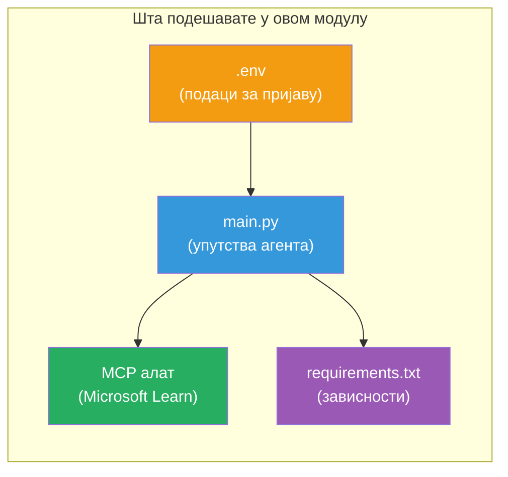

# Модул 3 - Конфигурисање агената, MCP алатке и окружења

У овом модулу прилагођавате основни мулти-агентски пројекат. Написаћете упутства за сва четвора агената, подесити MCP алатку за Microsoft Learn, конфигурисати променљиве окружења и инсталирати зависности.


> **Референца:** Потпуни радни код се налази у [`PersonalCareerCopilot/main.py`](../../../../../workshop/lab02-multi-agent/PersonalCareerCopilot/main.py). Користите га као референцу док градите свој пројекат.

---

## Корак 1: Конфигуришите променљиве окружења

1. Отворите фајл **`.env`** у корену вашег пројекта.
2. Попуните детаље вашег Foundry пројекта:

   ```env
   PROJECT_ENDPOINT=https://<your-account>.services.ai.azure.com/api/projects/<your-project>
   MODEL_DEPLOYMENT_NAME=gpt-4.1-mini
   ```

3. Сачувајте фајл.

### Где наћи ове вредности

| Вредност | Како је пронаћи |
|----------|-----------------|
| **Пројектни крајњи URL** | Microsoft Foundry бок → кликните ваш пројекат → крајњи URL у детаљном приказу |
| **Име распоређивања модела** | Foundry бок → проширите пројекат → **Models + endpoints** → име поред распоређеног модела |

> **Безбедност:** Никада не шаљите `.env` у верзиони контролу. Укључите га у `.gitignore` ако већ није.

### Мапирање променљивих окружења

Мулти-агентски `main.py` чита и стандардна и посебна имена променљивих окружења за радионицу:

```python
PROJECT_ENDPOINT = os.getenv("AZURE_AI_PROJECT_ENDPOINT") or os.getenv("PROJECT_ENDPOINT")
MODEL_DEPLOYMENT_NAME = os.getenv(
    "AZURE_AI_MODEL_DEPLOYMENT_NAME",
    os.getenv("MODEL_DEPLOYMENT_NAME", "gpt-4.1-mini"),
)
MICROSOFT_LEARN_MCP_ENDPOINT = os.getenv(
    "MICROSOFT_LEARN_MCP_ENDPOINT", "https://learn.microsoft.com/api/mcp"
)
```

MCP крајњи URL има разумну подразумевану вредност - није потребно подешавати га у `.env` осим ако желите да је промените.

---

## Корак 2: Напишите упутства за агенте

Ово је најкритичнији корак. Сваки агент треба пажљиво састављена упутства која дефинишу његову улогу, формат излаза и правила. Отворите `main.py` и креирајте (или измените) константе за упутства.

### 2.1 Resume Parser Agent

```python
RESUME_PARSER_INSTRUCTIONS = """\
You are the Resume Parser.
Extract resume text into a compact, structured profile for downstream matching.

Output exactly these sections:
1) Candidate Profile
2) Technical Skills (grouped categories)
3) Soft Skills
4) Certifications & Awards
5) Domain Experience
6) Notable Achievements

Rules:
- Use only explicit or strongly implied evidence.
- Do not invent skills, titles, or experience.
- Keep concise bullets; no long paragraphs.
- If input is not a resume, return a short warning and request resume text.
"""
```

**Зашто овакви сегменти?** MatchingAgent треба структуриране податке за оцењивање. Конзистентни сегменти омогућавају поуздан пренос између агената.

### 2.2 Job Description Agent

```python
JOB_DESCRIPTION_INSTRUCTIONS = """\
You are the Job Description Analyst.
Extract a structured requirement profile from a JD.

Output exactly these sections:
1) Role Overview
2) Required Skills
3) Preferred Skills
4) Experience Required
5) Certifications Required
6) Education
7) Domain / Industry
8) Key Responsibilities

Rules:
- Keep required vs preferred clearly separated.
- Only use what the JD states; do not invent hidden requirements.
- Flag vague requirements briefly.
- If input is not a JD, return a short warning and request JD text.
"""
```

**Зашто раздвојено на обавезне и пожељне?** MatchingAgent користи различите тежине за сваки тип (Обавезне вештине = 40 поена, Пожељне вештине = 10 поена).

### 2.3 Matching Agent

```python
MATCHING_AGENT_INSTRUCTIONS = """\
You are the Matching Agent.
Compare parsed resume output vs JD output and produce an evidence-based fit report.

Scoring (100 total):
- Required Skills 40
- Experience 25
- Certifications 15
- Preferred Skills 10
- Domain Alignment 10

Output exactly these sections:
1) Fit Score (with breakdown math)
2) Matched Skills
3) Missing Skills
4) Partially Matched
5) Experience Alignment
6) Certification Gaps
7) Overall Assessment

Rules:
- Be objective and evidence-only.
- Keep partial vs missing separate.
- Keep Missing Skills precise; it feeds roadmap planning.
"""
```

**Зашто експлицитно бодовање?** Репродуцибилно бодовање омогућава поређење извршења и отклањање грешака. Скала од 100 поена је лако разумљива крајњим корисницима.

### 2.4 Gap Analyzer Agent

```python
GAP_ANALYZER_INSTRUCTIONS = """\
You are the Gap Analyzer and Roadmap Planner.
Create a practical upskilling plan from the matching report.

Microsoft Learn MCP usage (required):
- For EVERY High and Medium priority gap, call tool `search_microsoft_learn_for_plan`.
- Use returned Learn links in Suggested Resources.
- Prefer Microsoft Learn for free resources.

CRITICAL: You MUST produce a SEPARATE detailed gap card for EVERY skill listed in
the Missing Skills and Certification Gaps sections of the matching report. Do NOT
skip or combine gaps. Do NOT summarize multiple gaps into one card.

Output format:
1) Personalized Learning Roadmap for [Role Title]
2) One DETAILED card per gap (produce ALL cards, not just the first):
   - Skill
   - Priority (High/Medium/Low)
   - Current Level
   - Target Level
   - Suggested Resources (include Learn URL from tool results)
   - Estimated Time
   - Quick Win Project
3) Recommended Learning Order (numbered list)
4) Timeline Summary (week-by-week)
5) Motivational Note

Rules:
- Produce every gap card before writing the summary sections.
- Keep it specific, realistic, and actionable.
- Tailor to candidate's existing stack.
- If fit >= 80, focus on polish/interview readiness.
- If fit < 40, be honest and provide a staged path.
"""
```

**Зашто нагласак на „CRITICAL“?** Без јасних упута да производи СВЕ картице празнина, модел обично генерише само 1-2 картице и сажима остатак. Блок „CRITICAL“ спречава ову скраћеност.

---

## Корак 3: Дефинишите MCP алатку

GapAnalyzer користи алатку која позива [Microsoft Learn MCP сервер](https://learn.microsoft.com/azure/foundry/agents/how-to/tools/model-context-protocol). Додајте ово у `main.py`:

```python
import json
from agent_framework import tool
from mcp.client.session import ClientSession
from mcp.client.streamable_http import streamable_http_client

@tool
async def search_microsoft_learn_for_plan(
    skill: str, role: str = "", max_results: int = 5
) -> str:
    """Search Microsoft Learn MCP and return curated official links for roadmap planning."""
    query = " ".join(part for part in [skill, role, "learning path module"] if part).strip()
    query = query or "job skills learning path"

    try:
        async with streamable_http_client(MICROSOFT_LEARN_MCP_ENDPOINT) as (
            read_stream, write_stream, _,
        ):
            async with ClientSession(read_stream, write_stream) as session:
                await session.initialize()
                result = await session.call_tool(
                    "microsoft_docs_search", {"query": query}
                )

        if not result.content:
            return (
                "No results returned from Microsoft Learn MCP. "
                "Fallback: https://learn.microsoft.com/training/support/catalog-api"
            )

        payload_text = getattr(result.content[0], "text", "")
        data = json.loads(payload_text) if payload_text else {}
        items = data.get("results", [])[:max(1, min(max_results, 10))]

        if not items:
            return f"No direct Microsoft Learn results found for '{skill}'."

        lines = [f"Microsoft Learn resources for '{skill}':"]
        for i, item in enumerate(items, start=1):
            title = item.get("title") or item.get("url") or "Microsoft Learn Resource"
            url = item.get("url") or item.get("link") or ""
            lines.append(f"{i}. {title} - {url}".rstrip(" -"))
        return "\n".join(lines)
    except Exception as ex:
        return (
            f"Microsoft Learn MCP lookup unavailable. Reason: {ex}. "
            "Fallbacks: https://learn.microsoft.com/api/mcp"
        )
```

### Како алатка функционише

| Корак | Шта се дешава |
|-------|---------------|
| 1 | GapAnalyzer одлучује да му требају ресурси за вештину (нпр. "Kubernetes") |
| 2 | Framework позива `search_microsoft_learn_for_plan(skill="Kubernetes")` |
| 3 | Функција отвара [Streamable HTTP](https://learn.microsoft.com/agent-framework/agents/tools/hosted-mcp-tools) везу ка `https://learn.microsoft.com/api/mcp` |
| 4 | Позива `microsoft_docs_search` на [MCP серверу](https://learn.microsoft.com/azure/foundry/agents/how-to/tools/model-context-protocol) |
| 5 | MCP сервер враћа резултате претраге (наслов + URL) |
| 6 | Функција форматира резултате као нумерисану листу |
| 7 | GapAnalyzer укључује URL-ове у картицу празнине |

### MCP зависности

MCP клијентске библиотеке су транзитивно укључене преко [`agent-framework-core`](https://learn.microsoft.com/agent-framework/overview/). Не морате их посебно додајете у `requirements.txt`. Ако добијете грешке при увозу, проверите:

```powershell
pip list | Select-String "mcp"
```

Очекује се да је пакет `mcp` инсталиран (верзија 1.x или новија).

---

## Корак 4: Повежите агенте и ток рада

### 4.1 Креирајте агенте са менаџерима контекста

```python
from contextlib import asynccontextmanager

@asynccontextmanager
async def create_agents():
    async with (
        get_credential() as credential,
        AzureAIAgentClient(
            project_endpoint=PROJECT_ENDPOINT,
            model_deployment_name=MODEL_DEPLOYMENT_NAME,
            credential=credential,
        ).as_agent(
            name="ResumeParser",
            instructions=RESUME_PARSER_INSTRUCTIONS,
        ) as resume_parser,
        AzureAIAgentClient(
            project_endpoint=PROJECT_ENDPOINT,
            model_deployment_name=MODEL_DEPLOYMENT_NAME,
            credential=credential,
        ).as_agent(
            name="JobDescriptionAgent",
            instructions=JOB_DESCRIPTION_INSTRUCTIONS,
        ) as jd_agent,
        AzureAIAgentClient(
            project_endpoint=PROJECT_ENDPOINT,
            model_deployment_name=MODEL_DEPLOYMENT_NAME,
            credential=credential,
        ).as_agent(
            name="MatchingAgent",
            instructions=MATCHING_AGENT_INSTRUCTIONS,
        ) as matching_agent,
        AzureAIAgentClient(
            project_endpoint=PROJECT_ENDPOINT,
            model_deployment_name=MODEL_DEPLOYMENT_NAME,
            credential=credential,
        ).as_agent(
            name="GapAnalyzer",
            instructions=GAP_ANALYZER_INSTRUCTIONS,
            tools=[search_microsoft_learn_for_plan],
        ) as gap_analyzer,
    ):
        yield resume_parser, jd_agent, matching_agent, gap_analyzer
```

**Кључне тачке:**
- Сваки агент има свој **појединачни** пример `AzureAIAgentClient`
- Само GapAnalyzer добија `tools=[search_microsoft_learn_for_plan]`
- `get_credential()` враћа [`ManagedIdentityCredential`](https://learn.microsoft.com/python/api/overview/azure/identity-readme#managed-identity-support) на Azure-у, [`DefaultAzureCredential`](https://learn.microsoft.com/azure/developer/python/sdk/authentication/credential-chains#defaultazurecredential-overview) локално

### 4.2 Изградите граф тока рада

```python
def create_workflow(resume_parser, jd_agent, matching_agent, gap_analyzer):
    workflow = (
        WorkflowBuilder(
            name="ResumeJobFitEvaluator",
            start_executor=resume_parser,
            output_executors=[gap_analyzer],
        )
        .add_edge(resume_parser, jd_agent)
        .add_edge(resume_parser, matching_agent)
        .add_edge(jd_agent, matching_agent)
        .add_edge(matching_agent, gap_analyzer)
        .build()
    )
    return workflow.as_agent()
```

> Погледајте [Workflows as Agents](https://learn.microsoft.com/agent-framework/workflows/as-agents) да разумете `.as_agent()` образац.

### 4.3 Покрените сервер

```python
async def main() -> None:
    validate_configuration()
    async with create_agents() as (resume_parser, jd_agent, matching_agent, gap_analyzer):
        agent = create_workflow(resume_parser, jd_agent, matching_agent, gap_analyzer)
        from azure.ai.agentserver.agentframework import from_agent_framework
        await from_agent_framework(agent).run_async()

if __name__ == "__main__":
    asyncio.run(main())
```

---

## Корак 5: Креирајте и активирајте виртуелно окружење

### 5.1 Креирајте окружење

```powershell
cd workshop\lab02-multi-agent\PersonalCareerCopilot
python -m venv .venv
```

### 5.2 Активирајте га

**PowerShell (Windows):**
```powershell
.\.venv\Scripts\Activate.ps1
```

**macOS/Linux:**
```bash
source .venv/bin/activate
```

### 5.3 Инсталирајте зависности

```powershell
pip install -r requirements.txt
```

> **Напомена:** Ред `agent-dev-cli --pre` у `requirements.txt` обезбеђује да је најновија прегледна верзија инсталирана. Ово је потребно за компатибилност са `agent-framework-core==1.0.0rc3`.

### 5.4 Потврдите инсталацију

```powershell
pip list | Select-String "agent-framework|agentserver|agent-dev"
```

Очекујани излаз:
```
agent-dev-cli                  0.0.1b260316
agent-framework-azure-ai       1.0.0rc3
agent-framework-core            1.0.0rc3
azure-ai-agentserver-agentframework 1.0.0b16
azure-ai-agentserver-core      1.0.0b16
```

> **Ако `agent-dev-cli` показује старију верзију** (нпр. `0.0.1b260119`), Agent Inspector ће при пријављивању добити грешке 403/404. Ажурирајте: `pip install agent-dev-cli --pre --upgrade`

---

## Корак 6: Потврдите аутентификацију

Покрените исти проверавач аутентификације из Лаба 01:

```powershell
az account show --query "{name:name, id:id}" --output table
```

Ако ово не успе, покрените [`az login`](https://learn.microsoft.com/cli/azure/authenticate-azure-cli-interactively).

За мулти-агентске токове рада, сва четворица агената деле исти креденцијал. Ако аутентификација успе за једног, биће успешна за све.

---

### Контролна листа

- [ ] `.env` има важне вредности `PROJECT_ENDPOINT` и `MODEL_DEPLOYMENT_NAME`
- [ ] Све 4 константе упутстава агената су дефинисане у `main.py` (ResumeParser, JD Agent, MatchingAgent, GapAnalyzer)
- [ ] MCP алатка `search_microsoft_learn_for_plan` је дефинисана и регистрована у GapAnalyzer
- [ ] `create_agents()` креира сва 4 агента са појединачним `AzureAIAgentClient` инстанцама
- [ ] `create_workflow()` гради исправан граф помоћу `WorkflowBuilder`
- [ ] Виртуелно окружење је креирано и активирано (`(.venv)` видљиво)
- [ ] `pip install -r requirements.txt` завршава без грешака
- [ ] `pip list` приказује све очекиване пакете на исправним верзијама (rc3 / b16)
- [ ] `az account show` враћа вашу претплату

---

**Претходно:** [02 - Scaffold Multi-Agent Project](02-scaffold-multi-agent.md) · **Следеће:** [04 - Orchestration Patterns →](04-orchestration-patterns.md)

---

<!-- CO-OP TRANSLATOR DISCLAIMER START -->
**Одрицање од одговорности**:  
Овај документ је преведен уз помоћ AI преводилачке услуге [Co-op Translator](https://github.com/Azure/co-op-translator). Иако тежимо прецизности, имајте у виду да аутоматски преводи могу да садрже грешке или нетачности. Оригинални документ на његовом изворном језику треба сматрати ауторитетним извором. За критичне информације препоручује се професионални људски превод. Нисмо одговорни за било какве неспоразуме или погрешне интерпретације настале употребом овог превода.
<!-- CO-OP TRANSLATOR DISCLAIMER END -->